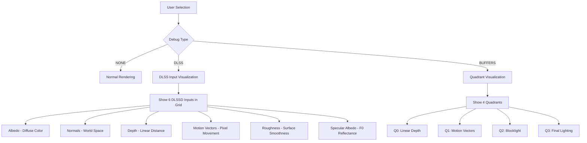
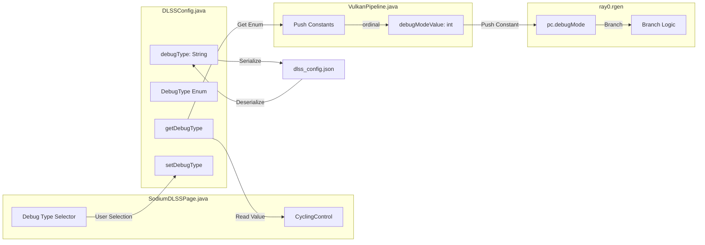

# Debug Type Selector Design Document

## Executive Summary

This document describes the design for adding a "debug type" selector to the Vulkanite project, allowing users to choose between "DLSS" and "Buffers" debug modes. The DLSS debug mode will display the inputs being fed to DLSS Ray Reconstruction, while the Buffers debug mode will show the existing quadrant-based buffer visualization.

## Current Implementation Analysis

### 1. Configuration Layer - [`DLSSConfig.java`](src/main/java/me/cortex/vulkanite/client/config/DLSSConfig.java)

**Current State:**
- Single boolean field `debugMode` (line 62)
- Simple getter [`isDebugMode()`](src/main/java/me/cortex/vulkanite/client/config/DLSSConfig.java:441) and setter [`setDebugMode()`](src/main/java/me/cortex/vulkanite/client/config/DLSSConfig.java:446)
- Persisted to JSON as `"debugMode": true/false`
- Default value: `false` (line 94)

**Key Code:**
```java
// Advanced settings
private boolean debugMode;
private boolean showPerformanceMetrics;
```

### 2. UI Layer - [`SodiumDLSSPage.java`](src/main/java/me/cortex/vulkanite/client/gui/sodium/SodiumDLSSPage.java)

**Current State:**
- Single tickbox control for "Debug Mode" (lines 211-218)
- Tooltip: "Enable debug visualization (Quadrants). Disables DLSS/DLSSD processing."
- Located in "Advanced Settings" option group

**Key Code:**
```java
// Advanced Settings
groups.add(OptionGroup.createBuilder()
    .add(OptionImpl.createBuilder(boolean.class, STORAGE)
        .setName(Text.of("Debug Mode"))
        .setTooltip(Text.of("Enable debug visualization (Quadrants). Disables DLSS/DLSSD processing."))
        .setControl(TickBoxControl::new)
        .setBinding(
            (opts, value) -> STORAGE.getConfig().setDebugMode(value),
            (opts) -> STORAGE.getConfig().isDebugMode())
        .build())
```

### 3. Rendering Layer - [`VulkanPipeline.java`](src/main/java/me/cortex/vulkanite/client/rendering/VulkanPipeline.java)

**Current State:**
- Debug mode value passed as push constant to ray tracing shader (line 625)
- When debug mode is enabled, DLSSD processing is skipped (lines 689-698)
- Diagnostic logging includes debug mode status (line 714)

**Key Code:**
```java
int debugMode = dlssConfig.isDebugMode() ? 1 : 0;

// Skip DLSSD if debug mode is enabled
boolean skipGBufferRestore = dlssEnabled && !debugModeEnabled && dlssdProcessor != null;
```

### 4. Shader Layer - [`ray0.rgen`](run/shaderpacks/VulkaniteRT/shaders/ray0.rgen)

**Current State:**
- Push constant block includes `int debugMode` (line 66)
- Quadrant-based visualization when `debugMode == 1` (lines 233-238, 823-895)
- Four quadrants showing:
  - **Q0 (Bottom-Left):** Linear Depth - shows depth from ray hit
  - **Q1 (Bottom-Right):** Motion Vectors - shows motion vector data
  - **Q2 (Top-Left):** Blocklight visualization - shows blocklight values
  - **Q3 (Top-Right):** Final Lighting (noisy output)
- Center panel showing albedo color

**Quadrant Layout:**
```
Q2 (normals/blocklight) | Q3 (final lighting)
------------------------|--------------------
Q0 (depth)              | Q1 (motion vectors)
```

---

## Proposed Design

### 1. Configuration Changes - [`DLSSConfig.java`](src/main/java/me/cortex/vulkanite/client/config/DLSSConfig.java)

#### 1.1 Add Debug Type Enum

```java
/**
 * Debug visualization type
 */
public enum DebugType {
    NONE,       // Debug mode disabled
    DLSS,       // Show DLSS inputs (albedo, normals, depth, motion vectors, roughness)
    BUFFERS     // Show buffer quadrants (existing visualization)
}
```

#### 1.2 Replace Boolean with Enum

Replace:
```java
private boolean debugMode;
```

With:
```java
private String debugType; // "NONE", "DLSS", "BUFFERS"
```

#### 1.3 Add Getter/Setter Methods

```java
public DebugType getDebugType() {
    try {
        return DebugType.valueOf(debugType.toUpperCase());
    } catch (IllegalArgumentException e) {
        return DebugType.NONE;
    }
}

public void setDebugType(DebugType type) {
    this.debugType = type.name();
}

// Convenience method for backward compatibility
public boolean isDebugMode() {
    return getDebugType() != DebugType.NONE;
}
```

#### 1.4 Update JSON Serialization

Add to [`loadFromFile()`](src/main/java/me/cortex/vulkanite/client/config/DLSSConfig.java:146):
```java
// Parse debug type
if (jsonObject.has("debugType")) {
    config.debugType = jsonObject.get("debugType").getAsString();
} else if (jsonObject.has("debugMode")) {
    // Backward compatibility: convert old boolean to new enum
    config.debugType = jsonObject.get("debugMode").getAsBoolean() ? "BUFFERS" : "NONE";
}
```

Add to [`save()`](src/main/java/me/cortex/vulkanite/client/config/DLSSConfig.java:264):
```java
jsonObject.addProperty("debugType", debugType);
```

### 2. UI Changes - [`SodiumDLSSPage.java`](src/main/java/me/cortex/vulkanite/client/gui/sodium/SodiumDLSSPage.java)

#### 2.1 Replace TickBox with CyclingControl

Replace the existing tickbox with a cycling control:

```java
// Advanced Settings
groups.add(OptionGroup.createBuilder()
    .add(OptionImpl.createBuilder(DLSSConfig.DebugType.class, STORAGE)
        .setName(Text.of("Debug Type"))
        .setTooltip(Text.of("Select debug visualization mode. DLSS shows inputs to DLSSD, Buffers shows quadrant view."))
        .setControl((opt) -> new CyclingControl<>(opt, DLSSConfig.DebugType.class, new Text[] {
            Text.of("None"),
            Text.of("DLSS (Show DLSSD Inputs)"),
            Text.of("Buffers (Quadrant View)")
        }))
        .setBinding(
            (opts, value) -> STORAGE.getConfig().setDebugType(value),
            (opts) -> STORAGE.getConfig().getDebugType())
        .build())
    .add(OptionImpl.createBuilder(boolean.class, STORAGE)
        .setName(Text.of("Show Performance Metrics"))
        .setTooltip(Text.of("Display performance metrics overlay."))
        .setControl(TickBoxControl::new)
        .setBinding(
            (opts, value) -> STORAGE.getConfig().setShowPerformanceMetrics(value),
            (opts) -> STORAGE.getConfig().isShowPerformanceMetrics())
        .build())
    .build());
```

### 3. Rendering Changes - [`VulkanPipeline.java`](src/main/java/me/cortex/vulkanite/client/rendering/VulkanPipeline.java)

#### 3.1 Update Push Constant Encoding

Change from:
```java
int debugMode = dlssConfig.isDebugMode() ? 1 : 0;
```

To:
```java
DLSSConfig.DebugType debugType = dlssConfig.getDebugType();
int debugModeValue = debugType.ordinal(); // 0=NONE, 1=DLSS, 2=BUFFERS
```

#### 3.2 Update DLSSD Skip Logic

```java
// Skip DLSSD processing if any debug mode is active
boolean skipDLSSD = debugType != DLSSConfig.DebugType.NONE;
boolean skipGBufferRestore = dlssEnabled && !skipDLSSD && dlssdProcessor != null;
```

### 4. Shader Changes - [`ray0.rgen`](run/shaderpacks/VulkaniteRT/shaders/ray0.rgen)

#### 4.1 Update Push Constant Block

The `debugMode` integer now represents:
- `0` = NONE (no debug)
- `1` = DLSS (show DLSS inputs)
- `2` = BUFFERS (show quadrant view)

#### 4.2 Add DLSS Debug Visualization

```glsl
if (pc.debugMode == 1) {
    // DLSS Debug Mode: Show inputs being fed to DLSSD
    // Layout: Single view showing selected input with a selector
    
    // Determine which input to show based on a uniform or key press
    // For now, cycle through inputs or show all in a grid
    
    // Option A: Grid layout (2x3)
    // +-----------+-----------+-----------+
    // | Albedo    | Normals   | Depth     |
    // +-----------+-----------+-----------+
    // | Motion Vec| Roughness | Specular  |
    // +-----------+-----------+-----------+
    
    // Option B: Single input with cycling
    // Show one input at a time with a text overlay
    
    // Grid layout implementation:
    vec2 cellSize = vec2(1.0/3.0, 1.0/2.0);
    int cellX = int(p.x / cellSize.x);
    int cellY = int(p.y / cellSize.y);
    int cell = cellY * 3 + cellX;
    
    vec2 localP = mod(p, cellSize) / cellSize;
    ivec2 localPixelCoord = ivec2(localP * launchSize);
    
    if (cell == 0) {
        // Albedo (diffuse color)
        color = vec4(albedo, 1.0);
    } else if (cell == 1) {
        // Normals (world-space)
        vec3 normalColor = normal * 0.5 + 0.5; // Map from [-1,1] to [0,1]
        color = vec4(normalColor, 1.0);
    } else if (cell == 2) {
        // Linear Depth
        float linearDepth = cameraRelativePos ? length(worldPos) : length(worldPos - origin);
        float normalizedDepth = clamp(linearDepth / 100.0, 0.0, 1.0);
        color = vec4(vec3(1.0 - normalizedDepth), 1.0);
    } else if (cell == 3) {
        // Motion Vectors
        vec2 motionVec = imageLoad(motionVectors, originalPixelCoord).rg;
        float magnitude = length(motionVec);
        vec2 normalizedMV = motionVec / max(launchSize.x, launchSize.y);
        color = vec4(normalizedMV * 0.5 + 0.5, magnitude * 0.1, 1.0);
    } else if (cell == 4) {
        // Roughness
        color = vec4(vec3(roughness), 1.0);
    } else {
        // Specular Albedo (F0)
        color = vec4(F0, 1.0);
    }
} else if (pc.debugMode == 2) {
    // BUFFERS Debug Mode: Existing quadrant visualization
    // [Keep existing quadrant code here]
}
```

---

## DLSS Debug Mode Visualization Details

### What Should "DLSS" Debug Mode Display?

The DLSS debug mode should show the **exact inputs** being fed to DLSS Ray Reconstruction. According to the DLSSD specification and the codebase analysis:

#### Required DLSSD Inputs (from [`DLSSRayReconstruction.java`](src/main/java/me/cortex/vulkanite/client/rendering/DLSSRayReconstruction.java:27-34)):

1. **Noisy Input** (color buffer) - The ray-traced output before denoising
2. **Motion Vectors** - Screen-space pixel movement between frames
3. **Depth Buffer** - Linear depth for spatial reconstruction
4. **Normal Buffer** - World-space surface normals (with roughness packed in .w)
5. **Diffuse Albedo** - Surface diffuse color (RGB)
6. **Specular Albedo** - F0 reflectance (RGB)
7. **Roughness** - Surface roughness (if not packed in normals.w)

### Proposed DLSS Debug Layout

```
+----------------+----------------+----------------+
|                |                |                |
|   Albedo       |   Normals      |   Depth        |
|   (Diffuse)    |   (RGB+Rough)  |   (Linear)     |
|                |                |                |
+----------------+----------------+----------------+
|                |                |                |
|   Motion       |   Roughness    |   Specular     |
|   Vectors      |   (Standalone) |   Albedo (F0)  |
|                |                |                |
+----------------+----------------+----------------+
```

### Color Encoding for Each Input:

| Input | Format | Visualization |
|-------|--------|---------------|
| Albedo | RGB [0,1] | Direct color display |
| Normals | RGB [-1,1] | Mapped to [0,1] for display |
| Depth | Float | Inverse depth for better contrast |
| Motion Vectors | RG pixels | Direction as color, magnitude as brightness |
| Roughness | Float [0,1] | Grayscale |
| Specular Albedo | RGB [0,1] | Direct color display (usually low values) |

---

## Implementation Plan

### Phase 1: Configuration Layer

1. **Add `DebugType` enum to [`DLSSConfig.java`](src/main/java/me/cortex/vulkanite/client/config/DLSSConfig.java)**
   - Location: After existing enums (around line 578)
   - Values: NONE, DLSS, BUFFERS

2. **Replace `debugMode` boolean with `debugType` string**
   - Update field declaration (line 62)
   - Update default constructor (line 94)
   - Add backward compatibility in loadFromFile()

3. **Add getter/setter methods**
   - `getDebugType()` returning enum
   - `setDebugType(DebugType)` 
   - Keep `isDebugMode()` for compatibility

4. **Update JSON serialization**
   - Save as "debugType" string
   - Load with backward compatibility for "debugMode" boolean

### Phase 2: UI Layer

1. **Update [`SodiumDLSSPage.java`](src/main/java/me/cortex/vulkanite/client/gui/sodium/SodiumDLSSPage.java)**
   - Replace TickBoxControl with CyclingControl
   - Update option binding to use DebugType enum
   - Update tooltip text

### Phase 3: Rendering Layer

1. **Update [`VulkanPipeline.java`](src/main/java/me/cortex/vulkanite/client/rendering/VulkanPipeline.java)**
   - Change push constant from boolean to ordinal value
   - Update DLSSD skip logic

2. **Update [`RenderPassExecutor.java`](src/main/java/me/cortex/vulkanite/client/rendering/RenderPassExecutor.java)**
   - No changes needed - already passes int value

### Phase 4: Shader Layer

1. **Update [`ray0.rgen`](run/shaderpacks/VulkaniteRT/shaders/ray0.rgen)**
   - Add DLSS debug visualization branch
   - Keep existing BUFFERS visualization
   - Add grid layout for 6 DLSS inputs

---

## Mermaid Diagrams

### Debug Type Flow



### Configuration Data Flow



---

## Testing Checklist

1. **Configuration Persistence**
   - [ ] Verify JSON saves with "debugType" field
   - [ ] Verify backward compatibility with old "debugMode" boolean
   - [ ] Test all three enum values persist correctly

2. **UI Functionality**
   - [ ] Cycling control shows all three options
   - [ ] Selection updates configuration
   - [ ] Tooltip displays correctly

3. **Rendering**
   - [ ] NONE: Normal rendering without debug overlay
   - [ ] DLSS: 6-panel grid showing all DLSSD inputs
   - [ ] BUFFERS: Existing 4-quadrant visualization

4. **Shader**
   - [ ] Push constant correctly passed to shader
   - [ ] All 6 DLSS inputs display correctly
   - [ ] Existing BUFFERS mode still works

---

## Backward Compatibility

The design maintains backward compatibility by:

1. **JSON Loading**: If `debugType` is not found, check for old `debugMode` boolean and convert:
   - `debugMode: true` → `debugType: "BUFFERS"`
   - `debugMode: false` → `debugType: "NONE"`

2. **API Compatibility**: Keep `isDebugMode()` method returning `true` for any non-NONE debug type

3. **Shader Compatibility**: The shader already uses an integer for `debugMode`, so no changes to the push constant structure are needed

---

## Summary

This design adds a "debug type" selector that allows users to choose between:

1. **NONE**: Normal rendering (no debug visualization)
2. **DLSS**: Shows the 6 inputs being fed to DLSS Ray Reconstruction in a 2x3 grid
3. **BUFFERS**: The existing quadrant-based buffer visualization

The implementation requires changes to:
- Configuration layer (enum replacement for boolean)
- UI layer (cycling control instead of tickbox)
- Rendering layer (ordinal value instead of 0/1)
- Shader layer (new visualization branch for DLSS inputs)

All changes maintain backward compatibility with existing configuration files.
