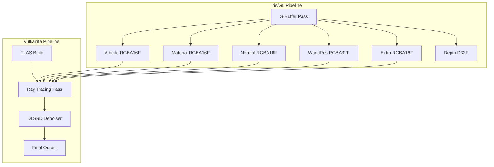
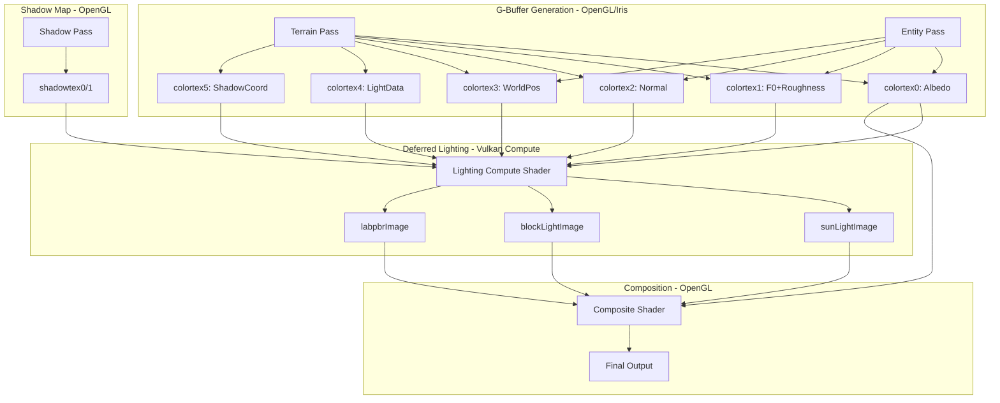
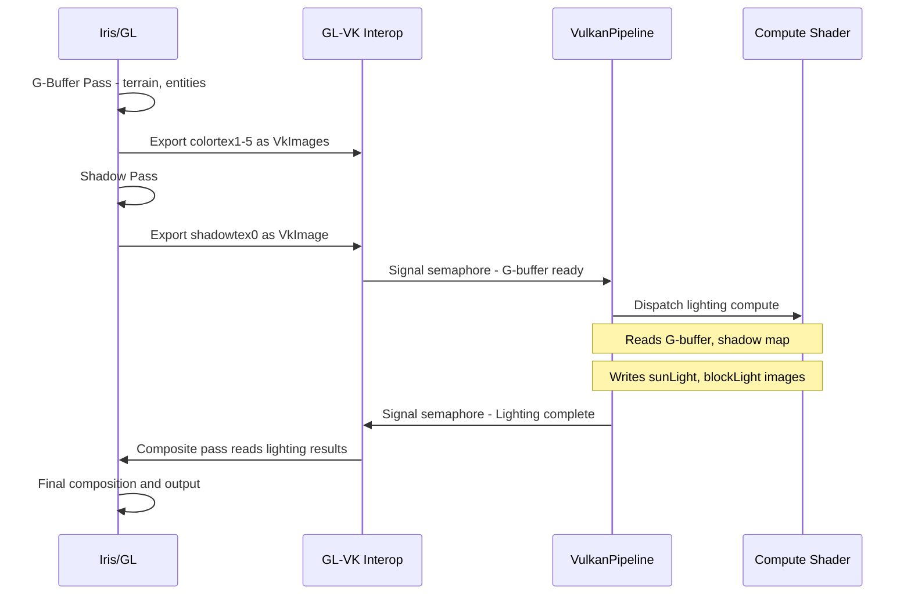
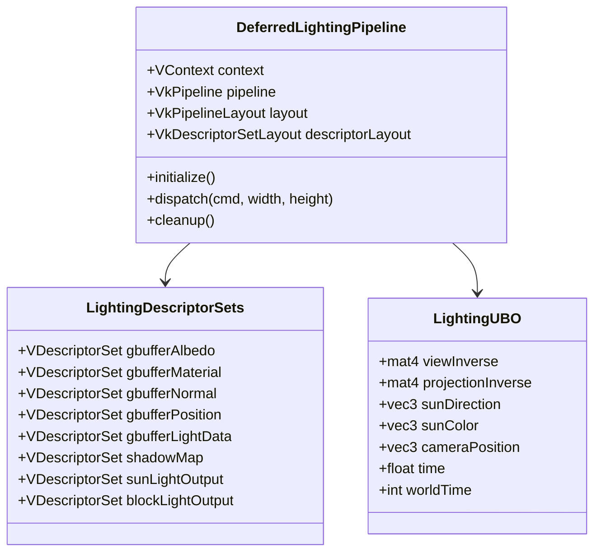

# Vulkanite Deferred Rendering Pipeline Design

## Executive Summary

This document describes the architecture for a deferred rendering pipeline in the "vulkanitedeferred" shaderpack. The design leverages the existing Vulkanite Vulkan-OpenGL interop infrastructure to implement a high-performance deferred lighting system using Vulkan compute shaders.

---

## 1. Current Architecture Analysis

### 1.1 Existing Rendering Pipeline

The current Vulkanite rendering architecture follows a **hybrid rendering model**:



### 1.2 Key Components

| Component | File | Purpose |
|-----------|------|---------|
| [`VulkanPipeline`](src/main/java/me/cortex/vulkanite/client/rendering/VulkanPipeline.java:45) | `VulkanPipeline.java` | Main pipeline orchestration |
| [`RenderPassExecutor`](src/main/java/me/cortex/vulkanite/client/rendering/RenderPassExecutor.java:31) | `RenderPassExecutor.java` | Descriptor set binding and ray dispatch |
| [`PipelineDescriptorSets`](src/main/java/me/cortex/vulkanite/client/rendering/PipelineDescriptorSets.java:14) | `PipelineDescriptorSets.java` | Expected descriptor layout validation |
| [`GBufferDLSSDAdapter`](src/main/java/me/cortex/vulkanite/client/rendering/GBufferDLSSDAdapter.java:42) | `GBufferDLSSDAdapter.java` | G-buffer to DLSSD input mapping |
| [`DLSSDProcessor`](src/main/java/me/cortex/vulkanite/client/rendering/DLSSDProcessor.java:44) | `DLSSDProcessor.java` | DLSSD Ray Reconstruction integration |

### 1.3 G-Buffer Layout

The existing G-buffer layout in [`VulkaniteRT`](run/shaderpacks/VulkaniteRT/shaders/gbuffers_terrain.fsh:24):

| Binding | Iris Buffer | Format | Content |
|---------|-------------|--------|---------|
| 7 | colortex1 | RGBA16F | Albedo RGB, Alpha |
| 8 | colortex2 | RGBA16F | F0 RGB, Roughness A |
| 9 | colortex3 | RGBA16F | Normal RGB, Roughness A |
| 10 | colortex4 | RGBA32F | World Position RGB, Metallic A |
| 11 | colortex5 | RGBA16F | Blocklight, Skylight, AO, Emission |

### 1.4 Descriptor Set Bindings

From [`PipelineDescriptorSets.java`](src/main/java/me/cortex/vulkanite/client/rendering/PipelineDescriptorSets.java:25):

```java
// Set 0 - Common Set
Binding 0:  UBO - Camera/sun uniforms
Binding 1:  Acceleration Structure - TLAS
Binding 3:  Combined Image Sampler - Block Atlas
Binding 4:  Combined Image Sampler - Normal Atlas
Binding 5:  Combined Image Sampler - Specular Atlas
Binding 6:  Storage Image - Output/Reservoir
Binding 7-11: Combined Image Sampler - G-Buffer (colortex1-5)
Binding 12: Storage Image - Final Output
Binding 13: Storage Image - Motion Vectors
Binding 14: Storage Image - Linear Depth
Binding 15: Storage Image - Previous Reservoir
```

---

## 2. Deferred Rendering Architecture

### 2.1 Design Goals

1. **No Ray Tracing Required**: Pure deferred lighting without RTX hardware dependency
2. **Vulkan Compute Integration**: Leverage Vulkan compute shaders for lighting calculations
3. **GL-Interop Compatibility**: Work with existing Iris G-buffer generation
4. **Modular Design**: Support both GL-only and Vulkan-enhanced lighting paths

### 2.2 Pipeline Overview



### 2.3 Data Flow



---

## 3. G-Buffer Specification

### 3.1 Attachment Formats

The deferred G-buffer uses 6 render targets matching the existing VulkaniteRT layout:

| Attachment | Format | RGB Channel | Alpha Channel |
|------------|--------|-------------|---------------|
| colortex0 | RGBA16F | Albedo color | Alpha |
| colortex1 | RGBA16F | F0 reflectance | Roughness |
| colortex2 | RGBA16F | World normal - encoded | Roughness packed |
| colortex3 | RGBA32F | World position | Metallic flag |
| colortex4 | RGBA16F | Blocklight R, Skylight G | AO B, Emission A |
| colortex5 | RGBA16F | Shadow coord RGB | SSS amount A |

### 3.2 Depth Buffer

- **Format**: D32_SFLOAT
- **Usage**: Depth testing, position reconstruction, shadow mapping

### 3.3 Shadow Map

- **Resolution**: 2048x2048 configurable
- **Format**: D32F with color attachment for variance shadow mapping
- **PCF**: 3x3 or 5x5 Poisson disk filtering

---

## 4. Vulkan Compute Lighting Pass

### 4.1 Compute Pipeline Architecture



### 4.2 Compute Shader Structure

```glsl
// deferred_lighting.comp
layout(local_size_x = 8, local_size_y = 8) in;

// G-Buffer inputs - combined image samplers
layout(set = 0, binding = 7) uniform sampler2D gbufferAlbedo;
layout(set = 0, binding = 8) uniform sampler2D gbufferMaterial;
layout(set = 0, binding = 9) uniform sampler2D gbufferNormal;
layout(set = 0, binding = 10) uniform sampler2D gbufferPosition;
layout(set = 0, binding = 11) uniform sampler2D gbufferLightData;

// Shadow map
layout(set = 0, binding = 20) uniform sampler2D shadowMap;

// Output storage images
layout(set = 0, binding = 21, rgba32f) writeonly uniform image2D sunLightImage;
layout(set = 0, binding = 22, rgba32f) writeonly uniform image2D blockLightImage;
layout(set = 0, binding = 23, rgba32f) writeonly uniform image2D labpbrImage;

// Uniforms
layout(set = 0, binding = 0) uniform LightingUBO {
    mat4 viewInverse;
    mat4 projectionInverse;
    vec3 sunDirection;
    vec3 sunColor;
    vec3 cameraPosition;
    float time;
    int worldTime;
};

void main() {
    ivec2 coord = ivec2(gl_GlobalInvocationID.xy);
    
    // Sample G-buffer
    vec4 albedo = texelFetch(gbufferAlbedo, coord, 0);
    vec4 material = texelFetch(gbufferMaterial, coord, 0);
    vec4 normalData = texelFetch(gbufferNormal, coord, 0);
    vec4 position = texelFetch(gbufferPosition, coord, 0);
    vec4 lightData = texelFetch(gbufferLightData, coord, 0);
    
    // Decode normal
    vec3 normal = normalize(normalData.rgb * 2.0 - 1.0);
    
    // Extract material properties
    vec3 F0 = material.rgb;
    float roughness = material.a;
    float metallic = position.a;
    
    // View direction
    vec3 viewDir = normalize(cameraPosition - position.rgb);
    
    // Shadow sampling
    float shadow = sampleShadowPCF(shadowMap, ...);
    
    // PBR lighting calculation
    vec3 directLight = evaluatePBR(albedo.rgb, normal, viewDir, 
                                    sunDirection, sunColor, 
                                    F0, roughness, metallic, shadow);
    
    // Ambient and blocklight
    vec3 ambient = calculateAmbient(lightData.g, normal, F0, roughness, metallic);
    vec3 blocklight = calculateBlocklight(lightData.r, albedo.rgb, F0, metallic);
    
    // Write outputs
    imageStore(sunLightImage, coord, vec4(directLight, shadow));
    imageStore(blockLightImage, coord, vec4(blocklight, lightData.r));
    imageStore(labpbrImage, coord, vec4(roughness, metallic, lightData.a, lightData.b));
}
```

### 4.3 Workgroup Sizing

- **Local Size**: 8x8 = 64 threads per workgroup
- **Dispatch**: `(width + 7) / 8, (height + 7) / 8, 1`
- **Shared Memory**: 16KB for tile-based shadow filtering optimization

---

## 5. Integration with VulkanPipeline

### 5.1 New Class: DeferredLightingPass

```java
package me.cortex.vulkanite.client.rendering;

/**
 * Executes deferred lighting using Vulkan compute shaders.
 * 
 * <p>This pass reads the G-buffer from Iris and computes:
 * <ul>
 *   <li>Directional lighting with shadow mapping</li>
 *   <li>Point/spot lights from blocklight data</li>
 *   <li>Ambient and sky lighting</li>
 * </ul>
 */
public class DeferredLightingPass {
    private final VContext ctx;
    private VkPipeline computePipeline;
    private VkPipelineLayout pipelineLayout;
    private VRef<VDescriptorSetLayout> descriptorLayout;
    
    // Output images
    private VRef<VImage> sunLightImage;
    private VRef<VImage> blockLightImage;
    private VRef<VImage> labpbrImage;
    
    /**
     * Initialize the compute pipeline and output images.
     */
    public void initialize(int width, int height);
    
    /**
     * Execute deferred lighting pass.
     * 
     * @param cmd Command buffer to record into
     * @param gbufferViews Array of G-buffer image views [colortex1-5]
     * @param shadowMapView Shadow map image view
     * @param camera Current camera state
     * @param sunDir Sun direction in world space
     */
    public void execute(
        VCmdBuff cmd,
        VRef<VImageView>[] gbufferViews,
        VRef<VImageView> shadowMapView,
        Camera camera,
        Vector3f sunDir
    );
    
    /**
     * Get output images for composition pass.
     */
    public LightingOutputs getOutputs();
}
```

### 5.2 Pipeline Flow Modification

The [`VulkanPipeline.renderPostShadows()`](src/main/java/me/cortex/vulkanite/client/rendering/VulkanPipeline.java:363) method needs modification:

```java
public void renderDeferred(
    List<VRef<VGImage>> vgOutImgs,
    Camera camera,
    VRef<VImageView>[] gbufferViews,
    VRef<VImageView> shadowMapView
) {
    // 1. Wait for G-buffer generation (GL semaphore)
    var inSemaphore = ctx.sync.createSharedBinarySemaphore();
    // ... signal from GL
    
    // 2. Transition G-buffer to compute read
    for (var view : gbufferViews) {
        cmd.encodeImageTransition(view.image, 
            VK_IMAGE_LAYOUT_GENERAL, 
            VK_IMAGE_LAYOUT_SHADER_READ_ONLY_OPTIMAL);
    }
    
    // 3. Dispatch compute lighting
    deferredLightingPass.execute(cmd, gbufferViews, shadowMapView, camera, sunDir);
    
    // 4. Transition output images back to GL
    for (var output : deferredLightingPass.getOutputs()) {
        cmd.encodeImageTransition(output, 
            VK_IMAGE_LAYOUT_GENERAL, 
            VK_IMAGE_LAYOUT_GENERAL);
    }
    
    // 5. Signal completion to GL
    var outSemaphore = ctx.sync.createSharedBinarySemaphore();
    // ... wait in GL composite pass
}
```

### 5.3 Descriptor Set Layout Extension

Add new bindings for deferred lighting in [`PipelineDescriptorSets.java`](src/main/java/me/cortex/vulkanite/client/rendering/PipelineDescriptorSets.java):

```java
// Deferred Lighting Set - extends common set
public static ShaderReflection.Set createDeferredLightingSetExpected() {
    return new ShaderReflection.Set(new ShaderReflection.Binding[] {
        // UBO
        new ShaderReflection.Binding("", 0, VK_DESCRIPTOR_TYPE_UNIFORM_BUFFER, 0, false),
        // G-buffer inputs (bindings 7-11 reused from common set)
        new ShaderReflection.Binding("", 7, VK_DESCRIPTOR_TYPE_COMBINED_IMAGE_SAMPLER, 0, false),
        new ShaderReflection.Binding("", 8, VK_DESCRIPTOR_TYPE_COMBINED_IMAGE_SAMPLER, 0, false),
        new ShaderReflection.Binding("", 9, VK_DESCRIPTOR_TYPE_COMBINED_IMAGE_SAMPLER, 0, false),
        new ShaderReflection.Binding("", 10, VK_DESCRIPTOR_TYPE_COMBINED_IMAGE_SAMPLER, 0, false),
        new ShaderReflection.Binding("", 11, VK_DESCRIPTOR_TYPE_COMBINED_IMAGE_SAMPLER, 0, false),
        // Shadow map
        new ShaderReflection.Binding("", 20, VK_DESCRIPTOR_TYPE_COMBINED_IMAGE_SAMPLER, 0, false),
        // Output images
        new ShaderReflection.Binding("", 21, VK_DESCRIPTOR_TYPE_STORAGE_IMAGE, 0, false),
        new ShaderReflection.Binding("", 22, VK_DESCRIPTOR_TYPE_STORAGE_IMAGE, 0, false),
        new ShaderReflection.Binding("", 23, VK_DESCRIPTOR_TYPE_STORAGE_IMAGE, 0, false),
    });
}
```

---

## 6. Shaderpack Format

### 6.1 iris.properties

```properties
# VulkaniteDeferred Configuration
iris.features.required=SSBO CUSTOM_IMAGES

# G-Buffer Formats
colortex0Format=RGBA16F
colortex1Format=RGBA16F
colortex2Format=RGBA16F
colortex3Format=RGBA32F
colortex4Format=RGBA16F
colortex5Format=RGBA16F

# Shadow Configuration
shadowMapResolution=2048
shadowDistance=128.0

# CUSTOM_IMAGES - Vulkan compute outputs
image.sunLightImage=sunLightImage_Sampler rgba rgba32f float false true 1.0 1.0
image.blockLightImage=blockLightImage_Sampler rgba rgba32f float false true 1.0 1.0
image.labpbrImage=labpbrImage_Sampler rgba rgba32f float false true 1.0 1.0
```

### 6.2 G-Buffer Shader Structure

The existing [`gbuffers_terrain.fsh`](run/shaderpacks/VulkaniteDeferred/shaders/gbuffers_terrain.fsh) already implements the correct G-buffer output structure. No changes needed.

### 6.3 Composite Shader Integration

The [`composite.fsh`](run/shaderpacks/VulkaniteDeferred/shaders/composite.fsh) reads from the Vulkan compute outputs:

```glsl
// Read lighting results from Vulkan compute
layout(rgba32f) readonly uniform image2D sunLightImage;
layout(rgba32f) readonly uniform image2D blockLightImage;
layout(rgba32f) readonly uniform image2D labpbrImage;

void main() {
    ivec2 coord = ivec2(gl_FragCoord.xy);
    
    // Sample lighting from Vulkan compute
    vec4 sunLight = imageLoad(sunLightImage, coord);
    vec4 blockLight = imageLoad(blockLightImage, coord);
    vec4 material = imageLoad(labpbrImage, coord);
    
    // Combine with G-buffer albedo
    vec4 albedo = texture(colortex0, texCoord);
    
    // Final composition
    vec3 finalColor = sunLight.rgb + blockLight.rgb + ambient;
    finalColor = toneMapACES(finalColor);
    finalColor = toGammaSpace(finalColor);
    
    outColor = vec4(finalColor, 1.0);
}
```

---

## 7. Performance Considerations

### 7.1 Memory Bandwidth

| Operation | Bandwidth Cost |
|-----------|----------------|
| G-Buffer Read | 5 textures × 8-16 bytes = 40-80 bytes/pixel |
| Shadow Sample | 4-16 samples × 4 bytes = 16-64 bytes/pixel |
| Output Write | 3 textures × 16 bytes = 48 bytes/pixel |
| **Total** | ~100-200 bytes/pixel |

### 7.2 Optimization Strategies

1. **Tile-Based Rendering**: Use shared memory to cache G-buffer tiles
2. **Half-Resolution Lighting**: Compute lighting at half resolution for distant surfaces
3. **Early Depth Culling**: Skip lighting for sky pixels using depth test
4. **Shadow Cache**: Cache shadow samples for static geometry

### 7.3 Expected Performance

| Resolution | Compute Time | Memory Bandwidth |
|------------|--------------|------------------|
| 1080p | ~2-4ms | ~20-40 GB/s |
| 1440p | ~4-6ms | ~35-70 GB/s |
| 4K | ~8-12ms | ~80-160 GB/s |

---

## 8. Implementation Phases

### Phase 1: Core Infrastructure
- [ ] Create `DeferredLightingPass.java` class
- [ ] Implement compute pipeline creation
- [ ] Add descriptor set layout for deferred lighting
- [ ] Create output image management

### Phase 2: Compute Shader
- [ ] Write `deferred_lighting.comp` shader
- [ ] Implement PBR lighting functions
- [ ] Add shadow sampling with PCF
- [ ] Implement ambient and blocklight

### Phase 3: Integration
- [ ] Modify `VulkanPipeline` for deferred path detection
- [ ] Add G-buffer transition logic
- [ ] Implement semaphore synchronization
- [ ] Add configuration options

### Phase 4: Testing and Optimization
- [ ] Validate output correctness
- [ ] Profile and optimize compute shader
- [ ] Add debug visualization modes
- [ ] Test with various resource packs

---

## 9. API Reference

### 9.1 DeferredLightingPass

```java
/**
 * Manages Vulkan compute pipeline for deferred lighting.
 * 
 * Usage:
 * <pre>
 * DeferredLightingPass pass = new DeferredLightingPass(context);
 * pass.initialize(width, height);
 * 
 * // In render loop:
 * pass.execute(cmd, gbufferViews, shadowMapView, camera, sunDir);
 * 
 * // Get outputs for composition:
 * LightingOutputs outputs = pass.getOutputs();
 * </pre>
 */
public class DeferredLightingPass {
    /**
     * Creates a new deferred lighting pass.
     * @param context Vulkan context
     */
    public DeferredLightingPass(VContext context);
    
    /**
     * Initializes output images and compute pipeline.
     * @param width Output width in pixels
     * @param height Output height in pixels
     */
    public void initialize(int width, int height);
    
    /**
     * Records compute dispatch to command buffer.
     * @param cmd Command buffer
     * @param gbufferViews G-buffer image views [albedo, material, normal, position, lightdata]
     * @param shadowMapView Shadow map view
     * @param camera Camera state
     * @param sunDir Sun direction in world space
     */
    public void execute(VCmdBuff cmd, VRef<VImageView>[] gbufferViews, 
                        VRef<VImageView> shadowMapView, Camera camera, Vector3f sunDir);
    
    /**
     * Gets output images for composition pass.
     * @return LightingOutputs containing sun, block, and material images
     */
    public LightingOutputs getOutputs();
    
    /**
     * Cleans up Vulkan resources.
     */
    public void cleanup();
}
```

### 9.2 LightingOutputs

```java
/**
 * Container for deferred lighting output images.
 */
public record LightingOutputs(
    VRef<VImage> sunLightImage,    // RGB: Direct lighting, A: Shadow factor
    VRef<VImage> blockLightImage,  // RGB: Blocklight contribution, A: Intensity
    VRef<VImage> labpbrImage       // R: Roughness, G: Metallic, B: AO, A: Emission
) {}
```

---

## 10. Conclusion

This design provides a complete deferred rendering pipeline that:

1. **Leverages existing infrastructure**: Uses the same G-buffer layout and interop mechanism as VulkaniteRT
2. **Enables non-RTX rendering**: Works on any GPU with Vulkan compute support
3. **Maintains compatibility**: Existing shaderpacks continue to work unchanged
4. **Provides extensibility**: Easy to add new lighting features via compute shaders

The implementation should proceed in phases, starting with core infrastructure and gradually adding features and optimizations.
