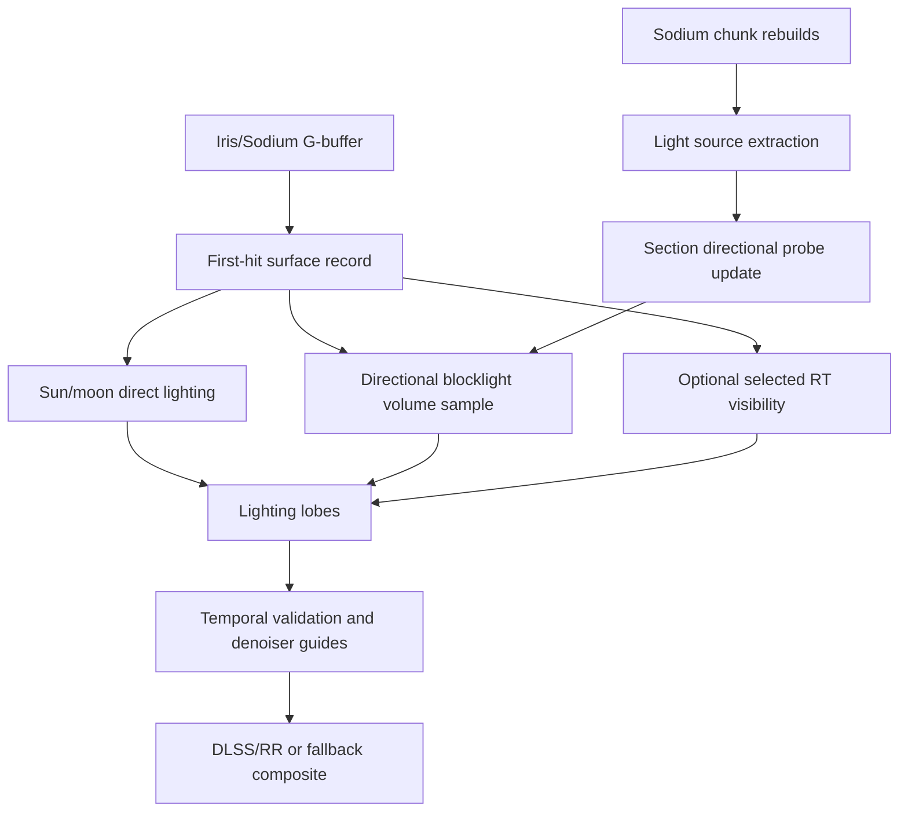

# Directional Lighting Resource Plan

## Goal

Build directional lighting that is much cheaper than full per-pixel path tracing
while keeping the visual wins that matter for Minecraft:

- sun and moon shadows that feel directional and stable;
- local block lights that have direction, color, and occlusion;
- reusable temporal data for DLSS/RR and future denoisers;
- one coherent lighting architecture instead of several partial systems.

Hardware RT is assumed available. Vulkanite already builds BLAS/TLAS and runs
ray-tracing shaders, so the plan should not avoid RT. The resource-saving goal
is to spend RT-core work on visibility, shadows, reflections, refractions, and
selected direct lights, while moving repeatable low-frequency diffuse lighting
into reusable world-space caches.

This plan supersedes the lighting parts of `DEFERRED_RENDERING_DESIGN.md` and
extends `RADIANCE_RTX_FLOW.md`. Those documents are still useful as historical
notes, but new lighting work should land here first.

## Verification Snapshot

Verified against the working tree on 2026-06-18:

- `shaderpacks/VulkaniteRT` is tracked and `build.gradle` already registers
  `syncVulkaniteShaderpacks`, which copies tracked packs into `run/shaderpacks`
  before `runClient` and `runServer`.
- `shaderpacks/VulkaniteRT` and `run/shaderpacks/VulkaniteRT` were
  content-identical at verification time, aside from Git line-ending warnings.
- `MixinProgramSet` loads ray-tracing shader stages from the active shaderpack
  through Iris' `sourceProvider`; it only injects the bundled
  `assets/vulkanite/shaders/raytracing/lib/restir.glsl` classpath resource.
- Sodium chunk rebuilds already attach captured mesh geometry to
  `ChunkBuildOutput` through `SodiumResultAdapter` and `IAccelerationBuildResult`.
  Section light data is now attached through `ISectionLightBuildResult` and
  `SectionLightExtractor`.
- `SectionLightManager` owns CPU section-light tables, uploads binding 22 for
  fallback/debug, owns 8x8x8 6-face directional probe pages keyed by
  `ChunkSectionPos`, and uploads binding 23 as a hashed probe-page directory
  followed by packed RGB10 probe pages. Section-light tables now also carry a
  compact per-section opaque-block mask extracted during the Sodium rebuild.
- `RtxFrameImages`, `RenderPassExecutor`, and `PipelineDescriptorSets` already
  expose radiance, reservoirs, motion/depth, material guide sidecars,
  first-hit depth, and blocklight-detail storage images.
- `RtxPassGraph` is still a thin sequential wrapper over reflected ray pipelines;
  it is not yet a named resource graph with independent compute/ray nodes.
- The tracked `ray0.rgen` samples binding 23 by world position through a bounded
  hash lookup, reconstructs cosine-weighted diffuse incident radiance from six
  probe faces, and applies the surface diffuse response once. It must not feed
  cached probe faces through the direct-light PBR/specular evaluator. Binding 22
  remains a section light table debug/reference path; final-light fallback is
  disabled by default because it is unoccluded.
- The Iris/OpenGL shaderpack path is being reduced to a surface-record producer:
  albedo, material, normal, world position, and guide metadata. Minecraft
  blocklight remains available as `colortex5.r` for debug/validation, but it is
  no longer used as a scalar local-light contribution.
- Sun shadow cost has been reduced through `SUN_SHADOW_MODE`; the default path
  uses one deterministic disk sample instead of a broad fixed multi-ray path.
  ReSTIR sun shadows are compile-gated behind `RESTIR_SUN_SHADOWS`, currently
  defaulting to `0`. The broad `enableReSTIR` naming still needs cleanup before
  adding ReSTIR DI for local emitters.
- The current shader uses the moon for sky rendering, but moon direct shadows are
  not a current lighting feature. Treat moon shadows as a follow-up once the sun
  path is cheap and stable.
- Older bundled shader resources under
  `src/main/resources/assets/vulkanite/shaders/raytracing` still exist, including
  `ray0.rgen`, `raygen.rgen`, `closesthit.rchit`, and `lib/lighting.glsl`.
  They should be audited as bundled fallback or stale experiments before any
  deletion.

## Internet And Paper Findings

### Radiance

Radiance replaces Minecraft's OpenGL renderer with a Vulkan C++ backend and
hardware ray tracing. Its public project pages emphasize a full OpenGL bypass,
Vulkan ray-tracing-pipeline support, and modern modules such as DLSS/FSR. That
is not directly portable to Vulkanite because Vulkanite still cooperates with
Iris/Sodium, but the product boundaries are worth copying.

The useful lesson is: split RT work into named outputs. First-hit state,
visibility, candidate lighting, temporal reuse, spatial reuse, final lighting,
and denoiser guides should become independent products. Keeping probe updates,
sun visibility, local-light selection, and final composition hidden inside one
large raygen is acceptable only while proving the data model.

Sources:

- https://github.com/Minecraft-Radiance/Radiance
- https://modrinth.com/mod/radiance-mod-windows
- https://www.minecraft-radiance.com/

### Unreal Lumen

Unreal Lumen is the most relevant production reference for Vulkanite's hybrid
lighting direction. The portable lesson is not the exact data structures; it is
the split between cached lighting and expensive hit evaluation. Lumen uses a
Surface Cache so ray hits can look up material and lighting data quickly, uses
screen traces before falling back to more complete scene tracing, and lets
hardware ray tracing choose between fast Surface Cache lighting and expensive
hit lighting for higher quality reflections.

Its performance guide also matches Vulkanite's current section-probe direction:
lighting cache updates are amortized, direct-light work is limited to important
lights per tile, and world-space radiance-cache quality is controlled by probe
resolution plus a per-frame probe trace/update budget. Vulkanite should copy
those control surfaces: section-probe resolution, page update budget, light
selection budget, cache coverage debug, and optional hit-lighting/ray validation
for cases where the cache is visibly wrong.

Sources:

- https://dev.epicgames.com/documentation/unreal-engine/lumen-technical-details-in-unreal-engine
- https://dev.epicgames.com/documentation/unreal-engine/lumen-global-illumination-and-reflections-in-unreal-engine
- https://dev.epicgames.com/documentation/unreal-engine/lumen-performance-guide-for-unreal-engine

### Rethinking Voxels

Rethinking Voxels is a Complementary Reimagined-derived shaderpack. Its README
and public project page emphasize voxelisation, colored flood-fill block light,
ray-traced occlusion checks, and sharp block-light shadows. The Modrinth notes
also call out an important tradeoff: sudden brightness changes are part of the
performance/sharp-shadow compromise.

The practical lesson is that Minecraft block lighting should be treated as a
voxel/light-field problem first, then corrected with selective visibility rays.
Vulkanite's section light tables, 8x8x8 directional probe pages, and opacity
masks are on the right track for the cheap light field. The next step is not
more per-pixel diffuse RT; it is sparse RT validation, better temporal blending,
and better emitter identity for modded/PBR light sources.

Sources:

- https://github.com/gri573/rethinking-voxels
- https://modrinth.com/shader/rethinking-voxels

### Soft Voxels

Soft Voxels reports a mix of light-propagation volume and path tracing, avoiding
traditional shadow maps for its visual target. The useful takeaway is that low
frequency diffuse lighting can be cached in a volume and refreshed gradually,
while sharp detail is added with a smaller amount of tracing.

Source: https://rre36.com/soft-voxels

### ReSTIR DI

ReSTIR DI targets real-time direct lighting from many dynamic lights by reusing
samples across space and time. NVIDIA's technical blog describes reusing nearby
and previous-frame information to guide rays and reduce noise, and the paper
focuses on dynamic direct lighting. This is a good fit for many torch-like
emitters, not for the single sun by itself.

Sources:

- https://research.nvidia.com/sites/default/files/pubs/2020-07_Spatiotemporal-reservoir-resampling/ReSTIR.pdf
- https://developer.nvidia.com/blog/rendering-millions-of-dynamics-lights-in-realtime/
- https://benedikt-bitterli.me/restir/

### ReSTIR GI

ReSTIR GI extends reservoir reuse to indirect paths. It is powerful but too big
for the first Vulkanite directional-lighting pass. Keep the current reservoir
infrastructure compatible with it, but do not start here.

Source: https://research.nvidia.com/publication/2021-06_restir-gi-path-resampling-real-time-path-tracing

### DDGI / Ray-Traced Irradiance Fields

DDGI extends irradiance probes so lighting can update dynamically with ray traced
visibility and probe blending. The JCGT paper and RTXGI docs make this the best
research match for "directional blocklight cache" in Vulkanite.

Sources:

- https://www.jcgt.org/published/0008/02/01/paper-lowres.pdf
- https://github.com/NVIDIAGameWorks/RTXGI-DDGI/blob/main/docs/Algorithms.md
- https://morgan3d.github.io/articles/2019-04-01-ddgi/

### Light Propagation Volumes

LPV is a cheaper dynamic GI approximation using lattices and spherical harmonics.
It has known leaking and low-frequency limits, but it is useful as a low-end
mode or as a propagation layer for blocklight volumes.

Source: https://dl.acm.org/doi/10.1145/1730804.1730821

### Voxel Cone Tracing

Voxel cone tracing stores scene lighting in a filtered voxel structure and
samples cones for diffuse/specular indirect light. It is attractive on paper,
but full-scene voxelization is likely too much for Vulkanite's hybrid
Iris/Sodium path. Treat it as a later high-quality mode, not the foundation.

Sources:

- https://research.nvidia.com/sites/default/files/publications/GIVoxels-pg2011-authors.pdf
- https://dl.acm.org/doi/10.1145/2037826.2037853

## Current Vulkanite State

The repo already has the right building blocks:

- Sodium chunk rebuild hook, active through `vulkanite.mixins.json`:
  `src/main/java/me/cortex/vulkanite/mixin/sodium/chunk/MixinChunkRenderRebuildTask.java`
- chunk geometry capture, currently mesh-only:
  `src/main/java/me/cortex/vulkanite/compat/SodiumResultAdapter.java`
- async BLAS/TLAS path:
  `src/main/java/me/cortex/vulkanite/acceleration/AccelerationManager.java`
- explicit RTX frame images and sidecars, including reservoir ping-pong,
  DLSS/RR guides, first-hit depth, and blocklight detail:
  `src/main/java/me/cortex/vulkanite/client/rendering/RtxFrameImages.java`
- a thin pass wrapper:
  `src/main/java/me/cortex/vulkanite/client/rendering/RtxPassGraph.java`
- descriptor reflection/binding support for storage images 6 and 12-21 plus
  section-light storage buffers at bindings 22 and 23:
  `src/main/java/me/cortex/vulkanite/client/rendering/RenderPassExecutor.java`
- section light extraction during Sodium rebuilds:
  `src/main/java/me/cortex/vulkanite/compat/SectionLightExtractor.java`
- section light and directional probe ownership:
  `src/main/java/me/cortex/vulkanite/client/lighting/SectionLightManager.java`
- shaderpack sync from tracked sources into the Iris run directory:
  `build.gradle` task `syncVulkaniteShaderpacks`
- current tracked resource plan:
  `plans/DIRECTIONAL_LIGHTING_RESOURCE_PLAN.md`

The main problem is not missing Vulkan plumbing. It is ownership and naming:

- `shaderpacks/VulkaniteRT/shaders/ray0.rgen` is the tracked RTX shaderpack.
- `run/shaderpacks/VulkaniteRT` is generated by the Gradle sync task. It should
  stay reproducible from `shaderpacks/VulkaniteRT`; do not edit only `run`.
- `src/main/resources/assets/vulkanite/shaders/raytracing/ray0.*`,
  `raygen.rgen`, `miss.rmiss`, `closesthit.rchit`, and `lib/lighting.glsl`
  are bundled resources, but the current loader only injects
  `lib/restir.glsl`. Treat the others as unaudited fallback/stale shader code.
- `DEFERRED_RENDERING_DESIGN.md` describes a separate deferred compute lighting
  path. That should not be implemented as an independent renderer while the RT
  path still owns DLSS/RR guide buffers.
- Older validation/low-resolution plans still mention `DeferredLightingPass` and
  `DeferredGBufferManager`. In this worktree those Java files are absent, so
  those documents should be treated as historical until revalidated.
- `enableReSTIR` currently means "the shaderpack uses the ReSTIR helper API",
  while the intended future feature is specifically local direct-light ReSTIR.
  Rename the Java/config surface before building more features on that toggle.

## Architecture Decision

Use one hybrid lighting stack:



The key split:

- dynamic sun/moon remains per-frame, but cheaper and temporally reused;
- local emissive/block lighting becomes a world-space directional cache;
- RT cores are used continuously for the tasks where hardware ray tracing wins:
  shadow visibility, alpha-aware occlusion, reflection/refraction continuation,
  probe validation, and selected local direct-light visibility.

Non-goals for the first implementation:

- no standalone `DeferredLightingPass` owner separate from the RTX pass graph;
- no ReSTIR GI work until local-light ReSTIR DI and probe resources are stable;
- no full-world light scan per frame;
- no runtime-only edits under `run/shaderpacks` as the source of truth;
- no deletion of bundled ray-tracing resources until a compile/load audit proves
  they are unused or replaced.

## Directional Light Data Model

### Section Light Source Table

Create a compact light table per Sodium section:

```java
record SectionLight(
    int packedBlockPos,
    int packedRgbEmission,
    short radius,
    short flags
) {}
```

Populate it from rebuilt chunk meshes and/or block states:

- torch, lantern, lava, redstone torch, soul light, glowstone, sea lantern;
- LabPBR/emissive texture signal when present;
- modded light IDs where available.

Do not rely on captured vertex bytes alone for light identity. The current
`SodiumResultAdapter` only records mesh ranges and terrain pass data; it does not
preserve block states or sprite/material IDs in a form that can reliably answer
"which block emitted this light". The first implementation should either:

- attach a new section-light payload during the Sodium rebuild while block states
  are still available; or
- derive explicit emitters from a conservative section/block-state scan triggered
  only by rebuild/dirty events.

Keep this table CPU-owned first. Upload changed sections to a device buffer in
batches. Do not scan the whole world per frame. Reuse the existing
`IAccelerationBuildResult` style or add a sibling interface so geometry capture
and light extraction travel with the same `ChunkBuildOutput`.

### Directional Irradiance Volume

For each active section, store a low-res grid of directional lighting probes.
Start with `8x8x8` probes per 16x16x16 section.

Two encoding candidates:

| Encoding | Memory | Sampling | Notes |
| --- | ---: | --- | --- |
| 6-face RGB8/RGB10 | low | dot normal to +/- axes | easiest debug path |
| SH L1 RGB16F | medium | 4 coefficients per RGB | better smooth directionality |

Start with 6-face RGB10A2 or RGB16F during development, then compress after the
result is stable.

Initial memory budget for `8x8x8` probes per section:

- 6-face `RGB10A2`: `512 probes * 6 faces * 4 bytes = 12 KiB/section`.
- 6-face `RGBA16F`: `512 probes * 6 faces * 8 bytes = 24 KiB/section`.
- SH L1 `RGB16F`: `512 probes * 4 coeffs * 3 channels * 2 bytes = 12 KiB/section`,
  before alignment and visibility/history data.

At 1024 active sections, the raw directional cache is roughly 12-24 MiB before
visibility, atlas padding, and history. That is acceptable for a prototype, but
Phase 3 must log active section count, atlas bytes, update bytes/frame, and probe
update time before increasing resolution.

Each probe stores diffuse incident lighting from six major directions. The
shader samples the volume at the surface world position, weights each face by
the surface normal, and then applies the material's diffuse response once.
Do not treat the six cached faces as six direct PBR lights; doing so creates
view-dependent/specular energy from a low-frequency cache. Nearest probe-cell
sampling reads two packed records for all six faces. The current trilinear path
blends already-weighted incident radiance from the eight neighboring probes,
which preserves the previous six-face math while reducing packed SSBO record
reads from the old per-face `6 * 8` pattern to `8 * 2`. This gives directional
blocklight without tracing hemisphere rays per pixel. Trilinear taps are
section-aware: taps that cross the `8x8x8` page edge look up the adjacent
section's probe page instead of clamping to the current section's edge probes.

### Probe Update

Use an async update queue:

1. Mark section dirty when its mesh or light table changes.
2. Add neighbor sections when light can cross section boundaries.
3. Update a small budget per frame.
4. Upload changed probe pages to a storage buffer or 3D texture atlas.
5. Keep old data until replacement is ready to avoid flicker.

First implementation can use CPU flood fill or GPU compute. GPU compute is the
target, but CPU generation is acceptable for proving the data model.

Current prototype behavior:

- CPU probe pages remain owned by `SectionLightManager`, keyed by
  `ChunkSectionPos`, and released or recycled when Sodium removes a section.
- Binding 23 begins with a 1024-record hashed directory. The shader probes this
  directory with linear probing instead of scanning all active page slots per
  pixel.
- Probe page generation gathers non-empty `SectionLightTable`s from the active
  3x3x3 neighboring section window around the page.
- Light table changes mark the changed active section and adjacent active probe
  pages dirty. This updates cross-section light influence without scanning the
  whole world each frame.
- CPU regeneration is budgeted at 4 probe pages per upload call, and each page
  selects at most 48 nearby/strong emitters once before generating probes. This
  keeps block place/break edits from monopolizing the render frame and avoids
  rescanning the same section light lists for every probe.
- Section update/removal events now also pre-bake up to 8 dirty probe pages on
  the CPU before the render upload path. This is a first step toward true
  update-driven baking; remaining queued pages are still amortized by upload.
- Packed probe faces now use the spare RGB10_A2 alpha bits as a two-bit
  confidence hint. The shader applies that hint while sampling the cache so
  distant, cross-page, or weakly validated baked radiance is less likely to
  dominate a room. This is not full DDGI visibility; it is a compatibility
  bridge until probe faces store richer visibility/depth moments or sparse RT
  validation data.
- Dirty probe updates are queued in visible-impact order: the changed section
  first, face-neighbor sections next, then edge/corner neighbors.
- Throttled logs report active pages, upload dirty pages, dirty queue
  before/after regeneration, neighbor dirty marks, uploaded bytes, regeneration
  time, upload time, total probe-update time, and buffer size.
- Hot command-submission and descriptor-binding diagnostics are trace-level so
  normal debug logging does not distort frame-time measurements.

Atlas ownership must be explicit from the start:

- key pages by section origin, not by transient render-section object identity;
- release or recycle pages when Sodium removes a section;
- version pages so shaders never sample half-written probe data;
- expose a debug view for page occupancy, dirty queue length, and stale pages.

### Visibility And Leakage

A raw LPV-style flood fill will leak through walls. Use two levels:

- cheap propagation with opacity masks for the default cache;
- hardware RT validation for a subset of probes, important light directions, or
  uncertain pixels.

The CPU opacity path is only a prototype visibility filter. It is useful because
it is deterministic, easy to inspect, and keeps the section-light cache
world-space, but it should not be treated as the final source of visibility
truth. Hardware RT should be used where it is strongest: selected light/probe
occlusion, alpha-aware blockers, reflections/refractions, and later ReSTIR DI
visibility.

For probe visibility, DDGI-style depth/visibility moments are the better target
than per-pixel tracing. Store a small visibility term per probe face or a simple
occlusion scalar at first.

## Sun And Moon Plan

The current shader traces multiple soft-shadow rays per visible pixel. That is
too expensive to scale. The shader already documents that sun ReSTIR is not the
right default; the sun ReSTIR branch is gated by `RESTIR_SUN_SHADOWS`, which
defaults to `0`. Keep that disabled while optimizing sun visibility. The broad
Java/config `enableReSTIR` name should not be treated as permission to add more
sun-reservoir behavior.

Moon handling should reuse the same machinery later, but do not make moon direct
shadows part of the first cost-reduction pass. The current tracked shader uses
the moon for sky color, not for per-surface moon shadowing.

Replace it in phases:

1. **Immediate:** reduce fixed sun samples and add explicit sun quality modes.
   Use deterministic sun disk sampling indexed by pixel and frame. Preserve
   DLSS guide writes and keep `RESTIR_SUN_SHADOWS` disabled.
2. **Checkerboard:** trace sun visibility for half the pixels each frame and
   reconstruct with normal/depth aware filters.
3. **History:** add a dedicated sun visibility history, separate from the
   local-light ReSTIR reservoirs. Move validation out of monolithic raygen once
   pass metadata exists.
4. **Distance tiers:** near surfaces get RT visibility; middle distance gets
   cached/checkerboard visibility; far distance uses shadow map or sky-light
   heuristic.
5. **Sky-light skip:** if Minecraft sky light or G-buffer extra data says there
   is no sky access, skip sun shadow rays entirely.

Do not use ReSTIR for the sun as the first optimization. A single directional
area light is better handled by deterministic disk samples and temporal reuse.

## Local Light Plan

### Tier 0: Bare Surface Record

Do not treat Minecraft blocklight as a lighting source. Iris/OpenGL should feed
Vulkanite a thin surface record: albedo, material, normal, world position,
emission, AO, and optional guide values. The current shader still passes the
Minecraft blocklight value through `colortex5.r`, but only as a debug/validation
guide for leakage and future skip heuristics.

The tracked shaderpack now strips vanilla vertex brightness from G-buffer albedo
by default while preserving tint hue. This keeps face brightness and local light
from being baked into the albedo that the RT path lights again.

### Tier 1: Directional Cache

Use the section directional volume for diffuse local lighting first. Rough
specular should come later from a separate lobe or selected RT/ReSTIR detail,
not from the six-face diffuse probe cache. This replaces most
`sampleBlockLightRT` work.

The initial binding, atlas addressing, and shader evaluation are in place.
Current probe pages are generated CPU-side from section light tables plus a
bounded 3x3x3 neighboring section gather. Debug modes exist for missing pages,
face weights, raw radiance, and probe/table mismatch; runtime tuning still needs
scene captures before the cache should be treated as visually tuned.

Important debug caveat: binding 22 is a globally limited, unoccluded emitter
table, not a truth table for lighting. A red `Leak Check`/old `Table Error`
view means the probe cache is brighter than the rough references or bright where
Minecraft's scalar blocklight is dark; it does not prove the table itself is
right. Use it to find candidate leak scenes, then validate with voxel occlusion,
sparse RT checks, or DDGI-style visibility/confidence data.

Current shader formula:

```glsl
vec3 incident = sampleSectionLightProbeIncidentVolume(worldPos, normal);
vec3 diffuseResponse = sectionLightProbeDiffuseResponse(albedo, F0, metallic);
vec3 diffuse = incident * diffuseResponse;
```

Fallback decisions should use the raw `incident` value, not the material-shaded
`diffuse` value. A metallic or black surface can shade cached diffuse light to
near zero even when the cache page is present and valid.

### Tier 2: ReSTIR DI For Explicit Emitters

For high quality mode, add ReSTIR DI for local emissive blocks:

1. Generate one or more candidates from the section light table.
2. Pick a candidate reservoir without visibility.
3. Trace one shadow ray for the selected candidate.
4. Reuse temporal and spatial reservoirs with position/normal validation.
5. Shade the selected light and blend with the directional cache.

This is the right place to use the existing `reservoirImages`.

### Tier 3: Selective RT Blocklight

Keep direct ray-traced blocklight, but make it selective instead of tracing
hemispheres for every lit pixel. It should run by budget and importance:

- camera-near pixels;
- highly emissive materials and local lights chosen by ReSTIR DI;
- reflections/refractions;
- probe validation rays;
- pixels where the directional cache is uncertain or visibly leaking;
- screenshots.

It should not be the default source for all diffuse blocklight. The default
should be cache-first diffuse plus RT visibility/detail where it matters.

## Redundancy Cleanup

Do these in order. Do not delete user/local runtime files before the tracked
shaderpack source is verified.

1. **Single shaderpack source of truth**
   - Keep `shaderpacks/VulkaniteRT` as the canonical editable source.
   - Treat `run/shaderpacks/VulkaniteRT` as generated/runtime output.
   - Keep `syncVulkaniteShaderpacks` wired into `runClient` and `runServer`.
   - Add a validation task/command that diffs tracked and runtime shaderpack
     files after sync.

2. **Retire generic bundled RT shader experiments**
   - Audit every non-`restir.glsl` file under
     `src/main/resources/assets/vulkanite/shaders/raytracing`, including
     `ray0.*`, `raygen.rgen`, `miss.rmiss`, `closesthit.rchit`,
     `lib/utils.glsl`, and `lib/lighting.glsl`.
   - If no bundled fallback path compiles them, move useful helpers into the
     tracked `VulkaniteRT/shaders/lib/rt` library and delete the stale files.
   - Keep `lib/restir.glsl` unless `MixinProgramSet` is changed to load a
     shaderpack-owned ReSTIR library.

3. **Merge deferred compute into the RTX pass graph**
   - Do not implement `DeferredLightingPass` as a separate lighting owner.
   - If compute lighting is added, model it as pass-graph nodes that consume the
     same first-hit/G-buffer records and write the same lighting lobe outputs.

4. **Split monolithic raygen responsibilities**
   - Keep first-hit read and guide writes in raygen initially.
   - Move temporal/spatial reuse, checkerboard resolve, and volume update into
     compute passes.
   - Keep raygen focused on ray generation and shading only.

5. **Unify ReSTIR naming**
   - Existing config says "ReSTIR" broadly.
   - Rename internally to `restirDirectLights` before local-light ReSTIR lands.
   - Keep `RESTIR_SUN_SHADOWS` disabled unless a dedicated experiment proves a
     sun reservoir beats deterministic disk samples plus temporal resolve.
   - Do not imply ReSTIR GI until indirect path reuse is implemented.

## Pass Graph Target

Current reflected bindings already give the plan concrete resource slots:

| Binding | Current use |
| ---: | --- |
| 6 | current reservoir / legacy intermediate depending on shader reflection |
| 12 | noisy radiance output |
| 13 | motion vectors |
| 14 | linear depth |
| 15 | previous reservoir |
| 16 | diffuse albedo + metallic guide |
| 17 | specular albedo guide |
| 18 | normal + roughness guide |
| 19 | specular hit depth |
| 20 | first-hit depth |
| 21 | blocklight detail |

The next step is not to invent another descriptor convention. It is to name
these resources in Java and make pass ownership explicit before adding more
lighting features:

| Pass | Type | Inputs | Outputs |
| --- | --- | --- | --- |
| `first_hit_import` | compute or raygen section | barebones G-buffer | first-hit validity/position/normal/material |
| `sun_visibility` | ray/query | first-hit, TLAS | sun visibility current |
| `sun_temporal_resolve` | compute | current/previous visibility | stable sun visibility |
| `section_light_update` | compute or async CPU upload | light table, opacity | directional probe atlas |
| `local_light_sample` | compute or raygen | first-hit, probe atlas | diffuse local, spec local |
| `restir_di_candidates` | compute | light tables, first-hit | candidate reservoirs |
| `restir_di_visibility` | ray/query | candidate reservoirs, TLAS | visible reservoirs |
| `lighting_compose` | compute or raygen | lobes, guides | noisy radiance, DLSS guides |

This is intentionally more explicit than the current `RtxPassGraph`, but it can
be introduced incrementally.

## Implementation Phases

Phases 0-4 are optimized around one rule: make the cheap cached lighting path
trustworthy before spending more rays. Rethinking Voxels points to a voxel/light
field with selective occlusion checks; Radiance points to explicit products and
resource ownership. The Vulkanite order should combine those lessons.

### Phase 0: Ownership And Naming Gate

Purpose: remove drift and ambiguous feature names before measuring lighting cost.

Current status:

- `shaderpacks/VulkaniteRT` is the canonical tracked shaderpack source.
- `syncVulkaniteShaderpacks` copies tracked sources into `run/shaderpacks`.
- `validateVulkaniteShaderpackDrift` exists and should be part of every lighting
  validation run.
- `BUNDLED_RT_SHADER_RESOURCE_AUDIT.md` documents stale bundled RT shaders; only
  `lib/restir.glsl` is injected by the current shaderpack loader.
- The old deferred compute documents are marked historical for lighting.

Optimized work:

- Keep `run/shaderpacks/VulkaniteRT` generated only; never make runtime-only
  shader edits authoritative.
- Keep stale bundled RT files until a loader audit proves no fallback path uses
  them, then either move useful helpers into `shaderpacks/VulkaniteRT/shaders`
  or delete them in one explicit cleanup.
- Rename broad ReSTIR-facing Java/UI/config wording before Phase 5. Use names
  that distinguish `restirDirectLights`, `RESTIR_SUN_SHADOWS`, and future
  `restirGI`.
- Keep pass/resource naming aligned with `RtxFrameImages` and the future
  pass-graph table in this document.

Exit criteria:

- `.\gradlew validateVulkaniteShaderpackDrift` passes after shaderpack sync.
- Active RT shader behavior is reproducible from tracked files.
- Stale bundled shader resources are either documented fallbacks or removed.
- ReSTIR naming no longer implies that sun shadows, local direct lights, and GI
  share one toggle.

### Phase 1: Sun Visibility Budget

Purpose: make the single directional light cheap, stable, and independent from
local-light ReSTIR.

Current status:

- `SUN_SHADOW_MODE` exists with off, 1-ray temporal, checkerboard, and high
  quality disk modes.
- Normal presets keep `RESTIR_SUN_SHADOWS` disabled.
- The default path uses deterministic disk sampling rather than a broad fixed
  multi-ray loop.
- Moon direct shadows are deferred; the moon is only a sky/light color input for
  now.

Optimized work:

- Keep mode `1` as the default performance target and mode `3` as screenshot
  quality, not the normal path.
- Add sky-access and back-face early-outs before tracing a sun shadow ray.
- Add a dedicated sun visibility history product instead of borrowing local
  direct-light reservoirs.
- Add debug output for current visibility, accumulated visibility, and skipped
  pixels.
- Measure rays per visible pixel and GPU time for modes `0` through `3`.

Exit criteria:

- Default sun visibility costs at most one RT shadow ray per eligible visible
  pixel before checkerboard/history reconstruction.
- `RESTIR_SUN_SHADOWS` remains off in normal presets.
- Normal, depth, motion, and first-hit guide outputs show no DLSS/RR regression.
- Debug views can explain missing, noisy, or over-smoothed sun shadows.

### Phase 2: Section Light Table Truth Source

Purpose: make per-section emitter and opacity data the authoritative local-light
input, matching the Rethinking Voxels lesson that block lighting starts as voxel
data rather than per-pixel ray queries.

Current status:

- `SectionLightExtractor` scans rebuilt Sodium sections while block states are
  available.
- `SectionLightTable` carries emissive blocks plus a compact 16x16x16 opacity
  mask.
- `ISectionLightBuildResult` attaches that table to `ChunkBuildOutput`.
- `SectionLightManager` owns active CPU tables and uploads binding 22 as a
  GPU-readable table/debug reference.

Optimized work:

- Keep extraction rebuild-triggered; do not scan the full world per frame.
- Improve emitter identity beyond vanilla luminance heuristics: block IDs,
  LabPBR/emissive metadata when available, block entities, fluids, and a small
  modded override table.
- Log table capacity, active section count, active light count, upload bytes,
  and truncated lights in one throttled path.
- Add or keep a debug mode that visualizes emitter count, emitter color, missing
  emitters, and opacity-mask coverage.
- Make section removal release table ranges and mark neighboring probe pages
  dirty without leaving stale light.

Exit criteria:

- Torch, lantern, lava, glowstone, sea lantern, redstone, soul, and common
  modded emitters are visible in binding 22 or a successor table.
- Dirty sections update from rebuild/dirty events without world-wide scans.
- Section unloads release table data and invalidate neighboring probe pages.
- Runtime logs expose enough counts and bytes to tune limits before Phase 3/4.

### Phase 3: Directional Probe Atlas Performance Gate

Purpose: make the cache-first local diffuse path cheap enough to replace scalar
Minecraft blocklight and broad per-pixel blocklight tracing.

Current status:

- Binding 23 is a packed GPU SSBO with a hashed probe-page directory and
  8x8x8 six-face RGB10 pages keyed by `ChunkSectionPos`.
- `ray0.rgen` samples binding 23 by bounded hash lookup. Trilinear probe
  sampling is the current visual-tuning default because nearest-cell sampling
  made the prototype radiance visibly blocky; nearest remains the performance
  fallback.
- Probe sampling reconstructs raw incident radiance separately from material
  shading. The final contribution is diffuse-only and cosine-weighted; cached
  faces are not evaluated through `evaluatePBRSplit`.
- Binding 22 remains a table/debug comparison path, not the default final-light
  source.
- CPU regeneration is budgeted to 1 page per upload call and at most 48 selected
  emitters per page.
- Scalar Minecraft blocklight diffuse/specular has been removed from final
  lighting; the G-buffer blocklight value remains a guide/debug signal.

Optimized work:

- Treat binding 23 as the canonical local diffuse path; keep binding 22 for
  debug and coarse comparisons only. Do not call binding 22 ground truth unless
  it has section-local lookup, visibility, and comparable units.
- Keep probe radiance unit tests/debug checks focused on raw incident radiance.
  Do not compare material-shaded output against cache presence.
- Tune page intensity, nearest/trilinear quality, page capacity, and dirty queue
  order against runtime hitches, not screenshots alone. The prototype default
  intensity is intentionally conservative while visibility and propagation are
  still rough.
- Track active pages, slot limit, dirty queue length, dirty upload pages, upload
  bytes, regeneration time, upload time, and total probe-update time.
- Add a page eviction or prioritization policy before increasing
  `SECTION_LIGHT_PROBE_MAX_PAGES`.
- Keep `sampleBlockLightRT` as selected detail/probe-validation plumbing, not as
  the default diffuse source.

Exit criteria:

- Local colored light visibly follows direction from the probe volume.
- Default local diffuse lighting uses the probe cache, not scalar blocklight or
  broad per-pixel RT blocklight.
- Block placement/removal updates the changed page first and amortizes neighbor
  updates without obvious frame hitches.
- Debug modes identify missing pages, face weights, probe radiance, and
  probe/table mismatch clearly enough for runtime tuning.

Current validation status for Phase 3 on 2026-06-18:

- `.\gradlew compileJava` passes.
- `.\gradlew validateVulkaniteShaderpackDrift` passes.
- `ray0.rgen` preprocesses from `shaderpacks/VulkaniteRT/shaders` and compiles
  with `glslangValidator -V --target-env vulkan1.3 -S rgen`.
- A generated mode-4 preprocessed `ray0.rgen` also compiles after replacing
  `#define SECTION_LIGHT_PROBE_DEBUG_MODE 0` with `4`.
- The cached-radiance correction is shader-validated: probe reconstruction uses
  raw cosine-weighted incident radiance, applies diffuse response once, and uses
  raw incident cache presence for table-fallback decisions.

### Phase 4: Voxel Occlusion And Sparse RT Correction

Purpose: reduce probe leakage without returning to full per-pixel diffuse RT.
This is where Rethinking Voxels' voxelised lighting lesson and Radiance's
visibility-product lesson meet.

Current status:

- Section light tables include block-state opacity masks.
- Probe generation runs a conservative supercover voxel DDA from light to probe
  through the active 3x3x3 neighboring section masks.
- Probe pages pack an energy-weighted per-face visibility confidence term. The
  shader applies that term when decoding probe radiance and exposes debug mode
  `6` for confidence visualization.
- Dirty probe-page regeneration blends against page history so torch/blocker
  changes are amortized instead of snapping every affected face to the newest
  CPU estimate immediately.
- The sparse RT correction path is now opt-in through
  `SECTION_LIGHT_SPARSE_RT_CORRECTION`. The normal/default path stays on the
  deterministic probe cache plus voxel confidence while Phase 4 is tuned.
- When sparse validation is enabled, it traces toward explicit uploaded
  section-light candidates instead of using the old hemispheric fake blocklight
  sampler. This keeps validation deterministic and avoids adding stochastic
  fake-light artifacts to final diffuse lighting.
- Debug mode `4` compares probe/table categories; red now means probe leak or
  over-bright, not merely an unoccluded table reference.

Optimized work:

- Tune the conservative DDA with runtime tests for walls, doors, slabs,
  diagonals, corners, fluids, and thin emissive blocks.
- Runtime-tune temporal blending/versioning for probe-page updates so dirty-page
  refreshes do not pop when a nearby torch or blocker changes.
- Tune opt-in sparse hardware RT validation for high-error probe faces,
  important nearby emitters, reflective/refraction paths, or pixels where debug
  mode `4` shows repeatable leak categories. Keep it default-off until runtime
  tests prove it improves leaks without introducing fake-light shimmer.
- Continue tuning the per-face confidence term toward DDGI-style visibility
  semantics before increasing validation-ray cost.
- Move probe regeneration out of the render-critical path or into compute once
  the CPU prototype behavior is visually acceptable.

Exit criteria:

- Light leaking through opaque walls is visibly reduced in runtime tests.
- Conservative DDA over-darkening is characterized and bounded.
- Probe updates amortize over frames with no persistent stale pages after unloads
  or rebuilds.
- Opt-in sparse RT validation has a fixed budget and improves the worst leak
  cases without becoming default per-pixel blocklight tracing or reintroducing
  the old stochastic fake blocklight sampler.

Current validation status for Phase 4 on 2026-06-18:

- `.\gradlew compileJava --rerun-tasks` passes.
- `.\gradlew syncVulkaniteShaderpacks validateVulkaniteShaderpackDrift` passes.
- `ray0.rgen` preprocesses from `shaderpacks/VulkaniteRT/shaders` and compiles
  with `glslangValidator -V --target-env vulkan1.3 -S rgen`.
- A generated mode-6 preprocessed `ray0.rgen` also compiles after replacing
  `#define SECTION_LIGHT_PROBE_DEBUG_MODE 0` with `6`.

### Phase 5: ReSTIR DI For Local Lights

- Use section light tables for candidate generation.
- Use existing reservoir images for local-light reservoirs.
- Add temporal and spatial reuse as compute passes.
- Trace visibility only for selected candidates.

Exit criteria:

- multiple nearby colored lights have sharper selected shadows;
- default mode still falls back cleanly to the directional cache.

### Phase 6: Denoiser-Friendly Lobe Split

- Split output into at least:
  - direct sun diffuse/specular;
  - local diffuse/specular;
  - emission;
  - reflection/refraction.
- Keep combined radiance for current DLSS path.
- Feed richer guides when DLSS/RR or a future NRD path can use them.

Exit criteria:

- debug views can inspect each lobe;
- denoiser input no longer has all lighting entangled in one color image.

## Default Quality Presets

| Preset | Sun | Local blocklight | Reflections | Target |
| --- | --- | --- | --- | --- |
| Low | 1 ray temporal | directional cache, reduced update budget | off/SSR fallback | low-end RT GPUs |
| Medium | 1 ray temporal + denoise | directional volume + RT probe validation | 1 bounce limited | mainstream RTX/RDNA RT |
| High | checkerboard soft sun | volume + ReSTIR DI visibility | 1 to 2 bounces | RTX class |
| Ultra | disk samples | volume + ReSTIR DI + selected RT blocklight | multi-bounce selected | screenshots |

## Verification Commands

Use these while executing the phases:

```powershell
.\gradlew syncVulkaniteShaderpacks
git diff --no-index --ignore-cr-at-eol --stat -- shaderpacks/VulkaniteRT run/shaderpacks/VulkaniteRT
rg -n "RESTIR_SUN_SHADOWS|sampleBlockLightRT|blocklightDetail|SectionLight|SECTION_LIGHT_PROBE" shaderpacks src/main/java
.\gradlew compileJava
.\gradlew validateVulkaniteShaderpackDrift
python preprocess_shader.py ray0.rgen shaderpacks/VulkaniteRT/shaders temp/ray0_neighbor_probes.preprocessed.rgen --clean
glslangValidator -V --target-env vulkan1.3 -S rgen temp/ray0_neighbor_probes.preprocessed.rgen -o temp/ray0_neighbor_probes.spv
```

Notes:

- `git diff --no-index` returns a non-zero exit code when differences exist; for
  a Gradle validation task, convert that into a clear "runtime shaderpack drift"
  failure message.
- If line-ending warnings obscure the shaderpack diff, keep
  `--ignore-cr-at-eol` and compare content, not checkout normalization.
- Shader compile validation still happens through the normal shaderpack load path;
  Java compilation alone does not prove GLSL validity.

## Risks

- Probe leakage can look worse than non-directional light if occlusion is weak.
- Per-section probe memory can grow quickly with view distance.
- Section lifetime bugs can leak probe atlas pages or leave stale light tables
  after chunk unloads.
- ReSTIR DI adds complexity and should wait until light tables and pass graph
  metadata exist.
- Broad ReSTIR naming can accidentally re-enable sun-reservoir experiments when
  the intended feature is local direct lighting.
- DLSS/RR can hide noise but can also smear bad guide data, so motion/depth and
  normal validation must remain strict.
- Runtime shaderpack drift can invalidate all measurements until Phase 0 is done.
- Bundled shader resources can confuse debugging if they look authoritative but
  are not loaded by the current shaderpack path.

## Immediate Next Actions

1. Runtime test the hashed probe directory and nearest-cell default for missing
   page artifacts, blockiness, and the expected frame-time drop.
2. Runtime test the supercover DDA probe visibility and confirm corner/corner
   leaks are reduced without over-darkening too much.
3. Runtime test `SECTION_LIGHT_PROBE_TRILINEAR=1` as the visual default against
   `0` as the performance fallback; keep whichever gives the best
   stability/cost tradeoff after the confidence hint and update-driven bake are
   measured in real scenes.
4. Add optional hardware RT validation for selected probe faces or important
   nearby lights.
5. Move probe generation off the render-critical path or into compute once CPU
   prototype behavior is visually acceptable.
6. Rename the broad ReSTIR-facing Java/config surface before starting local
   direct-light ReSTIR DI.
