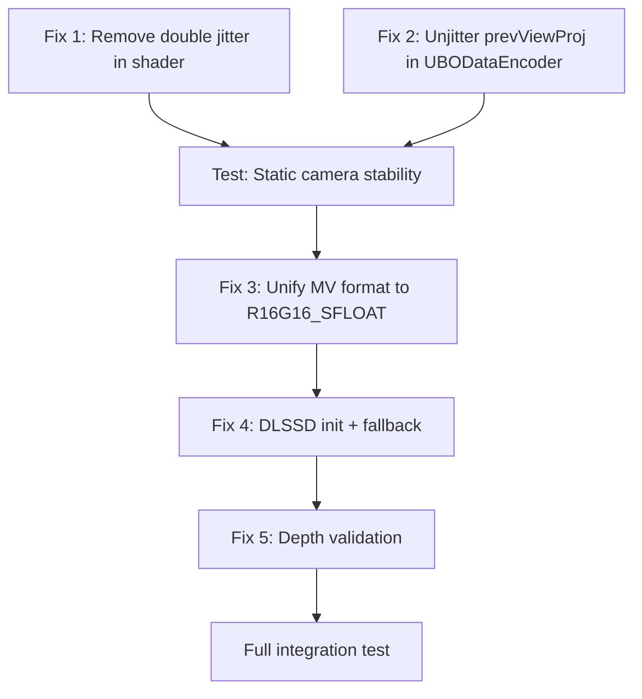

# DLSS Trembling & Ray Reconstruction Fix Plan

## Executive Summary

The DLSS integration suffers from **image trembling** caused by double jitter compensation in the motion vector pipeline, and the DLSS Ray Reconstruction (DLSSD) path has initialization and data-passing issues. This plan details five fixes ordered by impact.

---

## Issue 1: CRITICAL — Double Jitter Compensation in Motion Vectors

### Root Cause

The shader at [`ray0.rgen.preprocessed`](preprocessed_shaders/ray0.rgen.preprocessed:1074) subtracts jitter from `currentUV` before computing motion vectors:

```glsl
vec2 currentUV_unjittered = currentUV - (cam.jitterData.xy / launchSize);
motionVec = (prevUV - currentUV_unjittered) * launchSize;
```

DLSS already receives `InJitterOffsetX`/`InJitterOffsetY` parameters and performs its own internal unjittering. By pre-compensating in the shader, jitter is removed **twice**, producing per-frame sub-pixel oscillation visible as trembling.

### Fix

Remove the jitter subtraction from the shader. Motion vectors should be **pure geometric displacement** between the current and previous screen positions:

```glsl
// BEFORE (double jitter):
vec2 currentUV_unjittered = currentUV - (cam.jitterData.xy / launchSize);
motionVec = (prevUV - currentUV_unjittered) * launchSize;

// AFTER (correct):
motionVec = (prevUV - currentUV) * launchSize;
```

### Files to Change

| File | Change |
|------|--------|
| `preprocessed_shaders/ray0.rgen.preprocessed` ~line 1074-1075 | Remove `currentUV_unjittered`; use `currentUV` directly |
| Source `.rgen` shader (if separate from preprocessed) | Same change in the original GLSL source |

### Verification

- With a static camera, motion vectors for static geometry should be near-zero every frame.
- DLSS output should be stable with no sub-pixel jitter/shimmer.

---

## Issue 2: CRITICAL — prevViewProj Contains Jitter

### Root Cause

In [`UBODataEncoder.java`](src/main/java/me/cortex/vulkanite/client/rendering/UBODataEncoder.java:77), `curViewProj` is computed from `getGbufferProjection()` which includes the jittered projection matrix:

```java
curViewProj.set(CapturedRenderingState.INSTANCE.getGbufferProjection())
    .mul(tempView);
```

At the end of the frame (line 136), this jittered `curViewProj` is stored into `prevViewProj`:

```java
prevViewProj.set(curViewProj);
```

Next frame, when the shader reprojects via `cam.prevViewProj * vec4(absWorldPos, 1.0)`, the previous frame's **jittered** projection is used. Combined with the current frame's jittered projection for `currentUV`, this adds frame-to-frame jitter differences directly into the motion vectors.

### Fix

Compute and store an **unjittered** `curViewProj` for motion vector reprojection. The jitter needs to be removed from the projection matrix before multiplying with the view matrix.

#### Option A: Remove jitter from projection before computing ViewProj

```java
// Get the jittered projection
Matrix4f unjitteredProj = TL_UNJITTERED_PROJ.get();
unjitteredProj.set(CapturedRenderingState.INSTANCE.getGbufferProjection());

// Remove jitter: projection[2][0] and [2][1] contain the jitter offset
// Jitter is applied as: proj[2][0] += 2*jitterX/width, proj[2][1] += 2*jitterY/height
// But since we may not know the exact application method, we can reconstruct:
float jitterX = JitterManager.getJitterX();
float jitterY = JitterManager.getJitterY();
// Undo jitter in NDC: jitter was added as proj.m20 += jitterX * 2.0/width etc.
// The safest approach is to subtract the jitter contribution from m20/m21:
unjitteredProj.m20(unjitteredProj.m20() - jitterX * 2.0f);
unjitteredProj.m21(unjitteredProj.m21() - jitterY * 2.0f);

// Compute unjittered ViewProj for motion vector reprojection
curViewProj.set(unjitteredProj).mul(tempView);
```

> **Note:** The exact jitter removal depends on how `JitterManager` applies jitter to the Iris projection matrix. Need to verify the jitter is stored in pixel-space or NDC-space and adjust accordingly. Check [`JitterManager.java`](src/main/java/me/cortex/vulkanite/client/rendering/JitterManager.java) for the jitter application method.

#### Option B: Compute unjittered projection from scratch

If the jitter application format is unclear, reconstruct the projection matrix without jitter from known FOV/aspect/near/far values, bypassing the Iris jittered matrix entirely.

### Files to Change

| File | Change |
|------|--------|
| [`UBODataEncoder.java`](src/main/java/me/cortex/vulkanite/client/rendering/UBODataEncoder.java) | Add `TL_UNJITTERED_PROJ` ThreadLocal; compute unjittered projection; use it for `curViewProj` |
| [`JitterManager.java`](src/main/java/me/cortex/vulkanite/client/rendering/JitterManager.java) | Verify and possibly expose the jitter-to-NDC conversion factor |

### Verification

- Log `prevViewProj` elements `m20`/`m21` across frames — they should be constant for a static camera (no jitter oscillation).
- Motion vectors for static geometry with a moving camera should show smooth, consistent values.

---

## Issue 3: Motion Vector Format Mismatch

### Root Cause

Two different image formats are used for motion vectors:

- [`VulkanPipeline.java:937`](src/main/java/me/cortex/vulkanite/client/rendering/VulkanPipeline.java:937): creates as `VK_FORMAT_R16G16_SFLOAT`
- [`MotionVectorsGenerator.java:174`](src/main/java/me/cortex/vulkanite/client/rendering/MotionVectorsGenerator.java:174): creates as `VK_FORMAT_R32G32_SFLOAT`

The log message at line 941 of VulkanPipeline even says "RG32F" while the code uses `R16G16_SFLOAT`, suggesting confusion during development.

DLSS documentation recommends `R16G16_SFLOAT` for motion vectors. Using `R32G32_SFLOAT` wastes bandwidth and may cause format mismatch errors when the native bridge creates NGX resource descriptors.

### Fix

Unify to `VK_FORMAT_R16G16_SFLOAT` everywhere:

```java
// MotionVectorsGenerator.java line 174
// BEFORE:
VK_FORMAT_R32G32_SFLOAT
// AFTER:
VK_FORMAT_R16G16_SFLOAT
```

Also fix the misleading log message in VulkanPipeline.java:941:
```java
// BEFORE:
LOGGER.info("... + motion vectors (RG32F)", ...);
// AFTER:
LOGGER.info("... + motion vectors (RG16F)", ...);
```

### Files to Change

| File | Change |
|------|--------|
| [`MotionVectorsGenerator.java:174`](src/main/java/me/cortex/vulkanite/client/rendering/MotionVectorsGenerator.java:174) | Change `R32G32_SFLOAT` → `R16G16_SFLOAT` |
| [`VulkanPipeline.java:941`](src/main/java/me/cortex/vulkanite/client/rendering/VulkanPipeline.java:941) | Fix log message to say "RG16F" |

### Verification

- Check `dlss_bridge_debug.log` for no format mismatch errors.
- Confirm motion vector image is created with format 83 (`VK_FORMAT_R16G16_SFLOAT`).

---

## Issue 4: DLSSD / Ray Reconstruction Initialization

### Root Cause

The native bridge at [`dlss_wrapper.cpp:183`](dlss_bridge/dlss_wrapper.cpp:183) uses AppID `231313132` which is a generic/test ID. For DLSSD (Ray Reconstruction), NVIDIA may require a registered AppID or specific initialization path. The code has extensive comments about `bad00007` (NotInitialized) errors during feature creation, indicating this has been a persistent problem.

Additionally:
- Error handling after `CreateDLSSDFeature` gives up after 3 failures but doesn't surface the error to Java clearly.
- There is no automatic fallback from DLSSD to standard DLSS when Ray Reconstruction is unavailable.

### Fix

#### 4a. Improve NGX Initialization

```cpp
// Try with AppID 0 first (truly generic), which some SDK versions handle better
NVSDK_NGX_Result res = NVSDK_NGX_VULKAN_Init(
    0,  // AppID 0 = generic application
    L".",
    instance, physicalDevice, device,
    nullptr, nullptr, nullptr, nullptr
);

if (NVSDK_NGX_FAILED(res)) {
    // Fallback: try ProjectID method for development builds
    res = NVSDK_NGX_VULKAN_Init_with_ProjectID(
        "vulkanite-mc",
        NVSDK_NGX_ENGINE_TYPE_CUSTOM, "1.0",
        L".",
        instance, physicalDevice, device,
        nullptr, nullptr, nullptr, nullptr
    );
}
```

#### 4b. Add DLSSD → DLSS Fallback

In the Java layer ([`DLSSRayReconstruction.java`](src/main/java/me/cortex/vulkanite/client/rendering/DLSSRayReconstruction.java)), after DLSSD init fails:

```java
public boolean initialize(...) {
    int result = nativeInitDLSSD(...);
    if (result != 0) {
        LOGGER.warn("DLSSD init failed ({}), falling back to standard DLSS", result);
        useRayReconstruction = false;
        return initStandardDLSS(...);
    }
    useRayReconstruction = true;
    return true;
}
```

#### 4c. Better Error Reporting

Add a JNI-exported function to retrieve the last error string from the native bridge, so Java can log meaningful messages instead of just error codes.

### Files to Change

| File | Change |
|------|--------|
| [`dlss_wrapper.cpp`](dlss_bridge/dlss_wrapper.cpp) | Revise Init sequence; add `getLastError()` export; improve logging |
| [`DLSSRayReconstruction.java`](src/main/java/me/cortex/vulkanite/client/rendering/DLSSRayReconstruction.java) | Add DLSSD→DLSS fallback logic; surface native error messages |
| [`DLSSBridge.java`](src/main/java/me/cortex/vulkanite/client/rendering/DLSSBridge.java) | Add native method for `getLastError()` |

### Verification

- Test on RTX 40-series (DLSSD supported): should initialize DLSSD successfully.
- Test on RTX 20/30-series (DLSSD may not be supported): should gracefully fall back to standard DLSS.
- Check `dlss_bridge_debug.log` for clean initialization sequence without `bad00007` errors.

---

## Issue 5: Depth Handling for DLSSD

### Root Cause

The shader writes linear depth as `length(worldPos)` at [`ray0.rgen.preprocessed:1082`](preprocessed_shaders/ray0.rgen.preprocessed:1082):

```glsl
float linearDepth = cameraRelativePos ? length(worldPos) : length(worldPos - origin);
```

The native bridge defaults to `NVSDK_NGX_DLSS_Depth_Type_Linear` at [`dlss_wrapper.cpp:727`](dlss_bridge/dlss_wrapper.cpp:727). The `DepthInverted` flag was previously set but removed.

### Potential Problems

1. **Linear depth range**: `length(worldPos)` gives distance from camera origin, not a normalized depth. DLSSD expects specific depth ranges depending on the type flag.
2. **No near/far plane normalization**: Standard hardware depth is [0,1] mapped via near/far planes. Linear depth from raytracing can be arbitrarily large (hundreds of blocks in Minecraft).
3. **Format**: The depth image format must be verified — single-channel float is correct for linear depth.

### Fix

#### 5a. Verify Linear Depth Contract

Confirm that `NVSDK_NGX_DLSS_Depth_Type_Linear` expects raw world-space distance (meters/units) and not a normalized value. According to NVIDIA documentation:
- `DEPTH_TYPE_LINEAR` = linear depth in world units — this matches `length(worldPos)` ✓
- The depth image should be single-channel float (R32F or R16F)

#### 5b. Ensure Depth Image Format Matches

Check that the depth image passed to DLSSD is `R32_SFLOAT` (for precision with large Minecraft render distances).

#### 5c. Remove Diagnostic Code

Remove or gate behind a debug flag the diagnostic logging in [`UBODataEncoder.java:126-131`](src/main/java/me/cortex/vulkanite/client/rendering/UBODataEncoder.java:126) that prints every 60 frames, as it adds overhead in production.

### Files to Change

| File | Change |
|------|--------|
| [`GBufferDLSSDAdapter.java`](src/main/java/me/cortex/vulkanite/client/rendering/GBufferDLSSDAdapter.java) | Verify depth image format is R32_SFLOAT |
| [`dlss_wrapper.cpp`](dlss_bridge/dlss_wrapper.cpp) | Add assertion/log for depth format validation |
| [`UBODataEncoder.java`](src/main/java/me/cortex/vulkanite/client/rendering/UBODataEncoder.java) | Remove or conditionally gate diagnostic logging |

### Verification

- Log the actual depth values being passed to DLSSD (min/max per frame) to ensure they are in expected range.
- Verify no NaN/Inf values in depth buffer for sky pixels (where there is no geometry).

---

## Implementation Order

The fixes should be applied in this order due to dependencies:



| Priority | Fix | Impact |
|----------|-----|--------|
| **P0** | Fix 1 — Remove double jitter in shader | Eliminates primary trembling cause |
| **P0** | Fix 2 — Unjitter prevViewProj | Eliminates secondary trembling cause |
| **P1** | Fix 3 — Unify MV format | Prevents format mismatch crashes |
| **P1** | Fix 4 — DLSSD init + fallback | Enables Ray Reconstruction or graceful degradation |
| **P2** | Fix 5 — Depth validation | Ensures correct DLSSD depth input |

---

## Testing Checklist

- [ ] Static camera, static scene → motion vectors should be all zeros
- [ ] Static camera, moving entity → motion vectors only on entity pixels  
- [ ] Moving camera, static scene → smooth, consistent motion vectors
- [ ] DLSS output stable with no shimmer/trembling at all quality presets
- [ ] DLSSD initializes on RTX 40-series without errors
- [ ] DLSSD falls back to DLSS on non-supported hardware
- [ ] No `bad00007` errors in `dlss_bridge_debug.log`
- [ ] Motion vector image format is R16G16_SFLOAT in all code paths
- [ ] Depth buffer contains valid linear distances (no NaN/Inf for sky)
- [ ] Diagnostic logging removed or disabled in production builds
