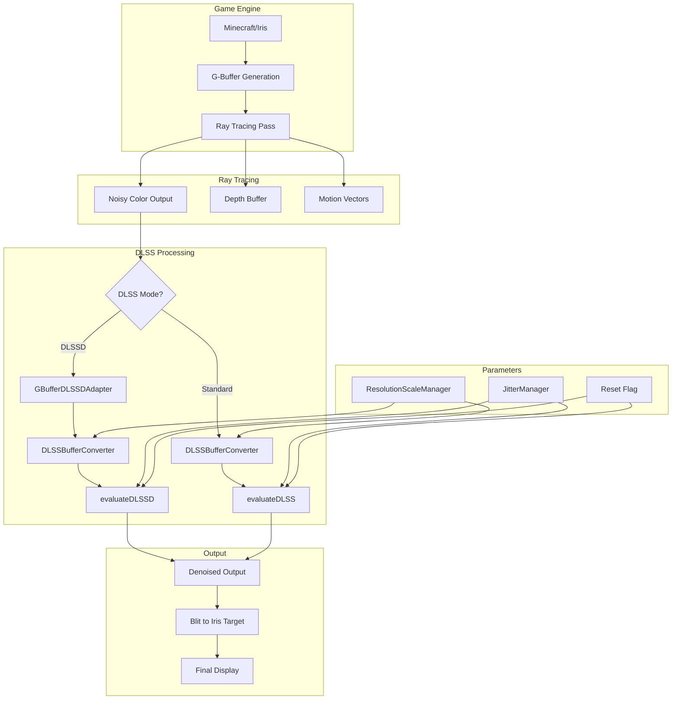
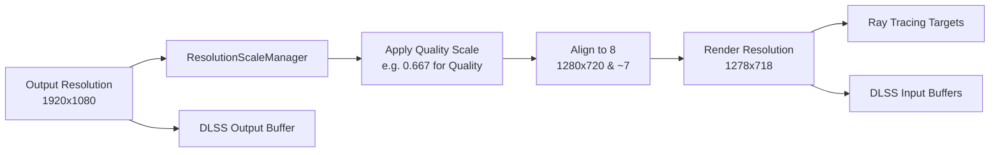
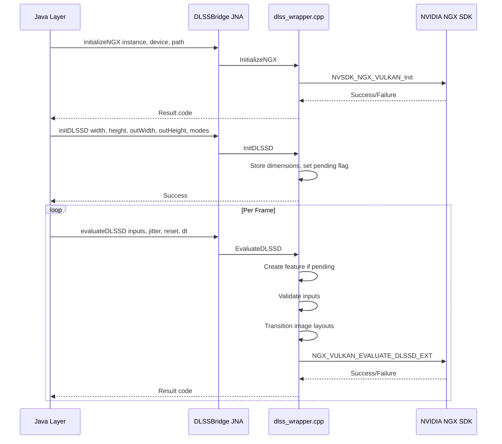

# DLSS Implementation Knowledge Document

## Purpose

This document captures the critical knowledge about DLSS/DLSSD requirements and the current implementation. It serves as the foundation for the future clean reimplementation, documenting what the SDK requires, what the current code provides, and the key integration points.

---

## Table of Contents

1. [DLSS SDK Requirements](#1-dlss-sdk-requirements)
2. [Current Implementation Analysis](#2-current-implementation-analysis)
3. [Known Issues and Gotchas](#3-known-issues-and-gotchas)
4. [Data Flow Diagram](#4-data-flow-diagram)
5. [Key Integration Points](#5-key-integration-points)
6. [Recommendations for Clean Reimplementation](#6-recommendations-for-clean-reimplementation)

---

## 1. DLSS SDK Requirements

### 1.1 NGX SDK Initialization

The NVIDIA NGX SDK must be initialized before any DLSS features can be used.

**Required Parameters:**
| Parameter | Type | Description |
|-----------|------|-------------|
| `vkInstance` | `VkInstance` | Vulkan instance handle |
| `vkPhysicalDevice` | `VkPhysicalDevice` | Physical device handle |
| `vkDevice` | `VkDevice` | Logical device handle |
| `ApplicationDataPath` | `wchar_t*` | Writable directory for NGX cache/logs |
| `ProjectID` or `AppID` | string/int | Application identifier |

**Initialization Methods:**
1. `NVSDK_NGX_VULKAN_Init(AppID, path, ...)` - Standard with numeric AppID
2. `NVSDK_NGX_VULKAN_Init_with_ProjectID(ProjectID, EngineType, EngineVersion, ...)` - For mods/non-commercial

**Critical Notes:**
- AppID `231313132` is NVIDIA's generic/test AppID that supports DLSS features
- ApplicationDataPath MUST be a writable directory (not read-only)
- For Minecraft mods, use the game directory or a temp directory

**Code Reference:** [`dlss_wrapper.cpp:233-427`](dlss_bridge/dlss_wrapper.cpp:233)

### 1.2 Standard DLSS Input Requirements

Standard DLSS (Super Resolution) requires the following inputs:

| Input | Format | Required | Description |
|-------|--------|----------|-------------|
| **Color** | `R16G16B16A16_SFLOAT` | Yes | Noisy/jittered color input at render resolution |
| **Depth** | `R32_SFLOAT` | Recommended | Linear depth buffer (distance from camera) |
| **Motion Vectors** | `R16G16_SFLOAT` or `R16G16B16A16_SFLOAT` | Yes | Screen-space pixel motion from prev to current frame |
| **Output** | `R16G16B16A16_SFLOAT` | Yes | Upscaled output at display resolution |

**Motion Vector Requirements:**
- Must be in **pixel space** (not NDC, not UV)
- Represents geometric motion only (camera + object movement)
- Should NOT include jitter compensation (DLSS handles this internally)
- Positive values = right/down movement
- Scale factor: `InMVScaleX = 1.0f, InMVScaleY = 1.0f` for pixel-space vectors

**Depth Requirements:**
- Linear depth (distance from camera), NOT hardware depth
- Positive values only
- Sky pixels should use far plane value

**Code Reference:** [`nvsdk_ngx_helpers_vk.h`](dlss_bridge/Include/nvsdk_ngx_helpers_vk.h)

### 1.3 DLSSD (Ray Reconstruction) Input Requirements

DLSSD requires all standard DLSS inputs PLUS G-buffer data:

| Input | Format | Required | Description |
|-------|--------|----------|-------------|
| **Color** | `R16G16B16A16_SFLOAT` | Yes | Noisy ray-traced output |
| **Depth** | `R32_SFLOAT` | **Required** | Linear depth (mandatory for DLSSD) |
| **Motion Vectors** | `R16G16B16A16_SFLOAT` | Yes | Screen-space motion |
| **Diffuse Albedo** | `R8G8B8A8_UNORM` or `R16G16B16A16_SFLOAT` | Yes | RGB surface diffuse color |
| **Specular Albedo** | `R8G8B8A8_UNORM` or `R16G16B16A16_SFLOAT` | Yes | F0 reflectance values |
| **Normals** | `R16G16B16A16_SFLOAT` | Yes | World-space normals (roughness in .w if packed) |
| **Roughness** | `R8_UNORM` or `R16_SFLOAT` | Optional | Separate roughness (if not packed in normals.w) |
| **Output** | `R16G16B16A16_SFLOAT` | Yes | Denoised output |

**Roughness Modes:**
- `NVSDK_NGX_DLSS_Roughness_Mode_Packed` (1): Roughness in normals.w component
- `NVSDK_NGX_DLSS_Roughness_Mode_Unpacked` (0): Separate roughness texture

**Depth Types:**
- `NVSDK_NGX_DLSS_Depth_Type_Linear` (0): Linear distance from camera
- `NVSDK_NGX_DLSS_Depth_Type_HW` (1): Hardware depth [0,1] or [1,0]

**Denoise Modes:**
- `NVSDK_NGX_DLSS_Denoise_Mode_Off` (0): No Ray Reconstruction
- `NVSDK_NGX_DLSS_Denoise_Mode_DLUnified` (1): Ray Reconstruction enabled

**Code Reference:** [`nvsdk_ngx_defs_dlssd.h`](dlss_bridge/Include/nvsdk_ngx_defs_dlssd.h)

### 1.4 Jitter Offset Requirements

**Range:** `[-0.5, 0.5]` in pixel space (render resolution)

**Generation:**
- Halton sequence recommended for temporal stability
- Base 2 for X, Base 3 for Y
- 8 phases typical (index 0-7)

**Application:**
1. Apply to projection matrix for ray tracing
2. Pass same values to DLSS evaluation

**Formula:**
```
jitterX = (halton(index, 2) - 0.5) * 2  // Maps [0,1) to [-0.5, 0.5)
jitterY = (halton(index, 3) - 0.5) * 2
```

**Projection Matrix Application:**
```glsl
// Convert pixel-space jitter to NDC
float jitterNDC_X = jitterX * 2.0 / renderWidth;
float jitterNDC_Y = jitterY * 2.0 / renderHeight;

// Apply to projection matrix
proj[2][0] += jitterNDC_X;
proj[2][1] += jitterNDC_Y;
```

**Code Reference:** [`JitterManager.java`](src/main/java/me/cortex/vulkanite/client/rendering/JitterManager.java)

### 1.5 Reset Flag

**When to Set Reset = 1:**
- First frame after feature creation
- Scene changes (new level, teleport)
- Camera cuts
- Resolution changes
- Quality preset changes
- Any temporal discontinuity

**Effect:** Invalidates temporal history, prevents ghosting artifacts

**Code Reference:** [`dlss_wrapper.cpp:894-898`](dlss_bridge/dlss_wrapper.cpp:894)

### 1.6 Resolution Parameters

**Dimension Requirements:**
- All dimensions must be **aligned to 8 pixels** (`width & ~7`)
- Render resolution: Internal resolution for ray tracing
- Output resolution: Display/target resolution

**Quality Preset Scale Factors:**
| Preset | Scale Factor | Example (1080p output) |
|--------|--------------|------------------------|
| Native/DLAA | 1.0 | 1920x1080 |
| Quality | 0.667 | 1280x720 |
| Balanced | 0.583 | 1120x630 |
| Performance | 0.5 | 960x540 |
| Ultra Performance | 0.333 | 640x360 |

**Code Reference:** [`dlss_wrapper.cpp:1021-1052`](dlss_bridge/dlss_wrapper.cpp:1021)

### 1.7 Motion Vector Scaling for DLSSD

**CRITICAL:** DLSSD works internally at OUTPUT resolution, but motion vectors are generated at RENDER resolution.

**Scale Calculation:**
```cpp
float mvScaleX = (float)outputWidth / (float)renderWidth;
float mvScaleY = (float)outputHeight / (float)renderHeight;
```

**Example:**
- Render: 1280x720, Output: 1920x1080
- `mvScaleX = 1920/1280 = 1.5`
- `mvScaleY = 1080/720 = 1.5`
- A motion vector of 10 pixels at render res becomes 15 pixels at output res

**Code Reference:** [`dlss_wrapper.cpp:929-932`](dlss_bridge/dlss_wrapper.cpp:929)

---

## 2. Current Implementation Analysis

### 2.1 Architecture Overview

The current implementation follows a layered architecture:

```
┌─────────────────────────────────────────────────────────────┐
│                     Java Layer                               │
│  ┌─────────────┐  ┌─────────────┐  ┌─────────────────────┐  │
│  │DLSSUpscaler │  │DLSSDPath    │  │DLSSRayReconstruction│  │
│  │ (new)       │  │(DLSSD impl) │  │ (legacy)             │  │
│  └─────────────┘  └─────────────┘  └─────────────────────┘  │
│           │               │                    │             │
│           └───────────────┼────────────────────┘             │
│                           ▼                                  │
│                  ┌─────────────────┐                         │
│                  │   DLSSBridge    │ (JNA Interface)         │
│                  └─────────────────┘                         │
└─────────────────────────────────────────────────────────────┘
                            │
                            ▼
┌─────────────────────────────────────────────────────────────┐
│                    Native Layer                              │
│                  ┌─────────────────┐                         │
│                  │  dlss_wrapper   │                         │
│                  │     .cpp        │                         │
│                  └─────────────────┘                         │
│                           │                                  │
│                           ▼                                  │
│                  ┌─────────────────┐                         │
│                  │   NVIDIA NGX    │                         │
│                  │      SDK        │                         │
│                  └─────────────────┘                         │
└─────────────────────────────────────────────────────────────┘
```

### 2.2 Input Buffer Generation

**Color Input:**
- Source: Ray tracing output from `ray0.rgen`
- Binding: `binding = 12` in VulkanPipeline
- Format: `VK_FORMAT_R16G16B16A16_SFLOAT`
- Resolution: Render resolution (scaled)

**Depth Buffer:**
- Source: Written by ray tracing shader
- Binding: `binding = 14` in VulkanPipeline
- Format: `VK_FORMAT_R32_SFLOAT` (linear depth)
- Calculation: `length(worldPos - cameraPos)`

**Motion Vectors:**
- Source: Calculated in `ray0.rgen`
- Binding: `binding = 13` in VulkanPipeline
- Format: `VK_FORMAT_R16G16B16A16_SFLOAT`
- Calculation: `(prevUV - currentUV) * launchSize`

**G-Buffer Inputs (DLSSD):**
- Source: Iris G-buffer textures
- Mapping via `GBufferDLSSDAdapter`:
  - Diffuse Albedo: `colortex1` (gbufferViews[0])
  - Specular Albedo: `colortex5` or `colortex2` (gbufferViews[4] or [1])
  - Normals: `colortex3` (gbufferViews[2])
  - Roughness: Packed in normals.w (default)

**Code Reference:** [`GBufferDLSSDAdapter.java:74-136`](src/main/java/me/cortex/vulkanite/client/rendering/GBufferDLSSDAdapter.java:74)

### 2.3 Buffer Format Conversions

The `DLSSBufferConverter` class handles format conversions:

**Common Conversions:**
1. RGBA8 UNORM → RGBA16 SFLOAT (for DLSSD compatibility)
2. Scaling from full resolution to render resolution
3. Format validation before passing to native code

**Code Reference:** [`DLSSBufferConverter.java`](src/main/java/me/cortex/vulkanite/client/rendering/DLSSBufferConverter.java)

### 2.4 Bridge Interface

The `DLSSBridge` JNA interface defines the native API:

**Key Methods:**
```java
// NGX Initialization
int initializeNGX(long vkInstance, long vkPhysicalDevice, long vkDevice, String dlssPath);

// Standard DLSS
int initDLSS(long vkInstance, long vkPhysicalDevice, long vkDevice, int width, int height, int outWidth, int outHeight);
int evaluateDLSS(long vkCommandBuffer, long colorImageView, long colorImage, int colorFormat, ...);
void destroyDLSS(long vkDevice);

// DLSSD (Ray Reconstruction)
int initDLSSD(long vkInstance, long vkPhysicalDevice, long vkDevice, int width, int height, int outWidth, int outHeight, int denoiseMode, int roughnessMode, int depthType, int perfQualityValue);
int evaluateDLSSD(long vkCommandBuffer, long colorImageView, long colorImage, int colorFormat, ...);
void destroyDLSSD(long vkDevice);
int isDLSSDAvailable();
```

**Code Reference:** [`DLSSBridge.java`](src/main/java/me/cortex/vulkanite/client/rendering/DLSSBridge.java)

### 2.5 Synchronization Points

**Image Layout Transitions:**
Before DLSS evaluation, all input images must be in correct layouts:

| Image | Required Layout | Access |
|-------|-----------------|--------|
| Color Input | `VK_IMAGE_LAYOUT_SHADER_READ_ONLY_OPTIMAL` | Read |
| Motion Vectors | `VK_IMAGE_LAYOUT_SHADER_READ_ONLY_OPTIMAL` | Read |
| Depth | `VK_IMAGE_LAYOUT_SHADER_READ_ONLY_OPTIMAL` | Read |
| G-Buffer Inputs | `VK_IMAGE_LAYOUT_SHADER_READ_ONLY_OPTIMAL` | Read |
| Output | `VK_IMAGE_LAYOUT_GENERAL` | UAV Write |

**Pipeline Barriers:**
- Source Stage: `VK_PIPELINE_STAGE_COMPUTE_SHADER_BIT`
- Destination Stage: `VK_PIPELINE_STAGE_FRAGMENT_SHADER_BIT`
- Source Access: `VK_ACCESS_SHADER_WRITE_BIT`
- Destination Access: `VK_ACCESS_SHADER_READ_BIT`

**Code Reference:** [`dlss_wrapper.cpp:973-1005`](dlss_bridge/dlss_wrapper.cpp:973)

---

## 3. Known Issues and Gotchas

### 3.1 DLSSD Fallback to Standard DLSS

**Issue:** When DLSSD feature creation fails, the system falls back to standard DLSS, which ignores G-buffer inputs.

**Symptoms:**
- Only albedo visible in output
- Denoising quality reduced
- G-buffer data completely ignored

**Root Cause:** Native code at [`dlss_wrapper.cpp:806-825`](dlss_bridge/dlss_wrapper.cpp:806) falls back to `EvaluateDLSS_Internal` when `m_DLSSDFeature` is null.

**Diagnostic Log:**
```
=== DIAG-RESOLUTION: DLSSD FALLBACK TO STANDARD DLSS ===
DIAG-RESOLUTION: Standard DLSS only uses: color, depth, motion vectors, output
DIAG-RESOLUTION: G-buffer inputs will be IGNORED!
```

### 3.2 Native Resolution Mode Rejection

**Issue:** DLSSD may reject native resolution mode (render == output).

**Symptoms:**
- DLSSD initialization fails
- Falls back to standard DLSS
- Log shows: "WARNING: Native resolution mode detected!"

**Cause:** DLSSD is designed for upscaling; native mode may not be supported.

**Workaround:** Use `QUALITY_NATIVE` preset which maps to DLAA mode.

**Code Reference:** [`DLSSRayReconstruction.java:289-307`](src/main/java/me/cortex/vulkanite/client/rendering/DLSSRayReconstruction.java:289)

### 3.3 Dimension Alignment Mismatches

**Issue:** Multiple places apply `& ~7` alignment, causing potential mismatches.

**Example:**
```
ResolutionScaleManager: 854 * 0.667 = 569.518 -> 569 & ~7 = 568
Old DLSSRayReconstruction: 854 & ~7 = 848, then 848 * 0.667 = 565 & ~7 = 560
```
This 8-pixel difference caused artifacts.

**Fix:** Use `ResolutionScaleManager` as single source of truth.

**Code Reference:** [`DLSSRayReconstruction.java:239-266`](src/main/java/me/cortex/vulkanite/client/rendering/DLSSRayReconstruction.java:239)

### 3.4 Output Image Layout Tracking

**Issue:** Transitioning output from `UNDEFINED` every frame causes validation errors.

**Fix:** Track output layout state; after first frame, transition from `GENERAL` to `GENERAL`.

**Code Reference:** [`dlss_wrapper.cpp:999-1005`](dlss_bridge/dlss_wrapper.cpp:999)

### 3.5 Jitter Range Validation

**Issue:** Jitter values outside [-0.5, 0.5] cause artifacts.

**Fix:** Native code clamps jitter values and logs warnings.

**Code Reference:** [`dlss_wrapper.cpp:201-216`](dlss_bridge/dlss_wrapper.cpp:201)

### 3.6 Motion Vector Double Compensation

**Issue:** If motion vectors already have jitter compensation applied, DLSS will double-compensate.

**Requirement:** Motion vectors should contain ONLY geometric motion (no jitter).

**Code Reference:** [`dlss_wrapper.cpp:554-563`](dlss_bridge/dlss_wrapper.cpp:554)

### 3.7 Sky Depth Value

**Issue:** Sky pixels use hardcoded depth of 10000.0.

**Potential Problem:** May cause edge artifacts at sky/object boundaries.

**Recommendation:** Use actual far plane distance from projection matrix.

**Code Reference:** [`ray0.rgen.preprocessed:1132`](preprocessed_shaders/ray0.rgen.preprocessed:1132)

### 3.8 Specular Albedo Source Variability

**Issue:** Specular albedo source varies between `colortex5` and `colortex2`.

**Potential Problem:** Inconsistent denoising if content differs between buffers.

**Recommendation:** Document expected content for each shader pack.

**Code Reference:** [`GBufferDLSSDAdapter.java:107-115`](src/main/java/me/cortex/vulkanite/client/rendering/GBufferDLSSDAdapter.java:107)

---

## 4. Data Flow Diagram

### 4.1 High-Level Flow



### 4.2 Buffer Resolution Flow



### 4.3 Native Bridge Flow



---

## 5. Key Integration Points

### 5.1 VulkanPipeline Integration

**File:** [`VulkanPipeline.java`](src/main/java/me/cortex/vulkanite/client/rendering/VulkanPipeline.java)

**Binding Points:**
| Binding | Usage | Format |
|---------|-------|--------|
| 12 | Final output target | `R16G16B16A16_SFLOAT` |
| 13 | Motion vectors | `R16G16B16A16_SFLOAT` |
| 14 | Linear depth | `R32_SFLOAT` |
| 15 | Previous frame reservoir | `R16G16B16A16_SFLOAT` |

### 5.2 Iris G-Buffer Integration

**File:** [`GBufferDLSSDAdapter.java`](src/main/java/me/cortex/vulkanite/client/rendering/GBufferDLSSDAdapter.java)

**G-Buffer Layout:**
| Buffer | Iris Name | Content |
|--------|-----------|---------|
| colortex1 | Albedo | Diffuse color RGB |
| colortex2 | Material | Metallic, roughness, AO, etc. |
| colortex3 | Normals | World-space normals, roughness in A |
| colortex4 | Position | World position or other |
| colortex5 | Extra | Specular data, etc. |

### 5.3 JitterManager Integration

**File:** [`JitterManager.java`](src/main/java/me/cortex/vulkanite/client/rendering/JitterManager.java)

**Key Methods:**
- `getJitterX()` / `getJitterY()`: Get current jitter offsets
- `applyJitter(Matrix4f proj)`: Apply jitter to projection matrix
- `advance()`: Move to next phase in sequence
- `reset()`: Reset to first phase

### 5.4 ResolutionScaleManager Integration

**File:** [`ResolutionScaleManager.java`](src/main/java/me/cortex/vulkanite/client/rendering/ResolutionScaleManager.java)

**Key Methods:**
- `update(outputWidth, outputHeight)`: Update dimensions
- `getRenderWidth()` / `getRenderHeight()`: Get aligned render dimensions
- `getOutputWidth()` / `getOutputHeight()`: Get output dimensions
- `getScaleFactor()`: Get current scale factor

---

## 6. Recommendations for Clean Reimplementation

### 6.1 Single Source of Truth for Dimensions

**Current Problem:** Multiple places calculate/align dimensions.

**Recommendation:** Use `ResolutionScaleManager` exclusively. All components should query dimensions from this single source.

### 6.2 Unified Input Preparation

**Current Problem:** `DLSSBufferConverter` and `DLSSDProcessor` both do format conversion.

**Recommendation:** Create a single `DLSSInputPreparer` class that:
1. Validates input formats
2. Performs necessary conversions
3. Scales G-buffers to render resolution
4. Creates properly typed image views

### 6.3 Clear Fallback Strategy

**Current Problem:** Fallback to standard DLSS is implicit and poorly documented.

**Recommendation:**
1. Explicitly detect DLSSD availability
2. Log clearly when fallback occurs
3. Provide user-facing indication of current mode
4. Consider disabling DLSSD entirely if fallback is persistent

### 6.4 Remove Legacy Code

**Current Problem:** `DLSSRayReconstruction` contains legacy buffer creation code.

**Recommendation:**
1. Remove internal buffer creation (rely on zero-copy path)
2. Consolidate to `DLSSUpscaler` + `DLSSDPath` architecture
3. Remove `DLSSDSettings` nested class (use `DLSSConfig`)

### 6.5 Improve Error Handling

**Current Problem:** NGX errors are logged but not always handled gracefully.

**Recommendation:**
1. Map NGX error codes to meaningful messages
2. Provide recovery strategies for common errors
3. Track consecutive failures and disable gracefully

### 6.6 Document Shader Pack Requirements

**Current Problem:** G-buffer content varies by shader pack.

**Recommendation:** Create a shader pack compatibility document:
1. Required G-buffer formats
2. Expected content in each buffer
3. Known working shader packs
4. Configuration options for different packs

---

## Appendix A: NGX Result Codes

| Code | Name | Description |
|------|------|-------------|
| 1 | `NVSDK_NGX_Result_Success` | Operation succeeded |
| -1 | `NVSDK_NGX_Result_FAIL` | Generic failure |
| -2 | `NVSDK_NGX_Result_FAIL_FeatureNotSupported` | Feature not available on this hardware |
| -3 | `NVSDK_NGX_Result_FAIL_PlatformError` | Platform-specific error |
| -4 | `NVSDK_NGX_Result_FAIL_FeatureAlreadyExists` | Feature already created |
| -5 | `NVSDK_NGX_Result_FAIL_FeatureNotFound` | Feature not found |
| -6 | `NVSDK_NGX_Result_FAIL_InvalidParameter` | Invalid parameter passed |
| -7 | `NVSDK_NGX_Result_FAIL_ScratchBufferTooSmall` | Internal buffer too small |
| -8 | `NVSDK_NGX_Result_FAIL_NotInitialized` | NGX not initialized |
| -9 | `NVSDK_NGX_Result_FAIL_UnsupportedInputFormat` | Input format not supported |
| -10 | `NVSDK_NGX_Result_FAIL_RWFlagMissing` | Image missing UAV access flag |
| -11 | `NVSDK_NGX_Result_FAIL_MissingInput` | Required input missing |
| -12 | `NVSDK_NGX_Result_FAIL_UnableToInitializeFeature` | Feature initialization failed |
| -13 | `NVSDK_NGX_Result_FAIL_OutOfDate` | Data out of date |
| -14 | `NVSDK_NGX_Result_FAIL_OutOfGPUMemory` | Insufficient GPU memory |
| -15 | `NVSDK_NGX_Result_FAIL_UnsupportedFormat` | Format not supported |

**Code Reference:** [`dlss_wrapper.cpp:88-107`](dlss_bridge/dlss_wrapper.cpp:88)

---

## Appendix B: Quality Preset Mapping

| Java Preset | Native Value | NGX Enum | Scale |
|-------------|--------------|----------|-------|
| NATIVE | 0 | `NVSDK_NGX_PerfQuality_Value_DLAA` | 1.0 |
| QUALITY | 1 | `NVSDK_NGX_PerfQuality_Value_MaxQuality` | 0.667 |
| BALANCED | 2 | `NVSDK_NGX_PerfQuality_Value_Balanced` | 0.583 |
| PERFORMANCE | 3 | `NVSDK_NGX_PerfQuality_Value_MaxPerf` | 0.5 |
| ULTRA_PERFORMANCE | 4 | `NVSDK_NGX_PerfQuality_Value_UltraPerformance` | 0.333 |

**Code Reference:** [`dlss_wrapper.cpp:1092-1100`](dlss_bridge/dlss_wrapper.cpp:1092)

---

## Appendix C: File Reference

| File | Purpose |
|------|---------|
| [`DLSSInputs.java`](src/main/java/me/cortex/vulkanite/client/rendering/dlss/DLSSInputs.java) | Input buffer container with builder pattern |
| [`DLSSContext.java`](src/main/java/me/cortex/vulkanite/client/rendering/dlss/DLSSContext.java) | State container for DLSS operations |
| [`DLSSUpscaler.java`](src/main/java/me/cortex/vulkanite/client/rendering/dlss/DLSSUpscaler.java) | Main facade for DLSS operations |
| [`DLSSDPath.java`](src/main/java/me/cortex/vulkanite/client/rendering/dlss/DLSSDPath.java) | DLSSD (Ray Reconstruction) implementation |
| [`DLSSBridge.java`](src/main/java/me/cortex/vulkanite/client/rendering/DLSSBridge.java) | JNA interface to native library |
| [`dlss_wrapper.cpp`](dlss_bridge/dlss_wrapper.cpp) | Native C++ wrapper around NGX SDK |
| [`GBufferDLSSDAdapter.java`](src/main/java/me/cortex/vulkanite/client/rendering/GBufferDLSSDAdapter.java) | Maps Iris G-buffers to DLSSD inputs |
| [`JitterManager.java`](src/main/java/me/cortex/vulkanite/client/rendering/JitterManager.java) | Manages subpixel jitter sequence |
| [`ResolutionScaleManager.java`](src/main/java/me/cortex/vulkanite/client/rendering/ResolutionScaleManager.java) | Centralized dimension management |
| [`DLSSRayReconstruction.java`](src/main/java/me/cortex/vulkanite/client/rendering/DLSSRayReconstruction.java) | Legacy DLSS integration (to be replaced) |

---

*Document Version: 1.0*
*Last Updated: 2026-03-25*
*Author: Architecture Analysis*
