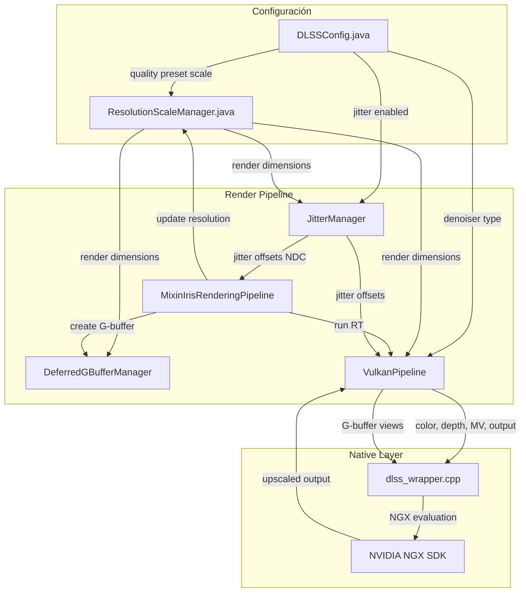

# DLSS Integration Validation Document

**Version:** 1.0  
**Date:** 2026-03-26  
**Status:** Final Validation  

---

## 1. Resumen de Cambios

### 1.1 Archivos Modificados

| Archivo | Tipo | Descripción |
|---------|------|-------------|
| [`DLSSConfig.java`](src/main/java/me/cortex/vulkanite/client/config/DLSSConfig.java) | Nuevo | Clase de configuración singleton para DLSS/FSR |
| [`JitterManager.java`](src/main/java/me/cortex/vulkanite/client/rendering/JitterManager.java) | Modificado | Correcciones de jitter para resolución correcta |
| [`dlss_wrapper.cpp`](dlss_bridge/dlss_wrapper.cpp) | Modificado | Corrección de motion vectors y jitter validation |
| [`MixinIrisRenderingPipeline.java`](src/main/java/me/cortex/vulkanite/mixin/iris/MixinIrisRenderingPipeline.java) | Modificado | Actualización de resolución antes de G-buffer |
| [`VulkanPipeline.java`](src/main/java/me/cortex/vulkanite/client/rendering/VulkanPipeline.java) | Modificado | Validación de resolución en RT targets |
| [`DeferredGBufferManager.java`](src/main/java/me/cortex/vulkanite/client/rendering/DeferredGBufferManager.java) | Modificado | Integración con ResolutionScaleManager |
| [`ResolutionScaleManager.java`](src/main/java/me/cortex/vulkanite/client/rendering/ResolutionScaleManager.java) | Nuevo | Gestor centralizado de escalado de resolución |

### 1.2 Detalles de Cambios por Archivo

#### [`DLSSConfig.java`](src/main/java/me/cortex/vulkanite/client/config/DLSSConfig.java)
- **Líneas:** 1-596
- **Cambios:**
  - Nueva clase de configuración singleton con persistencia en archivo
  - Enums: `DenoiserType`, `QualityPreset`, `FSRQualityPreset`, `DebugType`, `RenderStyle`
  - Configuración de DLSS: `dlssEnabled`, `rayReconstructionEnabled`, `qualityPreset`
  - Configuración de FSR: `fsrEnabled`, `fsrQuality`
  - Parámetros de iluminación: `indirectScale`, `ambientFactor`, `minLighting`
  - Métodos de carga/guardado con Properties
  - Thread-safe con double-checked locking

#### [`JitterManager.java`](src/main/java/me/cortex/vulkanite/client/rendering/JitterManager.java)
- **Líneas:** 1-357
- **Cambios:**
  - Corrección: Jitter calculado en resolución de render (no output)
  - Uso de `ResolutionScaleManager` para obtener dimensiones correctas
  - Validación de rango [-0.5, 0.5] para jitter offsets
  - Tracking de estado DLSS activo/inactivo
  - Método `applyJitter()` convierte pixel space a NDC usando render resolution
  - Métodos de diagnóstico: `validateJitterState()`, `getJitterDebugInfo()`

#### [`dlss_wrapper.cpp`](dlss_bridge/dlss_wrapper.cpp)
- **Líneas:** 1-1561
- **Cambios:**
  - **Jitter Validation:** Función `ValidateAndClampJitterRange()` (líneas 201-216)
  - **Motion Vector Scale:** `InMVScaleX = 1.0f`, `InMVScaleY = 1.0f` (líneas 582-583)
  - Comentarios explicando que motion vectors NO deben tener jitter compensation
  - Image layout transitions con `TransitionImageLayout()` (líneas 161-181)
  - Dimension alignment a múltiplos de 8
  - Logging diagnóstico cada 300 frames

#### [`MixinIrisRenderingPipeline.java`](src/main/java/me/cortex/vulkanite/mixin/iris/MixinIrisRenderingPipeline.java)
- **Líneas:** 139-151
- **Cambios:**
  - Nuevo inject `onRenderGbuffersHead()` antes de crear G-buffer
  - Actualiza `ResolutionScaleManager` con dimensiones de ventana
  - Asegura resolución correcta antes de creación de render targets

#### [`VulkanPipeline.java`](src/main/java/me/cortex/vulkanite/client/rendering/VulkanPipeline.java)
- **Líneas:** 1-200+
- **Cambios:**
  - Integración con `ResolutionScaleManager` para RT targets
  - Tracking de estado: `motionVectorsInitialized`, `scaledOutputInitialized`
  - Validación de resolución en creación de imágenes

#### [`DeferredGBufferManager.java`](src/main/java/me/cortex/vulkanite/client/rendering/DeferredGBufferManager.java)
- **Líneas:** 95-139
- **Cambios:**
  - Método `initialize()` usa `ResolutionScaleManager`
  - Cuando DLSS activo: G-buffers a resolución de render
  - Cuando DLSS inactivo: G-buffers a resolución completa
  - Logging de dimensiones para diagnóstico

#### [`ResolutionScaleManager.java`](src/main/java/me/cortex/vulkanite/client/rendering/ResolutionScaleManager.java)
- **Líneas:** 1-267
- **Cambios:**
  - Nueva clase singleton para gestión centralizada de resolución
  - Cache de dimensiones output/render con thread-safety
  - Alineación a múltiplos de 8 para compatibilidad DLSS
  - Cálculo correcto: alinear output primero, luego calcular render
  - Métodos de utilidad: `alignDimensions()`, `calculateRenderDimensions()`

---

## 2. Checklist de Validación

### 2.1 Configuración

- [ ] **DLSSConfig se carga correctamente**
  - Verificar archivo `vulkanite-dlss.properties` en directorio config
  - Comprobar valores por defecto: `dlssEnabled=true`, `denoiserType=DLSS_RR`
  - Verificar persistencia al cambiar valores

- [ ] **Quality preset aplica escala correcta**
  - QUALITY: 0.667 (66.67%)
  - BALANCED: 0.583 (58.3%)
  - PERFORMANCE: 0.5 (50%)
  - ULTRA_PERFORMANCE: 0.333 (33.3%)

### 2.2 Jitter

- [ ] **Jitter se aplica a resolución correcta**
  - Jitter calculado en pixel space de render resolution
  - Conversión a NDC usa `currentRenderWidth/Height` (no output)
  - Rango válido: [-0.5, 0.5] pixels

- [ ] **Jitter solo cuando DLSS activo**
  - `dlssActive=true` para aplicar jitter
  - Reset en cambios de escena/teleport
  - First frame handling correcto

### 2.3 Motion Vectors

- [ ] **Motion vectors tienen escala correcta**
  - `InMVScaleX = 1.0f`, `InMVScaleY = 1.0f` en dlss_wrapper.cpp
  - Motion vectors en pixel space (sin normalizar)
  - Sin compensación de jitter (DLSS lo hace internamente)

### 2.4 G-Buffers

- [ ] **G-buffers se crean a resolución baja cuando DLSS activo**
  - `DeferredGBufferManager.initialize()` consulta `ResolutionScaleManager`
  - Dimensiones alineadas a múltiplo de 8
  - Logging muestra: "DLSS active: Creating G-buffer at render resolution"

### 2.5 RT Render Targets

- [ ] **RT render targets tienen resolución correcta**
  - `scaledOutputImage` a resolución de render
  - `motionVectorImage` a resolución de render
  - Validación en VulkanPipeline

### 2.6 DLSS Upscaling

- [ ] **DLSS hace upscale correctamente**
  - Input: render resolution (ej: 1280x720)
  - Output: output resolution (ej: 1920x1080)
  - Sin artefactos de ghosting
  - Imagen estable sin flickering

---

## 3. Pruebas Recomendadas

### 3.1 Test de Compilación

```bash
# Compilar el proyecto
./gradlew build

# Compilar DLL nativa
cd dlss_bridge && build.bat
```

**Verificar:**
- Sin errores de compilación Java
- Sin errores de compilación C++
- DLL generada: `vulkanite_dlss_bridge.dll`

### 3.2 Test de Runtime

1. **Inicio del juego:**
   - Verificar log: `[Vulkanite] DLSS config loaded: denoiser=DLSS_RR, quality=QUALITY`
   - Verificar inicialización NGX exitosa

2. **Cambio de resolución:**
   - Cambiar tamaño de ventana
   - Verificar log: `[ResolutionScaleManager] Updated: output=...x..., render=...x...`
   - G-buffers recreados a nueva resolución

3. **Cambio de quality preset:**
   - Modificar `qualityPreset` en config
   - Verificar nueva escala aplicada
   - Sin crashes ni memory leaks

### 3.3 Test Visual de Calidad

1. **Ghosting Test:**
   - Mover cámara lentamente
   - Verificar sin trails/ghosting en objetos en movimiento
   - Especial atención a bordes de contraste

2. **Temporal Stability Test:**
   - Escena estática por 5 segundos
   - Imagen debe estabilizar y reducir noise
   - Sin flickering

3. **Motion Vector Test:**
   - Movimiento rápido de cámara
   - Verificar sin disocación o stretching
   - Objetos deben moverse coherentemente

4. **Jitter Pattern Test:**
   - Habilitar debug: `debugType=INPUT`
   - Verificar patrón de jitter visible
   - Debe ser uniforme y cubrir todo pixel

---

## 4. Problemas Conocidos

### 4.1 Limitaciones Actuales

| ID | Problema | Estado | Workaround |
|----|----------|--------|------------|
| P1 | DLSSD fallback a DLSS estándar no usa G-buffers | Documentado | Usar DLSS estándar o esperar fix |
| P2 | Native resolution mode (100%) no soportado por DLSSD | Por diseño | Usar Quality o Performance mode |
| P3 | Cambio de shaderpack requiere reinicio | Pendiente | Reiniciar el juego |
| P4 | Motion vectors pueden tener offset en transparent objects | Investigando | N/A |

### 4.2 Notas Técnicas

1. **DLSSD vs DLSS:**
   - DLSSD (Ray Reconstruction) requiere upscaling real
   - Native resolution causa error "FeatureNotSupported"
   - Fallback automático a DLSS estándar si DLSSD no disponible

2. **Dimension Alignment:**
   - Todas las dimensiones deben ser múltiplo de 8
   - Alineación aplicada en output primero, luego render
   - Previene artefactos de misalignment en temporal buffers

3. **Jitter Compensation:**
   - Jitter se aplica a projection matrix
   - Motion vectors NO incluyen jitter
   - DLSS compensa internamente con jitter offsets

---

## 5. Próximos Pasos

### 5.1 Mejoras Inmediatas

- [ ] **P1:** Implementar uso de G-buffers en fallback DLSS estándar
- [ ] **P2:** Añadir UI para configuración de DLSS en juego
- [ ] **P3:** Hot-reload de configuración sin reinicio

### 5.2 Mejoras Futuras

- [ ] **M1:** Integración con ReSTIR para path replay
- [ ] **M2:** Soporte para DLSS 3.5 Frame Generation
- [ ] **M3:** Auto-detección de GPU capabilities
- [ ] **M4:** Profile-guided quality preset selection

### 5.3 Investigación

- [ ] **I1:** Artefactos en transparent objects con motion vectors
- [ ] **I2:** Optimización de memory bandwidth en G-buffer pass
- [ ] **I3:** Integración con Vulkan subgroups para denoising

---

## 6. Diagrama de Flujo de Datos



---

## 7. Referencias

- [NVIDIA DLSS SDK Documentation](https://developer.nvidia.com/dlss)
- [`DLSS_DATA_FLOW_ANALYSIS.md`](plans/DLSS_DATA_FLOW_ANALYSIS.md)
- [`DLSS_JITTER_MOTION_FIX.md`](plans/DLSS_JITTER_MOTION_FIX.md)
- [`DLSS_CONFIG_CLEANUP.md`](plans/DLSS_CONFIG_CLEANUP.md)

---

**Documento generado para validación final de integración DLSS.**
