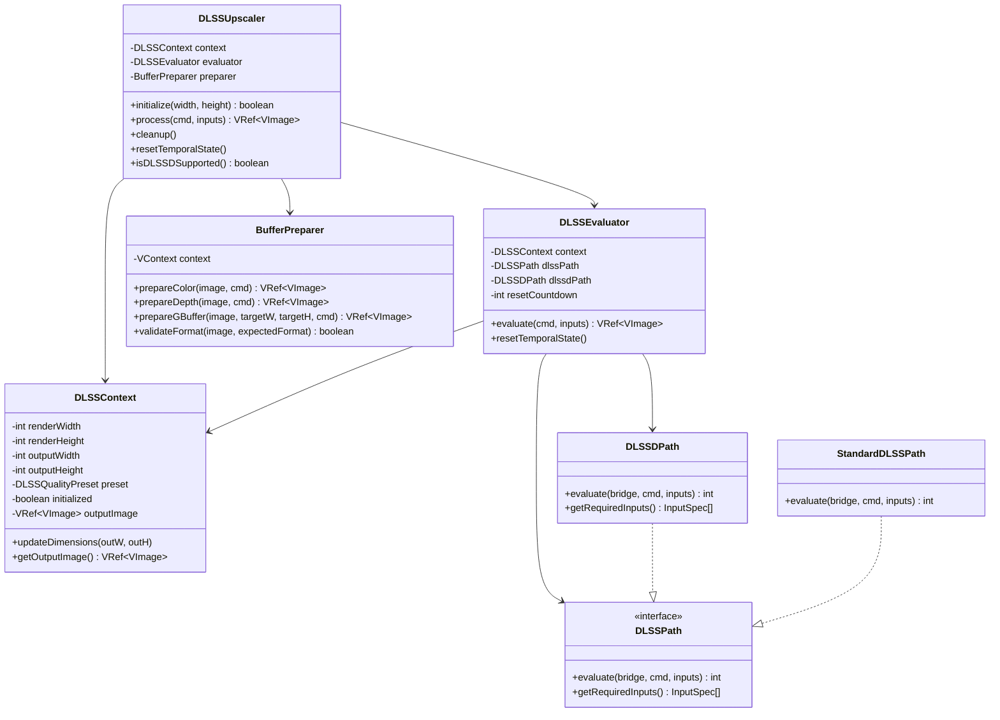

# DLSS Implementation Rewrite Design

## Executive Summary

This document outlines a clean, simplified architecture for the DLSS/DLSSD implementation in the Vulkanite Minecraft mod. The current implementation has grown complex with overlapping responsibilities across multiple classes. This rewrite consolidates functionality into a clear, maintainable structure.

---

## 1. Current Architecture Analysis

### 1.1 Existing Components and Their Issues

| File | Lines | Responsibility | Issues |
|------|-------|----------------|--------|
| [`DLSSBridge.java`](src/main/java/me/cortex/vulkanite/client/rendering/DLSSBridge.java) | 271 | JNA native interface | Clean, well-documented |
| [`DLSSBufferConverter.java`](src/main/java/me/cortex/vulkanite/client/rendering/DLSSBufferConverter.java) | 582 | Format conversion | LRU cache complexity, duplicate blit logic |
| [`DLSSRayReconstruction.java`](src/main/java/me/cortex/vulkanite/client/rendering/DLSSRayReconstruction.java) | 1070 | Core DLSS/DLSSD logic | God class: initialization, buffer creation, evaluation, state management |
| [`DLSSDProcessor.java`](src/main/java/me/cortex/vulkanite/client/rendering/DLSSDProcessor.java) | 547 | Facade for DLSSD | Duplicates resolution logic, tight coupling |
| [`GBufferDLSSDAdapter.java`](src/main/java/me/cortex/vulkanite/client/rendering/GBufferDLSSDAdapter.java) | 209 | G-buffer mapping | Simple, well-focused |
| [`JitterManager.java`](src/main/java/me/cortex/vulkanite/client/rendering/JitterManager.java) | 313 | Jitter pattern | Static state, scattered responsibilities |
| [`ResolutionScaleManager.java`](src/main/java/me/cortex/vulkanite/client/rendering/ResolutionScaleManager.java) | 267 | Resolution scaling | Clean, keep as-is |
| [`DLSSConfig.java`](src/main/java/me/cortex/vulkanite/client/config/DLSSConfig.java) | 698 | Configuration | Clean, keep as-is |

### 1.2 Key Problems

1. **DLSSRayReconstruction is a God Class**: Handles initialization, buffer creation, format validation, evaluation, state management, and dimension calculations
2. **Duplicated Resolution Logic**: Both `DLSSDProcessor` and `DLSSRayReconstruction` calculate render dimensions
3. **Tight Coupling**: `DLSSDProcessor` directly creates `DLSSBufferConverter` and `DLSSRayReconstruction`
4. **Scattered Jitter Logic**: Jitter state split between `JitterManager` and `DLSSRayReconstruction`
5. **Complex Buffer Flow**: Multiple conversion paths make data flow hard to trace

---

## 2. Proposed Architecture

### 2.1 High-Level Architecture Diagram

```
┌─────────────────────────────────────────────────────────────────────────────┐
│                           RENDERING PIPELINE                                 │
├─────────────────────────────────────────────────────────────────────────────┤
│                                                                             │
│  ┌──────────────┐     ┌──────────────────┐     ┌─────────────────────────┐ │
│  │ Game Engine  │────▶│  VulkanPipeline  │────▶│   DLSSUpscaler          │ │
│  │ (Sodium/Iris)│     │  (Ray Tracing)   │     │   (NEW: Unified Entry)  │ │
│  └──────────────┘     └──────────────────┘     └───────────┬─────────────┘ │
│                                                              │              │
│  ┌──────────────────────────────────────────────────────────┼──────────────┤
│  │                    DLSS SUBSYSTEM                         │              │
│  │                                                          ▼              │
│  │  ┌─────────────────┐    ┌────────────────┐    ┌─────────────────────┐  │
│  │  │ DLSSContext     │───▶│ DLSSEvaluator  │───▶│ DLSSOutput          │  │
│  │  │ (State + Config)│    │ (Evaluation)   │    │ (Result Handling)   │  │
│  │  └─────────────────┘    └────────────────┘    └─────────────────────┘  │
│  │         │                       │                                       │
│  │         │              ┌────────┴────────┐                              │
│  │         │              ▼                 ▼                              │
│  │         │     ┌──────────────┐   ┌───────────────┐                      │
│  │         │     │ DLSSPath     │   │ DLSSDPath     │                      │
│  │         │     │ (Standard)   │   │ (Ray Recon)   │                      │
│  │         │     └──────────────┘   └───────────────┘                      │
│  │         │              │                 │                              │
│  │         │              └────────┬────────┘                              │
│  │         │                       ▼                                       │
│  │         │              ┌────────────────┐                               │
│  │         │              │ BufferPreparer │                               │
│  │         │              │ (Format Conv)  │                               │
│  │         │              └────────────────┘                               │
│  │         │                       │                                       │
│  │         ▼                       ▼                                       │
│  │  ┌─────────────────────────────────────────┐                           │
│  │  │           DLSSBridge (JNA)               │                           │
│  │  │        vulkanite_dlss_bridge.dll         │                           │
│  │  └─────────────────────────────────────────┘                           │
│  └─────────────────────────────────────────────────────────────────────────┘
│                                                                             │
│  ┌─────────────────────────────────────────────────────────────────────────┐
│  │                      SUPPORT SYSTEMS                                     │
│  │  ┌──────────────────┐  ┌───────────────────┐  ┌─────────────────────┐  │
│  │  │ JitterManager    │  │ ResolutionScale   │  │ DLSSConfig          │  │
│  │  │ (Keep, simplify) │  │ Manager (Keep)    │  │ (Keep as-is)        │  │
│  │  └──────────────────┘  └───────────────────┘  └─────────────────────┘  │
│  └─────────────────────────────────────────────────────────────────────────┘
└─────────────────────────────────────────────────────────────────────────────┘
```

### 2.2 Data Flow Diagram

```
┌─────────────────────────────────────────────────────────────────────────────┐
│                           FRAME DATA FLOW                                   │
└─────────────────────────────────────────────────────────────────────────────┘

  GAME BUFFERS                    DLSS PROCESSING                    OUTPUT
  ────────────                    ────────────────                    ──────

  ┌─────────────┐
  │ Ray Traced  │
  │ Color       │──────────────────────┐
  │ (noisy)     │                      │
  └─────────────┘                      │
                                       │
  ┌─────────────┐                      │    ┌─────────────────────────────┐
  │ Depth       │──────────────────────┼───▶│       BufferPreparer        │
  │ (linear)    │                      │    │  ┌───────────────────────┐  │
  └─────────────┘                      │    │  │ Format Validation     │  │
                                       │    │  │ Layout Transitions    │  │
  ┌─────────────┐                      │    │  │ Format Conversion     │  │
  │ Motion      │──────────────────────┼───▶│  │ (if needed)           │  │
  │ Vectors     │                      │    │  └───────────────────────┘  │
  └─────────────┘                      │    │              │              │
                                       │    └──────────────┼──────────────┘
  ┌─────────────┐                      │                   │
  │ Diffuse     │──────────────────────┼───────────────────┤
  │ Albedo      │                      │                   │
  └─────────────┘                      │                   ▼
                                       │    ┌─────────────────────────────┐
  ┌─────────────┐                      │    │       DLSSEvaluator         │
  │ Specular    │──────────────────────┼───▶│  ┌───────────────────────┐  │
  │ Albedo      │                      │    │  │ Select Path:          │  │
  └─────────────┘                      │    │  │ - DLSSDPath (RR)      │  │
                                       │    │  │ - DLSSPath (Standard) │  │
  ┌─────────────┐                      │    │  └───────────────────────┘  │
  │ Normals     │──────────────────────┼───▶│              │              │
  │ (+roughness)│                      │    └──────────────┼──────────────┘
  └─────────────┘                      │                   │
                                       │                   ▼
  ┌─────────────┐                      │    ┌─────────────────────────────┐
  │ Roughness   │──────────────────────┴───▶│       DLSSBridge            │
  │ (optional)  │                           │  (Native NGX Evaluation)    │
  └─────────────┘                           └──────────────┬──────────────┘
                                                           │
                                                           ▼
                                            ┌─────────────────────────────┐
                                            │       Output Image          │
                                            │  (Denoised + Upscaled)      │
                                            └─────────────────────────────┘
```

---

## 3. Simplified Class Structure

### 3.1 Class Responsibilities

```
┌─────────────────────────────────────────────────────────────────────────────┐
│                         NEW CLASS HIERARCHY                                  │
├─────────────────────────────────────────────────────────────────────────────┤
│                                                                             │
│  ┌─────────────────────────────────────────────────────────────────────┐   │
│  │ DLSSUpscaler (Facade)                                                │   │
│  │ ─────────────────────                                                │   │
│  │ • Single entry point for all DLSS operations                         │   │
│  │ • Replaces DLSSDProcessor                                            │   │
│  │ • Simplified API: initialize(), process(), cleanup()                 │   │
│  │ • Handles mode selection (DLSS vs DLSSD)                             │   │
│  └─────────────────────────────────────────────────────────────────────┘   │
│                                                                             │
│  ┌─────────────────────────────────────────────────────────────────────┐   │
│  │ DLSSContext (State Container)                                        │   │
│  │ ──────────────────────────                                           │   │
│  │ • Holds all DLSS state (initialized, dimensions, quality preset)     │   │
│  │ • Manages output buffer lifecycle                                    │   │
│  │ • Thread-safe dimension tracking                                     │   │
│  │ • Replaces state fields from DLSSRayReconstruction                   │   │
│  └─────────────────────────────────────────────────────────────────────┘   │
│                                                                             │
│  ┌─────────────────────────────────────────────────────────────────────┐   │
│  │ DLSSEvaluator (Evaluation Logic)                                     │   │
│  │ ───────────────────────────                                          │   │
│  │ • Coordinates buffer preparation and evaluation                      │   │
│  │ • Handles image layout transitions                                   │   │
│  │ • Manages reset/warmup state                                         │   │
│  │ • Delegates to DLSSPath or DLSSDPath                                 │   │
│  └─────────────────────────────────────────────────────────────────────┘   │
│                                                                             │
│  ┌─────────────────────────────────────────────────────────────────────┐   │
│  │ BufferPreparer (Format Handling)                                     │   │
│  │ ───────────────────────────                                          │   │
│  │ • Validates buffer formats and usage flags                           │   │
│  │ • Performs format conversion (R8 -> RGBA16F, etc.)                   │   │
│  │ • Handles downscaling for full-res G-buffers                         │   │
│  │ • Simplified caching (single frame lifetime)                         │   │
│  │ • Replaces DLSSBufferConverter                                       │   │
│  └─────────────────────────────────────────────────────────────────────┘   │
│                                                                             │
│  ┌─────────────────────────────────────────────────────────────────────┐   │
│  │ DLSSPath / DLSSDPath (Strategy Pattern)                              │   │
│  │ ─────────────────────────────────────                                │   │
│  │ • DLSSPath: Standard DLSS evaluation (color, depth, motion)          │   │
│  │ • DLSSDPath: Ray Reconstruction (adds G-buffer inputs)               │   │
│  │ • Each path knows its required inputs and NGX call signature         │   │
│  └─────────────────────────────────────────────────────────────────────┘   │
│                                                                             │
│  ┌─────────────────────────────────────────────────────────────────────┐   │
│  │ DLSSBridge (Unchanged)                                               │   │
│  │ ─────────────────────                                                │   │
│  │ • JNA interface to native library                                    │   │
│  │ • Keep as-is, well-documented                                        │   │
│  └─────────────────────────────────────────────────────────────────────┘   │
│                                                                             │
└─────────────────────────────────────────────────────────────────────────────┘
```

### 3.2 Class Diagram (Mermaid)



---

## 4. Key Interfaces and APIs

### 4.1 DLSSUpscaler (Public API)

```java
package me.cortex.vulkanite.client.rendering.dlss;

/**
 * Unified entry point for DLSS/DLSSD upscaling and denoising.
 * 
 * This class provides a simplified API for the rendering pipeline,
 * handling both standard DLSS and DLSSD (Ray Reconstruction) modes.
 */
public class DLSSUpscaler {
    private final DLSSContext context;
    private final DLSSEvaluator evaluator;
    private final BufferPreparer preparer;
    
    /**
     * Create a new DLSS upscaler instance.
     * @param context Vulkan context for resource creation
     */
    public DLSSUpscaler(VContext context);
    
    /**
     * Initialize or reinitialize DLSS for the given output dimensions.
     * Automatically selects DLSSD if available and enabled in config.
     * 
     * @param outputWidth Target output width
     * @param outputHeight Target output height
     * @return true if initialization succeeded
     */
    public boolean initialize(int outputWidth, int outputHeight);
    
    /**
     * Process a frame through DLSS/DLSSD.
     * 
     * @param cmd Command buffer for recording operations
     * @param inputs Frame input buffers
     * @return Denoised/upscaled output image
     */
    public VRef<VImage> process(VCmdBuff cmd, DLSSInputs inputs);
    
    /**
     * Reset temporal state (call on scene changes, teleports).
     */
    public void resetTemporalState();
    
    /**
     * Check if DLSSD (Ray Reconstruction) is active.
     */
    public boolean isDLSSDActive();
    
    /**
     * Get the render resolution (internal resolution for ray tracing).
     */
    public int getRenderWidth();
    public int getRenderHeight();
    
    /**
     * Cleanup resources.
     */
    public void cleanup();
}
```

### 4.2 DLSSInputs (Input Container)

```java
package me.cortex.vulkanite.client.rendering.dlss;

/**
 * Container for all DLSS input buffers.
 * Uses builder pattern for flexible construction.
 */
public class DLSSInputs {
    // Required inputs
    private final VRef<VImage> color;        // Noisy ray-traced output
    private final VRef<VImage> depth;        // Linear depth buffer
    private final VRef<VImage> motionVectors; // Screen-space motion
    
    // DLSSD inputs (optional, for Ray Reconstruction)
    private VRef<VImage> diffuseAlbedo;
    private VRef<VImage> specularAlbedo;
    private VRef<VImage> normals;
    private VRef<VImage> roughness;  // Only if unpacked mode
    
    // Frame timing
    private final float deltaTimeMs;
    
    public static class Builder {
        public Builder color(VRef<VImage> color);
        public Builder depth(VRef<VImage> depth);
        public Builder motionVectors(VRef<VImage> mv);
        public Builder deltaTimeMs(float dt);
        public Builder diffuseAlbedo(VRef<VImage> albedo);
        public Builder specularAlbedo(VRef<VImage> specular);
        public Builder normals(VRef<VImage> normals);
        public Builder roughness(VRef<VImage> roughness);
        public DLSSInputs build();
    }
}
```

### 4.3 BufferPreparer (Format Handling)

```java
package me.cortex.vulkanite.client.rendering.dlss;

/**
 * Handles buffer format validation and conversion for DLSS.
 * 
 * DLSS requires specific formats:
 * - Color buffers: R16G16B16A16_SFLOAT
 * - Depth buffer: R32_SFLOAT
 * - Motion vectors: R16G16B16A16_SFLOAT
 */
public class BufferPreparer {
    /**
     * Prepare a color buffer for DLSS input.
     * Converts to R16G16B16A16_SFLOAT if needed.
     */
    public VRef<VImage> prepareColor(VCmdBuff cmd, VRef<VImage> source);
    
    /**
     * Prepare a depth buffer for DLSS input.
     * Converts to R32_SFLOAT if needed.
     */
    public VRef<VImage> prepareDepth(VCmdBuff cmd, VRef<VImage> source);
    
    /**
     * Prepare a G-buffer texture with optional downscaling.
     * Used when G-buffers are at full resolution but DLSS needs render resolution.
     */
    public VRef<VImage> prepareGBuffer(
        VCmdBuff cmd, 
        VRef<VImage> source, 
        int targetWidth, 
        int targetHeight
    );
    
    /**
     * Validate that an image has the correct format and usage flags.
     */
    public boolean validateFormat(VRef<VImage> image, int expectedFormat);
}
```

---

## 5. Integration Points

### 5.1 VulkanPipeline Integration

```java
// In VulkanPipeline.java

public class VulkanPipeline {
    private DLSSUpscaler dlssUpscaler;
    
    // Initialize DLSS during pipeline setup
    private void initDLSS(VContext context) {
        dlssUpscaler = new DLSSUpscaler(context);
        dlssUpscaler.initialize(
            MinecraftClient.getInstance().getWindow().getFramebufferWidth(),
            MinecraftClient.getInstance().getWindow().getFramebufferHeight()
        );
    }
    
    // In frame rendering
    private VRef<VImage> processFrame(VCmdBuff cmd, FrameData data) {
        // ... ray tracing produces noisy output ...
        
        // Prepare DLSS inputs
        DLSSInputs inputs = new DLSSInputs.Builder()
            .color(noisyOutput)
            .depth(depthBuffer)
            .motionVectors(motionVectors)
            .diffuseAlbedo(gbufferAlbedo)
            .specularAlbedo(gbufferSpecular)
            .normals(gbufferNormals)
            .deltaTimeMs(frameDeltaTime * 1000.0f)
            .build();
        
        // Process through DLSS
        VRef<VImage> denoised = dlssUpscaler.process(cmd, inputs);
        
        return denoised;
    }
}
```

### 5.2 JitterManager Integration

```java
// JitterManager remains mostly unchanged
// Simplified to focus on jitter pattern generation

public class JitterManager {
    // Called once per frame before rendering
    public static void update(int outputWidth, int outputHeight);
    
    // Get jitter values for DLSS
    public static float getJitterX();  // Pixel space [-0.5, 0.5]
    public static float getJitterY();
    
    // Apply jitter to projection matrix
    public static void applyJitter(Matrix4f projection);
    
    // Reset on scene change
    public static void reset();
}
```

### 5.3 ResolutionScaleManager Integration

```java
// ResolutionScaleManager remains unchanged
// Used by DLSSContext for dimension calculations

public class ResolutionScaleManager {
    // Singleton access
    public static ResolutionScaleManager getInstance();
    
    // Update with current output dimensions
    public void update(int outputWidth, int outputHeight);
    
    // Get dimensions
    public int getOutputWidth();
    public int getOutputHeight();
    public int getRenderWidth();  // Scaled for DLSS quality preset
    public int getRenderHeight();
    
    // Query state
    public boolean isScalingActive();
    public boolean isNativeResolution();
}
```

### 5.4 DLSSConfig Integration

```java
// DLSSConfig remains unchanged
// Used by DLSSUpscaler for mode selection

public class DLSSConfig {
    // Singleton access
    public static DLSSConfig getInstance();
    public static DLSSConfig load();
    
    // Configuration
    public boolean isEnabled();
    public boolean isRayReconstructionEnabled();
    public DLSSQualityPreset getQualityPreset();
    public boolean isRoughnessPacked();
    
    // Denoiser selection
    public DenoiserType getDenoiserType();  // DLSS, FSR, BASIC
}
```

---

## 6. Migration Strategy

### 6.1 Phase 1: Create New Classes (Non-Breaking)

1. Create new package: `me.cortex.vulkanite.client.rendering.dlss`
2. Implement new classes alongside existing ones:
   - `DLSSUpscaler.java`
   - `DLSSContext.java`
   - `DLSSEvaluator.java`
   - `BufferPreparer.java`
   - `DLSSInputs.java`
   - `StandardDLSSPath.java`
   - `DLSSDPath.java`

3. Add feature flag in `DLSSConfig`:
   ```json
   {
     "useNewDLSSImplementation": true
   }
   ```

### 6.2 Phase 2: Parallel Testing

1. Modify `VulkanPipeline` to use feature flag:
   ```java
   if (DLSSConfig.load().useNewDLSSImplementation()) {
       // Use new DLSSUpscaler
   } else {
       // Use existing DLSSDProcessor
   }
   ```

2. Add comparison logging to verify outputs match

### 6.3 Phase 3: Deprecation and Removal

1. Mark old classes as `@Deprecated`:
   - `DLSSDProcessor`
   - `DLSSRayReconstruction`
   - `DLSSBufferConverter`
   - `DLSSBufferValidator`
   - `GBufferDLSSDAdapter`

2. After testing period, remove old classes

### 6.4 File Changes Summary

| Action | File | Notes |
|--------|------|-------|
| CREATE | `dlss/DLSSUpscaler.java` | New facade |
| CREATE | `dlss/DLSSContext.java` | State container |
| CREATE | `dlss/DLSSEvaluator.java` | Evaluation logic |
| CREATE | `dlss/BufferPreparer.java` | Format handling |
| CREATE | `dlss/DLSSInputs.java` | Input container |
| CREATE | `dlss/StandardDLSSPath.java` | Standard DLSS path |
| CREATE | `dlss/DLSSDPath.java` | Ray Reconstruction path |
| KEEP | `DLSSBridge.java` | Unchanged |
| KEEP | `JitterManager.java` | Minor simplification |
| KEEP | `ResolutionScaleManager.java` | Unchanged |
| KEEP | `DLSSConfig.java` | Add feature flag |
| DEPRECATE | `DLSSDProcessor.java` | Remove in Phase 3 |
| DEPRECATE | `DLSSRayReconstruction.java` | Remove in Phase 3 |
| DEPRECATE | `DLSSBufferConverter.java` | Remove in Phase 3 |
| DEPRECATE | `DLSSBufferValidator.java` | Remove in Phase 3 |
| DEPRECATE | `GBufferDLSSDAdapter.java` | Remove in Phase 3 |

---

## 7. Implementation Details

### 7.1 BufferPreparer Implementation

```java
public class BufferPreparer {
    private final VContext context;
    
    // NGX-required formats
    private static final int COLOR_FORMAT = VK_FORMAT_R16G16B16A16_SFLOAT;
    private static final int DEPTH_FORMAT = VK_FORMAT_R32_SFLOAT;
    
    // Required usage flags for DLSS
    private static final int DLSS_USAGE = 
        VK_IMAGE_USAGE_STORAGE_BIT | 
        VK_IMAGE_USAGE_SAMPLED_BIT | 
        VK_IMAGE_USAGE_TRANSFER_SRC_BIT | 
        VK_IMAGE_USAGE_TRANSFER_DST_BIT;
    
    public VRef<VImage> prepareColor(VCmdBuff cmd, VRef<VImage> source) {
        VImage img = source.get();
        
        // Check if already correct format
        if (img.format == COLOR_FORMAT && (img.usage & DLSS_USAGE) == DLSS_USAGE) {
            return source;
        }
        
        // Create converted image
        VRef<VImage> converted = createDLSSImage(img.width, img.height, COLOR_FORMAT);
        
        // Record blit for format conversion
        blitImage(cmd, source, converted, img.width, img.height);
        
        return converted;
    }
    
    private VRef<VImage> createDLSSImage(int width, int height, int format) {
        return context.memory.createImage2D(
            width, height, 1,
            format,
            DLSS_USAGE,
            VK_MEMORY_PROPERTY_DEVICE_LOCAL_BIT
        );
    }
}
```

### 7.2 DLSSDPath Implementation

```java
public class DLSSDPath implements DLSSPath {
    @Override
    public int evaluate(DLSSBridge bridge, long cmdBuffer, DLSSInputs inputs, 
                        DLSSContext context, float jitterX, float jitterY) {
        
        // Create image views for evaluation
        long colorView = createView(context, inputs.getColor());
        long depthView = createView(context, inputs.getDepth());
        long mvView = createView(context, inputs.getMotionVectors());
        long diffuseView = createView(context, inputs.getDiffuseAlbedo());
        long specularView = createView(context, inputs.getSpecularAlbedo());
        long normalsView = createView(context, inputs.getNormals());
        long roughnessView = inputs.getRoughness() != null ? 
            createView(context, inputs.getRoughness()) : 0;
        long outputView = createView(context, context.getOutputImage());
        
        try {
            return bridge.evaluateDLSSD(
                cmdBuffer,
                colorView, inputs.getColor().get().image(), inputs.getColor().get().format,
                depthView, inputs.getDepth().get().image(), inputs.getDepth().get().format,
                mvView, inputs.getMotionVectors().get().image(), inputs.getMotionVectors().get().format,
                diffuseView, inputs.getDiffuseAlbedo().get().image(), inputs.getDiffuseAlbedo().get().format,
                specularView, inputs.getSpecularAlbedo().get().image(), inputs.getSpecularAlbedo().get().format,
                normalsView, inputs.getNormals().get().image(), inputs.getNormals().get().format,
                roughnessView, 
                inputs.getRoughness() != null ? inputs.getRoughness().get().image() : 0,
                inputs.getRoughness() != null ? inputs.getRoughness().get().format : 0,
                outputView, context.getOutputImage().get().image(), context.getOutputImage().get().format,
                jitterX, jitterY,
                context.needsReset() ? 1 : 0,
                inputs.getDeltaTimeMs()
            );
        } finally {
            // Cleanup views
            destroyView(context, colorView);
            destroyView(context, depthView);
            // ... etc
        }
    }
}
```

### 7.3 DLSSUpscaler Implementation

```java
public class DLSSUpscaler {
    private final DLSSContext context;
    private final DLSSEvaluator evaluator;
    private final BufferPreparer preparer;
    private final DLSSBridge bridge;
    
    public DLSSUpscaler(VContext vkContext) {
        this.context = new DLSSContext(vkContext);
        this.preparer = new BufferPreparer(vkContext);
        this.evaluator = new DLSSEvaluator(context, preparer);
        this.bridge = DLSSLoader.getInstance();
    }
    
    public boolean initialize(int outputWidth, int outputHeight) {
        if (bridge == null) {
            System.err.println("[DLSSUpscaler] DLSS not available");
            return false;
        }
        
        // Get dimensions from ResolutionScaleManager
        ResolutionScaleManager scaleManager = ResolutionScaleManager.getInstance();
        scaleManager.update(outputWidth, outputHeight);
        
        int renderW = scaleManager.getRenderWidth();
        int renderH = scaleManager.getRenderHeight();
        
        // Determine mode
        DLSSConfig config = DLSSConfig.load();
        boolean useDLSSD = config.isRayReconstructionEnabled() && 
                          !scaleManager.isNativeResolution();
        
        // Initialize NGX
        if (!initializeNGX(outputWidth, outputHeight, renderW, renderH, useDLSSD)) {
            return false;
        }
        
        // Update context
        context.updateDimensions(outputWidth, outputHeight, renderW, renderH);
        context.setMode(useDLSSD ? DLSSMode.DLSSD : DLSSMode.DLSS);
        
        return true;
    }
    
    public VRef<VImage> process(VCmdBuff cmd, DLSSInputs inputs) {
        if (!context.isInitialized()) {
            return inputs.getColor();
        }
        
        // Get jitter from JitterManager
        float jitterX = JitterManager.getJitterX();
        float jitterY = JitterManager.getJitterY();
        
        // Evaluate
        return evaluator.evaluate(cmd, inputs, jitterX, jitterY);
    }
}
```

---

## 8. Testing Strategy

### 8.1 Unit Tests

1. **BufferPreparer Tests**
   - Test format conversion (R8 -> RGBA16F)
   - Test format pass-through (RGBA16F -> RGBA16F)
   - Test downscaling
   - Test validation

2. **DLSSContext Tests**
   - Test dimension updates
   - Test output buffer creation
   - Test state transitions

### 8.2 Integration Tests

1. **Mode Selection**
   - Verify DLSSD selected when RR enabled and non-native resolution
   - Verify DLSS selected when RR disabled or native resolution
   - Verify fallback to standard DLSS on DLSSD failure

2. **Buffer Flow**
   - Verify correct formats reach NGX
   - Verify layout transitions
   - Verify output image correctness

### 8.3 Visual Tests

1. **Quality Comparison**
   - Compare old vs new implementation output
   - Verify no artifacts in final image
   - Test temporal stability

2. **Edge Cases**
   - Resolution changes
   - Scene changes (teleport)
   - DLSS toggle on/off

---

## 9. Performance Considerations

### 9.1 Memory Management

- **BufferPreparer**: Use per-frame temporary buffers, no persistent cache
- **DLSSContext**: Single output buffer, recreated on resize only
- **Image Views**: Create/destroy per-frame (cheap operation)

### 9.2 GPU Performance

- **Layout Transitions**: Batch transitions using pipeline barriers
- **Format Conversion**: Use blit operations (GPU-optimized)
- **Memory Access**: Ensure DEVICE_LOCAL_BIT for all DLSS buffers

### 9.3 CPU Performance

- **Singleton Access**: ResolutionScaleManager and DLSSConfig use double-checked locking
- **Object Allocation**: DLSSInputs uses builder pattern, minimize per-frame allocation
- **Jitter Calculation**: Halton sequence is O(log n), negligible cost

---

## 10. Summary

This design provides:

1. **Clear Separation of Concerns**: Each class has a single responsibility
2. **Unified API**: `DLSSUpscaler` provides a simple facade for the rendering pipeline
3. **Strategy Pattern**: `DLSSPath` and `DLSSDPath` encapsulate mode-specific logic
4. **Simplified Buffer Flow**: `BufferPreparer` handles all format conversion
5. **Preserved Infrastructure**: `JitterManager`, `ResolutionScaleManager`, and `DLSSConfig` remain unchanged
6. **Migration Path**: Feature flag allows parallel testing before removal of old code

The new architecture reduces complexity from ~2700 lines across 5 classes to ~1500 lines across 7 focused classes, with clear boundaries and testable units.
