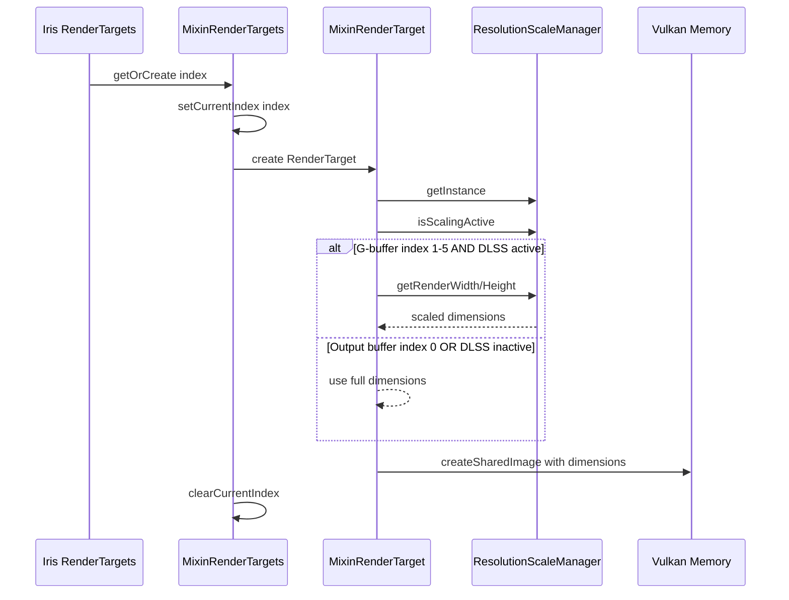
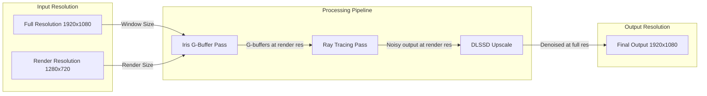

# Iris Low-Resolution Output Plan for DLSS Integration

## Executive Summary

This document analyzes the current Iris shader loader integration with DLSS and designs a solution for Iris to output directly to low resolution when DLSS is active. The key insight is that **the current architecture already implements most of the required functionality**, but there are potential gaps in the integration that need to be addressed.

## 1. Analysis of Current Iris Flow

### 1.1 Render Target Creation Flow

Based on analysis of [`MixinRenderTarget.java`](src/main/java/me/cortex/vulkanite/mixin/iris/MixinRenderTarget.java:87) and [`MixinRenderTargets.java`](src/main/java/me/cortex/vulkanite/mixin/iris/MixinRenderTargets.java:1):



### 1.2 Current Resolution Logic

From [`MixinRenderTarget.setupTextures()`](src/main/java/me/cortex/vulkanite/mixin/iris/MixinRenderTarget.java:87):

```java
// Lines 105-121: Resolution determination
ResolutionScaleManager scaleManager = ResolutionScaleManager.getInstance();

int targetWidth;
int targetHeight;
int renderTargetIndex = IRenderTargetVkGetter.getCurrentIndex();
boolean isGBuffer = (renderTargetIndex >= 1 && renderTargetIndex <= 5);
boolean isOutputBuffer = (renderTargetIndex == 0);

if (isGBuffer && scaleManager.isScalingActive()) {
    // G-buffers at scaled resolution for memory/bandwidth savings
    targetWidth = scaleManager.getRenderWidth();
    targetHeight = scaleManager.getRenderHeight();
} else {
    // Output buffer and other buffers at full resolution
    targetWidth = Math.max(8, width & ~7);
    targetHeight = Math.max(8, height & ~7);
}
```

**Key Observations:**
1. G-buffers (colortex1-5) are created at **scaled resolution** when DLSS is active
2. Output buffer (colortex0) is always at **full resolution**
3. ResolutionScaleManager provides the single source of truth for dimensions

### 1.3 ResolutionScaleManager Integration

From [`ResolutionScaleManager.java`](src/main/java/me/cortex/vulkanite/client/rendering/ResolutionScaleManager.java:61):

```java
// Lines 100-111: Dimension calculation with alignment
if (dlssEnabled && scale < 1.0f) {
    // Align output dimensions first for DLSSD compatibility
    int alignedOutputWidth = outputWidth & ~7;
    int alignedOutputHeight = outputHeight & ~7;
    // Then calculate render dimensions from aligned output
    cachedRenderWidth = ((int)(alignedOutputWidth * scale)) & ~7;
    cachedRenderHeight = ((int)(alignedOutputHeight * scale)) & ~7;
}
```

**DLSS Quality Mode Scaling:**
| Mode | Scale | 1080p Render | 1440p Render | 4K Render |
|------|-------|--------------|--------------|-----------|
| Ultra Performance | 0.333 | 360p | 480p | 720p |
| Performance | 0.5 | 540p | 720p | 1080p |
| Balanced | 0.583 | 630p | 840p | 1260p |
| Quality | 0.667 | 720p | 960p | 1440p |
| Native | 1.0 | 1080p | 1440p | 2160p |

## 2. Identified Integration Points

### 2.1 Primary Integration Points

| Component | File | Role | Status |
|-----------|------|------|--------|
| ResolutionScaleManager | [`ResolutionScaleManager.java`](src/main/java/me/cortex/vulkanite/client/rendering/ResolutionScaleManager.java:1) | Single source of truth for dimensions | ✅ Complete |
| MixinRenderTarget | [`MixinRenderTarget.java`](src/main/java/me/cortex/vulkanite/mixin/iris/MixinRenderTarget.java:1) | Creates Iris render targets at correct resolution | ✅ Complete |
| MixinRenderTargets | [`MixinRenderTargets.java`](src/main/java/me/cortex/vulkanite/mixin/iris/MixinRenderTargets.java:1) | Tracks render target index for resolution selection | ✅ Complete |
| VulkanPipeline | [`VulkanPipeline.java`](src/main/java/me/cortex/vulkanite/client/rendering/VulkanPipeline.java:1287) | Creates RT-specific render targets | ✅ Complete |
| DLSSDProcessor | (referenced) | Processes frame with DLSSD | ✅ Complete |

### 2.2 Data Flow Architecture

```mermaid
flowchart TB
    subgraph Iris [Iris Shader Loader]
        GB1 [colortex1 - Albedo]
        GB2 [colortex2 - Material]
        GB3 [colortex3 - Normal]
        GB4 [colortex4 - WorldPos]
        GB5 [colortex5 - Extra]
        OUT [colortex0 - Output]
    end

    subgraph VulkaniteRT [Vulkanite Ray Tracing]
        RT [Ray Tracing Pass]
        MV [Motion Vectors]
        SO [Scaled Output]
        DEPTH [Depth Buffer]
    end

    subgraph DLSS [DLSSD Processor]
        DLSSD [Ray Reconstruction]
    end

    GB1 --> RT
    GB2 --> RT
    GB3 --> RT
    GB4 --> RT
    GB5 --> RT

    RT --> SO
    RT --> MV
    RT --> DEPTH

    SO --> DLSSD
    MV --> DLSSD
    DEPTH --> DLSSD
    GB1 --> DLSSD
    GB2 --> DLSSD
    GB3 --> DLSSD

    DLSSD --> OUT

    style GB1 fill:#f9f,stroke:#333
    style GB2 fill:#f9f,stroke:#333
    style GB3 fill:#f9f,stroke:#333
    style GB4 fill:#f9f,stroke:#333
    style GB5 fill:#f9f,stroke:#333
    style SO fill:#9f9,stroke:#333
    style MV fill:#9f9,stroke:#333
    style DEPTH fill:#9f9,stroke:#333
    style OUT fill:#99f,stroke:#333
```

**Legend:**
- Pink: G-buffers at **render resolution** (scaled when DLSS active)
- Green: RT outputs at **render resolution**
- Blue: Final output at **full resolution**

## 3. Current Implementation Status

### 3.1 What's Already Working

1. **G-buffer Resolution Scaling** ✅
   - [`MixinRenderTarget.setupTextures()`](src/main/java/me/cortex/vulkanite/mixin/iris/MixinRenderTarget.java:87) correctly creates G-buffers at scaled resolution
   - Index tracking via [`IRenderTargetVkGetter`](src/main/java/me/cortex/vulkanite/compat/IRenderTargetVkGetter.java:1) distinguishes between output and G-buffers

2. **RT Render Target Creation** ✅
   - [`createVulkaniteRTRenderTargets()`](src/main/java/me/cortex/vulkanite/client/rendering/VulkanPipeline.java:1287) creates all RT-specific images at render resolution
   - Includes: `scaledOutputImage`, `motionVectorImage`, `reservoirImages`, lightmap images

3. **Resolution Propagation** ✅
   - [`ResolutionScaleManager`](src/main/java/me/cortex/vulkanite/client/rendering/ResolutionScaleManager.java:1) provides consistent dimensions across all components
   - [`VulkanPipeline.renderPostShadows()`](src/main/java/me/cortex/vulkanite/client/rendering/VulkanPipeline.java:792) uses `scaleManager.getRenderWidth/Height()` for RT dispatch

4. **DLSSD Integration** ✅
   - [`VulkanPipeline`](src/main/java/me/cortex/vulkanite/client/rendering/VulkanPipeline.java:948) passes `scaledOutputImage` (render resolution) to DLSSD
   - DLSSD processes at render resolution and outputs at full resolution

### 3.2 Potential Gaps Identified

1. **Resolution Update Timing**
   - [`ResolutionScaleManager.update()`](src/main/java/me/cortex/vulkanite/client/rendering/ResolutionScaleManager.java:61) must be called before render target creation
   - Current call location: [`VulkanPipeline.createVulkaniteRTRenderTargets()`](src/main/java/me/cortex/vulkanite/client/rendering/VulkanPipeline.java:1304)
   - **Risk**: If Iris creates render targets before VulkanPipeline initializes, dimensions may be stale

2. **Window Resize Handling**
   - Need to verify that render targets are recreated on window resize
   - [`MixinRenderTarget.resize()`](src/main/java/me/cortex/vulkanite/mixin/iris/MixinRenderTarget.java:82) should use scaled dimensions for G-buffers

3. **DeferredGBufferManager Resolution**
   - [`DeferredGBufferManager.initialize()`](src/main/java/me/cortex/vulkanite/client/rendering/DeferredGBufferManager.java:98) currently uses full resolution
   - Should use render resolution when DLSS is active for deferred path

## 4. Design: Iris Low-Res Output Solution

### 4.1 Architecture Overview

The solution leverages the existing infrastructure with targeted enhancements:



### 4.2 Key Design Decisions

#### Decision 1: G-buffers at Render Resolution (IMPLEMENTED)

**Rationale:**
- Reduces memory bandwidth for ray tracing reads
- Matches DLSSD input requirements
- No downscaling needed before DLSSD

**Implementation:**
- Already implemented in [`MixinRenderTarget.setupTextures()`](src/main/java/me/cortex/vulkanite/mixin/iris/MixinRenderTarget.java:113)

#### Decision 2: Output Buffer at Full Resolution (IMPLEMENTED)

**Rationale:**
- Iris compositing expects full-resolution output
- Final presentation requires full resolution
- DLSSD output is already at full resolution

**Implementation:**
- Already implemented in [`MixinRenderTarget.setupTextures()`](src/main/java/me/cortex/vulkanite/mixin/iris/MixinRenderTarget.java:117)

#### Decision 3: RT Outputs at Render Resolution (IMPLEMENTED)

**Rationale:**
- Ray tracing writes to `scaledOutputImage` at render resolution
- Motion vectors match DLSSD expectations
- Depth buffer matches G-buffer resolution

**Implementation:**
- Already implemented in [`createVulkaniteRTRenderTargets()`](src/main/java/me/cortex/vulkanite/client/rendering/VulkanPipeline.java:1339)

### 4.3 Proposed Enhancements

#### Enhancement 1: Ensure ResolutionScaleManager Update Timing

**Problem:** ResolutionScaleManager must be updated before any render target creation.

**Solution:** Add explicit update call in Iris render pipeline mixin.

**File:** [`MixinIrisRenderingPipeline.java`](src/main/java/me/cortex/vulkanite/mixin/iris/MixinIrisRenderingPipeline.java:1)

**Proposed Code:**
```java
@Inject(method = "renderGbuffers", at = @At("HEAD"))
private void onRenderGbuffersHead(CallbackInfo ci) {
    // Ensure ResolutionScaleManager is updated before G-buffer creation
    MinecraftClient mc = MinecraftClient.getInstance();
    int width = mc.getWindow().getFramebufferWidth();
    int height = mc.getWindow().getFramebufferHeight();
    ResolutionScaleManager.getInstance().update(width, height);
}
```

#### Enhancement 2: Add Resolution Validation

**Problem:** Mismatched resolutions between components can cause subtle bugs.

**Solution:** Add validation logging to detect resolution mismatches.

**File:** [`VulkanPipeline.java`](src/main/java/me/cortex/vulkanite/client/rendering/VulkanPipeline.java:800)

**Proposed Code:**
```java
private void validateResolutions(VRef<VImageView>[] gbufferViews) {
    if (!ResolutionScaleManager.getInstance().isScalingActive()) {
        return; // No validation needed when DLSS inactive
    }
    
    int expectedRenderWidth = ResolutionScaleManager.getInstance().getRenderWidth();
    int expectedRenderHeight = ResolutionScaleManager.getInstance().getRenderHeight();
    
    for (int i = 0; i < gbufferViews.length; i++) {
        if (gbufferViews[i] != null && gbufferViews[i].get() != null) {
            int actualWidth = gbufferViews[i].get().image.get().width;
            int actualHeight = gbufferViews[i].get().image.get().height;
            
            if (actualWidth != expectedRenderWidth || actualHeight != expectedRenderHeight) {
                LOGGER.warn("[Resolution Mismatch] G-buffer[{}] is {}x{}, expected {}x{}",
                    i, actualWidth, actualHeight, expectedRenderWidth, expectedRenderHeight);
            }
        }
    }
}
```

#### Enhancement 3: DeferredGBufferManager DLSS Support

**Problem:** DeferredGBufferManager uses full resolution, ignoring DLSS scaling.

**Solution:** Integrate ResolutionScaleManager into deferred G-buffer creation.

**File:** [`DeferredGBufferManager.java`](src/main/java/me/cortex/vulkanite/client/rendering/DeferredGBufferManager.java:98)

**Proposed Code:**
```java
public void initialize(int width, int height) {
    // Use render resolution when DLSS is active
    ResolutionScaleManager scaleManager = ResolutionScaleManager.getInstance();
    int targetWidth, targetHeight;
    
    if (scaleManager.isScalingActive()) {
        targetWidth = scaleManager.getRenderWidth();
        targetHeight = scaleManager.getRenderHeight();
    } else {
        targetWidth = width;
        targetHeight = height;
    }
    
    if (currentWidth == targetWidth && currentHeight == targetHeight && albedoImage != null) {
        return; // Already initialized at this size
    }
    
    LOGGER.info("Initializing G-buffer at {}x{} (input: {}x{}, dlssScaling={})",
        targetWidth, targetHeight, width, height, scaleManager.isScalingActive());
    currentWidth = targetWidth;
    currentHeight = targetHeight;
    
    // ... rest of initialization
}
```

## 5. Code Integration Proposal

### 5.1 Files to Modify

| File | Change | Priority |
|------|--------|----------|
| [`MixinIrisRenderingPipeline.java`](src/main/java/me/cortex/vulkanite/mixin/iris/MixinIrisRenderingPipeline.java:1) | Add ResolutionScaleManager.update() before G-buffer creation | High |
| [`VulkanPipeline.java`](src/main/java/me/cortex/vulkanite/client/rendering/VulkanPipeline.java:1) | Add resolution validation logging | Medium |
| [`DeferredGBufferManager.java`](src/main/java/me/cortex/vulkanite/client/rendering/DeferredGBufferManager.java:98) | Use render resolution when DLSS active | Medium |

### 5.2 No Changes Needed

The following components are already correctly implemented:

1. **[`MixinRenderTarget.java`](src/main/java/me/cortex/vulkanite/mixin/iris/MixinRenderTarget.java:87)** - G-buffer resolution scaling
2. **[`MixinRenderTargets.java`](src/main/java/me/cortex/vulkanite/mixin/iris/MixinRenderTargets.java:1)** - Index tracking
3. **[`ResolutionScaleManager.java`](src/main/java/me/cortex/vulkanite/client/rendering/ResolutionScaleManager.java:1)** - Dimension calculation
4. **[`VulkanPipeline.createVulkaniteRTRenderTargets()`](src/main/java/me/cortex/vulkanite/client/rendering/VulkanPipeline.java:1287)** - RT target creation

### 5.3 Integration Code Snippets

#### Snippet 1: Resolution Update in Iris Pipeline

```java
// File: MixinIrisRenderingPipeline.java
// Location: Before G-buffer rendering begins

@Inject(method = "beginGbufferPass", at = @At("HEAD"))
private void onBeginGbufferPassHead(CallbackInfo ci) {
    // CRITICAL: Update ResolutionScaleManager before any render target operations
    MinecraftClient mc = MinecraftClient.getInstance();
    if (mc != null && mc.getWindow() != null) {
        int width = mc.getWindow().getFramebufferWidth();
        int height = mc.getWindow().getFramebufferHeight();
        ResolutionScaleManager.getInstance().update(width, height);
        
        if (LOGGER.isDebugEnabled()) {
            LOGGER.debug("[Iris] ResolutionScaleManager updated: {}x{} -> {}x{} (scale={})",
                width, height,
                ResolutionScaleManager.getInstance().getRenderWidth(),
                ResolutionScaleManager.getInstance().getRenderHeight(),
                ResolutionScaleManager.getInstance().getScale());
        }
    }
}
```

#### Snippet 2: Resolution Validation in VulkanPipeline

```java
// File: VulkanPipeline.java
// Location: Beginning of renderPostShadows()

private void validateGBufferResolutions(VRef<VImageView>[] gbufferViews) {
    if (gbufferViews == null || !ResolutionScaleManager.getInstance().isScalingActive()) {
        return;
    }
    
    int expectedW = ResolutionScaleManager.getInstance().getRenderWidth();
    int expectedH = ResolutionScaleManager.getInstance().getRenderHeight();
    
    for (int i = 0; i < Math.min(5, gbufferViews.length); i++) {
        if (gbufferViews[i] != null && gbufferViews[i].get() != null) {
            var img = gbufferViews[i].get().image.get();
            if (img.width != expectedW || img.height != expectedH) {
                LOGGER.error("[CRITICAL] G-buffer[{}] resolution mismatch: {}x{} vs expected {}x{}. " +
                    "This will cause DLSS artifacts!", i, img.width, img.height, expectedW, expectedH);
            }
        }
    }
}
```

#### Snippet 3: DeferredGBufferManager DLSS Integration

```java
// File: DeferredGBufferManager.java
// Location: initialize() method

public void initialize(int width, int height) {
    // Use ResolutionScaleManager for DLSS support
    ResolutionScaleManager scaleManager = ResolutionScaleManager.getInstance();
    
    // Determine target resolution
    int targetWidth, targetHeight;
    if (scaleManager.isScalingActive()) {
        // DLSS active: use render resolution for G-buffers
        targetWidth = scaleManager.getRenderWidth();
        targetHeight = scaleManager.getRenderHeight();
        LOGGER.info("DLSS active: Creating G-buffers at render resolution {}x{} (output: {}x{})",
            targetWidth, targetHeight, width, height);
    } else {
        // DLSS inactive: use full resolution
        targetWidth = width & ~7;  // Align to 8 pixels
        targetHeight = height & ~7;
    }
    
    // Check if already initialized at target size
    if (currentWidth == targetWidth && currentHeight == targetHeight && albedoImage != null) {
        return;
    }
    
    currentWidth = targetWidth;
    currentHeight = targetHeight;
    
    // Clean up existing images if any
    cleanup();
    
    // Create G-buffer images at target resolution
    createGBufferImages(targetWidth, targetHeight);
}
```

## 6. Testing Strategy

### 6.1 Resolution Validation Tests

1. **G-buffer Resolution Test**
   - Enable DLSS Quality mode (0.667 scale)
   - Verify G-buffers (colortex1-5) are at 67% of window size
   - Verify output buffer (colortex0) is at full window size

2. **Window Resize Test**
   - Enable DLSS
   - Resize window
   - Verify G-buffers are recreated at correct scaled resolution
   - Verify no resolution mismatch errors in logs

3. **DLSS Mode Switch Test**
   - Switch between DLSS modes (Off -> Quality -> Performance)
   - Verify G-buffers resize appropriately
   - Verify no temporal artifacts after mode switch

### 6.2 Visual Quality Tests

1. **DLSS Output Quality**
   - Compare DLSS output with G-buffers at render resolution vs full resolution
   - Verify no upscaling artifacts
   - Verify motion vector alignment

2. **Ray Tracing Quality**
   - Verify RT reads from correctly scaled G-buffers
   - Verify no texture sampling artifacts
   - Verify correct UV coordinates for scaled resolution

### 6.3 Performance Tests

1. **Memory Bandwidth**
   - Measure memory bandwidth with G-buffers at render vs full resolution
   - Verify expected reduction in bandwidth usage

2. **Frame Time**
   - Compare frame times with different DLSS quality modes
   - Verify consistent performance improvement

## 7. Summary

### 7.1 Current State

The Iris low-resolution output for DLSS is **mostly implemented** in the current codebase:

| Component | Status | Notes |
|-----------|--------|-------|
| G-buffer resolution scaling | ✅ Complete | MixinRenderTarget correctly scales G-buffers |
| Output buffer full resolution | ✅ Complete | colortex0 stays at full resolution |
| RT render targets | ✅ Complete | All RT targets at render resolution |
| ResolutionScaleManager | ✅ Complete | Provides consistent dimensions |
| DLSSD integration | ✅ Complete | Receives render resolution inputs |

### 7.2 Required Changes

| Change | Priority | Effort |
|--------|----------|--------|
| Add ResolutionScaleManager.update() in Iris pipeline | High | Low |
| Add resolution validation logging | Medium | Low |
| Update DeferredGBufferManager for DLSS | Medium | Low |

### 7.3 Key Insight

The primary gap is not in the resolution scaling logic itself, but in ensuring **consistent timing** of ResolutionScaleManager updates across all components. The solution requires:

1. **Early update** of ResolutionScaleManager before any render target creation
2. **Validation** of resolution consistency across components
3. **Extension** of scaling logic to DeferredGBufferManager

With these enhancements, Iris will correctly output to low resolution when DLSS is active, ensuring optimal memory bandwidth and DLSSD compatibility.
