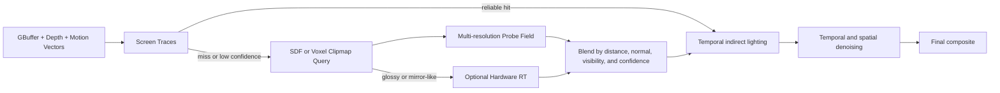
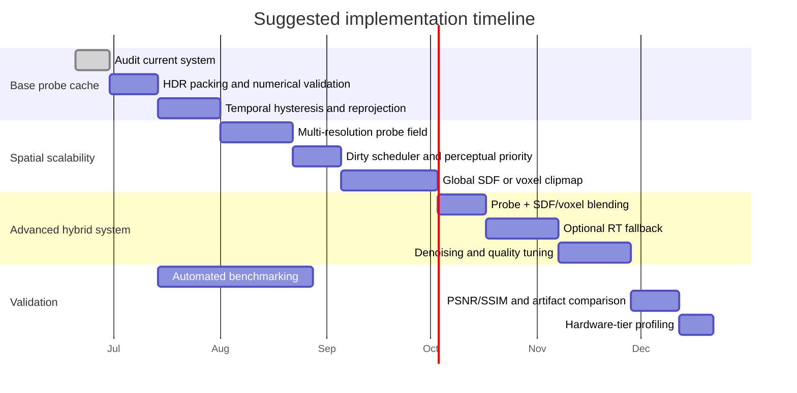

Translated from your uploaded text: 

# Technical Report for Improving Your Real-Time Lighting System

## Executive Summary

Your current implementation, based on the shared file, is already very close to a **directional irradiance/radiance probe cache**: it subdivides each section into a fixed `8×8×8` grid, stores six directional lobes per probe, selects a subset of lights by priority, evaluates visibility through a voxelized DDA-style traversal against local opacity, and packs the result into `RGB10_A2` with a confidence bitfield.

That is a reasonable foundation for approximate indirect lighting or low-cost local directional lighting, but it is still closer to a **re-injected local direct-light cache** than to a modern hybrid GI system with multiple bounces, wide-range spatial hierarchies, and stable temporal accumulation.

If you take Radiance, voxel GI, and Lumen into account, the strongest direction is not to replace everything with one single method. Instead, build a hybrid architecture with three layers: a **persistent Radiance-like cache for stability and reuse**, a **volumetric or SDF/voxel representation for spatial coverage and off-screen occlusion**, and **Lumen-like hybrid tracing with screen traces first and a more reliable fallback afterward**, ideally with optional hardware RT for glossy materials or low-confidence cases.

Radiance contributes key ideas around **true HDR**, **persistent reusable caching**, and **shared interreflection values**. Lumen contributes a production-proven strategy for combining **Screen Traces**, **Surface Cache**, **Distance Fields**, and **Hardware RT**. Probe/DDGI work contributes practical mechanisms for controlling leaks, transitions, and scalability.

The best quality/performance improvement for your case, assuming a custom engine and **unspecified hardware targets**, is this: keep your probe grid as the backbone, but change three things first.

First, move from `RGB10_A2` to an HDR format with a shared exponent or logarithmic compression, because Radiance showed early on that storing calibrated high-dynamic-range radiance is crucial, and your current packing can easily saturate when many lights contribute to the same probe.

Second, add **temporal accumulation with hysteresis and confidence-based invalidation**, because the visible code does not show temporal history, which leaves you exposed to shimmer and popping.

Third, stop relying only on local CPU visibility and add a broader hierarchical representation — distance fields, voxel clipmaps, or both — to resolve occlusion, bounces, and coverage beyond the immediate section neighborhood.

My final recommendation is a staged migration. In the first stage, turn your current system into a **temporal, persistent HDR probe cache**. In the second, add a **hierarchical volumetric structure** for coarse diffuse GI and robust occlusion. In the third, add a Lumen-like layer of **screen-space first, volumetric/SDF fallback, and optional RT** for glossy materials, reflections, and low-confidence cases.

That path minimizes technical risk, improves visual quality, protects frame time, and allows scaling from mid-range hardware to hardware with dedicated RT.

---

## Diagnosis of Your Current System

The shared file implements a probe page per section with a fixed size of `8×8×8`, for a total of `512` probes per section and `6` directional faces per probe. Each directional value is accumulated in `float` arrays, then packed into 32-bit integers with `10` bits per channel and the final `2` bits used as a cheap confidence hint.

That creates a very cheap and immediate representation of local lighting, but with two structural limitations: the angular model is very low-frequency, and the dynamic range of the packing is narrow for scenarios with many summed contributions.

There is also a clearly **CPU-centered** pipeline for selection and accumulation. The system selects the “most relevant” lights using a priority queue and a score based on emission, luma, radius, and distance to the page center. It then iterates over affected probes and performs a visibility test using voxelized DDA traversal over an opacity lookup with a `±1` section radius.

This helps limit cost and avoids considering every light, but the asymptotic cost still grows as the product of selected lights, influenced probes, and traversal steps. That hurts scenes with many small light sources and complex occluding geometry.

Another major limitation is **spatial reach**. The `SectionOpacityLookup` structure only queries sections in a `3×3×3` cube around the central section. That is fine for local occlusion and simplicity, but insufficient for large-scale GI, complex interiors with multiple connected rooms, or wide outdoor environments where relevant bounces come from farther away.

Finally, the visible file does not show any explicit **secondary bounce**, **temporal accumulation**, or persistent structure equivalent to Radiance’s ambient file. Radiance specifically exploits the fact that diffuse interreflection values are mostly **view-independent** and can be shared and reused between processes and runs. Lumen also relies heavily on several caches and amortized updates across multiple frames.

That absence is a big opportunity: today, your system is simple and understandable; tomorrow, it can become the foundation of a much more competitive hybrid GI system without completely breaking the existing architecture.

---

## Principles and Comparison of Approaches

Radiance began as a validated lighting simulation tool that takes a 3D geometric scene and produces spectral radiance maps using octree-accelerated ray tracing. Its ecosystem uses custom HDR formats and, most importantly for your case, defines an **Ambient File** for sharing diffuse interreflection values between processes or runs, taking advantage of the fact that these values are mostly view-independent.

Voxel-based approaches discretize the scene into a volume to simplify tracing and filtering. In practice, this family includes **Voxel Cone Tracing**, **Sparse Voxel Octrees**, and variants with clipmaps/cascades.

The key advantage is that the volume allows **prefiltering** of spatial and angular information for approximate indirect-light queries at a relatively stable cost. In VCT, the classic idea is to use mipmapped volumes to trace diffuse, specular, and occlusion cones. In SVO, the hierarchy stores only occupied or relevant regions and naturally supports LOD. In modern practice, many systems combine these ideas with probes or distance fields to reduce leaking and update cost.

Lumen represents a production hybrid architecture. Its official documentation describes how it first launches **Screen Traces** and then uses a more reliable method. It supports **Software Ray Tracing** through **Mesh Distance Fields** and the **Global Distance Field**, as well as **Hardware Ray Tracing** against triangles for higher quality, especially for mirror-like reflections and more complex geometry.

It also uses a **Surface Cache** parameterized with “Cards” to quickly query lighting at ray-hit points, amortizes updates over multiple frames, and exposes controls for scene quality, distance, final gather, and update speed.

By comparison, your current system already shares DNA with two of these worlds. Like Radiance, it has a reusable local cache with a notion of confidence. Like probe/DDGI systems and part of Lumen, it uses spatial discretization and compact directional responses.

What it lacks is the hierarchical part and the wide-range hybrid tracing.

| Approach             | Core idea                                                             | Advantages                                                                                        | Disadvantages                                                                                                   | Implementation difficulty                                                            | Best use                                              |
| -------------------- | --------------------------------------------------------------------- | ------------------------------------------------------------------------------------------------- | --------------------------------------------------------------------------------------------------------------- | ------------------------------------------------------------------------------------ | ----------------------------------------------------- |
| Radiance             | Physically based ray tracing, octree, HDR, and interreflection caches | High fidelity, strong physical foundation, excellent offline reference, persistent caches         | Not designed as a modern general-purpose interactive GI system for games; high cost if full fidelity is pursued | Medium-high if only adapting cache/HDR ideas; very high if porting the full approach | Ground truth, validation, and persistent cache design |
| Voxel GI / VCT / SVO | Hierarchical or mipmapped volume for approximate tracing              | Wide spatial coverage, natural LOD, good diffuse performance, integrates well with dynamic worlds | Light leaks, angular aliasing, memory cost if voxelization is not adaptive, complex updates                     | High                                                                                 | Diffuse GI and off-screen occlusion                   |
| Lumen-style hybrid   | Screen traces + SDF/Surface Cache fallback + optional RT              | Strong balance of quality/performance, robust dynamic changes, scalable by tiers                  | Complex architecture, many caches, delicate tuning, strong dependency on auxiliary scene representations        | Very high                                                                            | Modern engines with varied hardware targets           |
| Your current system  | Section probes + six directional faces + local DDA visibility         | Simple, understandable, compact, cheap per section                                                | Short range, low angular detail, no temporal accumulation, limited HDR, CPU-bound                               | Already implemented                                                                  | Foundation for incremental evolution                  |

The strategic takeaway is clear: if you want **visual quality, real-time performance, memory/bandwidth efficiency, and scalability** at the same time, the solution is not “Radiance or voxels or Lumen.” It is **Radiance ideas + voxel/SDF structure + Lumen-style hybrid fallback**.

---

## Hybrid Integration and Migration

The best integration between approaches starts by recognizing the role of each data structure.

**Probes** should be your low-frequency, high-stability cache.

**Voxels or distance fields** should provide occlusion, reach, and a reasonable off-screen scene representation.

**Hybrid tracing** should decide at shading time which source to use based on roughness, confidence, and whether data is available on screen.

This is exactly how Lumen prioritizes screen traces and then switches to a more reliable method, with Surface Cache and SDF or hardware RT tracing depending on the mode.

In your specific case, the natural migration would be to keep the spatial unit of the “section” and add two additional levels.

The first would be a **multi-resolution probe field**: keep `8×8×8` as the local base density where it already works, but allow lower density in homogeneous areas and higher density near windows, emissive surfaces, sharp normal changes, or thin occluders.

The second would be a global hierarchical representation: a **voxel clipmap** or **global distance field** so that bounces and visibility are not restricted to the `3×3×3` neighborhood.

For sampling and accumulation, the bridge between Radiance and Lumen is **reuse**. Radiance stores diffuse interreflection in shareable ambient files; Lumen uses multiple caches and amortized updates. So instead of fully recalculating every affected probe after the first change, you should implement **dirty marking + update priority + temporal hysteresis**.

High-confidence probes with low variation and low visual influence can keep their history. New, conflicting, or camera-proximate probes should be updated first.

In other words, your current “confidence” should not be limited to two packing bits. It should become a control signal for the update scheduler.

For denoising and blending, the recommendation is to work in two domains.

In 3D, combine probes with weights based on distance, normal, visibility, and confidence to avoid light leaking.

In temporal 2D, reproject indirect lighting and apply hysteresis modulated by motion, exposure changes, roughness, and disocclusion.

Lumen explicitly exposes the fact that several caches may take multiple frames to converge and offers separate controls for scene-lighting update speed and final-gather update speed. That suggests a healthy separation between “stability” and “response speed,” which you should also adopt.



The diagram summarizes the recommended architecture: screen-space first for cost, volumetric/SDF representation for coverage, probes for stability, and RT only where it truly buys quality.

That is the most realistic migration if your development-time and hardware constraints are still **unspecified**.

---

## Concrete Algorithmic Improvements and Optimizations

The most obvious and probably most valuable improvement is **HDR storage**. Radiance built its entire pipeline around calibrated high-dynamic-range radiance and popularized a 32-bit format with a shared exponent. Your current implementation uses `RGB10_A2` with linear clamping.

In scenes with several summed light sources, bright materials, or strong bounces, that quantization and saturation become a direct source of energy loss and banding.

The concrete recommendation is to switch to one of these options:

`RGB9E5`, RGBE/Radiance-like packing, LogLuv, or a custom packing format with mantissa plus shared exponent.

Move confidence to a separate `R8`/`RG8` channel or to a per-probe texture instead of hiding it in two alpha bits.

The second improvement is to replace the six-face angular model with a more expressive basis. Your current model uses `addFace` for ±X, ±Y, and ±Z as six axis-aligned lobes. That is cheap and solid for coarse diffuse lighting, but too rough for mixing GI with glossy reflections or preserving spatial anisotropy.

Two reasonable routes are:

Keep six lobes for the low tier and add **low-order SH** or a **low-resolution octahedral map** for the high tier.

Or keep the six faces only as control/occlusion channels and store the main irradiance/radiance in a different basis.

The third improvement is to turn updates into an **adaptive scheduler**. Today, cost is dominated by:

`selected lights × affected probes × DDA visibility`

You should reduce that product from three sides:

Fewer lights per probe through better importance sampling.

Fewer probes updated per frame through perceptual priority.

Fewer visibility steps through hierarchies.

Production probe-GI literature reports practical extensions in exactly that direction: fast transition heuristics, irradiance reuse for glossy lighting, probe state machines to prune irrelevant work, and multi-resolution cascades for large worlds.

```text
Algorithm A: adaptive probe update with HDR and temporal accumulation

for each dirtySection in priorityQueue:
    probeSet = selectProbes(dirtySection, camera, luminanceVariance, confidence)
    lightSet = importanceSampleLights(dirtySection, probeSet, maxLightsDynamic)
    for probe in probeSet:
        estimate = 0
        visibilityMeta = 0
        for light in lightSet:
            if quickReject(light, probe): continue
            vis = traceVisibilityHybrid(probe, light, localOpacity, globalSDF, voxelClipmap)
            estimate += evalDirectionalLight(light, probe) * vis
            visibilityMeta = updateMomentsOrCone(visibilityMeta, vis)
        history = reprojectPrevious(probe)
        blended = temporalBlend(history, estimate, confidence, motion, disocclusion)
        storeHDRProbe(probe, blended, visibilityMeta, confidence)
```

The expected complexity of this algorithm is:

`O(K * P̄ * L̄ * Cvis)`

Where:

`K` is the number of dirty sections processed per frame.

`P̄` is the number of probes actually updated per section.

`L̄` is the number of lights actually sampled per probe after importance sampling.

`Cvis` is the average cost of hybrid visibility.

The point of the redesign is that all four terms become controllable. In the current code, `P̄` and `Cvis` are much less manageable.

```text
Algorithm B: Lumen-style hybrid query for real-time shading

function queryIndirect(x, n, v, roughness):
    ss = screenTrace(x, n, v)
    if ss.valid and ss.confidence > Tscreen:
        return ss.radiance

    probeGI = sampleProbeField(x, n)
    sdfGI   = traceSDFOrVoxelCone(x, n, roughness)

    result = blendByConfidence(probeGI, sdfGI)

    if hardwareRTAvailable and (roughness < Tglossy or result.confidence < Tlow):
        rt = traceHardwareRay(x, reflect(v,n), maxDistance)
        result = blendSpecular(result, rt)

    return temporalDenoise(result)
```

The shading-query complexity remains roughly `O(1)` for screen tracing plus `O(nsamples)` for SDF/voxel cone tracing and, optionally, an RT cost dominated by BVH traversal.

That respects Lumen’s principle: use the cheapest path first and increase cost only when uncertainty or visual requirements increase.

These are the optimizations I would prioritize, in practical order:

| Improvement                                      | Expected impact | Implementation cost | Memory/bandwidth impact                         | Artifacts reduced                              |
| ------------------------------------------------ | --------------- | ------------------- | ----------------------------------------------- | ---------------------------------------------- |
| HDR packing such as RGBE/RGB9E5/LogLuv           | High            | Low-medium          | Slight increase or neutral, depending on format | Clipping, banding, energy loss                 |
| Temporal accumulation with confidence            | High            | Medium              | Low                                             | Flicker, popping, shimmer                      |
| Multi-resolution probe field                     | High            | Medium-high         | Better quality/memory ratio                     | Splotches, lack of local detail                |
| Global SDF or voxel clipmap                      | High            | High                | Medium-high                                     | Missing coverage, leaks, off-screen GI failure |
| Blending with visibility/moments                 | Medium-high     | Medium              | Low-medium                                      | Light leaking                                  |
| Hardware RT only for glossy/low-confidence cases | Medium-high     | High                | Medium                                          | Poor reflections, errors on complex geometry   |
| Perceptual-priority scheduling                   | Medium          | Medium              | Low                                             | Frame-time spikes                              |
| Compute/offloaded queues                         | Medium          | Medium-high         | Neutral                                         | CPU/GPU contention and stutter                 |

---

## Experimental Plan and Timeline

Your evaluation should follow a simple principle: measure every improvement against a higher-quality reference and a clear baseline.

For static quality, use an offline high-quality render as ground truth, ideally through an internal path tracer or equivalent scenes in Radiance where applicable, since Radiance is presented as a validated lighting-simulation tool and produces calibrated radiance maps.

For performance, separate cache-update cost, shading cost, and denoising/temporal cost.

For stability, one frame is not enough. You need camera sequences, changing-light sequences, and explicit artifact counts.

The minimum test scenes should cover these regimes, even though the exact content of your game or renderer is **unspecified**.

A white interior scene with windows and thin occluders helps detect light leaks and energy loss.

A modular corridor with doors and partitions helps test invalidation and propagation.

A wide outdoor scene with vegetation/instances tests scalability.

A scene with small, bright emissive elements tests noise and clipping.

A scene with glossy materials, water, or clear coat tests the transition between probes, voxels/SDF, and RT.

The metrics you requested are correct: **PSNR/SSIM**, **frame time**, **memory usage**, **GPU/CPU utilization**, and **artifact counts**.

I would apply them in a test matrix where each scene runs in four variants:

Baseline current system.

Baseline + HDR/temporal.

Baseline + volumetric/SDF structure.

Full hybrid system.

Additionally, log convergence latency after lighting changes, percentage of probes updated per frame, and invalidation rate.

In Lumen, global lighting changes can take several seconds to propagate depending on cache/update speed; that is why you should also measure “time until visually acceptable convergence.”

The most useful visual outputs are not just final screenshots. You need specific overlays:

Error heatmaps against reference.

Probe and confidence visualization.

Surface Cache coverage, or your equivalent.

Atlas views or debug views of the global SDF/voxel clipmap.

Leak counters.

Disocclusion maps.

Timelines showing the percentage of probes/bounces updated per frame.

Epic explicitly documents several view modes and commands for inspecting Cards, Surface Cache, Distance Fields, and the Lumen Scene. The important lesson is not to copy their tools exactly, but to give your team equivalent observability.



---

## Risks, Trade-Offs, and Fallback Strategies

The main technical risk is **mixing too many representations without a clear hierarchy of authority**.

If the same shading point can receive data from screen-space, probes, SDF, voxels, or RT without clear confidence rules, you will get popping, double contribution, or temporal inconsistency.

Lumen avoids this with a clear sequence: screen traces first, then a more reliable method. It also distinguishes between cheaper Surface Cache lighting and more expensive hit lighting in RT.

Your system should formalize an equivalent hierarchy and explicitly record the dominant source of each sample.

The second risk is **memory and bandwidth**. Dense volumes and distance fields grow quickly in size. Even in Lumen, increasing distance-field resolution/density increases disk size and memory usage, and `Scene Capture Cache Resolution` controls a direct trade-off between quality and GPU memory.

Your current per-section representation is relatively compact, but if you multiply angular resolution, temporal history, and visibility metadata without a compression policy, the cost will grow fast.

Use compact HDR, brick pooling, clipmaps, and compression by level.

The third risk is the cost of **RT in dense scenes or with deformable meshes**. Lumen documentation is clear that hardware RT provides higher quality, but has high setup costs in large scenes with many overlapping instances and deformable meshes because acceleration structures must be updated.

So the sensible strategy is not “use RT for everything.” Reserve it for near-specular reflections, premium transparency, and regions where probe/volume confidence is clearly insufficient.

For low-end hardware, the recommended fallback is tiered.

At the lowest tier, keep **HDR probes + screen-space + simple AO/sky indirect**, with no RT and no global voxelization or only very short-range voxelization.

At the mid tier, use **global distance-field or voxel-clipmap tracing for diffuse GI**, but no hit lighting or premium translucency.

At the high tier, enable the full hybrid system with selective RT.

That aligns with how Lumen distinguishes between software and hardware RT, what types of geometry each supports, and the fact that unsupported platforms fall back to cheaper solutions such as DFAO or sky lighting without complex shadows.

A concrete fallback plan for your renderer would be:

| Tier   | Suggested configuration                                                                       | Goal                                                |
| ------ | --------------------------------------------------------------------------------------------- | --------------------------------------------------- |
| Low    | HDR probes, six lobes or low-order SH, screen-space, no RT, no global voxelization            | Keep frame time and memory controlled               |
| Medium | HDR probes + temporal accumulation + diffuse global SDF/voxel clipmap, no RT or toggleable RT | Improve coverage and stability                      |
| High   | Full hybrid system with screen traces, SDF/voxels, multi-resolution probes, and selective RT  | Highest visual quality and reliable glossy lighting |

---

## References

The main sources for this report were official Radiance and Unreal documentation, along with widely cited technical papers and summaries on probes, SDF GI, and voxels.

Radiance describes its system as a validated lighting simulation tool, maintains syntax/model documentation, documents HDR files and the **Ambient File** for shared diffuse interreflection, and explicitly lists foundational works by Ward and collaborators on diffuse interreflection, irradiance gradients, shadow testing, and the Radiance system.

For Lumen, the main basis was Epic’s official documentation on **Lumen Technical Details** and **Lumen Global Illumination and Reflections**, which describes Screen Traces, Surface Cache, Software Ray Tracing with Mesh/Global Distance Fields, Hardware Ray Tracing, Final Gather, quality modes, platform limits, Far Field, and visualization tools.

For probe GI and production, the most useful references were *Scaling Probe-Based Real-Time Dynamic Global Illumination for Production*, because of its practical extensions to irradiance fields, and summaries of DDGI/Lumen in real-time GI literature.

For SDF- and voxel-based GI, the most useful sources were *Signed Distance Fields Dynamic Diffuse Global Illumination*, the technical summary of Voxel Cone Tracing/OpenGL, and SVO/GigaVoxels references cited in the secondary literature consulted.

As for Spanish-language sources, the available primary technical coverage was limited. There was some Spanish material about Unreal Engine and Lumen, but it was useful only as introductory context, not as the main technical foundation.

Finally, the diagnosis of your specific implementation was based on the shared file, which shows a section-based directional probe cache with light selection, local DDA visibility, `RGB10_A2` packing, and quantized confidence.
