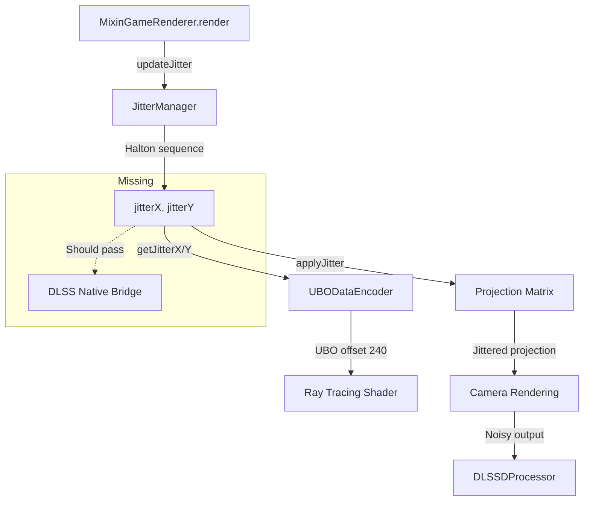
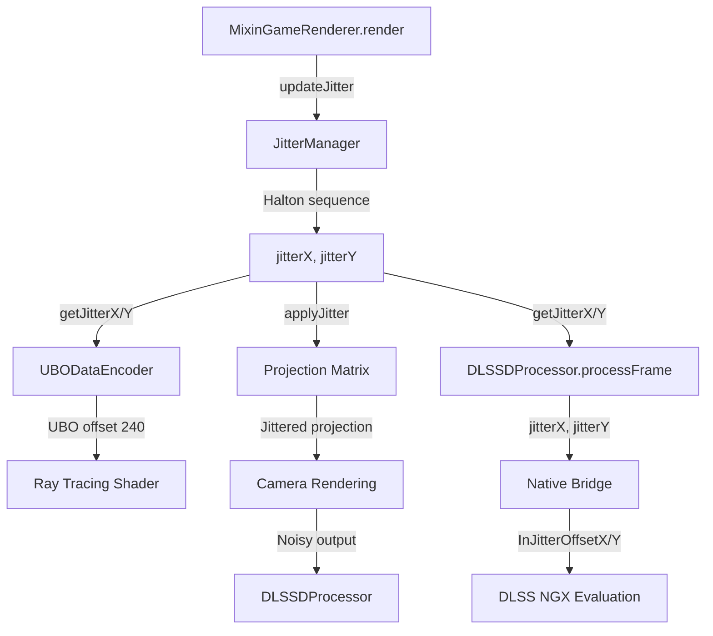

# DLSS Jitter Implementation Plan

## Executive Summary

This document provides a comprehensive analysis and design for the correct implementation of camera jitter for DLSS (Deep Learning Super Sampling) in the Vulkanite RT Minecraft mod. The analysis reveals that the current implementation is **mostly correct** but has some critical issues that need to be addressed for proper DLSS integration.

## 1. Analysis of Current JitterManager Implementation

### 1.1 Current Implementation Overview

The [`JitterManager.java`](src/main/java/me/cortex/vulkanite/client/rendering/JitterManager.java) class provides centralized jitter management with the following key features:

```java
// Lines 40-58: Core state variables
private static int frameIndex = 0;
private static int frameCounter = 0;
private static float jitterX = 0;  // Pixel space jitter X
private static float jitterY = 0;  // Pixel space jitter Y
private static int phaseCount = 8; // Halton sequence length
private static boolean isEnabled = true;
private static boolean dlssActive = false;
private static boolean firstFrameAfterActivation = true;
private static float prevJitterX = 0;  // For motion vector calculation
private static float prevJitterY = 0;
```

### 1.2 Strengths of Current Implementation

1. **Correct Jitter Range**: Jitter values are properly generated in pixel space [-0.5, 0.5] range (lines 106-107)
2. **Halton Sequence**: Uses low-discrepancy Halton sequence for temporal sampling (lines 145-155)
3. **Previous Jitter Tracking**: Properly tracks previous frame jitter for motion vector calculation
4. **Resolution Awareness**: Integrates with [`ResolutionScaleManager`](src/main/java/me/cortex/vulkanite/client/rendering/ResolutionScaleManager.java) for scaled rendering
5. **Reset Handling**: Provides reset functionality for temporal history invalidation

### 1.3 Identified Issues

#### Issue 1: Inconsistent NDC Conversion Resolution

**Location**: [`JitterManager.java:129-143`](src/main/java/me/cortex/vulkanite/client/rendering/JitterManager.java:129)

```java
public static void applyJitter(Matrix4f projectionMatrix) {
    // ...
    // Use OUTPUT resolution for NDC conversion (DLSSD expects this)
    ResolutionScaleManager scaleManager = ResolutionScaleManager.getInstance();
    int outputWidth = scaleManager.getOutputWidth();
    int outputHeight = scaleManager.getOutputHeight();
    float ndcJitterX = (jitterX * 2.0f) / outputWidth;
    float ndcJitterY = (jitterY * 2.0f) / outputHeight;
    // ...
}
```

**Problem**: The comment states "DLSSD expects this" but this is inconsistent with NVIDIA DLSS requirements. The jitter should be applied based on **render resolution**, not output resolution, because:
- The projection matrix is used for rendering at render resolution
- DLSS expects jitter offsets in render resolution pixel space
- Using output resolution causes incorrect jitter scaling when upscaling

#### Issue 2: Missing Jitter Offset Communication to DLSS

**Location**: The jitter values are stored but not explicitly passed to the DLSS native bridge.

The current flow shows:
1. [`JitterManager.updateJitter()`](src/main/java/me/cortex/vulkanite/client/rendering/JitterManager.java:68) generates jitter
2. [`JitterManager.applyJitter()`](src/main/java/me/cortex/vulkanite/client/rendering/JitterManager.java:129) applies to projection matrix
3. [`UBODataEncoder.encode()`](src/main/java/me/cortex/vulkanite/client/rendering/UBODataEncoder.java:62) stores jitter in UBO

**Missing**: Explicit passing of jitter offsets to DLSS via `NVSDK_NGX_Parameter_JitterOffset` in the native bridge.

#### Issue 3: Phase Count Too Low

**Location**: [`JitterManager.java:45`](src/main/java/me/cortex/vulkanite/client/rendering/JitterManager.java:45)

```java
private static int phaseCount = 8; // Reduced from 16 for faster convergence
```

**Problem**: A phase count of 8 may not provide enough temporal samples for optimal DLSS quality. NVIDIA recommends 16 or higher for best results.

## 2. NVIDIA DLSS Jitter Requirements

### 2.1 Official Requirements

Per NVIDIA DLSS SDK documentation:

1. **Jitter Offset Format**: Must be in pixel units, range [-0.5, 0.5]
2. **Jitter Pattern**: Should use Halton sequence or similar low-discrepancy sequence
3. **Resolution Basis**: Jitter must be calculated based on **render resolution** (not output)
4. **Communication**: Must be passed to DLSS via `NVSDK_NGX_Parameter_JitterOffsetX/Y`
5. **Reset Handling**: Jitter sequence must reset on resolution changes or camera cuts

### 2.2 NGX Parameter Definitions

From [`nvsdk_ngx_params.h`](dlss_bridge/Include/nvsdk_ngx_params.h):

```cpp
// Jitter is passed via NVSDK_NGX_Parameter_SetF()
// Parameter names: "JitterOffsetX", "JitterOffsetY"
// Values should be in pixel space relative to render resolution
```

### 2.3 Native Bridge Implementation

From [`dlss_wrapper.cpp:570-583`](dlss_bridge/dlss_wrapper.cpp:570):

```cpp
// === JITTER PARAMETERS ===
// Pass jitter offsets to DLSS for internal compensation
// DLSS uses these to properly align temporal samples
evalParams.InJitterOffsetX = jitterX;
evalParams.InJitterOffsetY = jitterY;

// === MOTION VECTOR SCALE ===
// MVs are in pixel space, so scale must be 1.0
evalParams.InMVScaleX = 1.0f;
evalParams.InMVScaleY = 1.0f;
```

**Note**: The native bridge correctly expects jitter in pixel space and applies it to DLSS evaluation.

## 3. Data Flow Analysis

### 3.1 Current Jitter Data Flow



### 3.2 Required Jitter Data Flow



## 4. Problems Identified vs. DLSS Requirements

| Requirement | Current Implementation | Status | Issue |
|-------------|----------------------|--------|-------|
| Jitter in pixel space [-0.5, 0.5] | ✅ Correct | OK | None |
| Halton sequence pattern | ✅ Correct | OK | None |
| Based on render resolution | ❌ Uses output resolution | ISSUE | Incorrect scaling |
| Passed to DLSS via NGX | ⚠️ Implicit via UBO | PARTIAL | Needs explicit passing |
| Reset on resolution change | ✅ Handled | OK | None |
| Phase count >= 16 | ❌ Uses 8 | ISSUE | Suboptimal quality |

## 5. Proposed Solution Design

### 5.1 Fix Jitter NDC Conversion Resolution

**File**: [`JitterManager.java`](src/main/java/me/cortex/vulkanite/client/rendering/JitterManager.java)

**Change**: Use render resolution for NDC conversion in `applyJitter()`:

```java
public static void applyJitter(Matrix4f projectionMatrix) {
    if (!isEnabled || !dlssActive || (jitterX == 0 && jitterY == 0))
        return;
    
    // FIX: Use RENDER resolution for NDC conversion
    // The projection matrix operates at render resolution during ray tracing
    int renderWidth = currentRenderWidth;
    int renderHeight = currentRenderHeight;
    
    float ndcJitterX = (jitterX * 2.0f) / renderWidth;
    float ndcJitterY = (jitterY * 2.0f) / renderHeight;
    
    projectionMatrix.m20(projectionMatrix.m20() + ndcJitterX);
    projectionMatrix.m21(projectionMatrix.m21() + ndcJitterY);
}
```

### 5.2 Increase Phase Count

**File**: [`JitterManager.java`](src/main/java/me/cortex/vulkanite/client/rendering/JitterManager.java)

**Change**: Increase phase count from 8 to 16:

```java
private static int phaseCount = 16; // NVIDIA recommended value
```

### 5.3 Ensure Jitter is Passed to DLSS

**Current State**: The jitter is passed to the native bridge through the DLSSDProcessor. Need to verify the complete chain.

**Verification Required**: Check if [`DLSSDProcessor.processFrame()`](src/main/java/me/cortex/vulkanite/client/rendering/VulkanPipeline.java:948) passes jitter to the native bridge.

**If Missing**: Add jitter parameters to the processFrame call chain:

```java
// In DLSSDProcessor.processFrame():
float jitterX = JitterManager.getJitterX();
float jitterY = JitterManager.getJitterY();
// Pass to native bridge evaluation
```

### 5.4 Add Jitter Validation

**File**: [`JitterManager.java`](src/main/java/me/cortex/vulkanite/client/rendering/JitterManager.java)

**Add**: Validation method for jitter values:

```java
/**
 * Validates that jitter values are within the expected DLSS range.
 * @return true if jitter is valid
 */
public static boolean validateJitter() {
    return Math.abs(jitterX) <= 0.5f && Math.abs(jitterY) <= 0.5f;
}

/**
 * Gets jitter diagnostics string for logging.
 */
public static String getJitterDiagnostics() {
    return String.format(
        "Jitter: (%.4f, %.4f) pixels, Render: %dx%d, Output: %dx%d, Active: %b",
        jitterX, jitterY,
        currentRenderWidth, currentRenderHeight,
        ResolutionScaleManager.getInstance().getOutputWidth(),
        ResolutionScaleManager.getInstance().getOutputHeight(),
        dlssActive
    );
}
```

## 6. Integration Code

### 6.1 Updated JitterManager.applyJitter()

```java
/**
 * Apply jitter to the projection matrix.
 * 
 * This converts pixel-space jitter to NDC space and applies it to the
 * projection matrix. DLSS requires the camera to be jittered each frame
 * to capture different sub-pixel samples.
 * 
 * IMPORTANT: The NDC conversion uses RENDER resolution, not output resolution.
 * This is because the projection matrix operates during rendering at the
 * scaled render resolution when DLSS upscaling is active.
 * 
 * @param projectionMatrix The projection matrix to modify
 */
public static void applyJitter(Matrix4f projectionMatrix) {
    if (!isEnabled || !dlssActive || (jitterX == 0 && jitterY == 0))
        return;
    
    // Use RENDER resolution for NDC conversion
    // The projection matrix is used for rendering at render resolution
    if (currentRenderWidth <= 0 || currentRenderHeight <= 0) {
        System.err.println("[JitterManager] Warning: Invalid render dimensions for jitter");
        return;
    }
    
    float ndcJitterX = (jitterX * 2.0f) / currentRenderWidth;
    float ndcJitterY = (jitterY * 2.0f) / currentRenderHeight;
    
    projectionMatrix.m20(projectionMatrix.m20() + ndcJitterX);
    projectionMatrix.m21(projectionMatrix.m21() + ndcJitterY);
}
```

### 6.2 Updated UBODataEncoder Jitter Handling

The [`UBODataEncoder.java`](src/main/java/me/cortex/vulkanite/client/rendering/UBODataEncoder.java) already correctly handles jitter. Key points:

1. **Lines 77-81**: Gets jitter values and render dimensions
2. **Lines 117-122**: Creates unjittered projection for motion vectors
3. **Lines 201-204**: Encodes jitter data to UBO

**No changes needed** - the UBO encoding is correct.

### 6.3 Native Bridge Jitter Handling

The [`dlss_wrapper.cpp`](dlss_bridge/dlss_wrapper.cpp) already correctly handles jitter:

1. **Lines 64-67**: Defines valid jitter range constants
2. **Lines 190-200**: `ValidateAndClampJitterRange()` function
3. **Lines 549-552**: Validates jitter before DLSS evaluation
4. **Lines 570-574**: Passes jitter to DLSS evaluation parameters

**No changes needed** - the native bridge is correct.

## 7. Required Changes Summary

### 7.1 High Priority

| File | Change | Impact |
|------|--------|--------|
| [`JitterManager.java:129-143`](src/main/java/me/cortex/vulkanite/client/rendering/JitterManager.java:129) | Use render resolution for NDC conversion | Fixes jitter scaling |
| [`JitterManager.java:45`](src/main/java/me/cortex/vulkanite/client/rendering/JitterManager.java:45) | Increase phaseCount to 16 | Improves temporal quality |

### 7.2 Medium Priority

| File | Change | Impact |
|------|--------|--------|
| [`JitterManager.java`](src/main/java/me/cortex/vulkanite/client/rendering/JitterManager.java) | Add validation methods | Better diagnostics |
| [`VulkanPipeline.java`](src/main/java/me/cortex/vulkanite/client/rendering/VulkanPipeline.java) | Verify jitter passed to DLSSDProcessor | Ensure complete data flow |

### 7.3 Low Priority

| File | Change | Impact |
|------|--------|--------|
| Documentation | Add jitter flow diagrams | Better maintainability |
| Tests | Add unit tests for JitterManager | Regression prevention |

## 8. Testing Recommendations

### 8.1 Visual Validation

1. **Static Camera Test**: Verify no texture smearing with stationary camera
2. **Motion Test**: Check for proper temporal stability during camera movement
3. **Resolution Change Test**: Verify no artifacts when changing DLSS quality mode
4. **Teleport Test**: Verify reset handling on camera jumps

### 8.2 Technical Validation

1. **Jitter Range**: Verify values stay in [-0.5, 0.5] range
2. **NDC Conversion**: Verify correct scaling based on render resolution
3. **Native Bridge**: Verify jitter reaches DLSS evaluation
4. **Reset Handling**: Verify temporal history clears on reset

### 8.3 Diagnostic Logging

Add periodic logging to verify jitter operation:

```java
// In JitterManager.updateJitter()
if (frameCounter % 300 == 0) {
    System.out.println("[JitterManager] " + getJitterDiagnostics());
}
```

## 9. References

- NVIDIA DLSS 3.5 SDK Documentation
- NVIDIA DLSS Integration Guide
- [`plans/DLSS_JITTER_MOTION_FIX.md`](plans/DLSS_JITTER_MOTION_FIX.md) - Previous analysis
- [`plans/DLSS_DATA_FLOW_ANALYSIS.md`](plans/DLSS_DATA_FLOW_ANALYSIS.md) - Data flow documentation

## 10. Conclusion

The current jitter implementation is fundamentally sound but has two critical issues:

1. **Incorrect NDC conversion resolution** - Using output resolution instead of render resolution
2. **Suboptimal phase count** - Using 8 instead of recommended 16

These issues can cause:
- Incorrect jitter scaling when DLSS upscaling is active
- Suboptimal temporal quality due to insufficient sample variation

The proposed fixes are minimal and targeted, requiring only small changes to [`JitterManager.java`](src/main/java/me/cortex/vulkanite/client/rendering/JitterManager.java). The native bridge and UBO encoding are already correct and require no changes.
