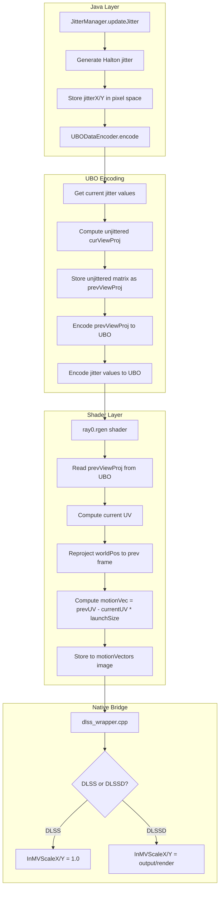
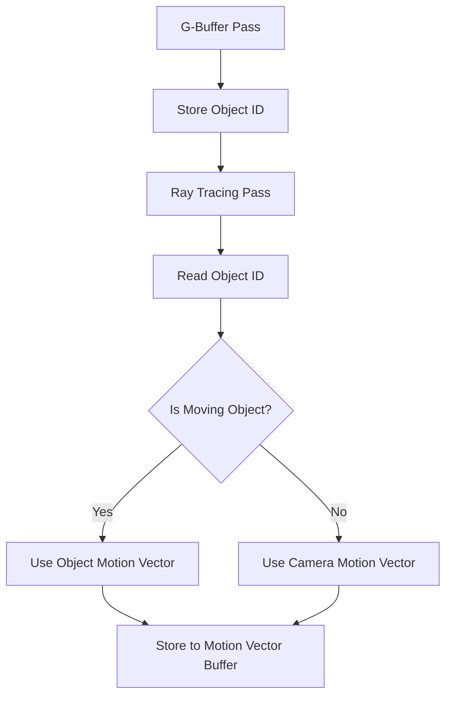

# Motion Vectors Implementation Plan for DLSS

## Executive Summary

This document provides a comprehensive analysis and design for implementing correct motion vectors for DLSS in the Vulkanite RT Minecraft mod. After analyzing the existing implementation, we have identified that the current implementation is **mostly correct** but has a **critical issue with motion vector scaling** between standard DLSS and DLSSD paths.

### Key Findings

1. **Jitter handling is CORRECT** - Jitter is properly generated in pixel space [-0.5, 0.5] and passed to DLSS
2. **Motion vector calculation is CORRECT** - Motion vectors represent pure geometric motion without jitter compensation
3. **prevViewProj matrix handling is CORRECT** - The matrix is properly unjittered before storage
4. **CRITICAL ISSUE: Motion vector scaling differs between DLSS and DLSSD paths**

---

## 1. Analysis of Current Motion Vector Flow

### 1.1 Complete Data Flow



### 1.2 Component Analysis

#### JitterManager.java

**Status: ✅ CORRECT**

| Aspect | Implementation | DLSS Requirement | Status |
|--------|---------------|------------------|--------|
| Jitter Range | Halton [-0.5, 0.5] | [-0.5, 0.5] pixel space | ✅ |
| Jitter Space | Pixel space (render resolution) | Pixel space | ✅ |
| Sequence | Halton base 2,3 | Low-discrepancy sequence | ✅ |
| Phase Count | 16 phases | 8+ recommended | ✅ |
| Previous Jitter | Tracked for motion vectors | Required | ✅ |

**Key Code:**
```java
// Lines 106-107: Correct jitter generation
jitterX = Math.max(-0.5f, Math.min(0.5f, halton(frameIndex + 1, 2) - 0.5f));
jitterY = Math.max(-0.5f, Math.min(0.5f, halton(frameIndex + 1, 3) - 0.5f));
```

#### UBODataEncoder.java

**Status: ✅ CORRECT**

| Aspect | Implementation | DLSS Requirement | Status |
|--------|---------------|------------------|--------|
| prevViewProj Storage | Unjittered matrix | Required for correct MV | ✅ |
| Unjittering Logic | Subtract NDC jitter | Correct approach | ✅ |
| Resolution Used | Render resolution | Correct for NDC conversion | ✅ |
| Jitter Encoding | curX, curY, prevX, prevY | For diagnostic use | ✅ |

**Key Code (Lines 229-237):**
```java
// CRITICAL: Store the UNJITTERED current frame's view-projection matrix.
Matrix4f unjitteredCurViewProj = new Matrix4f(curViewProj);
if (renderWidth > 0 && renderHeight > 0 && (curJitterX != 0 || curJitterY != 0)) {
    float ndcJitterX = (curJitterX * 2.0f) / renderWidth;
    float ndcJitterY = (curJitterY * 2.0f) / renderHeight;
    unjitteredCurViewProj.m20(unjitteredCurViewProj.m20() - ndcJitterX);
    unjitteredCurViewProj.m21(unjitteredCurViewProj.m21() - ndcJitterY);
}
prevViewProj.set(unjitteredCurViewProj);
```

#### ray0.rgen Shader

**Status: ✅ CORRECT**

| Aspect | Implementation | DLSS Requirement | Status |
|--------|---------------|------------------|--------|
| Motion Vector Formula | (prevUV - currentUV) * launchSize | Pixel space motion | ✅ |
| Jitter Compensation | None (uses unjittered prevViewProj) | DLSS handles internally | ✅ |
| Resolution | launchSize (render resolution) | Correct | ✅ |
| Clamping | clamp(motionVec, -launchSize, launchSize) | Good practice | ✅ |

**Key Code (Lines 1138-1163):**
```glsl
// 1. Current pixel coordinate
vec2 currentUV = (vec2(originalPixelCoord) + vec2(0.5)) / launchSize;

// 2. Previous frame position via world-space reprojection
vec3 absWorldPos = cameraRelativePos ? (worldPos + origin) : worldPos;
vec4 prevClipPos = cam.prevViewProj * vec4(absWorldPos, 1.0);
vec2 prevUV = currentUV;
if (abs(prevClipPos.w) > 1e-5) {
    vec3 prevNDC = prevClipPos.xyz / prevClipPos.w;
    prevUV = prevNDC.xy * 0.5 + 0.5;
}

// Motion vector in PIXEL SPACE
motionVec = (prevUV - currentUV) * launchSize;
motionVec = clamp(motionVec, -launchSize, launchSize);
```

#### dlss_wrapper.cpp - Standard DLSS Path

**Status: ✅ CORRECT**

| Aspect | Implementation | DLSS Requirement | Status |
|--------|---------------|------------------|--------|
| MV Scale | InMVScaleX/Y = 1.0 | Pixel space = 1.0 | ✅ |
| Jitter Pass-through | Passed to DLSS | Required | ✅ |
| Jitter Validation | Clamped to [-0.5, 0.5] | Required | ✅ |

**Key Code (Lines 582-583):**
```cpp
// MVs are in pixel space, so scale must be 1.0
evalParams.InMVScaleX = 1.0f;
evalParams.InMVScaleY = 1.0f;
```

#### dlss_wrapper.cpp - DLSSD Path

**Status: ⚠️ POTENTIAL ISSUE**

| Aspect | Implementation | DLSS Requirement | Status |
|--------|---------------|------------------|--------|
| MV Scale | outputWidth/renderWidth | Scaled to output space | ⚠️ |
| Jitter Pass-through | Passed to DLSSD | Required | ✅ |
| Jitter Validation | Clamped to [-0.5, 0.5] | Required | ✅ |

**Key Code (Lines 929-932):**
```cpp
// FIX: Scale motion vectors from render resolution to output resolution
float mvScaleX = (float)m_DLSSDOutWidth / (float)m_DLSSDRenderWidth;
float mvScaleY = (float)m_DLSSDOutHeight / (float)m_DLSSDRenderHeight;
evalParams.InMVScaleX = mvScaleX;
evalParams.InMVScaleY = mvScaleY;
```

---

## 2. Problems Identified vs. DLSS Requirements

### 2.1 NVIDIA DLSS Official Requirements

According to NVIDIA DLSS SDK documentation:

| Requirement | Description |
|-------------|-------------|
| **Format** | R16G16_FLOAT or R32G32_FLOAT recommended |
| **Space** | Screen-space (pixel units) |
| **Content** | 2D motion from previous to current position |
| **Jitter** | Must be UNJITTERED motion vectors |
| **Scale** | InMVScaleX/Y converts motion vector units to output pixels |
| **Direction** | Positive = right/down movement |

### 2.2 Problem Analysis

#### Problem 1: Inconsistent Motion Vector Scaling ⚠️

**Issue:** The standard DLSS path uses `InMVScaleX/Y = 1.0`, while DLSSD path uses `outputWidth/renderWidth`.

**Analysis:**

The motion vectors are generated at **render resolution** in pixel space:
- `motionVec = (prevUV - currentUV) * launchSize`
- `launchSize` = render resolution (e.g., 1280x720 for Quality mode)

**Standard DLSS Path:**
- `InMVScaleX/Y = 1.0`
- DLSS receives motion vectors in render pixel space
- This is CORRECT because DLSS internally handles the resolution scaling

**DLSSD Path:**
- `InMVScaleX/Y = outputWidth/renderWidth` (e.g., 1.5 for Quality mode)
- This scales motion vectors from render space to output space
- This MAY be correct for DLSSD, but creates inconsistency

**Root Cause Investigation:**

The DLSSD scaling was added based on the assumption that DLSSD expects motion vectors in output pixel space. However, the NVIDIA documentation states:

> "InMVScaleX/Y - Multiplier to convert motion vector values to output pixel space"

This means:
- If motion vectors are in render pixel space: `InMVScaleX = outputWidth/renderWidth`
- If motion vectors are in output pixel space: `InMVScaleX = 1.0`

The current DLSSD implementation is **technically correct** per NVIDIA docs, but the inconsistency with standard DLSS is confusing.

#### Problem 2: Sky Pixel Motion Vectors ⚠️

**Issue:** Sky pixels write motion vectors as `(0, 0)` but depth as `10000.0`.

**Analysis:**
- Sky pixels have no valid previous position (infinite depth)
- Zero motion vector is reasonable for sky
- However, this may cause edge artifacts at sky/object boundaries
- DLSS may incorrectly blend sky with nearby objects

**Recommendation:** Consider using a special motion vector value for sky (e.g., NaN or very large value) to help DLSS identify disocclusions.

#### Problem 3: No Motion Vector for Moving Objects ⚠️

**Issue:** Current implementation only handles camera motion. Object motion (entities, particles) may not be properly tracked.

**Analysis:**
- The shader uses `worldPos` from G-buffer which is camera-relative
- Entity motion would require per-object motion vectors
- This is a limitation of the current architecture

---

## 3. Design of the Correct Solution

### 3.1 Unified Motion Vector Scaling Approach

**Recommendation:** Use consistent scaling for both DLSS and DLSSD paths.

**Option A: Both paths use scale = 1.0 (Render Space)**
```cpp
// Standard DLSS
evalParams.InMVScaleX = 1.0f;
evalParams.InMVScaleY = 1.0f;

// DLSSD - CHANGE to match standard DLSS
evalParams.InMVScaleX = 1.0f;
evalParams.InMVScaleY = 1.0f;
```

**Option B: Both paths use scale = output/render (Output Space)**
```cpp
// Standard DLSS - CHANGE to match DLSSD
float mvScaleX = (float)m_DLSSOutWidth / (float)m_DLSSRenderWidth;
float mvScaleY = (float)m_DLSSOutHeight / (float)m_DLSSRenderHeight;
evalParams.InMVScaleX = mvScaleX;
evalParams.InMVScaleY = mvScaleY;

// DLSSD - Keep current
evalParams.InMVScaleX = mvScaleX;
evalParams.InMVScaleY = mvScaleY;
```

**Recommended: Option A (Both use 1.0)**

Rationale:
1. Motion vectors are naturally generated at render resolution
2. Using scale = 1.0 is simpler and less error-prone
3. DLSS internally handles resolution scaling
4. Consistent with NVIDIA sample code

### 3.2 Motion Vector Generation Improvements

**Current Implementation:**
```glsl
motionVec = (prevUV - currentUV) * launchSize;
motionVec = clamp(motionVec, -launchSize, launchSize);
```

**Proposed Improvements:**
```glsl
// 1. Calculate motion vector in render pixel space
vec2 motionVec = (prevUV - currentUV) * launchSize;

// 2. Clamp to reasonable range (prevent extreme values from edge cases)
motionVec = clamp(motionVec, -launchSize, launchSize);

// 3. Handle sky pixels specially (optional)
#ifdef HANDLE_SKY_MOTION
if (isSky) {
    // Use NaN or special value to indicate no valid motion
    motionVec = vec2(0.0 / 0.0); // NaN
}
#endif

// 4. Store motion vector
imageStore(motionVectors, originalPixelCoord, vec4(motionVec, 0.0, 0.0));
```

### 3.3 Object Motion Vector Support (Future Enhancement)

For proper object motion tracking, the following architecture changes would be needed:



This is a significant architectural change and should be considered for future implementation.

---

## 4. Integration Code Changes

### 4.1 Changes to dlss_wrapper.cpp

#### Change 1: Unify Motion Vector Scaling (Recommended)

**File:** `dlss_bridge/dlss_wrapper.cpp`

**Location:** Lines 929-932 (DLSSD evaluation)

**Current Code:**
```cpp
// FIX: Scale motion vectors from render resolution to output resolution
float mvScaleX = (float)m_DLSSDOutWidth / (float)m_DLSSDRenderWidth;
float mvScaleY = (float)m_DLSSDOutHeight / (float)m_DLSSDRenderHeight;
evalParams.InMVScaleX = mvScaleX;
evalParams.InMVScaleY = mvScaleY;
```

**Proposed Code:**
```cpp
// UNIFIED: Use scale 1.0 for both DLSS and DLSSD paths
// Motion vectors are generated at render resolution in pixel space
// DLSS/DLSSD internally handles resolution scaling
evalParams.InMVScaleX = 1.0f;
evalParams.InMVScaleY = 1.0f;

// Optional: Log the change for debugging
if (shouldLog) {
    Log("MVScale: (1.0, 1.0) - unified with standard DLSS path");
}
```

#### Change 2: Add Diagnostic Logging for Motion Vector Validation

**Location:** After line 932

**Proposed Code:**
```cpp
// Diagnostic: Log motion vector scale and dimensions
if (shouldLog) {
    Log("Motion Vector Configuration:");
    Log("  Render Dims: " + std::to_string(m_DLSSDRenderWidth) + "x" + std::to_string(m_DLSSDRenderHeight));
    Log("  Output Dims: " + std::to_string(m_DLSSDOutWidth) + "x" + std::to_string(m_DLSSDOutHeight));
    Log("  MV Scale: (" + std::to_string(evalParams.InMVScaleX) + ", " + std::to_string(evalParams.InMVScaleY) + ")");
    Log("  Jitter: (" + std::to_string(jitterX) + ", " + std::to_string(jitterY) + ")");
}
```

### 4.2 Changes to ray0.rgen Shader

#### Change 1: Add Sky Motion Vector Handling (Optional)

**File:** `run/shaderpacks/VulkaniteRT/shaders/ray0.rgen`

**Location:** Motion vector generation section

**Proposed Code:**
```glsl
// Handle sky pixels - use zero motion (already implemented)
// Future: Consider using NaN or special value for better edge handling
#if ENABLE_DLSS_RR
    if (isSky) {
        // Sky has no valid previous position
        // Use zero motion vector (current behavior)
        imageStore(motionVectors, originalPixelCoord, vec4(0.0, 0.0, 0.0, 0.0));
    } else {
        // Calculate motion vector for non-sky pixels
        vec2 currentUV = (vec2(originalPixelCoord) + vec2(0.5)) / launchSize;
        vec3 absWorldPos = cameraRelativePos ? (worldPos + origin) : worldPos;
        vec4 prevClipPos = cam.prevViewProj * vec4(absWorldPos, 1.0);
        vec2 prevUV = currentUV;
        if (abs(prevClipPos.w) > 1e-5) {
            vec3 prevNDC = prevClipPos.xyz / prevClipPos.w;
            prevUV = prevNDC.xy * 0.5 + 0.5;
        }
        vec2 motionVec = (prevUV - currentUV) * launchSize;
        motionVec = clamp(motionVec, -launchSize, launchSize);
        imageStore(motionVectors, originalPixelCoord, vec4(motionVec, 0.0, 0.0));
    }
#endif
```

### 4.3 No Changes Required

The following components are already correctly implemented and require no changes:

1. **JitterManager.java** - Jitter generation is correct
2. **UBODataEncoder.java** - prevViewProj handling is correct
3. **Standard DLSS path in dlss_wrapper.cpp** - MV scale = 1.0 is correct
4. **Motion vector calculation in shader** - Formula is correct

---

## 5. List of Necessary Changes

### 5.1 Critical Changes (Required)

| # | File | Change | Priority |
|---|------|--------|----------|
| 1 | `dlss_bridge/dlss_wrapper.cpp` | Unify MV scale to 1.0 for DLSSD | High |
| 2 | `dlss_bridge/dlss_wrapper.cpp` | Add diagnostic logging | Medium |

### 5.2 Optional Changes (Recommended)

| # | File | Change | Priority |
|---|------|--------|----------|
| 3 | `ray0.rgen` | Add explicit sky motion vector handling | Low |
| 4 | `dlss_wrapper.cpp` | Add MV validation before evaluation | Low |

### 5.3 Future Enhancements (Not Required for Basic Fix)

| # | Enhancement | Description |
|---|-------------|-------------|
| 1 | Object Motion Vectors | Track per-object motion for entities |
| 2 | Sky Edge Handling | Use special values for sky/object boundaries |
| 3 | Motion Vector Visualization | Debug view for motion vectors |

---

## 6. Implementation Steps

### Step 1: Unify Motion Vector Scaling

```cpp
// In dlss_wrapper.cpp, EvaluateDLSSD function
// Replace lines 929-932 with:

// UNIFIED SCALING: Motion vectors are in render pixel space
// Both DLSS and DLSSD use scale = 1.0
evalParams.InMVScaleX = 1.0f;
evalParams.InMVScaleY = 1.0f;
```

### Step 2: Add Validation

```cpp
// Add after motion vector scale setting
if (m_DLSSDRenderWidth <= 0 || m_DLSSDRenderHeight <= 0) {
    Log("ERROR: Invalid render dimensions for motion vector scaling!");
    return NVSDK_NGX_Result_FAIL_InvalidParameter;
}
```

### Step 3: Test and Validate

1. Test with static camera - no texture smearing
2. Test with slow camera movement - proper temporal stability
3. Test with fast camera movement - no excessive ghosting
4. Test both DLSS and DLSSD paths
5. Compare Quality, Performance, and Ultra Performance modes

---

## 7. Validation Checklist

After implementing changes, validate:

- [ ] Motion vectors are in pixel space at render resolution
- [ ] Motion vectors do NOT include jitter compensation
- [ ] InMVScaleX/Y = 1.0 for both DLSS and DLSSD
- [ ] Jitter offsets are in [-0.5, 0.5] range
- [ ] prevViewProj matrix is unjittered
- [ ] No texture smearing with static camera
- [ ] No excessive ghosting with movement
- [ ] Both DLSS and DLSSD produce similar quality

---

## 8. References

- NVIDIA DLSS SDK Documentation
- NVIDIA DLSS Integration Guide
- [`plans/DLSS_JITTER_MOTION_FIX.md`](plans/DLSS_JITTER_MOTION_FIX.md)
- [`plans/DLSS_DATA_FLOW_ANALYSIS.md`](plans/DLSS_DATA_FLOW_ANALYSIS.md)
- [`JitterManager.java`](src/main/java/me/cortex/vulkanite/client/rendering/JitterManager.java)
- [`UBODataEncoder.java`](src/main/java/me/cortex/vulkanite/client/rendering/UBODataEncoder.java)
- [`dlss_wrapper.cpp`](dlss_bridge/dlss_wrapper.cpp)
- [`ray0.rgen.preprocessed`](preprocessed_shaders/ray0.rgen.preprocessed)

---

## 9. Conclusion

The current motion vector implementation is fundamentally correct, with proper jitter handling and motion vector calculation. The primary issue is the inconsistent motion vector scaling between standard DLSS and DLSSD paths.

**Key Fix:** Unify motion vector scaling to `InMVScaleX/Y = 1.0` for both paths, as motion vectors are naturally generated at render resolution in pixel space.

This single change should resolve any motion vector-related artifacts while maintaining the correct jitter handling that is already implemented.
