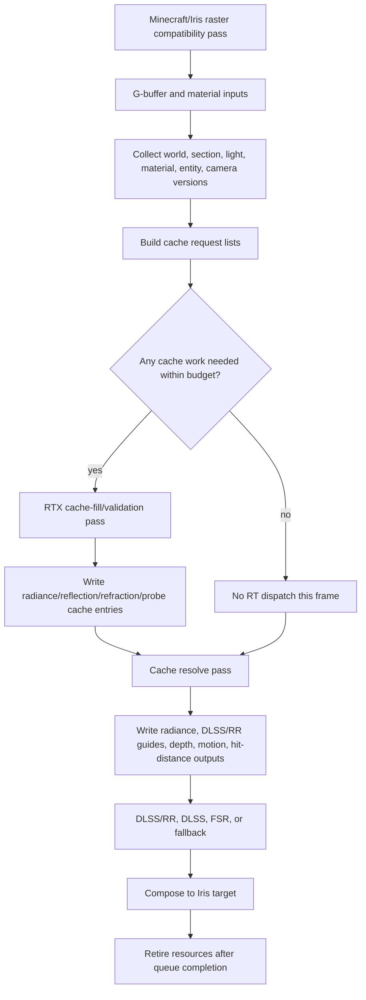

# Vulkanite Cache-First Optimization Plan

This is the shared source of truth for making Vulkanite lighting light. The goal is
not to make the current full-frame RT shader a little faster. The goal is to stop
using full-frame RT as steady-state lighting.

User clarification on 2026-06-20: RT/RTX is for validation and cache fill. RTX
runs when radiance, reflection, or refraction data is missing, stale, or needs
validation, writes or validates the cache, then turns off once cached data is
usable.

## Objective

Make steady-state frames cheap by replacing per-frame full-resolution RT with:

1. A bounded RTX cache-fill path for missing or stale lighting data.
2. A non-RT cache resolve path that runs every eligible frame.
3. Explicit cache validity and invalidation rules for world, geometry, lighting,
   material, camera, shaderpack, resolution, and temporal state changes.

Success means steady-state cache-hit frames avoid unnecessary `traceRays` work
without using stale radiance, reflection, refraction, probe, or guide data.

## Working Mode

Manual review remains active until the user explicitly changes it.

- Do not create new benchmark worlds, scripted scenes, automated capture
  harnesses, or reference-image suites.
- Do not run benchmark captures or automated A/B tests unless the user asks.
- Inspect source flow, diffs, logs, and configuration manually.
- Treat visual quality and "better or worse" as user-owned observations.
- Mark checklist items complete only with source inspection, commands, diffs, or
  user-provided observations.
- Label findings as `code-verified`, `inferred`, `target`, `measured`, or
  `user-observed`.

## Research Anchors

Use these as design direction, not as proof that Vulkanite already behaves this
way.

- NVIDIA RTXGI / SHaRC / NRC:
  https://github.com/NVIDIA-RTX/RTXGI
  Key idea: cache outgoing radiance in world space and replace much of path
  tracing with a hit evaluation plus cache lookup.
- RTXGI-DDGI:
  https://github.com/NVIDIAGameWorks/RTXGI-DDGI/blob/main/docs/Algorithms.md
  Key idea: maintain irradiance and distance probe data with fast ray-traced
  updates, then shade from probes.
- Kajiya GI overview:
  https://github.com/EmbarkStudios/kajiya/blob/main/docs/gi-overview.md
  Key idea: use an output-sensitive irradiance cache; queries drive where cache
  entries are allocated and refreshed.
- ReSTIR GI:
  https://research.nvidia.com/publication/2021-06_restir-gi-path-resampling-real-time-path-tracing
  Key idea: reuse paths across pixels and frames when rays still need to be
  traced.
- Real-time Neural Radiance Caching:
  https://research.nvidia.com/publication/2021-06_real-time-neural-radiance-caching-path-tracing
  Key idea: learn a radiance cache while rendering. Treat as future work unless
  the user explicitly wants neural-cache complexity.
- Minecraft PTGI:
  https://github.com/MahoganyTown/Minecraft-PTGI
  Useful comparison for path-traced GI plus SVGF/TAA, but not the main path to
  cache-hit steady state.
- Rethinking Voxels:
  https://github.com/gri573/rethinking-voxels
  Useful Minecraft-specific comparison for voxelization, ray-tested occlusion,
  and cheaper colored block lighting.

## Current Code-Verified Problem

Current default/reference source flow still runs RT every eligible frame. Part 2
adds a temporary `cache_resolve_only` path that skips `traceRays`, but the
default remains `full_rt_reference` until request lists, cache validity, and
quality checkpoints make cache-hit steady state trustworthy.

- [VulkanPipeline.java](C:/Users/PCGAMER/Documents/GitHub/vulkanite-1.20.1/src/main/java/me/cortex/vulkanite/client/rendering/VulkanPipeline.java:454)
  calls `passGraph.execute(...)` inside the per-frame render path.
- [RtxPassGraph.java](C:/Users/PCGAMER/Documents/GitHub/vulkanite-1.20.1/src/main/java/me/cortex/vulkanite/client/rendering/RtxPassGraph.java:34)
  loops every reflected RT pass.
- [RenderPassExecutor.java](C:/Users/PCGAMER/Documents/GitHub/vulkanite-1.20.1/src/main/java/me/cortex/vulkanite/client/rendering/RenderPassExecutor.java:448)
  calls `traceRays(renderWidth, renderHeight, 1)`.
- [ray0.rgen](C:/Users/PCGAMER/Documents/GitHub/vulkanite-1.20.1/shaderpacks/VulkaniteRT/shaders/ray0.rgen:3918)
  still contains per-frame reflection/refraction/indirect/section-light RT work.
- [ray0.rgen](C:/Users/PCGAMER/Documents/GitHub/vulkanite-1.20.1/shaderpacks/VulkaniteRT/shaders/ray0.rgen:1638)
  already has section-light probe RT cache read/write machinery, which should be
  treated as a foothold for the cache-first rewrite.
- [CacheResolvePass.java](C:/Users/PCGAMER/Documents/GitHub/vulkanite-1.20.1/src/main/java/me/cortex/vulkanite/client/rendering/CacheResolvePass.java)
  now provides a non-RT compute resolve/debug path for Part 2, but it is still
  fallback lighting rather than a real cache-hit implementation.

These are source observations, not performance measurements.

## Target Architecture



The important split is:

- `Cache fill`: optional, bounded, RT-capable, driven by dirty/missing cache
  requests.
- `Cache resolve`: mandatory for rendered frames, non-RT if possible, samples
  cache data and produces the same downstream outputs expected today.

## Cache Families

Start with explicit families instead of one vague "RT cache".

| Cache | Purpose | Likely backing | Filled by RT? | Read by steady state? |
|---|---|---|---|---|
| Section blocklight probe cache | Colored local block lighting and visibility | Existing `SectionLightManager` buffers and `ray0.rgen` RT cache cells | Yes, bounded | Yes |
| Diffuse radiance cache | Indirect diffuse tail lighting | World-space grid/hash or section/probe pages | Yes | Yes |
| Reflection cache | Specular/env result for stable surfaces | Screen-space history plus world/material keyed cache | Sometimes | Yes |
| Refraction cache | Water/glass/ice/crystal transmission result | Screen-space history plus material/medium keyed cache | Sometimes | Yes |
| Guide cache | DLSS/RR albedo, normal, roughness, depth, motion, hit distance | `RtxFrameImages` or split compute outputs | No RT unless hit distance requires it | Yes |

Do not add a cache without specifying its key, lifetime, invalidation, fallback,
and debug view.

## Invalidation Rules

Every cached value must be invalidated or revalidated by a clear version source.

| Event | Required action |
|---|---|
| Chunk section geometry changed | Invalidate affected section cache entries and neighbor entries that can see through/around the changed section |
| Section light table changed | Invalidate local light/probe/radiance entries and nearby influence region |
| Material atlas or PBR texture changed | Invalidate material-dependent reflection/refraction/radiance entries |
| Entity BLAS changed | Invalidate only dynamic/entity-dependent cache entries, not the whole world cache |
| Camera teleport/world switch | Reset temporal history and require cache revalidation where screen history is trusted |
| Sun/sky/time/weather changed | Either version sky-dependent entries or use a cheap analytic sky term outside the cache |
| Shaderpack/settings changed | Rebuild pipelines and invalidate cache entries whose layout, format, or meaning changed |
| Resolution/render scale changed | Recreate image-sized outputs and preserve only world-space caches that remain valid |
| DLSS/RR mode changed | Reset guide history and verify cache resolve outputs still match guide contracts |

Stale light is a regression. A lower RT count only counts as an optimization when
the cache validity model still explains why the reused value is correct enough.

## Execution Rules

- Full-screen `traceRays(renderWidth, renderHeight, 1)` is allowed only during
  the transition period or when explicitly selected as a debug/reference mode.
- Default steady state should have a path where no RT dispatch occurs if all
  required cache entries are valid.
- Cache-fill work must be budgeted: max entries, max rays, max pages, or max time
  per frame.
- Missing cache data must degrade predictably: previous valid value, local
  fallback, probe fallback, screen-space fallback, or noisy RT debug path.
- Debug views must show cache hit/miss/stale/in-flight/fallback state.
- DLSS/RR guides must remain valid even when RT is skipped.

## Implementation Parts

### Part 0 - Preserve Manual Scope

Status: **in progress**

- [x] Keep manual-review mode active.
- [x] Record that the user wants RT/RTX as validation/cache fill, then off.
- [x] Record source-verified evidence that RT currently runs every eligible frame.
- [ ] Record user-provided performance and image-quality observations as
  `user-observed`.
- [ ] Do not run automated captures unless the user explicitly asks.

Exit condition: future agents know the target is cache-hit steady state, not
per-frame full-screen RT.

### Part 1 - Map Current Per-Frame RT Cost and Outputs

Status: **complete**

- [x] Enumerate every output currently produced by `ray0.rgen`: radiance,
  reservoirs, albedo/metallic, specular albedo, normal/roughness, motion,
  linear depth, specular hit depth, first-hit depth, blocklight detail, final
  noisy output, and section-light RT cache buffer writes.
- [x] Separate outputs that require RT from outputs that can come from G-buffer,
  compute, history, or cache resolve.
- [x] Identify which outputs DLSS/RR consumes and their required formats/ranges.
- [x] Record shader branches that trace indirect, reflection, refraction,
  section-light sparse validation, and blocklight probe cache fill.
- [x] Do not add optional counters or logs; user did not approve
  instrumentation.

Part 1 output map (`code-verified`):

| Output | Writer and backing | Current range/meaning | RT dependency | DLSS/RR consumer |
|---|---|---|---|---|
| Current reservoir / sun history, binding 6 | Injected `reservoirImage`, `rgba32f`; `RtxFrameImages` allocates `VK_FORMAT_R32G32B32A32_SFLOAT` | ReSTIR packs `w_sum`, `W`, `m`, sun-disk offset; sun-history path stores world position plus packed visibility/history | ReSTIR and sun-history visibility currently depend on `alphaAwareVisibility` ray queries | Not consumed by NGX; used by current/previous-frame ReSTIR and sun-shadow history |
| Final noisy radiance, binding 12 | `outputImage`, `rgba16f`; `RtxFrameImages.radiance` is `VK_FORMAT_R16G16B16A16_SFLOAT` | Linear HDR color after direct, indirect, local, specular/transmission, volumetric, and color-grade/firefly clamp, before tone map/gamma | Current value includes RT branches; target cache resolve must assemble the same contract without RT on cache-hit frames | DLSS/RR `pInColor`; standard DLSS color input; fallback blit source |
| Motion vectors, binding 13 | `motionVectors`, `rg16f`; `VK_FORMAT_R16G16_SFLOAT` | Pixel-space previous-current vector, clamped to launch size; sky writes zero | G-buffer/camera-derived; no RT required if first-hit position is known | DLSS/RR and standard DLSS motion input; native MV scale is 1.0 x/y |
| Linear depth, binding 14 | `linearDepthImage`, `r16f`; `VK_FORMAT_R16_SFLOAT` | Camera-forward linear depth in scene units; sky writes `10000.0` | G-buffer/depth-derived; no RT required if first hit is known | DLSS/RR and standard DLSS depth input, created as linear depth |
| Previous reservoir, binding 15 | Injected `prevReservoirImage`, `rgba32f` | Previous frame ping-pong image for temporal/spatial reuse | Read-only in `ray0.rgen`; must remain coherent when RT is skipped | Not consumed by NGX |
| Diffuse albedo/metallic, binding 16 | `DiffuseAlbedoMetallic`, `rgba8`; `VK_FORMAT_R8G8B8A8_UNORM` | RGB clamped albedo, A metallic; sky writes zero | G-buffer/material-derived; no RT required when first-hit G-buffer is valid | DLSS/RR diffuse albedo guide |
| Specular albedo, binding 17 | `SpecularAlbedo`, `rgba8`; `VK_FORMAT_R8G8B8A8_UNORM` | RGB F0 clamped 0..1, A 1.0; sky writes zero | G-buffer/material-derived | DLSS/RR specular albedo guide |
| Normal/roughness, binding 18 | `NormalRoughness`, `rgba16f`; `VK_FORMAT_R16G16B16A16_SFLOAT` | Current shader writes `normal * 0.5 + 0.5` in RGB and roughness 0.04..1 in A; sky writes up normal and roughness 1 | G-buffer/material-derived | DLSS/RR normals plus packed roughness; Part 2 should verify whether NGX expects encoded or signed normals |
| Specular hit depth, binding 19 | `SpecularHitDepth`, `r16f`; `VK_FORMAT_R16_SFLOAT` | First written as linear depth, then overwritten with `specularHitDistanceGuide`; default view distance, reflection miss `10000.0`, refraction uses min reflection/refraction distance | RT-required today only for reflection/refraction hit distance; can be cache/history/fallback-derived | DLSS/RR `pInSpecularHitDistance` |
| First-hit depth, binding 20 | `FirstHitDepth`, `r16f`; `VK_FORMAT_R16_SFLOAT` | Linear first-hit depth; sky writes `10000.0` | G-buffer/depth-derived; primary RT fallback only when G-buffer is invalid | Allocated and bound, but not passed to current Java/native DLSS/RR evaluation |
| Blocklight detail, binding 21 | `blocklightDetailImage`, `rgba16f`; `VK_FORMAT_R16G16B16A16_SFLOAT` | RGB local/emissive lighting detail, A normalized local-light/detail strength; starts at zero per pixel | Current RGB can include RT blocklight and section-light sparse RT; can become cache/table/debug output | No reader found outside raygen/descriptor binding in current tree |
| Section probe RT cache, binding 24 | `SectionLightProbeRtCacheBuffer`, `std430` coherent buffer; Java name is probe feedback buffer | Six packed RGB9E5 radiance faces plus ready/in-flight state and face mask per probe cell | This is a cache-fill output. Existing read/write helpers are the foothold for Part 5 | Not consumed by NGX |

Part 1 shader branch map (`code-verified`):

- Primary hit fallback: `ray0.rgen` samples hybrid G-buffer first and calls
  `traceRayEXT` only when `validHybridSample(...)` fails.
- Visibility helper: `alphaAwareVisibility(...)` uses `rayQueryEXT`; direct sun,
  ReSTIR final visibility, volumetric shadows, indirect-hit shadow checks,
  reflection-hit shadow checks, and section-light sparse validation route through
  it.
- ReSTIR/sun history: injected `restir.glsl` declares current/previous reservoir
  images and writes either ReSTIR reservoirs or sun-shadow history.
- Indirect diffuse: the bounce loop traces up to `INDIRECT_BOUNCES` clamped to
  three bounces, then may cast a shadow visibility query at the bounce hit.
- Reflection: reflective non-refractive surfaces trace up to
  `METAL_MAX_BOUNCES`, update `specularHitDistanceGuide` on the first bounce, and
  may query sun visibility at reflected hits.
- Refraction/transmission: refractive surfaces call `traceSimpleRadiance(...)`
  for reflected and refracted directions, then write the min distance as the
  specular guide.
- RT blocklight: `sampleBlockLightRT(...)` uses `rayQueryEXT` to find emissive
  block surfaces when `RT_BLOCKLIGHT_PROBES` and `BLOCKLIGHT_SAMPLES` allow it.
- Section-light sparse/probe RT: `sampleSectionLightSparseRt(...)` traces
  candidate light visibility; `sampleSectionLightProbeRtCell(...)` fills probe
  faces; cache read/write helpers manage ready/in-flight state. The current
  surface-cache branch calls sparse RT directly; Part 5 should audit whether the
  unused surface claim/complete helpers should gate repeated work.

Exit condition met: a no-RT cache resolve must still write radiance,
motion vectors, linear depth, diffuse/metallic, specular albedo,
normal/roughness, specular hit distance, first-hit depth, reservoir/history when
the ReSTIR or sun-history path is active, blocklight detail if retained, and
valid section-probe cache state or fallback/debug values.

### Part 2 - Split Full RT Pass From Cache Resolve

Status: **complete**

- [x] Design a `CacheResolve` path that can write the same frame outputs without
  calling `traceRays`.
- [x] Decide whether resolve is compute shader, raster fullscreen pass, or a
  minimal raygen with RT disabled by specialization constant.
- [x] Add a temporary debug switch:
  `full_rt_reference`, `cache_fill`, `cache_resolve_only`.
- [x] Ensure the full RT reference path remains available for visual comparison.
- [x] Preserve descriptor layout compatibility or introduce a versioned layout
  migration.

Part 2 implementation notes (`code-verified`):

- `CacheResolvePass` is a compute pass, not a raygen. It dispatches 8x8 compute
  workgroups and never calls `traceRays`.
- `cache_resolve_only` skips TLAS build/entity capture and writes radiance,
  current reservoir clear, motion vectors, linear depth, diffuse/metallic,
  specular albedo, encoded normal/roughness, specular hit depth, first-hit
  depth, and blocklight detail from the hybrid G-buffer plus fallback lighting.
- `cache_fill` runs the existing full RT pass first, preserving current
  cache-fill side effects such as section-probe RT cache writes, then runs the
  compute resolve pass without clearing full-RT reservoir writes. Until real
  caches exist, this mode intentionally resolves from G-buffer fallback lighting
  rather than full RT radiance.
- `full_rt_reference` is the default and keeps the previous full-screen RT path
  available for visual comparison.
- The full RT descriptor layout is unchanged. The compute resolve owns a
  separate reflected descriptor layout and pipeline.

Exit condition met: `cache_resolve_only` can compose one frame from resolve
outputs without mandatory full-screen RT. Runtime visual quality remains
user-observed/pending because the resolve path is still fallback lighting, not a
real radiance/reflection/refraction cache hit.

### Part 3 - Build Cache Request Lists

Status: **in progress**

- [x] Define request keys for section probe cells, diffuse radiance entries,
  reflection entries, and refraction entries.
- [x] Generate section-probe requests from section dirty queues.
- [ ] Generate visible G-buffer pixel requests.
- [ ] Generate reflection/refraction surface requests.
- [ ] Ingest feedback-buffer requests.
- [x] Deduplicate requests by stable key before dispatch.
- [x] Prioritize visible, high-error, high-luma, and near-camera requests.
- [x] Cap request count per frame and carry backlog across frames.

Part 3 implementation notes (`code-verified`):

- `CacheRequestKey` now defines stable key shapes for section-probe cells,
  diffuse radiance entries, reflection entries, and refraction entries.
- `CacheRequestQueue` deduplicates requests by stable key, merges duplicate
  requests by retaining stronger visibility/error/luma/near-camera priority,
  caps backlog size, and drains sorted batches up to a per-frame budget.
- `SectionLightManager` now tracks dirty section-probe RT request cursors per
  probe page, emits at most the caller's budget of section-probe cell requests
  per frame, and carries un-emitted cells across frames without expanding every
  dirty page into request objects at once.
- `VulkanPipeline` owns the central request queue, collects section-probe
  requests in cache modes, clears pending request state on world changes and
  pipeline destroy, and logs throttled request stats.
- `cache_resolve_only` gathers pending requests but does not drain them as a
  processed batch because no RT-capable fill pass runs in that mode.
- `cache_fill` drains a bounded request batch, but the current shader still uses
  the transitional full-screen RT pass. The drained list is not yet bound to a
  request-driven cache-fill shader.

Exit condition not yet met: request lists exist for section-probe dirty work,
but visible G-buffer, reflection/refraction, and feedback-buffer request sources
are still pending, and RT work is not yet driven by the request list.

### Part 4 - Version and Invalidate Caches

Status: **not started**

- [ ] Add per-section geometry and light versions where they do not already
  exist.
- [ ] Add material/PBR atlas versioning or conservative invalidation.
- [ ] Track world id, dimension id, shaderpack generation, sky/time generation,
  and cache layout generation.
- [ ] Store enough version data with each cache entry to reject stale hits.
- [ ] Audit chunk removal, BLAS stale result rejection, shader reload, world
  switch, resize, and DLSS/RR mode changes.

Exit condition: cache hits can be accepted or rejected by explicit validity data.

### Part 5 - Section Blocklight Probe Cache First

Status: **not started**

- [ ] Use the existing section-light probe RT cache as the first cache-first
  implementation target.
- [ ] Verify ready/in-flight state transitions in `ray0.rgen` and
  `SectionLightManager`.
- [ ] Prevent sparse RT validation from running on already-ready cache cells.
- [ ] Use feedback to request only missing/stale probe faces or surface cells.
- [ ] Add debug views for ready, in-flight, stale, fallback, and validated cells.
- [ ] Manual checkpoint: user checks walls, caves, page boundaries, several
  nearby emitters, fast chunk loading, and darkness after warm-up.

Exit condition: blocklight can reach a cache-hit state where steady frames avoid
repeating the same validation rays.

### Part 6 - Diffuse Radiance Cache

Status: **not started**

- [ ] Choose backing structure: section-local grid, sparse world hash, or probe
  extension. Prefer simple world/section cache before neural approaches.
- [ ] Fill entries from RT requests, not full-screen pixels.
- [ ] Resolve diffuse indirect from cache plus direct/ambient terms.
- [ ] Define fallback for empty entries and progressive warm-up behavior.
- [ ] Avoid light leaks with normal bias, visibility/distance confidence, and
  neighbor invalidation.
- [ ] Manual checkpoint: interiors, thin walls, caves, sun changes, block updates,
  chunk streaming, and camera motion.

Exit condition: diffuse indirect no longer requires full-frame RT after warm-up.

### Part 7 - Reflection and Refraction Cache

Status: **not started**

- [ ] Split surface classification from ray tracing: identify reflective and
  refractive pixels cheaply from G-buffer/material data.
- [ ] Reuse screen-space history where valid before requesting world-space RT.
- [ ] Cache stable material/surface results with roughness, normal, material id,
  medium, and depth/position validity.
- [ ] Trace only misses, disocclusions, invalid entries, or high-error surfaces.
- [ ] Preserve specular hit-distance guide validity for DLSS/RR.
- [ ] Manual checkpoint: water, glass, ice, metals, grazing angles, camera motion,
  and fast lighting changes.

Exit condition: reflection/refraction rays are sparse validation work, not a
per-pixel steady-state loop.

### Part 8 - Frame Orchestration and RT Gating

Status: **not started**

- [ ] Add a frame decision before `passGraph.execute`: `NO_RT`,
  `CACHE_FILL_ONLY`, `FULL_RT_REFERENCE`, or `DISABLED`.
- [ ] Skip `RtxPassGraph.execute` when cache state and debug mode allow `NO_RT`.
- [ ] Ensure resource transitions, semaphores, command buffers, and final
  composition still run correctly when RT is skipped.
- [ ] Keep queue lifetime and retained resource references safe for both RT and
  no-RT frames.
- [ ] Record counters: RT dispatches skipped, cache requests processed, backlog,
  hit rate, stale rejects, fallback pixels.

Exit condition: Vulkanite can present valid frames without tracing rays every
frame.

### Part 9 - Descriptor, Image, and Pipeline Cleanup

Status: **not started**

- [ ] Stop allocating/updating descriptor sets for RT passes on `NO_RT` frames.
- [ ] Avoid recreating image views for stable resources.
- [ ] Keep cache buffers/images resident across frames with explicit retirement.
- [ ] Create separate descriptor layouts for cache fill and cache resolve if that
  reduces per-frame binding churn.
- [ ] Audit barriers between cache-fill writes, resolve reads, DLSS/RR reads, and
  final blit.

Exit condition: CPU encode and descriptor overhead also drops on cache-hit frames.

### Part 10 - Shader Cost After Gating

Status: **not started**

- [ ] Optimize raygen/closest-hit/any-hit only after RT is no longer mandatory
  every frame.
- [ ] Profile or inspect remaining cache-fill rays by category: blocklight,
  diffuse radiance, reflection, refraction, sun visibility, volumetric work.
- [ ] Add early exits for zero contribution before any ray query or grid walk.
- [ ] Remove debug-only and disabled work from release permutations while keeping
  debug/reference modes available.
- [ ] Preserve miss shader sky writes and all DLSS/RR guide contracts.

Exit condition: remaining RTX-active frames are cheaper, bounded, and visually
acceptable.

### Part 11 - Reconstruction, Upscaling, and Guides

Status: **not started**

- [ ] Verify cache resolve writes every DLSS/RR guide with valid ranges.
- [ ] Reset temporal state on mode, scale, world, camera cut, and invalid cache
  transitions.
- [ ] Confirm fallback after DLSS/RR failure does not force full RT unless the
  debug/reference mode requests it.
- [ ] Manual checkpoint: DLSS RR, standard DLSS, FSR, disabled/noisy output, and
  unsupported hardware.

Exit condition: reconstruction remains stable when RT is skipped on cache-hit
frames.

### Part 12 - Lifecycle, Reload, Resize, and Recovery

Status: **not started**

- [ ] Ensure shader reload invalidates cache layouts and pipelines safely.
- [ ] Ensure resize recreates image-sized outputs but preserves valid world-space
  caches.
- [ ] Ensure world switch and dimension change clear or version all cache families.
- [ ] Ensure device loss or native DLSS failure leaves Iris/Minecraft usable.
- [ ] Keep manual checkpoints for startup, shader reload, resize, world switch,
  and recovery.

Exit condition: cache state does not survive across incompatible lifecycle
changes.

### Part 13 - Memory and Cache Budgets

Status: **not started**

- [ ] Define memory budgets for each cache family.
- [ ] Evict by last use, distance, version mismatch, and low confidence.
- [ ] Track device-local, host-visible, shared-image, AS, descriptor, scratch, and
  upload memory.
- [ ] Verify cache buffers are not freed while in use by submitted work.
- [ ] Manual checkpoint: long session, chunk churn, repeated resize, shader
  reload, dimension switch, and DLSS mode switching.

Exit condition: cache memory stays bounded and lifetime-safe.

### Part 14 - Shutdown and Destruction

Status: **in progress**

- [ ] Map destruction order for active pipelines, DLSS/NGX, probe workers,
  pending BLAS jobs, TLAS/BLAS, command queues, cache buffers/images, semaphores,
  and Vulkan context.
- [x] Retain a BLAS worker thread handle, stop accepting work, wake the worker,
  cancel queued jobs, and join before closing builder-owned BLAS resources.
- [x] Shut down section probe workers before freeing state their tasks can publish
  into.
- [ ] Drain or fail pending `CommandSubmissionRequest` futures and release retained
  command-buffer/semaphore references on shutdown and device-loss paths.
- [ ] Identify the owner that destroys `CommandManager`, `SyncManager`,
  allocators, Vulkan device, debug messenger, surface, and instance.
- [ ] Verify partial initialization cleanup and idempotent destroy.
- [x] Provide manual checkpoints for repeated launch/quit, world join/leave,
  shader reload then quit, and quit during heavy chunk work.

Manual checkpoint: start `ray-tracing-test-place`, fly fast enough to trigger
chunk/BLAS/probe work, then quit while chunks are still loading. Repeat with a
warmed static scene, world join/leave, and shader reload then quit. Record whether
shutdown hangs and whether logs show `[BLAS Builder] Worker stopped during
shutdown` and `[Vulkanite] Section probe workers stopped during shutdown` without
late BLAS/probe errors, probe timeout warnings, or double-close warnings.

Exit condition: shutdown is bounded and clean for both RT and no-RT cache-hit
frames.

### Part 15 - Quality Scaling and Final Integration

Status: **not started**

- [ ] Keep full RT reference mode as the no-quality-loss comparison path.
- [ ] Treat quality levels as explicit user-facing tradeoffs, not hidden
  optimizations.
- [ ] Ask the user to review final combined changes in the flows they care about.
- [ ] Record user-observed performance, smoothness, lighting, material, stability,
  startup/reload, resize, and shutdown results.
- [ ] Compile active RT/cache-fill/cache-resolve stages and relevant permutations.
- [ ] Run shaderpack drift validation only if the user explicitly allows it.
- [ ] Inspect the complete diff for generated-file edits, unrelated changes,
  stale comments, descriptor mismatches, unsafe indices, and unbounded loops.

Completion target: user-confirmed improvement or clearly documented cache-first
cleanup with no critical visual, synchronization, descriptor, or lifetime
regression.

## Status Board

| Part | Owner | State | Result or blocker |
|---|---|---|---|
| 0 - Manual scope | Codex | in progress | Manual mode and RT cache-fill contract recorded; current per-frame RT path source-verified. |
| 1 - Current RT outputs | Codex | complete | Output contract, DLSS/RR consumers, and current trace branches mapped from source. |
| 2 - Split RT/resolve | Codex | complete | Compute cache resolve path added with `full_rt_reference`, `cache_fill`, and `cache_resolve_only`; default remains full RT reference. |
| 3 - Cache requests | Codex | in progress | Stable keys, dedupe/priority/backlog, and section-probe dirty queue requests added; visible pixel/reflection/refraction/feedback sources still pending. |
| 4 - Cache versioning | unassigned | not started | Needed to avoid stale lighting. |
| 5 - Section blocklight cache | unassigned | not started | First practical target because cache machinery already exists. |
| 6 - Diffuse radiance cache | unassigned | not started | Main GI steady-state win. |
| 7 - Reflection/refraction cache | unassigned | not started | Needed to stop per-pixel continuation rays. |
| 8 - Frame RT gating | unassigned | not started | Skip `RtxPassGraph.execute` on cache-hit frames. |
| 9 - Descriptors/images/pipelines | unassigned | not started | Removes CPU overhead on no-RT frames. |
| 10 - Shader cost after gating | unassigned | not started | Optimize only remaining cache-fill RT work. |
| 11 - Reconstruction/guides | unassigned | not started | Keep DLSS/RR valid when RT is skipped. |
| 12 - Lifecycle/recovery | unassigned | not started | Cache invalidation across reload/resize/world changes. |
| 13 - Memory/cache budgets | unassigned | not started | Keep cache memory bounded. |
| 14 - Shutdown/destruction | Codex | in progress | BLAS worker and section probe shutdown improved; command futures and context teardown remain open. |
| 15 - Final integration | unassigned | not started | User-observed outcome required. |

Allowed states: `not started`, `in progress`, `blocked`, `complete`, `rejected`.

## Evidence Ledger

| Date | Agent | Part | Build/scene/settings | Metric | Before | After | Delta | Correctness checks | Decision |
|---|---|---:|---|---|---:|---:|---:|---|---|
| 2026-06-20 | Codex | 0 | `979a61c`, current dirty tree | Runtime shaderpack mismatched files | 0 | 0 | 0 | pre-sync `git diff --no-index`; Gradle drift validation passed | Baseline sanity retained |
| 2026-06-20 | Codex | 0 | runtime options | Minecraft FPS cap | 60 FPS | 260 FPS | +200 FPS headroom | VSync remains off; Vulkanite internal pacer code-verified disabled | Retained for uncapped baseline only |
| 2026-06-20 | User/Codex | 0 | manual review | RT runtime contract | plan implied normal per-frame RT | RTX should fill/validate radiance, reflection, refraction caches, then turn off | user-provided architecture clarification | document update only | Cache-first rewrite retained |
| 2026-06-20 | Codex | 0 | source inspection | Full-frame RT dispatch | `passGraph.execute` called every eligible frame and reaches `traceRays` | target is gated RT with cache resolve | target | `VulkanPipeline`, `RtxPassGraph`, `RenderPassExecutor`, `ray0.rgen` inspected | Rewrite plan around gating and cache resolve |
| 2026-06-20 | Codex | 1 | current dirty tree, manual review | RT output contract | Part 1 unmapped | `ray0.rgen` outputs and DLSS/RR consumers mapped; no instrumentation added | code-verified | `ray0.rgen`, injected `restir.glsl`, `RtxFrameImages`, `RenderPassExecutor`, `DLSSDProcessor`, `DLSSBridge`, `dlss_wrapper.cpp`, G-buffer shaders inspected; `git diff --check` | Part 2 can design cache resolve against explicit outputs |
| 2026-06-20 | Codex | 2 | current dirty tree, manual review | No-RT frame composition path | `encodeRtxFrame` always reached `passGraph.execute` and `RenderPassExecutor.traceRays` when TLAS existed | `cache_resolve_only` skips TLAS/full RT and dispatches `CacheResolvePass`; `cache_fill` runs full RT then resolve; `full_rt_reference` remains default | code-verified | `VulkanPipeline`, `VulkaniteConfig`, `CacheResolvePass`; compute shader validated with `glslangValidator -V -S comp`; `git diff --check`; no-index whitespace check for new resolver file; `./gradlew classes` | Retained pending user visual/runtime observation |
| 2026-06-20 | Codex | 3 | current dirty tree, manual review | Cache request list plumbing | Part 3 had no stable request keys or bounded backlog | Stable request keys, dedupe/priority queue, section-probe dirty request cursors, per-frame cap, and throttled request stats | code-verified | `SectionLightManager`, `SectionDirectionalProbePage`, `VulkanPipeline`, `cache/*`; `git diff --check`; `./gradlew classes` | Retained as infrastructure; not yet request-driven RT |
| 2026-06-20 | Codex | 14 | current dirty tree, manual review | BLAS shutdown ownership | worker had no retained stop/join path | cooperative cancel, wake, join, and owned-resource cleanup path | code-verified | source inspection; `git diff --check`; `./gradlew classes` | Retained pending user shutdown observation |
| 2026-06-20 | Codex | 14 | clean live tree at start of pass, manual review | Section probe executor shutdown ownership | `destroy()` cleared manager state then relied on `shutdownNow` while running tasks could still publish results | manager marks shutdown, cancels queued probe work, waits up to `vulkanite.probeShutdownJoinMs`, discards late results, then frees state | code-verified | source inspection; `git diff --check`; `./gradlew classes` | Retained pending user shutdown observation |
| - | - | - | - | - | - | - | - | - | - |

## Changed-File Ledger

| Date | Agent | Part | Files | Purpose | Validation |
|---|---|---:|---|---|---|
| 2026-06-20 | Codex | planning | `plans/OPTIMIZATION_AGENT_FLOW.md` | Rewrite optimization flow around cache-first RT gating, explicit cache validity, and non-RT steady-state resolve | Markdown-only patch; `git diff --check` |
| 2026-06-20 | Codex | 1 | `plans/OPTIMIZATION_AGENT_FLOW.md` | Record current raygen outputs, DLSS/RR guide contract, trace branches, and no-instrumentation decision | Markdown-only patch; `git diff --check` |
| 2026-06-20 | Codex | 2 | `src/main/java/me/cortex/vulkanite/client/rendering/CacheResolvePass.java`, `src/main/java/me/cortex/vulkanite/client/rendering/VulkanPipeline.java`, `src/main/java/me/cortex/vulkanite/client/config/VulkaniteConfig.java`, `plans/OPTIMIZATION_AGENT_FLOW.md` | Add compute cache resolve path, temporary RTX/cache mode switch, resolve-only frame orchestration, and Part 2 handoff notes | `glslangValidator -V -S comp`; `git diff --check`; no-index whitespace check for new resolver file; `./gradlew classes` |
| 2026-06-20 | Codex | 3 | `src/main/java/me/cortex/vulkanite/client/rendering/cache/CacheRequest.java`, `src/main/java/me/cortex/vulkanite/client/rendering/cache/CacheRequestBatch.java`, `src/main/java/me/cortex/vulkanite/client/rendering/cache/CacheRequestFamily.java`, `src/main/java/me/cortex/vulkanite/client/rendering/cache/CacheRequestKey.java`, `src/main/java/me/cortex/vulkanite/client/rendering/cache/CacheRequestQueue.java`, `src/main/java/me/cortex/vulkanite/client/rendering/cache/CacheRequestSource.java`, `src/main/java/me/cortex/vulkanite/client/rendering/cache/CacheRequestStats.java`, `src/main/java/me/cortex/vulkanite/client/lighting/SectionDirectionalProbePage.java`, `src/main/java/me/cortex/vulkanite/client/lighting/SectionLightManager.java`, `src/main/java/me/cortex/vulkanite/client/rendering/VulkanPipeline.java`, `plans/OPTIMIZATION_AGENT_FLOW.md` | Add stable cache request keys, dedupe/priority/backlog queue, section-probe dirty request generation, request logging, and Part 3 status notes | `git diff --check`; `./gradlew classes` |
| 2026-06-20 | Codex | 14 | `src/main/java/me/cortex/vulkanite/acceleration/AccelerationBlasBuilder.java`, `src/main/java/me/cortex/vulkanite/acceleration/AccelerationManager.java`, `src/main/java/me/cortex/vulkanite/acceleration/blas/BLASBuildWorker.java`, `src/main/java/me/cortex/vulkanite/acceleration/blas/BLASBatchProcessor.java`, `src/main/java/me/cortex/vulkanite/acceleration/blas/BLASCompactor.java`, `src/main/java/me/cortex/vulkanite/acceleration/blas/BLASMemoryManager.java`, `src/main/java/me/cortex/vulkanite/lib/memory/AccelerationStructurePool.java`, `src/main/java/me/cortex/vulkanite/lib/memory/PoolLinearAllocator.java`, `src/main/java/me/cortex/vulkanite/lib/pipeline/VComputePipeline.java`, `plans/OPTIMIZATION_AGENT_FLOW.md` | Stop/join BLAS worker on shutdown, cancel queued BLAS jobs, and release builder-owned BLAS resources after the worker stops | `git diff --check`; `./gradlew classes` |
| 2026-06-20 | Codex | 14 | `src/main/java/me/cortex/vulkanite/client/lighting/SectionLightManager.java`, `plans/OPTIMIZATION_AGENT_FLOW.md` | Stop accepting section probe work during shutdown, cancel queued probe tasks, wait for running tasks, discard late results, and free probe state afterward | `git diff --check`; `./gradlew classes` |

## Rejected Experiments

| Date | Agent | Part | Experiment | Why rejected | Evidence | Revisit condition |
|---|---|---:|---|---|---|---|
| 2026-06-20 | Codex | 0 | Creating/running automated benchmark worlds, scripted scenes, capture harnesses, or A/B tests | User wants manual flow review and user-owned visual/performance judgment | User directive in chat | Only if the user explicitly re-enables automated testing |
| 2026-06-20 | Codex | planning | Treating raygen micro-optimization as the primary plan | Full-frame RT every eligible frame is the architecture problem | Source inspection and user clarification | Revisit after RT gating and cache resolve exist |
| 2026-06-20 | Codex | planning | Neural radiance cache as first implementation | Too complex for the first cache-first step and likely vendor/runtime-heavy | Research review | Revisit only after simple world/section cache is insufficient |
| 2026-06-20 | Codex | 3 | Adding a blocking GPU feedback readback to make feedback-buffer requests look complete | Current tree has no general readback helper, and forcing synchronous readback would add synchronization risk before the request model is consumed | Source inspection of `VCmdBuff`, `MemoryManager`, section feedback buffer ownership | Revisit with an async readback/staging design or GPU-side request compaction pass |

## Agent Completion Protocol

Before ending a part, the agent must:

1. Re-read the relevant part and check only items backed by evidence.
2. Update its status and the Status Board.
3. Add retained/reverted changes and user observations to the Evidence Ledger.
4. Add retained edits to the Changed-File Ledger.
5. Add failed ideas to Rejected Experiments.
6. Record commands/checks, source observations, correctness risks, and
   limitations.
7. Replace `Latest handoff` with current facts.
8. Tell the user what completed, what remains, and the exact next action.

## Latest Handoff

- Agent/date: Codex / 2026-06-20
- Part/status: Part 3 / in progress
- Completed checklist items: stable request keys for section probe cells,
  diffuse radiance entries, reflection entries, and refraction entries;
  section-probe requests generated from section dirty queues; stable-key
  dedupe; priority scoring for visible/error/luma/near-camera signals;
  per-frame request cap with carried backlog.
- Pre-existing dirty files that overlapped this part:
  `plans/OPTIMIZATION_AGENT_FLOW.md` was already dirty at the start of this
  pass.
- Files changed by this agent:
  `src/main/java/me/cortex/vulkanite/client/rendering/cache/CacheRequest.java`,
  `src/main/java/me/cortex/vulkanite/client/rendering/cache/CacheRequestBatch.java`,
  `src/main/java/me/cortex/vulkanite/client/rendering/cache/CacheRequestFamily.java`,
  `src/main/java/me/cortex/vulkanite/client/rendering/cache/CacheRequestKey.java`,
  `src/main/java/me/cortex/vulkanite/client/rendering/cache/CacheRequestQueue.java`,
  `src/main/java/me/cortex/vulkanite/client/rendering/cache/CacheRequestSource.java`,
  `src/main/java/me/cortex/vulkanite/client/rendering/cache/CacheRequestStats.java`,
  `src/main/java/me/cortex/vulkanite/client/lighting/SectionDirectionalProbePage.java`,
  `src/main/java/me/cortex/vulkanite/client/lighting/SectionLightManager.java`,
  `src/main/java/me/cortex/vulkanite/client/rendering/VulkanPipeline.java`,
  `plans/OPTIMIZATION_AGENT_FLOW.md`.
- Commands/checks and results: `git status --short`; `rg --files`; targeted
  `Get-Content`/`rg` reads for `VulkanPipeline`, `CacheResolvePass`,
  `RenderPassExecutor`, `RtxPassGraph`, `VulkaniteConfig`,
  `SectionLightManager`, `SectionDirectionalProbePage`, `Vulkanite`, memory/cmd
  helpers, and section-probe shader claim/complete helpers in `ray0.rgen`;
  `git diff --check` passed; first `./gradlew classes` failed on a missing
  `Vec3d` import in the new helper; import was added; rerun
  `./gradlew classes` passed with existing DLSS deprecation/unchecked warnings.
- Before/after measurements with sample count: none.
- Visual and temporal correctness checks: no runtime visual pass was run.
  Source checks verify request generation, scoring, and lifecycle clearing only;
  image quality remains user-observed.
- Synchronization/lifetime checks: request state is CPU-side only; pending
  central requests and section-probe request cursors are cleared on world change,
  pipeline destroy, section removal, probe page removal, and probe page eviction.
- Rejected experiments: no blocking GPU feedback readback was added because the
  current tree has no general readback helper and forcing one would exceed the
  source-backed Part 3 slice.
- Known risks, limitations, or blockers: visible G-buffer pixel requests,
  reflection/refraction surface requests, and feedback-buffer ingestion remain
  pending; `cache_fill` drains a bounded batch but still runs the transitional
  full-screen RT pass, so RT work is not yet truly request-driven; Part 4
  validity/version data is still needed before cache hits can be trusted.
- Exact next recommended action: add a GPU-visible request/feedback path that
  turns visible cache misses and reflective/refractive surface classifications
  into `CacheRequestKey`s, then bind the drained `cache_fill` batch to a sparse
  section-probe cache-fill shader instead of the full-screen raygen.

## Required Handoff Template

```text
Agent/date:
Part and status:
Completed checklist items:
Pre-existing dirty files that overlapped this part:
Files changed by this agent:
Commands/checks and results:
Before/after measurements with sample count:
Visual and temporal correctness checks:
Synchronization/lifetime checks:
Rejected experiments:
Known risks, limitations, or blockers:
Exact next recommended action:
```
