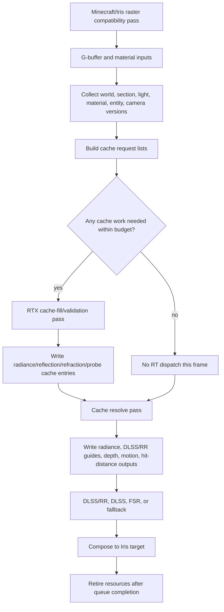

# Vulkanite Cache-First Optimization Plan

This is the shared source of truth for making Vulkanite lighting light. The goal is
not to make the current full-frame RT shader a little faster. The goal is to stop
using full-frame RT as steady-state lighting.

User clarification on 2026-06-20: RT/RTX is for validation and cache fill. RTX
runs when radiance, reflection, or refraction data is missing, stale, or needs
validation, writes or validates the cache, then turns off once cached data is
usable.

## Objective

Make steady-state frames cheap by replacing per-frame full-resolution RT with:

1. A bounded RTX cache-fill path for missing or stale lighting data.
2. A non-RT cache resolve path that runs every eligible frame.
3. Explicit cache validity and invalidation rules for world, geometry, lighting,
   material, camera, shaderpack, resolution, and temporal state changes.

Success means steady-state cache-hit frames avoid unnecessary `traceRays` work
without using stale radiance, reflection, refraction, probe, or guide data.

## Working Mode

Manual review remains active until the user explicitly changes it.

- Do not create new benchmark worlds, scripted scenes, automated capture
  harnesses, or reference-image suites.
- Do not run benchmark captures or automated A/B tests unless the user asks.
- Inspect source flow, diffs, logs, and configuration manually.
- Treat visual quality and "better or worse" as user-owned observations.
- Mark checklist items complete only with source inspection, commands, diffs, or
  user-provided observations.
- Label findings as `code-verified`, `inferred`, `target`, `measured`, or
  `user-observed`.

## Research Anchors

Use these as design direction, not as proof that Vulkanite already behaves this
way.

- NVIDIA RTXGI / SHaRC / NRC:
  https://github.com/NVIDIA-RTX/RTXGI
  Key idea: cache outgoing radiance in world space and replace much of path
  tracing with a hit evaluation plus cache lookup.
- RTXGI-DDGI:
  https://github.com/NVIDIAGameWorks/RTXGI-DDGI/blob/main/docs/Algorithms.md
  Key idea: maintain irradiance and distance probe data with fast ray-traced
  updates, then shade from probes.
- Kajiya GI overview:
  https://github.com/EmbarkStudios/kajiya/blob/main/docs/gi-overview.md
  Key idea: use an output-sensitive irradiance cache; queries drive where cache
  entries are allocated and refreshed.
- ReSTIR GI:
  https://research.nvidia.com/publication/2021-06_restir-gi-path-resampling-real-time-path-tracing
  Key idea: reuse paths across pixels and frames when rays still need to be
  traced.
- Real-time Neural Radiance Caching:
  https://research.nvidia.com/publication/2021-06_real-time-neural-radiance-caching-path-tracing
  Key idea: learn a radiance cache while rendering. Treat as future work unless
  the user explicitly wants neural-cache complexity.
- Minecraft PTGI:
  https://github.com/MahoganyTown/Minecraft-PTGI
  Useful comparison for path-traced GI plus SVGF/TAA, but not the main path to
  cache-hit steady state.
- Rethinking Voxels:
  https://github.com/gri573/rethinking-voxels
  Useful Minecraft-specific comparison for voxelization, ray-tested occlusion,
  and cheaper colored block lighting.

## Current Code-Verified Problem

Current default/reference source flow still runs RT every eligible frame. Part 2
adds a temporary `cache_resolve_only` path that skips `traceRays`, but the
default remains `full_rt_reference` until request lists, cache validity, and
quality checkpoints make cache-hit steady state trustworthy.

- [VulkanPipeline.java](C:/Users/PCGAMER/Documents/GitHub/vulkanite-1.20.1/src/main/java/me/cortex/vulkanite/client/rendering/VulkanPipeline.java:454)
  calls `passGraph.execute(...)` inside the per-frame render path.
- [RtxPassGraph.java](C:/Users/PCGAMER/Documents/GitHub/vulkanite-1.20.1/src/main/java/me/cortex/vulkanite/client/rendering/RtxPassGraph.java:34)
  loops every reflected RT pass.
- [RenderPassExecutor.java](C:/Users/PCGAMER/Documents/GitHub/vulkanite-1.20.1/src/main/java/me/cortex/vulkanite/client/rendering/RenderPassExecutor.java:448)
  calls `traceRays(renderWidth, renderHeight, 1)`.
- [ray0.rgen](C:/Users/PCGAMER/Documents/GitHub/vulkanite-1.20.1/shaderpacks/VulkaniteRT/shaders/ray0.rgen:3918)
  still contains per-frame reflection/refraction/indirect/section-light RT work.
- [ray0.rgen](C:/Users/PCGAMER/Documents/GitHub/vulkanite-1.20.1/shaderpacks/VulkaniteRT/shaders/ray0.rgen:1638)
  already has section-light probe RT cache read/write machinery, which should be
  treated as a foothold for the cache-first rewrite.
- [CacheResolvePass.java](C:/Users/PCGAMER/Documents/GitHub/vulkanite-1.20.1/src/main/java/me/cortex/vulkanite/client/rendering/CacheResolvePass.java)
  now provides a non-RT compute resolve/debug path for Part 2, but it is still
  fallback lighting rather than a real cache-hit implementation.

These are source observations, not performance measurements.

## Target Architecture



The important split is:

- `Cache fill`: optional, bounded, RT-capable, driven by dirty/missing cache
  requests.
- `Cache resolve`: mandatory for rendered frames, non-RT if possible, samples
  cache data and produces the same downstream outputs expected today.

## Cache Families

Start with explicit families instead of one vague "RT cache".

| Cache | Purpose | Likely backing | Filled by RT? | Read by steady state? |
|---|---|---|---|---|
| Section blocklight probe cache | Colored local block lighting and visibility | Existing `SectionLightManager` buffers and `ray0.rgen` RT cache cells | Yes, bounded | Yes |
| Diffuse radiance cache | Indirect diffuse tail lighting | World-space grid/hash or section/probe pages | Yes | Yes |
| Reflection cache | Specular/env result for stable surfaces | Screen-space history plus world/material keyed cache | Sometimes | Yes |
| Refraction cache | Water/glass/ice/crystal transmission result | Screen-space history plus material/medium keyed cache | Sometimes | Yes |
| Guide cache | DLSS/RR albedo, normal, roughness, depth, motion, hit distance | `RtxFrameImages` or split compute outputs | No RT unless hit distance requires it | Yes |

Do not add a cache without specifying its key, lifetime, invalidation, fallback,
and debug view.

## Invalidation Rules

Every cached value must be invalidated or revalidated by a clear version source.

| Event | Required action |
|---|---|
| Chunk section geometry changed | Invalidate affected section cache entries and neighbor entries that can see through/around the changed section |
| Section light table changed | Invalidate local light/probe/radiance entries and nearby influence region |
| Material atlas or PBR texture changed | Invalidate material-dependent reflection/refraction/radiance entries |
| Entity BLAS changed | Invalidate only dynamic/entity-dependent cache entries, not the whole world cache |
| Camera teleport/world switch | Reset temporal history and require cache revalidation where screen history is trusted |
| Sun/sky/time/weather changed | Either version sky-dependent entries or use a cheap analytic sky term outside the cache |
| Shaderpack/settings changed | Rebuild pipelines and invalidate cache entries whose layout, format, or meaning changed |
| Resolution/render scale changed | Recreate image-sized outputs and preserve only world-space caches that remain valid |
| DLSS/RR mode changed | Reset guide history and verify cache resolve outputs still match guide contracts |

Stale light is a regression. A lower RT count only counts as an optimization when
the cache validity model still explains why the reused value is correct enough.

## Execution Rules

- Full-screen `traceRays(renderWidth, renderHeight, 1)` is allowed only during
  the transition period or when explicitly selected as a debug/reference mode.
- Default steady state should have a path where no RT dispatch occurs if all
  required cache entries are valid.
- Cache-fill work must be budgeted: max entries, max rays, max pages, or max time
  per frame.
- Missing cache data must degrade predictably: previous valid value, local
  fallback, probe fallback, screen-space fallback, or noisy RT debug path.
- Debug views must show cache hit/miss/stale/in-flight/fallback state.
- DLSS/RR guides must remain valid even when RT is skipped.

## Implementation Parts

### Part 0 - Preserve Manual Scope

Status: **in progress**

- [x] Keep manual-review mode active.
- [x] Record that the user wants RT/RTX as validation/cache fill, then off.
- [x] Record source-verified evidence that RT currently runs every eligible frame.
- [x] Record user-provided performance and image-quality observations as
  `user-observed`.
- [ ] Do not run automated captures unless the user explicitly asks.

Exit condition: future agents know the target is cache-hit steady state, not
per-frame full-screen RT.

### Part 1 - Map Current Per-Frame RT Cost and Outputs

Status: **complete**

- [x] Enumerate every output currently produced by `ray0.rgen`: radiance,
  reservoirs, albedo/metallic, specular albedo, normal/roughness, motion,
  linear depth, specular hit depth, first-hit depth, blocklight detail, final
  noisy output, and section-light RT cache buffer writes.
- [x] Separate outputs that require RT from outputs that can come from G-buffer,
  compute, history, or cache resolve.
- [x] Identify which outputs DLSS/RR consumes and their required formats/ranges.
- [x] Record shader branches that trace indirect, reflection, refraction,
  section-light sparse validation, and blocklight probe cache fill.
- [x] Do not add optional counters or logs; user did not approve
  instrumentation.

Part 1 output map (`code-verified`):

| Output | Writer and backing | Current range/meaning | RT dependency | DLSS/RR consumer |
|---|---|---|---|---|
| Current reservoir / sun history, binding 6 | Injected `reservoirImage`, `rgba32f`; `RtxFrameImages` allocates `VK_FORMAT_R32G32B32A32_SFLOAT` | ReSTIR packs `w_sum`, `W`, `m`, sun-disk offset; sun-history path stores world position plus packed visibility/history | ReSTIR and sun-history visibility currently depend on `alphaAwareVisibility` ray queries | Not consumed by NGX; used by current/previous-frame ReSTIR and sun-shadow history |
| Final noisy radiance, binding 12 | `outputImage`, `rgba16f`; `RtxFrameImages.radiance` is `VK_FORMAT_R16G16B16A16_SFLOAT` | Linear HDR color after direct, indirect, local, specular/transmission, volumetric, and color-grade/firefly clamp, before tone map/gamma | Current value includes RT branches; target cache resolve must assemble the same contract without RT on cache-hit frames | DLSS/RR `pInColor`; standard DLSS color input; fallback blit source |
| Motion vectors, binding 13 | `motionVectors`, `rg16f`; `VK_FORMAT_R16G16_SFLOAT` | Pixel-space previous-current vector, clamped to launch size; sky writes zero | G-buffer/camera-derived; no RT required if first-hit position is known | DLSS/RR and standard DLSS motion input; native MV scale is 1.0 x/y |
| Linear depth, binding 14 | `linearDepthImage`, `r16f`; `VK_FORMAT_R16_SFLOAT` | Camera-forward linear depth in scene units; sky writes `10000.0` | G-buffer/depth-derived; no RT required if first hit is known | DLSS/RR and standard DLSS depth input, created as linear depth |
| Previous reservoir, binding 15 | Injected `prevReservoirImage`, `rgba32f` | Previous frame ping-pong image for temporal/spatial reuse | Read-only in `ray0.rgen`; must remain coherent when RT is skipped | Not consumed by NGX |
| Diffuse albedo/metallic, binding 16 | `DiffuseAlbedoMetallic`, `rgba8`; `VK_FORMAT_R8G8B8A8_UNORM` | RGB clamped albedo, A metallic; sky writes zero | G-buffer/material-derived; no RT required when first-hit G-buffer is valid | DLSS/RR diffuse albedo guide |
| Specular albedo, binding 17 | `SpecularAlbedo`, `rgba8`; `VK_FORMAT_R8G8B8A8_UNORM` | RGB F0 clamped 0..1, A 1.0; sky writes zero | G-buffer/material-derived | DLSS/RR specular albedo guide |
| Normal/roughness, binding 18 | `NormalRoughness`, `rgba16f`; `VK_FORMAT_R16G16B16A16_SFLOAT` | Vulkanite's explicit guide contract writes normalized world-space normals encoded from signed `[-1, 1]` to `[0, 1]` in RGB and roughness 0.04..1 in A; sky writes encoded up normal and roughness 1 | G-buffer/material-derived | DLSS/RR normals plus packed roughness; raygen and compute resolve share `encodeDlssNormalGuide(...)` semantics |
| Specular hit depth, binding 19 | `SpecularHitDepth`, `r16f`; `VK_FORMAT_R16_SFLOAT` | First written as linear depth, then overwritten with `specularHitDistanceGuide`; default view distance, reflection miss `10000.0`, refraction uses min reflection/refraction distance | RT-required today only for reflection/refraction hit distance; can be cache/history/fallback-derived | DLSS/RR `pInSpecularHitDistance` |
| First-hit depth, binding 20 | `FirstHitDepth`, `r16f`; `VK_FORMAT_R16_SFLOAT` | Linear first-hit depth; sky writes `10000.0` | G-buffer/depth-derived; primary RT fallback only when G-buffer is invalid | Allocated and bound, but not passed to current Java/native DLSS/RR evaluation |
| Blocklight detail, binding 21 | `blocklightDetailImage`, `rgba16f`; `VK_FORMAT_R16G16B16A16_SFLOAT` | RGB local/emissive lighting detail, A normalized local-light/detail strength; starts at zero per pixel | Current RGB can include RT blocklight and section-light sparse RT; can become cache/table/debug output | No reader found outside raygen/descriptor binding in current tree |
| Section probe RT cache, binding 24 | `SectionLightProbeRtCacheBuffer`, `std430` coherent buffer; Java name is probe feedback buffer | Six packed RGB9E5 radiance faces plus ready/in-flight state and face mask per probe cell | This is a cache-fill output. Existing read/write helpers are the foothold for Part 5 | Not consumed by NGX |

Part 1 shader branch map (`code-verified`):

- Primary hit fallback: `ray0.rgen` samples hybrid G-buffer first and calls
  `traceRayEXT` only when `validHybridSample(...)` fails.
- Visibility helper: `alphaAwareVisibility(...)` uses `rayQueryEXT`; direct sun,
  ReSTIR final visibility, volumetric shadows, indirect-hit shadow checks,
  reflection-hit shadow checks, and section-light sparse validation route through
  it.
- ReSTIR/sun history: injected `restir.glsl` declares current/previous reservoir
  images and writes either ReSTIR reservoirs or sun-shadow history.
- Indirect diffuse: the bounce loop traces up to `INDIRECT_BOUNCES` clamped to
  three bounces, then may cast a shadow visibility query at the bounce hit.
- Reflection: reflective non-refractive surfaces trace up to
  `METAL_MAX_BOUNCES`, update `specularHitDistanceGuide` on the first bounce, and
  may query sun visibility at reflected hits.
- Refraction/transmission: refractive surfaces call `traceSimpleRadiance(...)`
  for reflected and refracted directions, then write the min distance as the
  specular guide.
- RT blocklight: `sampleBlockLightRT(...)` uses `rayQueryEXT` to find emissive
  block surfaces when `RT_BLOCKLIGHT_PROBES` and `BLOCKLIGHT_SAMPLES` allow it.
- Section-light sparse/probe RT: `sampleSectionLightSparseRt(...)` traces
  candidate light visibility; `sampleSectionLightProbeRtCell(...)` fills probe
  faces; cache read/write helpers manage ready/in-flight state. The current
  surface-cache branch calls sparse RT directly; Part 5 should audit whether the
  unused surface claim/complete helpers should gate repeated work.

Exit condition met: a no-RT cache resolve must still write radiance,
motion vectors, linear depth, diffuse/metallic, specular albedo,
normal/roughness, specular hit distance, first-hit depth, reservoir/history when
the ReSTIR or sun-history path is active, blocklight detail if retained, and
valid section-probe cache state or fallback/debug values.

### Part 2 - Split Full RT Pass From Cache Resolve

Status: **complete**

- [x] Design a `CacheResolve` path that can write the same frame outputs without
  calling `traceRays`.
- [x] Decide whether resolve is compute shader, raster fullscreen pass, or a
  minimal raygen with RT disabled by specialization constant.
- [x] Add a temporary debug switch:
  `full_rt_reference`, `cache_fill`, `cache_resolve_only`.
- [x] Ensure the full RT reference path remains available for visual comparison.
- [x] Preserve descriptor layout compatibility or introduce a versioned layout
  migration.

Part 2 implementation notes (`code-verified`):

- `CacheResolvePass` is a compute pass, not a raygen. It dispatches 8x8 compute
  workgroups and never calls `traceRays`.
- `cache_resolve_only` skips TLAS build/entity capture and writes radiance,
  current reservoir clear, motion vectors, linear depth, diffuse/metallic,
  specular albedo, encoded normal/roughness, specular hit depth, first-hit
  depth, and blocklight detail from the hybrid G-buffer plus fallback lighting.
- `cache_fill` runs the existing full RT pass, preserving current cache-fill
  side effects such as section-probe RT cache writes, and keeps that pass's
  radiance/guides for presentation. It still collects cache feedback but no
  longer dispatches fallback resolve merely to overwrite and discard full-RT
  frame products. Once real radiance caches exist, this mode can fill and then
  resolve those caches explicitly.
- `full_rt_reference` is the default and keeps the previous full-screen RT path
  available for visual comparison.
- The full RT descriptor layout is unchanged. The compute resolve owns a
  separate reflected descriptor layout and pipeline.
- Resolve fallback writes `10000.0` as unknown/miss specular hit distance;
  first-surface linear depth is not reused as a continuation-ray hit guide.

Exit condition met: `cache_resolve_only` can compose one frame from resolve
outputs without mandatory full-screen RT. Runtime visual quality remains
user-observed/pending because the resolve path is still fallback lighting, not a
real radiance/reflection/refraction cache hit.

### Part 3 - Build Cache Request Lists

Status: **complete**

- [x] Define request keys for section probe cells, diffuse radiance entries,
  reflection entries, and refraction entries.
- [x] Generate section-probe requests from section dirty queues.
- [x] Generate visible G-buffer pixel requests.
- [x] Generate reflection/refraction surface requests.
- [x] Ingest feedback-buffer requests.
- [x] Deduplicate requests by stable key before dispatch.
- [x] Prioritize visible, high-error, high-luma, and near-camera requests.
- [x] Cap request count per frame and carry backlog across frames.

Part 3 implementation notes (`code-verified`):

- `CacheRequestKey` now defines stable key shapes for section-probe cells,
  diffuse radiance entries, reflection entries, and refraction entries.
- `CacheRequestQueue` deduplicates requests by stable key, merges duplicate
  requests by retaining stronger visibility/error/luma/near-camera priority,
  caps backlog size, and drains sorted batches up to a per-frame budget.
- `SectionLightManager` now tracks dirty section-probe RT request cursors per
  probe page, emits at most the caller's budget of section-probe cell requests
  per frame, and carries un-emitted cells across frames without expanding every
  dirty page into request objects at once.
- `VulkanPipeline` owns the central request queue, collects section-probe
  requests in cache modes, clears pending request state on world changes and
  pipeline destroy, and logs throttled request stats.
- `CacheFeedbackPass` now samples the visible hybrid G-buffer on a coarse,
  bounded grid in `cache_fill` and `cache_resolve_only`, classifies diffuse
  radiance, reflective, and refractive surfaces, writes compact feedback records
  into a three-slot host-visible SSBO ring, and ingests only slots whose queue
  timeline execution has completed, without a blocking same-frame readback.
- Visible G-buffer feedback produces diffuse radiance keys; reflective
  non-refractive surfaces produce reflection keys keyed by world cell, normal,
  roughness/material, and view bucket; water/glass/ice/crystal surfaces produce
  refraction keys keyed by world cell, normal, roughness/material, and medium
  bucket.
- `cache_resolve_only` gathers pending requests but does not drain them as a
  processed batch because no RT-capable fill pass runs in that mode.
- `cache_fill` drains a bounded section-probe batch for the Part 5 fill-request
  buffer while the current shader still uses the transitional full-screen RT
  pass. Other families remain queued until their consumers exist.
- Backlog capacity is reserved per family. Dirty section cursors advance only
  when enqueue added or merged the request, and the current section-probe
  consumer drains only section requests; unimplemented diffuse/reflection/
  refraction consumers no longer cause their requests to be discarded.

Exit condition met: request lists now have stable keys, section-dirty sources,
visible G-buffer sources, reflection/refraction surface sources, asynchronous
feedback ingestion, dedupe, priority, per-frame caps, and backlog carry-over.
Section-probe fill work is request-driven by Part 5; the remaining families and
frame-level RT gating belong to Parts 6-8.

### Part 4 - Version and Invalidate Caches

Status: **complete**

- [x] Add per-section geometry and light versions where they do not already
  exist.
- [x] Add material/PBR atlas versioning or conservative invalidation.
- [x] Track world id, dimension id, shaderpack generation, sky/time generation,
  and cache layout generation.
- [x] Store enough version data with each cache entry to reject stale hits.
- [x] Audit chunk removal, BLAS stale result rejection, shader reload, world
  switch, resize, and DLSS/RR mode changes.

Part 4 implementation notes (`code-verified`):

- `CacheInvalidationTracker` is the central cache-validity source. It tracks
  world id, dimension id, shaderpack generation, sky/time generation, material
  generation, cache layout generation, temporal generation, guide generation,
  per-family generations, and per-section geometry/light versions.
- `CacheEntryVersionStamp` is captured into each `CacheRequest`, giving future
  cache entries enough version data to reject stale hits before reuse.
- Generic diffuse/reflection/refraction stamps also carry conservative global
  scene-geometry and scene-light generations so changes outside the owning
  section cannot leave a traced result valid. Entries that actually intersect
  dynamic entity geometry mark their stamp with `withEntityDependency()` and
  then validate the entity generation as well.
- `CacheRequestKey.primarySectionKey()` maps section-probe keys directly and
  maps diffuse/reflection/refraction grid keys back to their owning section for
  local section-version validation.
- `SectionLightManager` conservatively bumps per-section geometry versions on
  accepted section rebuilds, bumps light versions on light-list changes or
  section reactivation, records tombstone versions on chunk removal, and clears
  section versions with section-light state on world reset.
- `MixinPBRAtlasTexture` and `MixinSpriteAtlasTexture` bump material generation
  on atlas upload, invalidating material-dependent diffuse, reflection, and
  refraction families.
- `VulkanPipeline` advances world/dimension generations on world switch, bumps
  shaderpack and cache-layout generations on shaderpack changes, tracks sky/time
  generation each encoded RTX/cache frame, and bumps temporal/guide generations
  on resize/render-scale or DLSS/RR mode changes.
- World identity advances even when switching between worlds in the same
  dimension; every newly constructed pipeline forces a shaderpack/layout
  generation even when the pack name is unchanged; camera cuts advance
  temporal/guide validity; sky time is quantized into 100-tick buckets instead
  of invalidating all sky-dependent families every tick.
- Audit result: chunk removal now versions affected sections; BLAS stale result
  rejection already uses `retiredSections` plus latest build time in
  `AccelerationManager`; shader reload destroys the pipeline and shaderpack
  changes bump shaderpack/layout generations; world switch clears request,
  feedback, and section-light state; resize and DLSS/RR mode changes reset
  temporal/guide validity.

Exit condition met: cache hits can be accepted or rejected by explicit validity
data. No cache family is fully consumed yet; Part 5 must use these stamps when it
turns section-probe requests into real sparse cache-fill work.

### Part 5 - Section Blocklight Probe Cache First

Status: **in progress** (`source-complete`; manual checkpoint pending)

- [x] Use the existing section-light probe RT cache as the first cache-first
  implementation target.
- [x] Verify ready/in-flight state transitions in `ray0.rgen` and
  `SectionLightManager`.
- [x] Prevent sparse RT validation from running on already-ready cache cells
  without reusing visibility across unrelated surfaces.
- [x] Use feedback to request missing/stale probe cells.
- [x] Add debug views for ready, in-flight, stale, fallback, and validated cells.
- [ ] Manual checkpoint: user checks walls, caves, page boundaries, several
  nearby emitters, fast chunk loading, and darkness after warm-up.

Part 5 implementation notes (`code-verified`):

- An attempted exact-surface reuse path was rejected after runtime review. It
  stored the first shaded pixel's visibility in a 2-block probe-cell face and
  reused it for unrelated surfaces, causing hard square lighting boundaries and
  potential reuse across walls. Exact-surface lighting now uses the original
  per-pixel sparse trace until a separately keyed surface cache exists.
- Drained `SECTION_PROBE_CELL` requests are uploaded through bounded binding 25
  records. The first matching raygen invocations fill requested six-face cells;
  the request buffer is capped at 256 cells per frame and rejects stale request
  stamps before upload.
- Request records carry the current probe generation and raygen rejects a batch
  whose generation does not match the RT cache header.
- Section and neighbor page invalidation clears resident RT-cache slots before
  reuse, removes pending old-page requests, and page completion queues fresh
  cell requests. World reset still clears the complete RT-cache buffer.
- Cache revision 14 invalidates the rejected revision-13 surface-authored cells.
- `SECTION_LIGHT_PROBE_RT_SURFACE_CACHE` now defaults to 0 in source and the
  runtime shaderpack copy. The exact-surface RTX mode remains available as a
  reference/debug toggle, but the default cache-fill profile shades from the
  warmed probe-volume cache instead of tracing per-pixel local-light visibility
  after cells are ready.
- `SECTION_LIGHT_PROBE_DEBUG_MODE=6` shows validated faces green,
  ready-but-missing faces blue, in-flight yellow, stale magenta, and
  fallback/missing orange.
- User cache-state checkpoint showed mostly/all green cells while final lighting
  still looked unacceptable. That means the request/fill state is healthy enough
  for the sampled cells, but the probe-volume approximation is still producing
  bad shaded-surface lighting. A brief attempt to surface-validate/clamp ready
  RT-cache probe-volume output was rejected because uncached per-pixel sparse
  validation produced unstable shadow shapes.

Source-side exit condition met. Request-driven probe-center fills remain, sparse
surface validation remains off for the RT-cache steady path, and unsafe
exact-surface reuse was removed to restore correctness. The manual checkpoint is
still pending by design. A future surface cache needs its own position/normal key
and must not alias the coarser probe-center storage.

### Part 6 - Diffuse Radiance Cache

Status: **in progress** (`source-complete`; manual checkpoint pending)

- [x] Choose backing structure: section-local grid, sparse world hash, or probe
  extension. Prefer simple world/section cache before neural approaches.
- [x] Fill entries from RT requests, not full-screen pixels.
- [x] Resolve diffuse indirect from cache plus direct/ambient terms.
- [x] Define fallback for empty entries and progressive warm-up behavior.
- [x] Avoid light leaks with normal bias, visibility/distance confidence, and
  neighbor invalidation.
- [ ] Manual checkpoint: interiors, thin walls, caves, sun changes, block updates,
  chunk streaming, and camera motion.

Part 6 implementation notes (`code-verified`):

- Backing structure selected: a sparse section-local world grid using the
  existing feedback key shape. Feedback cells are `floor(absWorldPos * 0.5)`,
  so each diffuse cell covers 2 blocks and `primarySectionKey()` maps 8 cells to
  one 16-block chunk section.
- Diffuse feedback keys now represent incident radiance by position and normal
  bucket, not surface material response. The feedback shader writes material
  bucket 0 for diffuse requests, and CPU ingestion enforces the same bucket
  before creating `DIFFUSE_RADIANCE` keys. Albedo/material response stays a
  resolve-side concern.
- Reflection and refraction feedback still retain material, roughness, and
  view/medium buckets because those cache families represent surface-dependent
  transport.
- Existing diffuse invalidation remains conservative: section geometry/light,
  scene geometry/light, sky, material, world, shaderpack, resize, and mode
  changes can still reject stale entries before a fill/resolve consumer accepts
  them.
- `DiffuseRadianceCache` owns a bounded 16,384-entry device-local hash table and
  a bounded 256-record fill upload. `CACHE_FILL` drains diffuse requests into
  binding 27; only those request-index invocations trace a cache sample.
- Cache entries use generation-stamped ready/fill states and eight-probe open
  addressing. A live colliding entry is never evicted, and an already-ready key
  is immutable, so frame number and request order cannot continuously reshape
  warmed lighting.
- Fill rays use a key-derived deterministic cosine sample from the normal-facing
  side of the 2-block cell. Resolve binding 26 applies material response, keeps
  direct/specular terms separate, and blends cached indirect at conservative
  confidence over the existing ambient/blocklight fallback.
- Empty, stale, contended, or over-budget entries retain fallback lighting.
  Near-immediate cache-ray hits receive reduced confidence. World, shaderpack,
  scene geometry/light, material, sky bucket, and diffuse-family changes clear
  or version out the table conservatively.

Source-side exit condition is met. Manual checks remain pending, and Part 8 must
still automate switching between RT fill and no-RT resolve frames.

### Part 7 - Reflection and Refraction Cache

Status: **not started**

- [ ] Split surface classification from ray tracing: identify reflective and
  refractive pixels cheaply from G-buffer/material data.
- [ ] Reuse screen-space history where valid before requesting world-space RT.
- [ ] Cache stable material/surface results with roughness, normal, material id,
  medium, and depth/position validity.
- [ ] Trace only misses, disocclusions, invalid entries, or high-error surfaces.
- [ ] Preserve specular hit-distance guide validity for DLSS/RR.
- [ ] Manual checkpoint: water, glass, ice, metals, grazing angles, camera motion,
  and fast lighting changes.

Exit condition: reflection/refraction rays are sparse validation work, not a
per-pixel steady-state loop.

### Part 8 - Frame Orchestration and RT Gating

Status: **not started**

- [ ] Add a frame decision before `passGraph.execute`: `NO_RT`,
  `CACHE_FILL_ONLY`, `FULL_RT_REFERENCE`, or `DISABLED`.
- [ ] Skip `RtxPassGraph.execute` when cache state and debug mode allow `NO_RT`.
- [ ] Ensure resource transitions, semaphores, command buffers, and final
  composition still run correctly when RT is skipped.
- [ ] Keep queue lifetime and retained resource references safe for both RT and
  no-RT frames.
- [ ] Record counters: RT dispatches skipped, cache requests processed, backlog,
  hit rate, stale rejects, fallback pixels.

Exit condition: Vulkanite can present valid frames without tracing rays every
frame.

### Part 9 - Descriptor, Image, and Pipeline Cleanup

Status: **not started**

- [ ] Stop allocating/updating descriptor sets for RT passes on `NO_RT` frames.
- [ ] Avoid recreating image views for stable resources.
- [ ] Keep cache buffers/images resident across frames with explicit retirement.
- [ ] Create separate descriptor layouts for cache fill and cache resolve if that
  reduces per-frame binding churn.
- [ ] Audit barriers between cache-fill writes, resolve reads, DLSS/RR reads, and
  final blit.

Exit condition: CPU encode and descriptor overhead also drops on cache-hit frames.

### Part 10 - Shader Cost After Gating

Status: **not started**

- [ ] Optimize raygen/closest-hit/any-hit only after RT is no longer mandatory
  every frame.
- [ ] Profile or inspect remaining cache-fill rays by category: blocklight,
  diffuse radiance, reflection, refraction, sun visibility, volumetric work.
- [ ] Add early exits for zero contribution before any ray query or grid walk.
- [ ] Remove debug-only and disabled work from release permutations while keeping
  debug/reference modes available.
- [ ] Preserve miss shader sky writes and all DLSS/RR guide contracts.

Exit condition: remaining RTX-active frames are cheaper, bounded, and visually
acceptable.

### Part 11 - Reconstruction, Upscaling, and Guides

Status: **not started**

- [ ] Verify cache resolve writes every DLSS/RR guide with valid ranges.
- [ ] Reset temporal state on mode, scale, world, camera cut, and invalid cache
  transitions.
- [ ] Confirm fallback after DLSS/RR failure does not force full RT unless the
  debug/reference mode requests it.
- [ ] Manual checkpoint: DLSS RR, standard DLSS, FSR, disabled/noisy output, and
  unsupported hardware.

Exit condition: reconstruction remains stable when RT is skipped on cache-hit
frames.

### Part 12 - Lifecycle, Reload, Resize, and Recovery

Status: **not started**

- [ ] Ensure shader reload invalidates cache layouts and pipelines safely.
- [ ] Ensure resize recreates image-sized outputs but preserves valid world-space
  caches.
- [ ] Ensure world switch and dimension change clear or version all cache families.
- [ ] Ensure device loss or native DLSS failure leaves Iris/Minecraft usable.
- [ ] Keep manual checkpoints for startup, shader reload, resize, world switch,
  and recovery.

Exit condition: cache state does not survive across incompatible lifecycle
changes.

### Part 13 - Memory and Cache Budgets

Status: **not started**

- [ ] Define memory budgets for each cache family.
- [ ] Evict by last use, distance, version mismatch, and low confidence.
- [ ] Track device-local, host-visible, shared-image, AS, descriptor, scratch, and
  upload memory.
- [ ] Verify cache buffers are not freed while in use by submitted work.
- [ ] Manual checkpoint: long session, chunk churn, repeated resize, shader
  reload, dimension switch, and DLSS mode switching.

Exit condition: cache memory stays bounded and lifetime-safe.

### Part 14 - Shutdown and Destruction

Status: **in progress**

- [ ] Map destruction order for active pipelines, DLSS/NGX, probe workers,
  pending BLAS jobs, TLAS/BLAS, command queues, cache buffers/images, semaphores,
  and Vulkan context.
- [x] Retain a BLAS worker thread handle, stop accepting work, wake the worker,
  cancel queued jobs, and join before closing builder-owned BLAS resources.
- [x] Shut down section probe workers before freeing state their tasks can publish
  into.
- [ ] Drain or fail pending `CommandSubmissionRequest` futures and release retained
  command-buffer/semaphore references on shutdown and device-loss paths.
- [ ] Identify the owner that destroys `CommandManager`, `SyncManager`,
  allocators, Vulkan device, debug messenger, surface, and instance.
- [ ] Verify partial initialization cleanup and idempotent destroy.
- [x] Provide manual checkpoints for repeated launch/quit, world join/leave,
  shader reload then quit, and quit during heavy chunk work.

Manual checkpoint: start `ray-tracing-test-place`, fly fast enough to trigger
chunk/BLAS/probe work, then quit while chunks are still loading. Repeat with a
warmed static scene, world join/leave, and shader reload then quit. Record whether
shutdown hangs and whether logs show `[BLAS Builder] Worker stopped during
shutdown` and `[Vulkanite] Section probe workers stopped during shutdown` without
late BLAS/probe errors, probe timeout warnings, or double-close warnings.

Exit condition: shutdown is bounded and clean for both RT and no-RT cache-hit
frames.

### Part 15 - Quality Scaling and Final Integration

Status: **not started**

- [ ] Keep full RT reference mode as the no-quality-loss comparison path.
- [ ] Treat quality levels as explicit user-facing tradeoffs, not hidden
  optimizations.
- [ ] Ask the user to review final combined changes in the flows they care about.
- [ ] Record user-observed performance, smoothness, lighting, material, stability,
  startup/reload, resize, and shutdown results.
- [ ] Compile active RT/cache-fill/cache-resolve stages and relevant permutations.
- [ ] Run shaderpack drift validation only if the user explicitly allows it.
- [ ] Inspect the complete diff for generated-file edits, unrelated changes,
  stale comments, descriptor mismatches, unsafe indices, and unbounded loops.

Completion target: user-confirmed improvement or clearly documented cache-first
cleanup with no critical visual, synchronization, descriptor, or lifetime
regression.

## Status Board

| Part | Owner | State | Result or blocker |
|---|---|---|---|
| 0 - Manual scope | Codex | in progress | Manual mode and RT cache-fill contract recorded; current per-frame RT path source-verified. |
| 1 - Current RT outputs | Codex | complete | Output contract, DLSS/RR consumers, and current trace branches mapped from source. |
| 2 - Split RT/resolve | Codex | complete | Compute cache resolve path added with `full_rt_reference`, `cache_fill`, and `cache_resolve_only`; default remains full RT reference. |
| 3 - Cache requests | Codex | complete | Stable request keys, dedupe/priority/backlog, section-probe dirty queue requests, visible G-buffer feedback, and reflection/refraction surface requests added. |
| 4 - Cache versioning | Codex | complete | Explicit generation tracker and request stamps added for world, section, material, shaderpack, sky/time, layout, temporal, and guide validity. |
| 5 - Section blocklight cache | Codex | in progress | Source-side path is complete: request-driven cell warm-up, no exact-surface/probe aliasing, default probe-volume cache shading, stale-slot invalidation, and cache-state debug view. Manual visual checkpoint remains. |
| 6 - Diffuse radiance cache | Codex | in progress | Source-complete: bounded request-driven deterministic RT fills, generation-stamped hash entries, conservative fallback/confidence, and non-RT diffuse resolve. Manual visual checkpoint remains. |
| 7 - Reflection/refraction cache | unassigned | not started | Needed to stop per-pixel continuation rays. |
| 8 - Frame RT gating | unassigned | not started | Skip `RtxPassGraph.execute` on cache-hit frames. |
| 9 - Descriptors/images/pipelines | unassigned | not started | Removes CPU overhead on no-RT frames. |
| 10 - Shader cost after gating | unassigned | not started | Optimize only remaining cache-fill RT work. |
| 11 - Reconstruction/guides | unassigned | not started | Keep DLSS/RR valid when RT is skipped. |
| 12 - Lifecycle/recovery | unassigned | not started | Cache invalidation across reload/resize/world changes. |
| 13 - Memory/cache budgets | unassigned | not started | Keep cache memory bounded. |
| 14 - Shutdown/destruction | Codex | in progress | BLAS worker and section probe shutdown improved; command futures and context teardown remain open. |
| 15 - Final integration | unassigned | not started | User-observed outcome required. |

Allowed states: `not started`, `in progress`, `blocked`, `complete`, `rejected`.

## Evidence Ledger

| Date | Agent | Part | Build/scene/settings | Metric | Before | After | Delta | Correctness checks | Decision |
|---|---|---:|---|---|---:|---:|---:|---|---|
| 2026-06-20 | Codex | 0 | `979a61c`, current dirty tree | Runtime shaderpack mismatched files | 0 | 0 | 0 | pre-sync `git diff --no-index`; Gradle drift validation passed | Baseline sanity retained |
| 2026-06-20 | Codex | 0 | runtime options | Minecraft FPS cap | 60 FPS | 260 FPS | +200 FPS headroom | VSync remains off; Vulkanite internal pacer code-verified disabled | Retained for uncapped baseline only |
| 2026-06-20 | User/Codex | 0 | manual review | RT runtime contract | plan implied normal per-frame RT | RTX should fill/validate radiance, reflection, refraction caches, then turn off | user-provided architecture clarification | document update only | Cache-first rewrite retained |
| 2026-06-20 | Codex | 0 | source inspection | Full-frame RT dispatch | `passGraph.execute` called every eligible frame and reaches `traceRays` | target is gated RT with cache resolve | target | `VulkanPipeline`, `RtxPassGraph`, `RenderPassExecutor`, `ray0.rgen` inspected | Rewrite plan around gating and cache resolve |
| 2026-06-20 | User/Codex | 1-4 audit | active `full_rt_reference`, VSync off, 260 FPS cap | Minecraft profiler `updateDisplay` share | not provided | 88% | user-observed; single pie-chart observation | Active log showed `full_rt_reference`; current config was written after launch and is not hot-reloaded; live GPU check showed 97% utilization/P0; source inspection traced `updateDisplay` to presentation waiting behind the GL/Vulkan semaphore chain | Treat as GPU saturation from mandatory full-frame RT, not display-copy or request-queue CPU cost; Parts 5-8 must remove/gate steady-state RT |
| 2026-06-20 | Codex | 1 | current dirty tree, manual review | RT output contract | Part 1 unmapped | `ray0.rgen` outputs and DLSS/RR consumers mapped; no instrumentation added | code-verified | `ray0.rgen`, injected `restir.glsl`, `RtxFrameImages`, `RenderPassExecutor`, `DLSSDProcessor`, `DLSSBridge`, `dlss_wrapper.cpp`, G-buffer shaders inspected; `git diff --check` | Part 2 can design cache resolve against explicit outputs |
| 2026-06-20 | Codex | 2 | current dirty tree, manual review | No-RT frame composition path | `encodeRtxFrame` always reached `passGraph.execute` and `RenderPassExecutor.traceRays` when TLAS existed | `cache_resolve_only` skips TLAS/full RT and dispatches `CacheResolvePass`; `cache_fill` runs full RT then resolve; `full_rt_reference` remains default | code-verified | `VulkanPipeline`, `VulkaniteConfig`, `CacheResolvePass`; compute shader validated with `glslangValidator -V -S comp`; `git diff --check`; no-index whitespace check for new resolver file; `./gradlew classes` | Retained pending user visual/runtime observation |
| 2026-06-20 | Codex | 3 | current dirty tree, manual review | Cache request list plumbing | Part 3 had no stable request keys or bounded backlog | Stable request keys, dedupe/priority queue, section-probe dirty request cursors, per-frame cap, and throttled request stats | code-verified | `SectionLightManager`, `SectionDirectionalProbePage`, `VulkanPipeline`, `cache/*`; `git diff --check`; `./gradlew classes` | Retained as infrastructure; not yet request-driven RT |
| 2026-06-20 | Codex | 3 | current dirty tree, manual review | Visible/cache feedback request sources | Visible pixel, reflection/refraction, and feedback-buffer sources pending | `CacheFeedbackPass` samples visible G-buffer surfaces into an async host-visible feedback SSBO; CPU ingests previous-frame records into `CacheRequestQueue` as diffuse, reflection, and refraction keys | code-verified | `CacheFeedbackPass`, `VulkanPipeline`; inline compute shader validated with `glslangValidator -V -S comp`; `git diff --check`; `./gradlew classes` | Part 3 complete; retained pending request-driven RT consumers |
| 2026-06-20 | Codex | 4 | current dirty tree, manual review | Cache hit validity data | Part 4 had no explicit cache-entry stamps or global/local generation tracker | `CacheInvalidationTracker` tracks global, family, guide/temporal, and section versions; requests now capture `CacheEntryVersionStamp`; world, shaderpack, material atlas, sky/time, resize, DLSS/RR mode, section rebuild, and section removal events advance validity data | code-verified | `CacheInvalidationTracker`, `CacheEntryVersionStamp`, `CacheRequest`, `CacheRequestKey`, `SectionLightManager`, `VulkanPipeline`, atlas upload mixins inspected; `git diff --check`; `./gradlew classes` | Part 5 can use stamps to reject stale section-probe cache hits before accepting them |
| 2026-06-20 | Codex | 2-4 audit | current dirty tree, manual review | Synchronization, request retention, guide semantics, cache validity | Single feedback SSBO lacked completion ownership; rejected/drained requests could be lost; cache-fill discarded full-RT frame products; fallback reused first-hit depth as specular hit distance; exact sky ticks and owning-section-only stamps were insufficient | Three completion-tracked feedback slots; per-family retained backlog and accepted-enqueue cursors; cache-fill keeps full-RT output; unknown specular guide sentinel; conservative scene generations, selective entity dependency, camera-cut and forced reload generations, 100-tick sky buckets | code-verified | Targeted source review; historical bundled NGX bridge plus existing Vulkanite data-flow contract inspected; `./gradlew classes`; `git diff --check` | Corrective audit retained; runtime visual checkpoint remains user-owned |
| 2026-06-20 | Codex | 5 | current dirty tree, manual review | Repeated section-light sparse RT | Exact-surface mode called `sampleSectionLightSparseRt` every shaded pixel and drained section-cell requests were discarded | Ready faces are read before RT; missing faces use claim/complete state; bounded binding 25 fills requested cells; dirty resident slots are cleared before reuse | code-verified | `SectionLightManager`, `VulkanPipeline`, `RtxPassGraph`, `RenderPassExecutor`, `ray0.rgen`, settings/lang inspected; preprocessed raygen passed `glslangValidator`; `git diff --check`; `./gradlew classes` | Retained pending user visual/warm-up checkpoint |
| 2026-06-20 | Codex | 5 | current dirty tree, manual review | Face/cell fill arbitration recheck | Whole-cell warm-up could seize a ready partial cell, overlapping an in-flight face writer or a reader that had already accepted the ready state | Whole-cell warm-up now claims only empty/stale cells; ready partial cells remain immutable and missing faces stay on the face-claim path, which rechecks ownership | code-verified | Targeted state-transition review; preprocessed raygen passed `glslangValidator -V --target-env vulkan1.2 -S rgen`; `git diff --check`; `./gradlew classes` | Retained; runtime visual checkpoint remains pending |
| 2026-06-20 | User/Codex | 5 | user runtime, `run/logs/latest.log` | Ray tracing pipeline creation | Reflected VulkaniteRT set 0 included storage-buffer binding 25, but every Java expected-layout variant stopped at binding 24 and rejected the pipeline | Expected common descriptor contracts now allow binding 25, matching the existing descriptor update and shader declaration | runtime-verified | Runtime exception inspected; expected-layout variants audited; `./gradlew classes`; subsequent launch logged `Hybrid RTX pipeline created: passes=1, entities=true` | Fix retained; continue with the visual cache checks |
| 2026-06-20 | Codex | 5 | local manual-checkpoint configuration | Cache test controls | `rtxCacheMode` absent (defaulted to `full_rt_reference`); cache-state debug absent (defaulted to 0) | Prepared `cache_fill` and `SECTION_LIGHT_PROBE_DEBUG_MODE=6`; VulkaniteRT, shaders enabled, surface cache/cache-only defaults, VSync off, 260 FPS cap, and source/runtime shader hash verified | configuration-verified; restart pending | Parsed active property files, defaults, process command line, and SHA-256 source/runtime shader match | Restart the already-running client, confirm the cache-mode log, inspect state transitions, then turn debug back to 0 for lighting-quality checks |
| 2026-06-20 | User/Codex | 5 | user screenshot and active runtime log | Exact-surface cache correctness | Revision 13 reused one pixel's sparse visibility for every matching normal in a coarse 2-block probe cell, producing severe square discontinuities; active run was still `full_rt_reference`, and Iris had reset debug mode to 0 | Removed surface/probe semantic aliasing, restored per-pixel exact-surface tracing, removed unused face-claim writers, and bumped cache revision to 14 | code-verified; runtime recheck pending | Screenshot pattern matched address quantization; active log/config inspected; preprocessed raygen compiled; runtime shaderpack synchronized and drift-validated; `./gradlew classes` | Correctness rollback retained; Part 5 optimization remains incomplete |
| 2026-06-20 | Codex | 5 | local manual-checkpoint configuration | Local-light test profile | Custom falloff `0.1`, emitter intensity `24`, minimum light `0.02`, and experimental sparse correction made the cave comparison unusually clipped and short-ranged | Preserved the custom profile, then restored default local-light values for the correctness retest: falloff `0.0125`, emitter `12`, minimum light `0.05`, sparse correction off, and default sculk/shulker gains | configuration-verified; restart pending | Compared persisted overrides with shader defaults | Use controlled defaults for the revision-14 A/B before retuning appearance |
| 2026-06-20 | Codex | 5 | source/runtime shaderpack copy, manual review | Repeated sparse local-light RT on warmed section cache | Default `SECTION_LIGHT_PROBE_RT_SURFACE_CACHE=1` kept exact-surface local-light ray tests active even after probe cells were ready | Default and raygen fallback changed to `SECTION_LIGHT_PROBE_RT_SURFACE_CACHE=0`; exact-surface mode remains an explicit reference/debug toggle | code-verified; runtime recheck pending | `settings.glsl`, `ray0.rgen`, and option text inspected/updated in source and runtime copy; preprocessed raygen passed `glslangValidator`; source/runtime shaderpack diff had no content drift; `git diff --check`; `./gradlew classes` | Part 5 source-side cache-first path complete; manual visual checkpoint still pending |
| 2026-06-20 | User/Codex | 5 | user screenshot, normal lighting view, `cache_fill` log | Section-probe cache visual checkpoint | Prior revision-13 exact-surface/probe-cell aliasing produced severe repeated square seams | Current screenshot does not show the old repeated 2-block seam pattern, but it still shows a hard rectangular local-light shadow/occlusion patch under the blocks and blocky wall shadowing | user-observed; inferred from screenshot | Latest log confirms `RTX cache mode: cache_fill`; screenshot is normal lighting rather than cache-state debug mode 6 | Keep Part 5 manual checkpoint pending; request/debug-state view and broader cave/wall/page-boundary checks still needed before marking complete |
| 2026-06-20 | User/Codex | 5 | user screenshot, compare debug view | Probe/table compare checkpoint | `SECTION_LIGHT_PROBE_DEBUG_MODE=4` compares probe lighting against the unoccluded table heuristic, not cache residency state | Compare view shows widespread red/cyan disagreement: red regions indicate over-bright/leak-suspicious probe lighting or probe-only light, and cyan regions indicate under-lit probe lighting relative to the table reference | user-observed; code-inferred | Runtime shader options show `SECTION_LIGHT_PROBE_DEBUG_MODE=4`; `ray0.rgen` compare color mapping inspected | Part 5 manual checkpoint remains open; switch to cache-state mode 6 next to distinguish missing/stale/in-flight cells from model mismatch |
| 2026-06-20 | User/Codex | 5 | user observation, cache-state debug view | Ready RT-cache quality | Cache-state debug mode 6 showed green cells, but normal lighting still looked unacceptable | A trial shaded-surface validation/clamp for RT-cache probe-volume output caused unstable shadow shapes, so the RT-cache path was restored to skip uncached per-pixel sparse validation; runtime debug option remains normal lighting | code-verified; runtime recheck pending | `ray0.rgen` branch inspected; preprocessed raygen passed `glslangValidator -V --target-env vulkan1.2 -S rgen`; `validateVulkaniteShaderpackDrift` passed | Recheck same view with debug mode off; the durable fix needs a separate surface-keyed cache or stronger stable occlusion model |
| 2026-06-20 | Codex | 6 | current dirty tree, manual review | Diffuse request/cache identity | Diffuse feedback keyed visible surfaces by material bucket, which would duplicate the same incident radiance for different albedo/material response | Diffuse feedback now uses a 2-block section-local incident-radiance key with normal bucket and material bucket 0; CPU ingestion enforces the same invariant | code-verified | `CacheFeedbackPass`, `CacheRequestKey`, `CacheInvalidationTracker`, and Part 6 checklist inspected; inline feedback compute shader passed `glslangValidator --stdin -S comp`; `./gradlew classes`; `git diff --check` | Fill storage/buffers and non-RT diffuse resolve remain pending |
| 2026-06-20 | Codex | 6 | current dirty tree, manual review | Request-driven diffuse RT and non-RT resolve | Diffuse requests had no resident GPU storage, fill consumer, or resolve lookup; empty pages used fallback only | A bounded generation-stamped hash receives at most 256 deterministic request rays per fill frame; resolve reads ready entries and conservatively blends indirect radiance over fallback lighting | code-verified; manual scene check pending | Forced Java compile; raygen and compute GLSL validation; shaderpack drift validation; `git diff --check` | Source implementation retained; interiors, thin walls, sun/block changes, streaming, and motion remain user-owned checks |
| 2026-06-20 | Codex | 14 | current dirty tree, manual review | BLAS shutdown ownership | worker had no retained stop/join path | cooperative cancel, wake, join, and owned-resource cleanup path | code-verified | source inspection; `git diff --check`; `./gradlew classes` | Retained pending user shutdown observation |
| 2026-06-20 | Codex | 14 | clean live tree at start of pass, manual review | Section probe executor shutdown ownership | `destroy()` cleared manager state then relied on `shutdownNow` while running tasks could still publish results | manager marks shutdown, cancels queued probe work, waits up to `vulkanite.probeShutdownJoinMs`, discards late results, then frees state | code-verified | source inspection; `git diff --check`; `./gradlew classes` | Retained pending user shutdown observation |
| - | - | - | - | - | - | - | - | - | - |

## Changed-File Ledger

| Date | Agent | Part | Files | Purpose | Validation |
|---|---|---:|---|---|---|
| 2026-06-20 | Codex | planning | `plans/OPTIMIZATION_AGENT_FLOW.md` | Rewrite optimization flow around cache-first RT gating, explicit cache validity, and non-RT steady-state resolve | Markdown-only patch; `git diff --check` |
| 2026-06-20 | Codex | 1-4 audit | `plans/OPTIMIZATION_AGENT_FLOW.md` | Record the user's 88% `updateDisplay` observation and the code/runtime finding that asynchronous full-frame RT pressure is charged to presentation while the active client remains in `full_rt_reference` | Active log/config timestamps, source synchronization-path inspection, live GPU utilization query, `git diff --check`, `./gradlew classes` |
| 2026-06-20 | Codex | 1 | `plans/OPTIMIZATION_AGENT_FLOW.md` | Record current raygen outputs, DLSS/RR guide contract, trace branches, and no-instrumentation decision | Markdown-only patch; `git diff --check` |
| 2026-06-20 | Codex | 2 | `src/main/java/me/cortex/vulkanite/client/rendering/CacheResolvePass.java`, `src/main/java/me/cortex/vulkanite/client/rendering/VulkanPipeline.java`, `src/main/java/me/cortex/vulkanite/client/config/VulkaniteConfig.java`, `plans/OPTIMIZATION_AGENT_FLOW.md` | Add compute cache resolve path, temporary RTX/cache mode switch, resolve-only frame orchestration, and Part 2 handoff notes | `glslangValidator -V -S comp`; `git diff --check`; no-index whitespace check for new resolver file; `./gradlew classes` |
| 2026-06-20 | Codex | 3 | `src/main/java/me/cortex/vulkanite/client/rendering/cache/CacheRequest.java`, `src/main/java/me/cortex/vulkanite/client/rendering/cache/CacheRequestBatch.java`, `src/main/java/me/cortex/vulkanite/client/rendering/cache/CacheRequestFamily.java`, `src/main/java/me/cortex/vulkanite/client/rendering/cache/CacheRequestKey.java`, `src/main/java/me/cortex/vulkanite/client/rendering/cache/CacheRequestQueue.java`, `src/main/java/me/cortex/vulkanite/client/rendering/cache/CacheRequestSource.java`, `src/main/java/me/cortex/vulkanite/client/rendering/cache/CacheRequestStats.java`, `src/main/java/me/cortex/vulkanite/client/lighting/SectionDirectionalProbePage.java`, `src/main/java/me/cortex/vulkanite/client/lighting/SectionLightManager.java`, `src/main/java/me/cortex/vulkanite/client/rendering/VulkanPipeline.java`, `plans/OPTIMIZATION_AGENT_FLOW.md` | Add stable cache request keys, dedupe/priority/backlog queue, section-probe dirty request generation, request logging, and Part 3 status notes | `git diff --check`; `./gradlew classes` |
| 2026-06-20 | Codex | 3 | `src/main/java/me/cortex/vulkanite/client/rendering/CacheFeedbackPass.java`, `src/main/java/me/cortex/vulkanite/client/rendering/VulkanPipeline.java`, `plans/OPTIMIZATION_AGENT_FLOW.md` | Add asynchronous G-buffer feedback collector, ingest previous-frame visible diffuse/reflection/refraction requests, clear pending feedback on mode/world/pipeline changes, and mark Part 3 complete | `glslangValidator -V -S comp`; `git diff --check`; `./gradlew classes` |
| 2026-06-20 | Codex | 4 | `src/main/java/me/cortex/vulkanite/client/rendering/cache/CacheInvalidationTracker.java`, `src/main/java/me/cortex/vulkanite/client/rendering/cache/CacheEntryVersionStamp.java`, `src/main/java/me/cortex/vulkanite/client/rendering/cache/CacheRequest.java`, `src/main/java/me/cortex/vulkanite/client/rendering/cache/CacheRequestKey.java`, `src/main/java/me/cortex/vulkanite/client/lighting/SectionLightManager.java`, `src/main/java/me/cortex/vulkanite/client/rendering/VulkanPipeline.java`, `src/main/java/me/cortex/vulkanite/mixin/iris/MixinPBRAtlasTexture.java`, `src/main/java/me/cortex/vulkanite/mixin/minecraft/MixinSpriteAtlasTexture.java`, `plans/OPTIMIZATION_AGENT_FLOW.md` | Add cache validity generations, request stamps, per-section geometry/light version hooks, material atlas invalidation, and lifecycle invalidation for world, shaderpack, sky/time, resize, and DLSS/RR mode changes | `git diff --check`; `./gradlew classes` |
| 2026-06-20 | Codex | 2-4 audit | `VulkaniteConfig.java`, `CacheFeedbackPass.java`, `CacheResolvePass.java`, `VulkanPipeline.java`, `SectionLightManager.java`, `cache/CacheRequestQueue.java`, `cache/CacheInvalidationTracker.java`, `cache/CacheEntryVersionStamp.java`, `DLSSBridge.java`, `ray0.rgen`, `plans/OPTIMIZATION_AGENT_FLOW.md` | Remove feedback host/GPU race, retain unconsumed or rejected requests, stop cache-fill from discarding full-RT outputs, correct fallback guide semantics, and close lifecycle/dependency invalidation gaps | `./gradlew classes`; `git diff --check`; targeted diff/source review |
| 2026-06-20 | Codex | 5 | `src/main/java/me/cortex/vulkanite/client/lighting/SectionLightManager.java`, `src/main/java/me/cortex/vulkanite/client/rendering/VulkanPipeline.java`, `src/main/java/me/cortex/vulkanite/client/rendering/RtxPassGraph.java`, `src/main/java/me/cortex/vulkanite/client/rendering/RenderPassExecutor.java`, `shaderpacks/VulkaniteRT/shaders/ray0.rgen`, `shaderpacks/VulkaniteRT/shaders/lib/rt/settings.glsl`, `shaderpacks/VulkaniteRT/shaders/lang/en_us.lang`, `plans/OPTIMIZATION_AGENT_FLOW.md` | Bind bounded section-probe fill requests, reuse exact-surface cache faces, clear stale resident slots, bump cache revision, and add cache-state debug visualization | Preprocessed raygen `glslangValidator -V --target-env vulkan1.2 -S rgen`; `git diff --check`; `./gradlew classes` |
| 2026-06-20 | Codex | 5 | `src/main/java/me/cortex/vulkanite/client/rendering/PipelineDescriptorSets.java`, `plans/OPTIMIZATION_AGENT_FLOW.md` | Add section-probe fill-request binding 25 to Java's allowed common descriptor-layout contracts after the user runtime exposed the omission | Runtime log/root-cause inspection; `./gradlew classes` |
| 2026-06-20 | Codex | 5 | `run/config/vulkanite.properties`, `run/shaderpacks/VulkaniteRT.txt`, `plans/OPTIMIZATION_AGENT_FLOW.md` | Prepare the local manual checkpoint with `cache_fill` and section-cache debug mode 6 | Parsed effective values and defaults; checked active client command line has no cache-mode override; source/runtime shader SHA-256 match |
| 2026-06-20 | Codex | 5 | `shaderpacks/VulkaniteRT/shaders/ray0.rgen`, runtime shaderpack copy, `plans/OPTIMIZATION_AGENT_FLOW.md` | Remove coarse probe-cell reuse of exact-surface visibility, restore correct sparse surface tracing, and invalidate revision-13 cells | Preprocessed raygen `glslangValidator -V --target-env vulkan1.2 -S rgen`; `validateVulkaniteShaderpackDrift`; `./gradlew classes` |
| 2026-06-20 | Codex | 5 | `run/shaderpacks/VulkaniteRT.txt`, `run/shaderpacks/VulkaniteRT.before-part5-correctness.txt`, `plans/OPTIMIZATION_AGENT_FLOW.md` | Preserve the user's custom shader options and normalize local-light controls for a controlled correctness retest | Persisted values compared with tracked shader defaults |
| 2026-06-20 | Codex | 5-6 | `shaderpacks/VulkaniteRT/shaders/lib/rt/settings.glsl`, `shaderpacks/VulkaniteRT/shaders/ray0.rgen`, `shaderpacks/VulkaniteRT/shaders/lang/en_us.lang`, runtime shaderpack copy, `src/main/java/me/cortex/vulkanite/client/rendering/CacheFeedbackPass.java`, `src/main/java/me/cortex/vulkanite/client/rendering/cache/CacheRequestKey.java`, `plans/OPTIMIZATION_AGENT_FLOW.md` | Finish the Part 5 source-side cache-first default and start Part 6 with a section-local, material-independent diffuse incident-radiance request identity | `python preprocess_shader.py ...`; `glslangValidator -V --target-env vulkan1.2 -S rgen`; inline feedback shader `glslangValidator --stdin -S comp`; source/runtime shaderpack no-drift diff; `git diff --check`; `./gradlew classes` |
| 2026-06-20 | Codex | 6 | `src/main/java/me/cortex/vulkanite/client/rendering/cache/DiffuseRadianceCache.java`, `CacheInvalidationTracker.java`, `VulkanPipeline.java`, `RtxPassGraph.java`, `RenderPassExecutor.java`, `PipelineDescriptorSets.java`, `CacheResolvePass.java`, `shaderpacks/VulkaniteRT/shaders/ray0.rgen`, runtime shaderpack copy, `plans/OPTIMIZATION_AGENT_FLOW.md` | Add bounded diffuse cache/fill buffers, deterministic request-only RT population, conservative non-RT indirect resolve, fallback/confidence behavior, invalidation, and lifecycle cleanup | `./gradlew compileJava --rerun-tasks`; `./gradlew test` (`NO-SOURCE`); preprocessed raygen and extracted compute shader passed `glslangValidator`; `validateVulkaniteShaderpackDrift`; `git diff --check` |
| 2026-06-20 | Codex | 5 | `plans/OPTIMIZATION_AGENT_FLOW.md` | Record the user-provided normal-mode visual checkpoint screenshot and keep the manual Part 5 checkpoint pending pending debug-state and broader scene review | Markdown-only observation update; validation pending in this pass |
| 2026-06-20 | Codex | 5 | `run/shaderpacks/VulkaniteRT.txt`, `plans/OPTIMIZATION_AGENT_FLOW.md` | Record the user-provided compare-mode checkpoint and prepare cache-state debug mode 6 for the next manual view | Runtime options inspected; `ray0.rgen` compare/cache-state color mapping inspected; `git diff --check` |
| 2026-06-20 | Codex | 5 | `shaderpacks/VulkaniteRT/shaders/ray0.rgen`, runtime shaderpack copy, `run/shaderpacks/VulkaniteRT.txt`, `plans/OPTIMIZATION_AGENT_FLOW.md` | Reject the RT-cache surface-validation clamp after it caused unstable shadow shapes; restore the RT-cache path to skip uncached per-pixel sparse validation and leave normal-lighting debug mode active | Preprocessed raygen `glslangValidator -V --target-env vulkan1.2 -S rgen`; `validateVulkaniteShaderpackDrift`; `git diff --check` |
| 2026-06-20 | Codex | 14 | `src/main/java/me/cortex/vulkanite/acceleration/AccelerationBlasBuilder.java`, `src/main/java/me/cortex/vulkanite/acceleration/AccelerationManager.java`, `src/main/java/me/cortex/vulkanite/acceleration/blas/BLASBuildWorker.java`, `src/main/java/me/cortex/vulkanite/acceleration/blas/BLASBatchProcessor.java`, `src/main/java/me/cortex/vulkanite/acceleration/blas/BLASCompactor.java`, `src/main/java/me/cortex/vulkanite/acceleration/blas/BLASMemoryManager.java`, `src/main/java/me/cortex/vulkanite/lib/memory/AccelerationStructurePool.java`, `src/main/java/me/cortex/vulkanite/lib/memory/PoolLinearAllocator.java`, `src/main/java/me/cortex/vulkanite/lib/pipeline/VComputePipeline.java`, `plans/OPTIMIZATION_AGENT_FLOW.md` | Stop/join BLAS worker on shutdown, cancel queued BLAS jobs, and release builder-owned BLAS resources after the worker stops | `git diff --check`; `./gradlew classes` |
| 2026-06-20 | Codex | 14 | `src/main/java/me/cortex/vulkanite/client/lighting/SectionLightManager.java`, `plans/OPTIMIZATION_AGENT_FLOW.md` | Stop accepting section probe work during shutdown, cancel queued probe tasks, wait for running tasks, discard late results, and free probe state afterward | `git diff --check`; `./gradlew classes` |

## Rejected Experiments

| Date | Agent | Part | Experiment | Why rejected | Evidence | Revisit condition |
|---|---|---:|---|---|---|---|
| 2026-06-20 | Codex | 0 | Creating/running automated benchmark worlds, scripted scenes, capture harnesses, or A/B tests | User wants manual flow review and user-owned visual/performance judgment | User directive in chat | Only if the user explicitly re-enables automated testing |
| 2026-06-20 | Codex | planning | Treating raygen micro-optimization as the primary plan | Full-frame RT every eligible frame is the architecture problem | Source inspection and user clarification | Revisit after RT gating and cache resolve exist |
| 2026-06-20 | Codex | planning | Neural radiance cache as first implementation | Too complex for the first cache-first step and likely vendor/runtime-heavy | Research review | Revisit only after simple world/section cache is insufficient |
| 2026-06-20 | Codex | 3 | Adding a blocking same-frame GPU feedback readback to make feedback-buffer requests look complete | Synchronous readback would add unnecessary frame sync risk before the request model is consumed | Source inspection of `VCmdBuff`, `MemoryManager`, section feedback buffer ownership; async `CacheFeedbackPass` retained instead | Revisit only if later cache-fill consumers require lower-latency feedback than previous-frame ingestion |
| 2026-06-20 | Codex | 5 | Reusing exact-surface sparse-RT results in section probe-cell faces | A probe cell spans 2 blocks and represents radiance at its center; it cannot safely key exact-surface visibility. First-writer reuse crossed positions and walls and produced visible square seams | User screenshot; shader address path quantizes world position to the 8x8x8 section grid | Revisit only with separate surface storage keyed finely enough by world position, normal, material/source dependency, and validity generation |
| 2026-06-20 | Codex | 5 | Running uncached per-pixel surface validation on ready RT-cache probe-volume lighting | It reduced trust in bad green cells but produced unstable shadow shapes because sparse validation samples are not stored in a stable surface-keyed cache | User observation after the trial; `ray0.rgen` validation branch inspected and restored to `SECTION_LIGHT_PROBE_RT_CACHE_ENABLE == 0` | Revisit only with a deterministic surface cache, temporal history, or stable voxel/visibility structure |

## Agent Completion Protocol

Before ending a part, the agent must:

1. Re-read the relevant part and check only items backed by evidence.
2. Update its status and the Status Board.
3. Add retained/reverted changes and user observations to the Evidence Ledger.
4. Add retained edits to the Changed-File Ledger.
5. Add failed ideas to Rejected Experiments.
6. Record commands/checks, source observations, correctness risks, and
   limitations.
7. Replace `Latest handoff` with current facts.
8. Tell the user what completed, what remains, and the exact next action.

## Previous Handoff

- Agent/date: Codex / 2026-06-20
- Part/status: Part 5 / in progress (`source-complete`; manual checkpoint
  pending) and Part 6 / in progress.
- Completed checklist items: Part 5 source-side cache-first path is complete.
  Section probe cells are request-filled through bounded binding 25, stale
  stamps/dirty resident slots are rejected or cleared, unsafe exact-surface
  reuse through probe cells is gone, and source plus runtime shaderpack defaults
  now use the probe-volume cache path (`SECTION_LIGHT_PROBE_RT_SURFACE_CACHE=0`)
  instead of per-pixel exact-surface sparse RTX after warm-up. Part 6 has started
  with a chosen backing/request identity: 2-block section-local incident-radiance
  cells keyed by normal bucket and material bucket 0.
- Pre-existing dirty files that overlapped this pass:
  `plans/OPTIMIZATION_AGENT_FLOW.md`,
  `src/main/java/me/cortex/vulkanite/client/rendering/CacheFeedbackPass.java`,
  `src/main/java/me/cortex/vulkanite/client/rendering/cache/CacheRequestKey.java`,
  `shaderpacks/VulkaniteRT/shaders/ray0.rgen`,
  `shaderpacks/VulkaniteRT/shaders/lib/rt/settings.glsl`,
  and `shaderpacks/VulkaniteRT/shaders/lang/en_us.lang`. Unrelated dirty files
  in the DLSS cleanup/config path were left alone.
- Files changed in this pass:
  `src/main/java/me/cortex/vulkanite/client/rendering/CacheFeedbackPass.java`,
  `src/main/java/me/cortex/vulkanite/client/rendering/cache/CacheRequestKey.java`,
  `shaderpacks/VulkaniteRT/shaders/ray0.rgen`,
  `shaderpacks/VulkaniteRT/shaders/lib/rt/settings.glsl`,
  `shaderpacks/VulkaniteRT/shaders/lang/en_us.lang`,
  the matching runtime shaderpack copy under `run/shaderpacks/VulkaniteRT`, and
  `plans/OPTIMIZATION_AGENT_FLOW.md`.
- Commands/checks and results: targeted `rg`/`Get-Content` reads of Part 5/6,
  shader settings, raygen branch conditions, feedback request construction, key
  packing, and invalidation rules; `python preprocess_shader.py ray0.rgen
  shaderpacks/VulkaniteRT/shaders temp/ray0_part5_part6.preprocessed.rgen
  --clean`; `glslangValidator -V --target-env vulkan1.2 -S rgen
  temp/ray0_part5_part6.preprocessed.rgen`; inline feedback compute shader
  extracted through stdin and passed `glslangValidator --stdin -S comp -V
  --target-env vulkan1.2`; source/runtime VulkaniteRT no-index diff had no
  content drift; `git diff --check` passed with line-ending warnings only;
  `./gradlew classes` passed.
- Before/after measurements with sample count: none.
- Visual and temporal correctness checks: manual visual review remains pending.
  The previous square-seam failure was addressed by removing surface/probe-cell
  aliasing; this pass additionally made probe-volume cache shading the default
  so exact-surface RTX is no longer the warmed-cache path. The latest user
  normal-lighting screenshot in `cache_fill` no longer shows the obvious repeated
  2-block seam pattern, but it still has a hard rectangular local-light
  shadow/occlusion patch under the blocks and blocky wall shadowing. The latest
  compare-mode screenshot (`SECTION_LIGHT_PROBE_DEBUG_MODE=4`) shows widespread
  red/cyan probe/table disagreement. The cache-state view then showed green
  cells while the user still judged final lighting unacceptable. A temporary
  RT-cache surface-validation clamp was tried and rejected after the user
  observed unstable shadow shapes, so Part 5 remains pending until a stable
  surface-keyed cache/occlusion fix and broader wall/cave/page-boundary checks
  are reviewed.
- Synchronization/lifetime checks: no new GPU buffers or descriptor bindings
  were added in Part 6. The Part 6 change only normalizes diffuse feedback keys
  before they enter the existing durable request queue. Existing feedback slots
  remain completion-tracked and previous-frame ingested.
- Rejected experiments: exact-surface reuse through coarse probe-cell faces, and
  uncached per-pixel surface validation on ready RT-cache probe-volume lighting.
- Known risks, limitations, or blockers: `cache_fill` still runs the
  transitional full-screen RT pass until Part 8 gates frame RT. Ready green
  probe cells can still shade poorly because the coarse probe-volume lighting
  lacks a stable surface visibility cache. Part 6 has request identity only;
  diffuse cache storage, fill records, RT fill, and non-RT diffuse resolve are
  still pending.
- Exact next recommended action: restart/reload shaders with
  `SECTION_LIGHT_PROBE_DEBUG_MODE=0` and check whether the unstable shadow shapes
  are gone. If normal lighting is still ugly but stable, the next Part 5 step is
  a separately keyed surface cache or stronger occlusion model rather than more
  probe-state plumbing. For coding, continue Part 6 by adding bounded diffuse
  fill storage/request records and a resolve-side fallback for empty diffuse
  entries.

## Latest Handoff

- Agent/date: Codex / 2026-06-20
- Part/status: Part 6 / in progress (`source-complete`; manual checkpoint
  pending).
- Completed checklist items: bounded diffuse storage and fill uploads;
  request-only deterministic RT population; generation-stamped collision-safe
  entries; compute resolve with material response; conservative fallback,
  confidence, invalidation, and destruction paths.
- Pre-existing dirty files that overlapped this part: the rendering/cache flow,
  `ray0.rgen`, and this plan were already dirty from Parts 2-6. Unrelated DLSS
  cleanup files were left alone.
- Files changed by this agent: `DiffuseRadianceCache.java`,
  `CacheInvalidationTracker.java`, `VulkanPipeline.java`, `RtxPassGraph.java`,
  `RenderPassExecutor.java`, `PipelineDescriptorSets.java`,
  `CacheResolvePass.java`, tracked/runtime `ray0.rgen`, and this plan.
- Commands/checks and results: forced Java compile passed; Gradle tests reported
  `NO-SOURCE`; preprocessed raygen and extracted cache-resolve compute shader
  passed Vulkan 1.2 `glslangValidator`; shaderpack drift validation passed;
  `git diff --check` passed with line-ending warnings only.
- Before/after measurements with sample count: none; manual-review mode was
  preserved.
- Visual and temporal correctness checks: pending. Fill samples are derived from
  cache keys rather than frame IDs, ready entries are immutable, and live hash
  collisions are not evicted. This specifically removes two sources of
  constantly changing cached shapes.
- Synchronization/lifetime checks: transfer uploads barrier into RT/compute
  access; raygen completion publishes payload before ready state; frame-owned
  references close after encoding; resident buffers close during pipeline
  destruction.
- Known risks and limitations: the 2-block cache remains coarse, so confidence
  is deliberately limited. `cache_fill` and `cache_resolve_only` are still
  separate transitional modes; automatic fill/resolve gating belongs to Part 8.
- Exact next action: run the Part 6 manual checkpoint in interiors, caves, and
  thin-wall/page-boundary views, then exercise sun changes, block updates,
  chunk streaming, and camera motion. Keep the checkpoint open if shapes move
  after entries become ready.

## Required Handoff Template

```text
Agent/date:
Part and status:
Completed checklist items:
Pre-existing dirty files that overlapped this part:
Files changed by this agent:
Commands/checks and results:
Before/after measurements with sample count:
Visual and temporal correctness checks:
Synchronization/lifetime checks:
Rejected experiments:
Known risks, limitations, or blockers:
Exact next recommended action:
```
