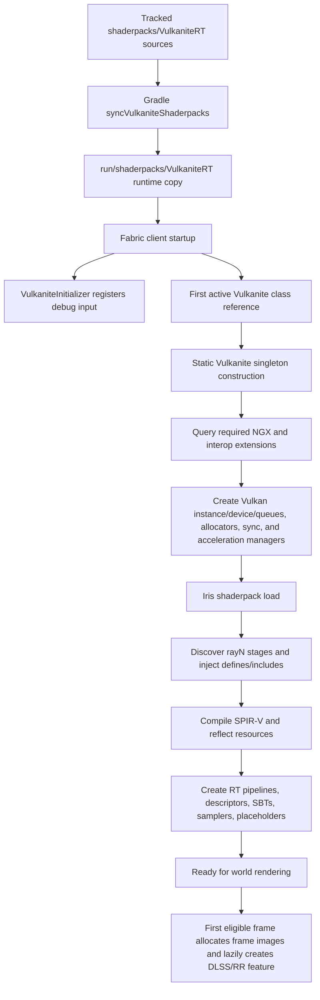
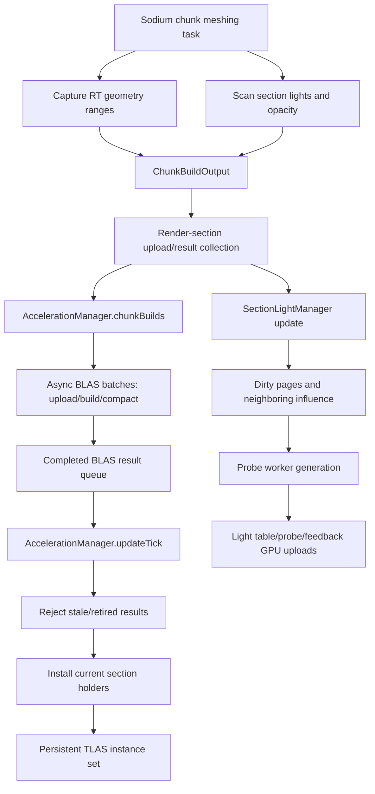
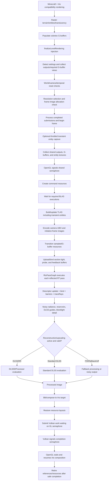
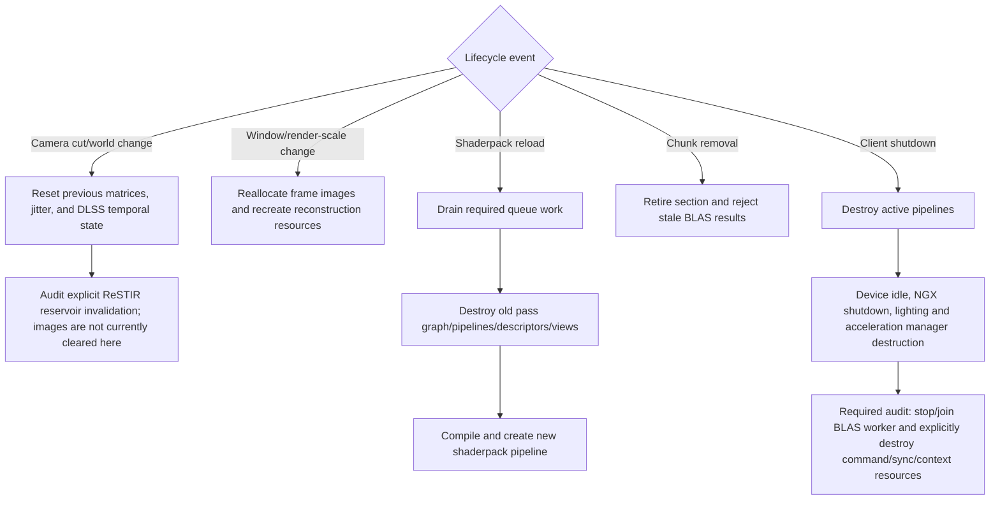

# Agent Prompt

Optimize the complete Vulkanite lifecycle, not only the ray-generation shader. Follow work from project/shaderpack preparation and Vulkan startup through Sodium/Iris capture, geometry and lighting extraction, asynchronous BLAS work, entity capture, TLAS construction, OpenGL/Vulkan interop, descriptor and command encoding, all ray-tracing shader stages, temporal reconstruction/upscaling, final composition, reloads, world changes, memory retirement, and shutdown.

Use evidence-driven, reversible changes. Preserve rendering correctness, compatibility, synchronization, descriptor/resource contracts, DLSS/Ray Reconstruction guide validity, temporal stability, and safe resource lifetimes. Do not report lower image quality as an algorithmic optimization. Inspect the existing dirty worktree before every change and preserve work that was already present.

Use this document as the shared source of truth. Take one part at a time, check what previous agents completed, inspect their source/diff evidence, and update the checklist as work progresses. When a part finishes, check only verified items, update its status, add changed files and user observations to the evidence ledger, record rejected experiments, and replace the latest handoff with exact information for the next agent. Then report what was done, what the user observed, what remains, and the next recommended part.

# Objective

Improve end-to-end frame time, RT GPU time, CPU overhead, chunk-update stutter, memory use, load/reload latency, and shutdown reliability without moving cost to another stage or introducing visual and lifetime regressions.

## Current working mode - manual flow review

This plan is in manual-review mode until the user explicitly changes it.

- Do not create new benchmark worlds, scripted test scenes, automated capture harnesses, or reference-image test suites.
- Do not run benchmark/test captures or automated A/B tests unless the user explicitly asks for them.
- Inspect the lifecycle, source flow, logs, configuration, and diffs manually, then look for one reversible improvement at a time.
- Treat visual quality and "better or worse" judgments as user-owned observations. Record them only when the user provides them.
- It is acceptable to document manual checkpoints and exact places for the user to look, but do not declare a rendering improvement from an automated test result.
- If an older checklist item says "test", "run", "capture", or "baseline", interpret it in this mode as "prepare or record a manual user-check path" unless the user explicitly re-enables automated testing.

A successful result must distinguish:

- Steady-state CPU frame time
- Steady-state GPU frame time
- RT pass GPU time
- Chunk rebuild and BLAS/TLAS update spikes
- Interop and queue wait time
- Reconstruction/upscaling time
- Allocation count, memory footprint, and resource churn
- Startup, shader reload, resize, world switch, and shutdown behavior

# End-to-End Flow

## Build and startup



`VulkaniteInitializer` is not the Vulkan bootstrap: it currently registers only
`DebugKeyHandler`. The Vulkan context is created by static `Vulkanite.INSTANCE`
construction when the class is first actively referenced. NGX-required extension
discovery happens before device creation, while DLSS/RR feature creation happens
later through `DLSSDProcessor` when an eligible frame and its dimensions exist.

## Persistent world-data preparation



## Per-frame render flow



## Reset, reload, resize, and shutdown



# Source and Ownership Map

Edit tracked sources, not generated/runtime copies.

| Flow area | Main owners |
|---|---|
| Build/runtime shaderpack sync | `build.gradle`, `shaderpacks/VulkaniteRT`, `run/shaderpacks/VulkaniteRT` |
| Client/Vulkan initialization | `VulkaniteInitializer` (debug input only), static `Vulkanite.INSTANCE`, `Vulkanite`, `VInitializer`, `VContext`, `DeviceProperties` |
| Iris integration and G-buffer handoff | `MixinIrisRenderingPipeline`, Iris texture/render-target mixins |
| Shader discovery/compilation/reflection | `MixinProgramSet`, `RaytracingShaderSource`, `RaytracingShaderSet`, `ShaderCompiler`, `ShaderReflection`, `SpirvParser` |
| RT pipeline/pass execution | `VulkanPipeline`, `RtxPassGraph`, `RtPipeline`, `RenderPassExecutor`, `RaytracePipelineBuilder` |
| Chunk geometry capture | `MixinChunkRenderRebuildTask`, `SodiumResultAdapter`, `SodiumGeometry*` |
| Chunk light extraction | `SectionLightExtractor`, `SectionLightTable`, `SectionLightManager`, `SectionDirectionalProbePage` |
| BLAS work | `AccelerationManager`, `AccelerationBlasBuilder`, `acceleration/blas/*` |
| TLAS and instances | `AccelerationTLASManager`, `TLASSectionManager`, `TLASInstanceBuffer`, `TlasPointerArena` |
| Entity/transient geometry | `EntityCapture`, `EntityBlasBuilder`, entity/particle capture mixins |
| Shared GL/Vulkan images and sync | `HybridInterop`, `SharedImageViewTracker`, `VGImage`, `VGSemaphore`, `SyncManager` |
| Command submission and barriers | `CommandManager`, `CommandSubmissionRequest`, `VCommandPool`, `VCmdBuff` |
| Images, buffers, allocation | `RtxFrameImages`, `MemoryManager`, allocators, `UploadStream`, `VRef`, `VRegistry` |
| Ray-tracing shaders | `shaderpacks/VulkaniteRT/shaders/ray0*`, `lib/rt/*`, `lib/pbr/*` |
| Resolution and temporal state | `ResolutionScaleManager`, `JitterManager`, `UBODataEncoder` |
| DLSS/RR/FSR | `DLSSDProcessor`, `DLSSBridge`, `GBufferDLSSDAdapter`, `DLSSDParameterValidator`, `FSRUpscaler` |
| Configuration/UI | `VulkaniteConfig`, `DLSSConfig`, `ShaderpackSettingsHandler`, Sodium option classes |
| Destruction/reload | `VulkanPipeline.destroy`, `Vulkanite.destroy`, resource mixins, `MixinMinecraftClient` |

`shaderpacks/VulkaniteRT` is the active tracked shaderpack source. `run/shaderpacks/VulkaniteRT` is generated by Gradle. The smaller shader under `src/main/resources/assets/vulkanite/shaders/raytracing` is not assumed to be equivalent.

## Verified implementation notes and open lifecycle gaps

Verified against the dirty working tree on 2026-06-20:

- `MixinIrisRenderingPipeline.finalizeLevelRendering` invokes the RTX overlay at
  `HEAD`, after Iris has populated the compatibility G-buffers expected by this
  integration.
- Each eligible frame currently creates two shared binary semaphores, one
  transient command pool, and one command buffer. `CommandManager.Queue` retains
  the submitted command buffer, and the command buffer retains semaphore/resource
  references until the queue timeline reports completion.
- `AccelerationManager.updateTick` accepts only completed async BLAS batches,
  rejects retired/superseded section results, and limits installation to 32
  sections per render tick. `buildTLAS` then queues the required async-BLAS
  timeline dependencies on queue 0; it does not perform a host wait for each BLAS.
- World identity changes and camera jumps over 10 blocks reset previous matrices,
  jitter, and DLSS temporal state. They do not explicitly clear or version the two
  ReSTIR reservoir images, so reservoir invalidation remains a correctness audit
  item rather than a verified behavior.
- `syncVulkaniteShaderpacks` deletes and recopies each runtime pack. Because
  `validateVulkaniteShaderpackDrift` depends on that sync task, it verifies the
  generated result, not pre-sync runtime drift. Capture any runtime-only diff
  before invoking either task.
- `MixinMinecraftClient.close` destroys active pipelines before
  `Vulkanite.destroy`, which calls `vkDeviceWaitIdle`, shuts down NGX, and destroys
  lighting/acceleration managers. `AccelerationBlasBuilder` now retains its BLAS
  worker thread, cancels queued-but-not-started BLAS batches on shutdown, lets an
  in-flight batch finish, and joins before releasing builder-owned BLAS resources.
  `Vulkanite.destroy` still does not visibly destroy `VContext`/command/sync/device/
  instance ownership. Treat complete context teardown as unverified Part 15 work.

These notes describe current implementation, not proof that the behavior is
correct. A diagram box or source-code path is not a completed checklist item until
runtime evidence is recorded.

# Rules for Every Part

- Record initial `git status --short`; never reset, clean, or overwrite unrelated changes.
- In manual-review mode, do not create or run tests, benchmark worlds, scripted captures, or automated A/B comparisons unless the user explicitly asks.
- Inspect flow before changing behavior. File size, line count, and intuition are hypotheses, not proof.
- Reason about the complete frame as well as the local stage; a local gain that increases a wait or later pass is not a win.
- Change one attributable cost center at a time and keep it independently reversible.
- When a visual/performance check is needed, provide a manual checkpoint for the user instead of declaring the result yourself.
- Record user-provided observations separately from code-verified or inferred findings.
- Separate CPU encode time from GPU execution time and queue-wait time when inspecting or instrumenting flow.
- Never remove a barrier, wait, flush, reference, or close call without proving the replacement lifetime/synchronization rule.
- Preserve DLSS/RR guide spaces, formats, ranges, jitter conventions, and sky/miss writes.
- Do not silently lower default samples, bounce counts, view distance, render scale, or material features.
- Compile-time permutations may eliminate unused paths, but supported debug and fallback modes must still work.
- Descriptor, UBO, push-constant, SSBO, SBT, cache packing, and image-layout changes require validation of all producers and consumers.
- Label findings as `measured`, `code-verified`, `inferred`, or `target`; do not present an intended lifecycle as implemented behavior.
- In manual-review mode, label user feedback as `user-observed`; do not convert it into an automated pass/fail claim.
- Do not mark a checkbox complete without a command, code inspection, diff, or user-provided reproducible observation in the ledger.

# Part 0 - Define Manual Review Scope and Acceptance Targets

Status: **in progress**

- [x] Record commit, dirty files, OS, CPU, GPU, driver, Java, JVM flags, memory allocation, resolution, and display refresh.
- [x] Record shaderpack, all RT/DLSS/FSR settings, render scale, view distance, entity distance, VSync/FPS cap, and debug mode.
- [x] Create fixed cases for startup, shader reload, resize, world switch, and shutdown.
- [x] Switch the plan to manual-review mode: no new test worlds, scripted scenes, capture harnesses, or automated A/B tests are required.
- [x] Pick the next lifecycle/source-flow area to inspect manually.
- [x] Record the exact user-driven manual checkpoint for each retained change.
- [ ] Record user-provided performance or image-quality observations as `user-observed`, without declaring the result independently.
- [ ] Record CPU/GPU/VRAM/heap/native-memory facts only when they come from existing logs, explicit user-provided data, or a user-requested diagnostic pass.
- [x] Define acceptable image difference and temporal-stability criteria before implementation.
- [ ] Save screenshots/debug guides only when the user provides them or explicitly requests them.

Repository sanity checks, only when explicitly allowed:

```powershell
git status --short
./gradlew syncVulkaniteShaderpacks validateVulkaniteShaderpackDrift
```

The Gradle command mutates `run/shaderpacks` before validating it. In
manual-review mode, do not run it unless the user explicitly asks. If runtime
drift matters, compare or archive `run/shaderpacks/VulkaniteRT` first.

Exit condition: another agent can continue the manual flow review, make one reversible change at a time, and hand the user an exact place to judge whether it looks or feels better.

# Part 1 - End-to-End Instrumentation and Cost Map

Status: **not started**

- [ ] Add or verify named CPU timers around every major box in the per-frame diagram.
- [ ] Add/verify Vulkan timestamps for BLAS, TLAS, RT passes, reconstruction/upscale, copy/blit, and meaningful barriers.
- [ ] Record timestamp period/valid bits, query reset/readback policy, queue identity, and the submission timeline value associated with every GPU interval; never subtract timestamps from unrelated queues as if they shared one clock domain.
- [ ] If the user explicitly re-enables instrumentation, estimate or measure timer overhead; otherwise keep this as a source-flow review item.
- [ ] Record host wait time, queue wait dependencies, GL semaphore signal/wait duration, and pending-submission retirement.
- [ ] Record per-frame allocation counts and bytes for command pools/buffers, semaphores, descriptors, views, images, uploads, and temporary collections.
- [ ] Record counts for chunks rebuilt, geometry ranges/bytes, lights scanned, BLAS queued/completed/installed/stale, TLAS instances, captured entities, and probe pages.
- [ ] Measure startup, shader compile/reflection/pipeline build, shader reload, resize reallocation, and shutdown latency.
- [ ] Produce a ranked cost table and choose the top two steady-state and top two stutter costs.
- [ ] If the user explicitly re-enables captures, export a per-frame row containing frame/capture ID, scene, dimensions, settings hash, CPU stages, GPU stages, wait durations, work counts, allocations, and queue depths so spikes can be correlated instead of compared as separate summaries.

Exit condition: optimization order is driven by a complete CPU/GPU/wait/allocation cost map.

# Part 2 - Build, Startup, and Shader Compilation

Status: **not started**

- [ ] Measure Gradle shaderpack sync/drift validation and avoid redundant copying or hashing without weakening correctness.
- [ ] Measure Vulkan instance/device, extension discovery, allocator, queue, and NGX initialization separately.
- [ ] Audit repeated config loads and capability probes during startup and first frame.
- [ ] Measure shader preprocessing, shaderc compilation, SPIR-V reflection, pipeline/SBT construction, and descriptor layout creation per stage.
- [ ] Cache only artifacts whose key includes all source, include, define, capability, shaderpack, and driver-relevant inputs.
- [ ] Confirm cache invalidation and shader error diagnostics remain correct.
- [ ] Verify startup with DLSS unsupported, disabled, enabled, and native library failure.

Exit condition: startup/reload becomes faster or more predictable without stale shaders or capability mistakes.

# Part 3 - Sodium Chunk Capture and Light Extraction

Status: **not started**

- [ ] Profile `MixinChunkRenderRebuildTask` geometry capture and `SectionLightExtractor.scan` independently.
- [ ] Check duplicated traversal of chunk blocks/meshes and share immutable results only when ownership permits.
- [ ] Avoid RT extraction when no compatible RT shaderpack/path is active.
- [ ] Ensure cancelled or superseded chunk builds stop avoidable extra work and release data safely.
- [ ] Bound allocations/copies in `SodiumResultAdapter`, geometry records, and section-light tables.
- [ ] Provide manual checkpoints for initial world load, fast flight, mass block updates, dimension switch, and shaderpack disable.

Exit condition: chunk worker overhead and P95/P99 traversal spikes improve with identical geometry/light results.

# Part 4 - BLAS Upload, Build, Compaction, and Installation

Status: **not started**

- [ ] Profile enqueue delay, CPU batching, upload, GPU build, query/readback, compaction, queue waits, and install delay.
- [ ] Audit `BLASBuildPolicy`, batch sizing, worker scheduling, scratch reuse, and memory pool fragmentation.
- [ ] Reject stale/retired/superseded builds as early as safely possible.
- [ ] Confirm the 32-section install budget balances latency against frame spikes; tune only from queue-depth evidence.
- [ ] Reduce unnecessary host waits and queue idle operations while preserving dependency ordering.
- [ ] Verify geometry buffers and acceleration structures retire only after their last GPU use.
- [ ] Provide manual checkpoints for sustained chunk churn and shutdown with pending batches.

Exit condition: BLAS throughput/latency or update stutter improves without stale geometry, leaks, or device loss.

# Part 5 - Entity and Transient Geometry Capture

Status: **not started**

- [ ] Profile entity enumeration, mesh capture, texture sharing, vertex/index upload, entity BLAS creation, and transient retirement.
- [ ] Verify adaptive capture throttling responds to measured load without visible popping beyond accepted criteria.
- [ ] Avoid recapturing unchanged eligible entities when identity, pose, material, and texture state make reuse safe.
- [ ] Bound entity/particle capture work and memory under dense scenes.
- [ ] Audit atlas/custom texture reference churn and duplicate interop resources.
- [ ] Provide manual checkpoints for animated entities, particles, teleport, world unload, shader reload, and disabled entity capture.

Exit condition: entity-heavy frame time/stutter improves without stale transforms, missing geometry, or unsafe texture lifetimes.

# Part 6 - TLAS Instances, Build, and Reuse

Status: **not started**

- [ ] Profile CPU instance encoding, pointer arena/instance-buffer updates, GPU TLAS build, scratch allocation, and queued BLAS waits.
- [ ] Separate persistent section instances from transient entity instances in measurements.
- [ ] Verify build-vs-update mode choices and flags using actual topology-change patterns.
- [ ] Reuse rotating TLAS/scratch slots only when prior submissions are complete.
- [ ] Audit instance masks, custom indices, SBT offsets, transforms, and stale section removal.
- [ ] Provide manual checkpoints for static camera, moving entities, chunk churn, mass unload, and world switch.

Exit condition: TLAS CPU/GPU time or wait time improves with identical visible instances and safe slot reuse.

# Part 7 - Per-Frame Java Orchestration and Allocation Churn

Status: **not started**

- [ ] Profile `MixinIrisRenderingPipeline.runRayTracing` and `VulkanPipeline.renderPostShadows` by substage.
- [ ] Audit repeated `DLSSConfig.load`, shaderpack detection, requirement checks, image/view wrapping, lists/arrays, and temporary reference objects.
- [ ] Measure command-pool/buffer and shared binary-semaphore creation per frame before considering reuse.
- [ ] Reuse frame-local objects only with explicit frame-in-flight and completion rules.
- [ ] Check UBO allocation/map/unmap/flush behavior and persistent mapping opportunities supported by the allocator.
- [ ] Ensure exceptions and device-loss paths still close every acquired reference.

Exit condition: CPU frame time/allocation pressure improves without cross-frame aliasing or resource leaks.

# Part 8 - OpenGL/Vulkan Interop and Synchronization

Status: **not started**

- [ ] Measure `glSignal`, Vulkan submit wait, Vulkan completion signal, and `glWait` independently.
- [ ] Audit the exact image set and layouts returned by `HybridInterop.collect`; avoid synchronizing unused resources.
- [ ] Verify entity textures, G-buffers, outputs, atlases, and custom textures have correct ownership and visibility.
- [ ] Identify queue bubbles caused by early/late signal placement or overbroad stage/access masks.
- [ ] Consolidate transitions/barriers only when equivalent resource hazards are proven.
- [ ] Provide manual checkpoints for NVIDIA/other supported vendors, resize, minimize/restore, shader reload, and exception recovery.

Exit condition: interop wait/bubble time improves with validation-clean ownership and no flicker/corruption.

# Part 9 - Frame Images, Descriptors, Barriers, and Pass Graph

Status: **not started**

- [ ] Profile `RtxFrameImages.ensureAllocated`, layout initialization, descriptor allocation/update, set binding, and pass-to-pass barriers.
- [ ] Confirm frame images reallocate only when render/output dimensions or required formats actually change.
- [ ] Cache descriptor sets only when every bound resource lifetime and dynamic offset remains valid.
- [ ] Make `RtxPassGraph` resource reads/writes explicit enough to derive minimal correct transitions.
- [ ] Avoid recreating image views for stable resources when `SharedImageViewTracker` can safely retain them.
- [ ] Audit fallback/empty descriptor sets and optional bindings for needless work and null-resource safety.
- [ ] Validate multi-pass shaderpacks, legacy binding layouts, custom textures, and Iris SSBOs.

Exit condition: encoding/descriptor/barrier overhead decreases with all reflected layouts still supported.

# Part 10 - Ray-Tracing Shaders and GPU Traversal

Status: **not started**

- [ ] Profile raygen, closest-hit, any-hit, miss, and each pass independently where tooling permits.
- [ ] Record invocation/ray counts for primary, sun shadow, indirect, reflection/refraction, blocklight, section-light visibility, probe fill, and volumetric work.
- [ ] Inspect register pressure, occupancy, divergence, memory transactions, and traversal cost rather than source size alone.
- [ ] Remove disabled/debug-only work from release permutations while retaining supported modes.
- [ ] Add early exits before expensive ray queries, grid walks, gathers, or BRDF paths whose contribution is provably zero.
- [ ] Audit ray flags, cull masks, distance bounds, SBT selection, alpha handling, and duplicated traversal.
- [ ] Hoist invariant calculations and repeated buffer/image reads where generated code confirms duplication.
- [ ] Preserve sky/miss sidecar writes and all DLSS/RR guide contracts.
- [ ] Compare still quality and temporal behavior during motion.

High-cost candidates to measure, not assume:

- `INDIRECT_BOUNCES=3` in the current tracked/default shader settings
- `BLOCKLIGHT_SAMPLES=8` when `RT_BLOCKLIGHT_PROBES` is active
- `SECTION_LIGHT_SPARSE_RT_SAMPLES=8` only on the conditional sparse/cached section-light paths that use it
- Section-grid search radius 2, potentially a `5 x 5 x 5` neighborhood
- Six-face trilinear probe gathers, documented as up to 48 reads
- Reflection/refraction continuation rays
- `VOLUMETRIC_SAMPLES=8` in the Balanced profile, plus conditional visibility rays; other profiles select 4/12/24
- Large live state/control flow in `ray0.rgen`

Exit condition: GPU/RT time improves outside variance in multiple scenes without unacceptable noise or material/lighting regressions.

# Part 11 - Section Lights, Probe Workers, GPU Cache, and Feedback

Status: **not started**

- [ ] Profile CPU extraction/update, neighbor invalidation, worker jobs, sorting, directory generation, uploads, feedback clearing, and shader sampling.
- [ ] Record active lights/pages, dirty backlog, build latency, eviction, directory/hash probe failures, cache hits, atomics, and uploaded bytes.
- [ ] Avoid rebuilding/dirtying unchanged pages and repeated neighbor cascades.
- [ ] Audit worker count, scratch buffers, synchronization, slot eviction policy, and world-change cleanup.
- [ ] Reduce GPU cache population stampedes and redundant exact-surface visibility work without breaking ready/in-flight state transitions.
- [ ] Change trilinear/confidence/source-shape work only after bandwidth/cost evidence.
- [ ] Provide manual checkpoints for walls/leaks, page boundaries, multiple emitters, chunk loading, darkness, and cache warm-up motion.

Exit condition: CPU/GPU probe cost or warm-up improves without light leaks, missing lights, square halos, or stale pages.

# Part 12 - Resolution, DLSS/RR, FSR, and Final Composition

Status: **not started**

- [ ] Profile resolution selection, resource prepare/recreate, parameter validation, native evaluation, transitions, and final blit separately.
- [ ] Verify render/output dimensions, alignment, formats, jitter, motion scale, exposure, reset flags, matrices, and delta time.
- [ ] Avoid repeated native/config initialization and resource recreation when dimensions/mode are stable.
- [ ] Audit copies/blits that can be avoided through safe direct output binding.
- [ ] Validate fallback after DLSS/RR failure and temporal reset when mode, scale, world, or camera continuity changes.
- [ ] Provide manual checkpoints for DLSS RR, standard DLSS, FSR, disabled/noisy output, DLAA/full resolution, and unsupported hardware.
- [ ] Inspect every guide debug view for NaN/Inf, invalid ranges, edges, disocclusion, and camera motion.

Exit condition: reconstruction/composition time or resource churn improves without ghosting, boundary artifacts, exposure shifts, or broken fallback.

# Part 13 - Memory, Pools, Uploads, and Resource Lifetimes

Status: **not started**

- [ ] Record heap, native, device-local, host-visible, shared-image, AS, descriptor, scratch, and upload memory over time.
- [ ] Profile allocation/free counts, pool growth, fragmentation, mapped flushes, staging copies, and delayed retirement.
- [ ] Audit `VRef` ownership at every acquire/addRef/close boundary and all exception paths.
- [ ] Right-size reusable buffers with measured high-water marks and bounded shrink/eviction behavior.
- [ ] Verify frame-in-flight resources are never recycled before queue completion.
- [ ] Provide manual checkpoints for long sessions with chunk churn, repeated resize, shader reload, dimension switch, and DLSS mode switching.

Exit condition: memory footprint/churn improves or remains bounded with no leaks, use-after-free, or premature retirement.

# Part 14 - Configuration, Reload, Resize, World Change, and Recovery

Status: **not started**

- [ ] Measure and deduplicate config file reads, shaderpack detection, option propagation, and pipeline rebuild triggers.
- [ ] Ensure a setting changes only the minimum resources/pipelines/history that actually depend on it.
- [ ] Validate temporal reset ownership across `UBODataEncoder`, `JitterManager`, reservoirs, and `DLSSDProcessor`.
- [ ] Audit shader reload queue-idle scope and replace only where narrower synchronization is proven safe.
- [ ] Verify resize/minimize, camera teleport, dimension/world switch, device loss, native DLSS failure, and shader compilation failure.
- [ ] Confirm fallback leaves Iris/Minecraft usable and does not leak the old pipeline.

Exit condition: lifecycle transitions are faster and deterministic with no stale history or partially destroyed state.

# Part 15 - Shutdown and Destruction

Status: **in progress**

- [ ] Map destruction order for active pipelines, DLSS/NGX, probe workers, pending BLAS jobs, TLAS/BLAS, command queues, images/buffers/views, semaphores, and Vulkan context.
- [ ] Ensure worker producers stop before consumers/allocators are destroyed.
- [x] Retain a BLAS worker thread handle, stop accepting work, define drain-versus-cancel behavior, wake the worker, and join it before closing its query pool, decode pipeline, AS pool, queues, or device.
- [ ] Shut down the probe executor before freeing state its running tasks can publish into; verify interruption and late-result handling instead of relying on `shutdownNow` alone.
- [ ] Drain or fail pending/in-flight `CommandSubmissionRequest` futures and release their retained command-buffer/semaphore references on every shutdown and device-loss path.
- [ ] Drain only queues/submissions needed for safe retirement; retain full idle waits if narrower proof is absent.
- [ ] Identify the unique owner that destroys `CommandManager`, `SyncManager`, allocators, Vulkan device, debug messenger, surface, and instance; add explicit idempotent teardown where no owner exists.
- [ ] Verify idempotent cleanup after partial initialization and device loss.
- [x] Provide manual checkpoints for repeated launch/quit, world join/leave, shader reload then quit, and quit during heavy chunk work.
- [ ] Check logs and native memory for late work, double closes, leaked resources, and hangs.

Manual checkpoint for the retained BLAS shutdown change: start the existing
`ray-tracing-test-place` world, fly fast enough to trigger chunk/BLAS work, then
quit while chunks are still loading. Repeat with a warmed static scene, world
join/leave, and shader reload then quit. User-owned observations to record:
whether shutdown hangs, whether logs contain `[BLAS Builder] Worker stopped during
shutdown`, and whether there are late BLAS errors or resource double-close warnings.

Exit condition: shutdown is bounded, clean, and safe under normal and failure paths.

# Part 16 - Quality Scaling and Final Integration

Status: **not started**

- [ ] Keep the original visual target as the no-quality-loss reference.
- [ ] If requested, define explicit Low/Medium/High/Ultra budgets separately from algorithmic optimizations.
- [ ] Ask the user to manually review the final combined changes in the flows they care about.
- [ ] Record user-observed performance, smoothness, lighting, material, stability, startup/reload, resize, and shutdown results without declaring them independently.
- [ ] Compile all active RT stages and relevant feature permutations.
- [ ] Run `./gradlew validateVulkaniteShaderpackDrift` only if the user explicitly allows validation commands.
- [ ] Inspect the complete diff for generated-file edits, unrelated changes, stale comments, descriptor mismatches, unsafe indices, and unbounded loops.
- [ ] Record every rejected experiment and every user-confirmed retained win.

Completion target: user-confirmed improvement or clearly documented manual-flow cleanup, no critical visual/synchronization/lifetime regression, and enough source/diff context that another agent can continue.

# Status Board

| Part | Owner | State | Result or blocker |
|---|---|---|---|
| 0 - Manual scope/targets | Codex | in progress | Machine/config snapshot, lifecycle cases, acceptance thresholds, manual-review mode, next area, and retained-change manual checkpoint recorded. |
| 1 - Instrumentation/cost map | unassigned | not started | - |
| 2 - Build/startup/shaders | unassigned | not started | - |
| 3 - Chunk capture/lights | unassigned | not started | - |
| 4 - BLAS | unassigned | not started | - |
| 5 - Entity capture | unassigned | not started | - |
| 6 - TLAS | unassigned | not started | - |
| 7 - Frame orchestration | unassigned | not started | - |
| 8 - GL/Vulkan interop | unassigned | not started | - |
| 9 - Images/descriptors/pass graph | unassigned | not started | - |
| 10 - RT shaders/traversal | unassigned | not started | - |
| 11 - Section lights/probes | unassigned | not started | - |
| 12 - DLSS/RR/FSR/composition | unassigned | not started | - |
| 13 - Memory/lifetimes | unassigned | not started | - |
| 14 - Reload/resize/recovery | unassigned | not started | - |
| 15 - Shutdown | Codex | in progress | BLAS worker stop/join and builder-owned BLAS resource cleanup implemented; probe executor, pending command futures, and VContext teardown remain open. |
| 16 - Final integration | unassigned | not started | - |

Allowed states: `not started`, `in progress`, `blocked`, `complete`, `rejected`.

# Evidence Ledger

In manual-review mode, use this ledger for code-verified findings, retained diffs, and user-observed outcomes. Do not add automated benchmark/test results unless the user explicitly asks for the run.

| Date | Agent | Part | Build/scene/settings | Metric | Before | After | Delta | Correctness checks | Decision |
|---|---|---:|---|---|---:|---:|---:|---|---|
| 2026-06-20 | Codex | 0 | `979a61c`, current dirty tree | Runtime shaderpack mismatched files | 0 | 0 | 0 | pre-sync `git diff --no-index`; Gradle drift validation passed | Baseline sanity retained |
| 2026-06-20 | Codex | 0 | runtime options | Minecraft FPS cap | 60 FPS | 260 FPS | +200 FPS headroom | VSync remains off; Vulkanite internal pacer code-verified disabled | Retained for uncapped baseline only |
| 2026-06-20 | Codex | 15 | current dirty tree, manual review | BLAS shutdown ownership | worker had no retained stop/join path | cooperative cancel, wake, join, and owned-resource cleanup path | code-verified | source inspection; `git diff --check`; `./gradlew classes` | Retained pending user shutdown observation |
| - | - | - | - | - | - | - | - | - | - |

# Changed-File Ledger

| Date | Agent | Part | Files | Purpose | Validation |
|---|---|---:|---|---|---|
| 2026-06-20 | document setup | planning | `plans/OPTIMIZATION_AGENT_FLOW.md` | Define complete optimization/handoff flow | `git diff --check` |
| 2026-06-20 | Codex verification | planning | `plans/OPTIMIZATION_AGENT_FLOW.md` | Correct startup/reset/shutdown claims and add measurement/lifetime detail | source audit; no-index whitespace check; Gradle drift validation |
| 2026-06-20 | Codex | 0 | `plans/OPTIMIZATION_AGENT_FLOW.md`, `plans/optimization-baseline/*` | Record Part 0 environment/config evidence and reproducible capture contract | `classes`; shaderpack sync/drift validation; `git diff --check` |
| 2026-06-20 | Codex | 0 | `scripts/optimization/Capture-VulkaniteBaseline.ps1`, `scripts/optimization/Summarize-VulkaniteBaseline.ps1`, runtime `run/options.txt` | Automate config/telemetry/frame capture and remove the 60 FPS measurement cap | PowerShell syntax audit; runtime option/hash check; PresentMon empty-output behavior reproduced |
| 2026-06-20 | Codex | 0 | `plans/OPTIMIZATION_AGENT_FLOW.md` | Switch the plan to manual-flow review and block new tests/captures unless explicitly requested | Markdown-only patch; no tests run by request |
| 2026-06-20 | Codex | 15 | `src/main/java/me/cortex/vulkanite/acceleration/AccelerationBlasBuilder.java`, `src/main/java/me/cortex/vulkanite/acceleration/AccelerationManager.java`, `src/main/java/me/cortex/vulkanite/acceleration/blas/BLASBuildWorker.java`, `src/main/java/me/cortex/vulkanite/acceleration/blas/BLASBatchProcessor.java`, `src/main/java/me/cortex/vulkanite/acceleration/blas/BLASCompactor.java`, `src/main/java/me/cortex/vulkanite/acceleration/blas/BLASMemoryManager.java`, `src/main/java/me/cortex/vulkanite/lib/memory/AccelerationStructurePool.java`, `src/main/java/me/cortex/vulkanite/lib/memory/PoolLinearAllocator.java`, `src/main/java/me/cortex/vulkanite/lib/pipeline/VComputePipeline.java`, `plans/OPTIMIZATION_AGENT_FLOW.md` | Stop/join BLAS worker on shutdown, cancel queued BLAS jobs, and release builder-owned BLAS resources after the worker stops | `git diff --check`; `./gradlew classes` |

# Rejected Experiments

| Date | Agent | Part | Experiment | Why rejected | Evidence | Revisit condition |
|---|---|---:|---|---|---|---|
| 2026-06-20 | Codex | 0 | Creating/running automated benchmark worlds, scripted scenes, capture harnesses, or A/B tests | User wants manual flow review and will tell the IA whether a change is better or worse | User directive in chat | Only if the user explicitly re-enables automated testing |

# Agent Completion Protocol

Before ending a part, the agent must:

1. Re-read the part and check only items supported by evidence.
2. Update its Status line and the Status Board.
3. Add every retained/reverted change and every user-observed result to the Evidence Ledger.
4. Add retained edits to the Changed-File Ledger.
5. Add failed ideas to Rejected Experiments.
6. Record commands/checks, source observations, user observations, correctness risks, and limitations.
7. Replace `Latest handoff` below with current facts.
8. Tell the user what completed, what improved, what remains, and the exact next action.

# Next-Agent Handoff

## Latest handoff

- Agent/date: Codex / 2026-06-20
- Part/status: Part 15 / in progress
- Completed checklist items: BLAS builder now retains the worker thread, stops accepting new jobs on destroy, cancels queued-but-not-started BLAS batches, wakes the worker without interrupting in-flight submission waits, drains pending render-thread submissions while joining, and releases builder-owned BLAS query/pipeline/AS-pool resources only after the worker stops. Manual shutdown checkpoints are recorded above.
- Pre-existing dirty files that overlapped this part: the acceleration/BLAS, command, rendering, and plan files were already dirty before this pass; treat earlier BLAS batching, compaction, timestamp, and stale-result logic as pre-existing unless isolated by this handoff.
- Files changed by this agent: `AccelerationBlasBuilder.java`, `AccelerationManager.java`, `BLASBuildWorker.java`, `BLASBatchProcessor.java`, `BLASCompactor.java`, `BLASMemoryManager.java`, `AccelerationStructurePool.java`, `PoolLinearAllocator.java`, `VComputePipeline.java`, and `plans/OPTIMIZATION_AGENT_FLOW.md`.
- Commands/checks and results: `git status --short` recorded a broad pre-existing dirty tree; `git diff --check` passed with line-ending warnings only; `./gradlew classes` passed with two existing DLSS deprecation warnings and generic unchecked/deprecated notes. No benchmark worlds, captures, A/B tests, or shaderpack drift validation were run.
- Before/after measurements with sample count: none; this was a lifecycle correctness cleanup, not a performance capture.
- Visual and temporal correctness checks: no rendering path, shader settings, guide formats, or quality settings were changed. User still owns visual/performance observations.
- Synchronization/lifetime checks: code-verified BLAS shutdown order is stop accepting work, request worker shutdown, wake blocked acquire/park paths, process pending submissions while joining, cancel queued jobs, wait queue idle, then close BLAS query pools, decode pipeline, allocator pools, and AS pool. If the worker does not join within `vulkanite.blasShutdownJoinMs` (default 5000 ms), builder-owned resources are deliberately retained rather than closed under a live worker.
- Rejected experiments: automated benchmark worlds, scripted scenes, capture harnesses, and A/B tests remain rejected for the current workflow unless the user explicitly re-enables them.
- Known risks, limitations, or blockers: probe executor shutdown, pending/in-flight `CommandSubmissionRequest` failure/drain semantics, and explicit `VContext`/`CommandManager`/`SyncManager`/device/instance teardown remain open Part 15 items. Runtime shutdown logs have not yet been observed by the user.
- Exact next recommended action: user manually checks repeated launch/quit, world join/leave, shader reload then quit, and quitting during active chunk loading; record whether shutdown hangs and whether logs show `[BLAS Builder] Worker stopped during shutdown` without late BLAS or double-close warnings.

## Required handoff template

```text
Agent/date:
Part and status:
Completed checklist items:
Pre-existing dirty files that overlapped this part:
Files changed by this agent:
Commands/checks and results:
Before/after measurements with sample count:
Visual and temporal correctness checks:
Synchronization/lifetime checks:
Rejected experiments:
Known risks, limitations, or blockers:
Exact next recommended action:
```
