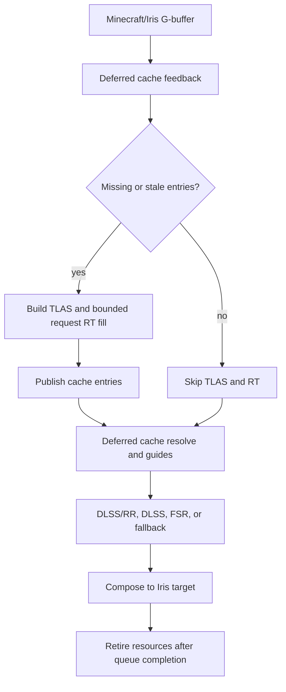

# Vulkanite RTX Trace-Misses, Resolve-Hits Plan

This is the shared source of truth for the current Vulkanite RT flow.

User override on 2026-06-22: RTX traces missing/stale transport, publishes it to
the caches, and stops tracing once the visible working set is valid. Cache-hit
frames use deferred compute resolve and issue no RT dispatch. Full-frame RT is
retained only as the explicit `full_rt_reference` comparison mode. This latest
instruction supersedes the earlier 2026-06-22 full-frame-every-frame override.

## Objective

Make the live renderer cache-first and bounded:

1. Classify visible cache hits/misses from the deferred G-buffer without RT.
2. Dispatch at most 256 request invocations only while missing/stale entries
   exist; each invocation fills section, diffuse, reflection, or refraction data.
3. Resolve the full visible frame and DLSS/RR guides from resident caches in
   compute, including immediately after a fill dispatch.
4. Skip TLAS construction and `traceRays` completely when the working set hits.
5. Keep explicit cache validity, invalidation, fallback, and retry rules.

Success means RTX is validation/cache-fill work, not a permanent per-frame tax.

## Working Mode

Manual review remains active until the user explicitly changes it.

- Do not create new benchmark worlds, scripted scenes, automated capture
  harnesses, or reference-image suites.
- Do not run benchmark captures or automated A/B tests unless the user asks.
- Inspect source flow, diffs, logs, and configuration manually.
- Treat visual quality and "better or worse" as user-owned observations.
- Mark checklist items complete only with source inspection, commands, diffs, or
  user-provided observations.
- Label findings as `code-verified`, `inferred`, `target`, `measured`, or
  `user-observed`.

## Research Anchors

Use these as design direction, not as proof that Vulkanite already behaves this
way.

- NVIDIA RTXGI / SHaRC / NRC:
  https://github.com/NVIDIA-RTX/RTXGI
  Key idea: cache outgoing radiance in world space and replace much of path
  tracing with a hit evaluation plus cache lookup.
- RTXGI-DDGI:
  https://github.com/NVIDIAGameWorks/RTXGI-DDGI/blob/main/docs/Algorithms.md
  Key idea: maintain irradiance and distance probe data with fast ray-traced
  updates, then shade from probes.
- Kajiya GI overview:
  https://github.com/EmbarkStudios/kajiya/blob/main/docs/gi-overview.md
  Key idea: use an output-sensitive irradiance cache; queries drive where cache
  entries are allocated and refreshed.
- ReSTIR GI:
  https://research.nvidia.com/publication/2021-06_restir-gi-path-resampling-real-time-path-tracing
  Key idea: reuse paths across pixels and frames when rays still need to be
  traced.
- Real-time Neural Radiance Caching:
  https://research.nvidia.com/publication/2021-06_real-time-neural-radiance-caching-path-tracing
  Key idea: learn a radiance cache while rendering. Treat as future work unless
  the user explicitly wants neural-cache complexity.
- Photonics (Minecraft mod and source):
  https://modrinth.com/mod/photonics
  https://github.com/Redi2Go/PhotonicEngine
  Key idea in the Minecraft 1.20.1 `0.2.5` implementation: defer lighting from
  surface buffers, spatially bin block lights, progressively finish their
  visibility, and reuse indirect light through temporal and world-surface caches.
- Minecraft PTGI:
  https://github.com/MahoganyTown/Minecraft-PTGI
  Useful comparison for path-traced GI plus SVGF/TAA, but not the main path to
  cache-hit steady state.
- Rethinking Voxels:
  https://github.com/gri573/rethinking-voxels
  Useful Minecraft-specific comparison for voxelization, ray-tested occlusion,
  and cheaper colored block lighting.

### Photonics mod deferred-lighting investigation (2026-06-22)

The relevant project is Redi2Go's Photonics mod. The exact Minecraft 1.20.1
`0.2.5` jar and its shaders were inspected (`code-verified` for Photonics;
`inferred` when mapped to Vulkanite):

- Photonics lights deferred surface data rather than making local lighting part
  of a monolithic final-color pass. Its history validation searches a 5x5
  neighborhood and requires a close world position plus nearly identical normal.
- Block lights are stored in 8-block spatial bins. A surface evaluates at most
  20 unfinished local lights per frame and carries a cursor in temporal history,
  so completed light work can be reused instead of starting from light zero.
- Indirect light uses a distance-quantized world-surface key containing position
  and axis-normal orientation. A small open-addressed hash cache atomically
  accumulates samples; resolve gathers compatible tangent-plane entries and
  avoids publishing cache entries on block edges to reduce cross-surface leaks.
- Visibility is software voxel traced through hierarchical occupancy, including
  sub-block voxel models. This is a useful alternative for stable block-light
  occlusion when hardware RT would be disproportionately expensive.
- This release does not implement the requested strict stop rule: temporal data
  receives probabilistic refresh and indirect entries can continue accumulating
  to 2048 samples. Vulkanite must retain explicit versioned completion and
  `NO_RT` after convergence rather than copying that behavior.
- Current Photonics branches add a ReSTIR DI pipeline with temporal reservoirs,
  spatial reuse, accumulation, and denoising. That is newer than the 1.20.1
  release and is relevant only for selecting among many unfinished lights, not
  as justification for tracing valid cache hits.

Decision for Vulkanite: build a separately keyed surface direct-light cache.
Key it by section/cell, quantized surface position and normal, geometry version,
and light-list generation. Store accumulated radiance plus a light cursor or
coverage state. Section light bins identify relevant lights; only unfinished or
invalid light slots may create RTX fill requests. Once coverage is complete and
the versions still match, deferred resolve consumes the entry and the frame stays
`NO_RT`. Use strict surface validation and edge rejection because the previous
coarse probe-face reuse leaked across unrelated surfaces. Evaluate hierarchical
voxel occupancy as the cheaper local-blocklight visibility backend in Part 10;
do not replace Vulkanite's G-buffer with Photonics' full-screen primary software
voxel tracing.

## Current Code-Verified Flow

`cache_on_hit` (and the legacy persisted alias `cache_fill`) now means automatic
trace-misses/resolve-hits orchestration. The asynchronous deferred feedback pass
adds only missing/stale visible entries to a bounded queue. A non-empty batch
selects `CACHE_FILL_ONLY`, builds the TLAS, and dispatches at `batchSize x 1`.
An empty batch selects `NO_RT`, skips TLAS and the RT pass graph, and runs compute
resolve. `full_rt_reference` remains the only render-resolution RT path.

- [VulkanPipeline.java](C:/Users/PCGAMER/Documents/GitHub/vulkanite-1.20.1/src/main/java/me/cortex/vulkanite/client/rendering/VulkanPipeline.java)
  collects misses before the frame decision and calls `passGraph.execute(...)`
  only for `CACHE_FILL_ONLY` or `FULL_RT_REFERENCE`.
- [RtxPassGraph.java](C:/Users/PCGAMER/Documents/GitHub/vulkanite-1.20.1/src/main/java/me/cortex/vulkanite/client/rendering/RtxPassGraph.java:34)
  loops every reflected RT pass.
- [RenderPassExecutor.java](C:/Users/PCGAMER/Documents/GitHub/vulkanite-1.20.1/src/main/java/me/cortex/vulkanite/client/rendering/RenderPassExecutor.java)
  calls `traceRays(batchSize, 1, 1)` for bounded fills.
- [ray0.rgen](C:/Users/PCGAMER/Documents/GitHub/vulkanite-1.20.1/shaderpacks/VulkaniteRT/shaders/ray0.rgen)
  exits immediately after request population when the cache execution mode is
  negative, before full-frame visibility or lighting work.
- [ray0.rgen](C:/Users/PCGAMER/Documents/GitHub/vulkanite-1.20.1/shaderpacks/VulkaniteRT/shaders/ray0.rgen:1638)
  already has section-light probe RT cache read/write machinery, which should be
  treated as a foothold for the cache-first rewrite.
- [CacheResolvePass.java](C:/Users/PCGAMER/Documents/GitHub/vulkanite-1.20.1/src/main/java/me/cortex/vulkanite/client/rendering/CacheResolvePass.java)
  reads diffuse/specular transport caches and writes the visible frame and
  guides without RT.

These are source observations, not performance measurements.

## Active Architecture



The invariant is simple: misses may trace; valid hits never trace.

## Cache Families

Start with explicit families instead of one vague "RT cache".

| Cache | Purpose | Likely backing | Filled by RT? | Read by steady state? |
|---|---|---|---|---|
| Section blocklight probe cache | Colored local block lighting and visibility | Existing `SectionLightManager` buffers and `ray0.rgen` RT cache cells | Yes, bounded | Yes |
| Diffuse radiance cache | Indirect diffuse tail lighting | World-space grid/hash or section/probe pages | Yes | Yes |
| Reflection cache | Specular/env result for stable surfaces | Screen-space history plus world/material keyed cache | Sometimes | Yes |
| Refraction cache | Water/glass/ice/crystal transmission result | Screen-space history plus material/medium keyed cache | Sometimes | Yes |
| Guide cache | DLSS/RR albedo, normal, roughness, depth, motion, hit distance | `RtxFrameImages` or split compute outputs | No RT unless hit distance requires it | Yes |

Do not add a cache without specifying its key, lifetime, invalidation, fallback,
and debug view.

## Invalidation Rules

Every cached value must be invalidated or revalidated by a clear version source.

| Event | Required action |
|---|---|
| Chunk section geometry changed | Invalidate affected section cache entries and neighbor entries that can see through/around the changed section |
| Section light table changed | Invalidate local light/probe/radiance entries and nearby influence region |
| Material atlas or PBR texture changed | Invalidate material-dependent reflection/refraction/radiance entries |
| Entity BLAS changed | Invalidate only dynamic/entity-dependent cache entries, not the whole world cache |
| Camera teleport/world switch | Reset temporal history and require cache revalidation where screen history is trusted |
| Sun/sky/time/weather changed | Either version sky-dependent entries or use a cheap analytic sky term outside the cache |
| Shaderpack/settings changed | Rebuild pipelines and invalidate cache entries whose layout, format, or meaning changed |
| Resolution/render scale changed | Recreate image-sized outputs and preserve only world-space caches that remain valid |
| DLSS/RR mode changed | Reset guide history and verify cache resolve outputs still match guide contracts |

Stale light is a regression. A lower RT count only counts as an optimization when
the cache validity model still explains why the reused value is correct enough.

## Execution Rules

- Full-screen `traceRays(renderWidth, renderHeight, 1)` is allowed only during
  the transition period or when explicitly selected as a debug/reference mode.
- Default steady state should have a path where no RT dispatch occurs if all
  required cache entries are valid.
- Cache-fill work must be budgeted: max entries, max rays, max pages, or max time
  per frame.
- Missing cache data must degrade predictably: previous valid value, local
  fallback, probe fallback, screen-space fallback, or noisy RT debug path.
- Debug views must show cache hit/miss/stale/in-flight/fallback state.
- DLSS/RR guides must remain valid even when RT is skipped.

## Implementation Parts

### Part 0 - Preserve Manual Scope

Status: **in progress**

- [x] Keep manual-review mode active.
- [x] Record that the user wants RT/RTX as validation/cache fill, then off.
- [x] Record source-verified evidence that RT currently runs every eligible frame.
- [x] Record user-provided performance and image-quality observations as
  `user-observed`.
- [ ] Do not run automated captures unless the user explicitly asks.

Exit condition: future agents know the target is cache-hit steady state, not
per-frame full-screen RT.

### Part 1 - Map Current Per-Frame RT Cost and Outputs

Status: **complete**

- [x] Enumerate every output currently produced by `ray0.rgen`: radiance,
  reservoirs, albedo/metallic, specular albedo, normal/roughness, motion,
  linear depth, specular hit depth, first-hit depth, blocklight detail, final
  noisy output, and section-light RT cache buffer writes.
- [x] Separate outputs that require RT from outputs that can come from G-buffer,
  compute, history, or cache resolve.
- [x] Identify which outputs DLSS/RR consumes and their required formats/ranges.
- [x] Record shader branches that trace indirect, reflection, refraction,
  section-light sparse validation, and blocklight probe cache fill.
- [x] Do not add optional counters or logs; user did not approve
  instrumentation.

Part 1 output map (`code-verified`):

| Output | Writer and backing | Current range/meaning | RT dependency | DLSS/RR consumer |
|---|---|---|---|---|
| Current reservoir / sun history, binding 6 | Injected `reservoirImage`, `rgba32f`; `RtxFrameImages` allocates `VK_FORMAT_R32G32B32A32_SFLOAT` | ReSTIR packs `w_sum`, `W`, `m`, sun-disk offset; sun-history path stores world position plus packed visibility/history | ReSTIR and sun-history visibility currently depend on `alphaAwareVisibility` ray queries | Not consumed by NGX; used by current/previous-frame ReSTIR and sun-shadow history |
| Final noisy radiance, binding 12 | `outputImage`, `rgba16f`; `RtxFrameImages.radiance` is `VK_FORMAT_R16G16B16A16_SFLOAT` | Linear HDR color after direct, indirect, local, specular/transmission, volumetric, and color-grade/firefly clamp, before tone map/gamma | Current value includes RT branches; target cache resolve must assemble the same contract without RT on cache-hit frames | DLSS/RR `pInColor`; standard DLSS color input; fallback blit source |
| Motion vectors, binding 13 | `motionVectors`, `rg16f`; `VK_FORMAT_R16G16_SFLOAT` | Pixel-space previous-current vector, clamped to launch size; sky writes zero | G-buffer/camera-derived; no RT required if first-hit position is known | DLSS/RR and standard DLSS motion input; native MV scale is 1.0 x/y |
| Linear depth, binding 14 | `linearDepthImage`, `r16f`; `VK_FORMAT_R16_SFLOAT` | Camera-forward linear depth in scene units; sky writes `10000.0` | G-buffer/depth-derived; no RT required if first hit is known | DLSS/RR and standard DLSS depth input, created as linear depth |
| Previous reservoir, binding 15 | Injected `prevReservoirImage`, `rgba32f` | Previous frame ping-pong image for temporal/spatial reuse | Read-only in `ray0.rgen`; must remain coherent when RT is skipped | Not consumed by NGX |
| Diffuse albedo/metallic, binding 16 | `DiffuseAlbedoMetallic`, `rgba8`; `VK_FORMAT_R8G8B8A8_UNORM` | RGB clamped albedo, A metallic; sky writes zero | G-buffer/material-derived; no RT required when first-hit G-buffer is valid | DLSS/RR diffuse albedo guide |
| Specular albedo, binding 17 | `SpecularAlbedo`, `rgba8`; `VK_FORMAT_R8G8B8A8_UNORM` | RGB F0 clamped 0..1, A 1.0; sky writes zero | G-buffer/material-derived | DLSS/RR specular albedo guide |
| Normal/roughness, binding 18 | `NormalRoughness`, `rgba16f`; `VK_FORMAT_R16G16B16A16_SFLOAT` | Vulkanite's explicit guide contract writes normalized world-space normals encoded from signed `[-1, 1]` to `[0, 1]` in RGB and roughness 0.04..1 in A; sky writes encoded up normal and roughness 1 | G-buffer/material-derived | DLSS/RR normals plus packed roughness; raygen and compute resolve share `encodeDlssNormalGuide(...)` semantics |
| Specular hit depth, binding 19 | `SpecularHitDepth`, `r16f`; `VK_FORMAT_R16_SFLOAT` | First written as linear depth, then overwritten with `specularHitDistanceGuide`; default view distance, reflection miss `10000.0`, refraction uses min reflection/refraction distance | RT-required today only for reflection/refraction hit distance; can be cache/history/fallback-derived | DLSS/RR `pInSpecularHitDistance` |
| First-hit depth, binding 20 | `FirstHitDepth`, `r16f`; `VK_FORMAT_R16_SFLOAT` | Linear first-hit depth; sky writes `10000.0` | G-buffer/depth-derived; primary RT fallback only when G-buffer is invalid | Allocated and bound, but not passed to current Java/native DLSS/RR evaluation |
| Blocklight detail, binding 21 | `blocklightDetailImage`, `rgba16f`; `VK_FORMAT_R16G16B16A16_SFLOAT` | RGB local/emissive lighting detail, A normalized local-light/detail strength; starts at zero per pixel | Current RGB can include RT blocklight and section-light sparse RT; can become cache/table/debug output | No reader found outside raygen/descriptor binding in current tree |
| Section probe RT cache, binding 24 | `SectionLightProbeRtCacheBuffer`, `std430` coherent buffer; Java name is probe feedback buffer | Six packed RGB9E5 radiance faces plus ready/in-flight state and face mask per probe cell | This is a cache-fill output. Existing read/write helpers are the foothold for Part 5 | Not consumed by NGX |

Part 1 shader branch map (`code-verified`):

- Primary hit fallback: `ray0.rgen` samples hybrid G-buffer first and calls
  `traceRayEXT` only when `validHybridSample(...)` fails.
- Visibility helper: `alphaAwareVisibility(...)` uses `rayQueryEXT`; direct sun,
  ReSTIR final visibility, volumetric shadows, indirect-hit shadow checks,
  reflection-hit shadow checks, and section-light sparse validation route through
  it.
- ReSTIR/sun history: injected `restir.glsl` declares current/previous reservoir
  images and writes either ReSTIR reservoirs or sun-shadow history.
- Indirect diffuse: the bounce loop traces up to `INDIRECT_BOUNCES` clamped to
  three bounces, then may cast a shadow visibility query at the bounce hit.
- Reflection: reflective non-refractive surfaces trace up to
  `METAL_MAX_BOUNCES`, update `specularHitDistanceGuide` on the first bounce, and
  may query sun visibility at reflected hits.
- Refraction/transmission: refractive surfaces call `traceSimpleRadiance(...)`
  for reflected and refracted directions, then write the min distance as the
  specular guide.
- RT blocklight: `sampleBlockLightRT(...)` uses `rayQueryEXT` to find emissive
  block surfaces when `RT_BLOCKLIGHT_PROBES` and `BLOCKLIGHT_SAMPLES` allow it.
- Section-light sparse/probe RT: `sampleSectionLightSparseRt(...)` traces
  candidate light visibility; `sampleSectionLightProbeRtCell(...)` fills probe
  faces; cache read/write helpers manage ready/in-flight state. The current
  surface-cache branch calls sparse RT directly; Part 5 should audit whether the
  unused surface claim/complete helpers should gate repeated work.

Exit condition met: a no-RT cache resolve must still write radiance,
motion vectors, linear depth, diffuse/metallic, specular albedo,
normal/roughness, specular hit distance, first-hit depth, reservoir/history when
the ReSTIR or sun-history path is active, blocklight detail if retained, and
valid section-probe cache state or fallback/debug values.

### Part 2 - Split Full RT Pass From Cache Resolve

Status: **complete**

- [x] Design a `CacheResolve` path that can write the same frame outputs without
  calling `traceRays`.
- [x] Decide whether resolve is compute shader, raster fullscreen pass, or a
  minimal raygen with RT disabled by specialization constant.
- [x] Add a temporary debug switch:
  `full_rt_reference`, `cache_fill`, `cache_resolve_only`.
- [x] Ensure the full RT reference path remains available for visual comparison.
- [x] Preserve descriptor layout compatibility or introduce a versioned layout
  migration.

Part 2 implementation notes (`code-verified`):

- `CacheResolvePass` is a compute pass, not a raygen. It dispatches 8x8 compute
  workgroups and never calls `traceRays`.
- `cache_resolve_only` skips TLAS build/entity capture and writes radiance,
  current reservoir clear, motion vectors, linear depth, diffuse/metallic,
  specular albedo, encoded normal/roughness, specular hit depth, first-hit
  depth, and blocklight detail from the hybrid G-buffer plus fallback lighting.
- Part 8 supersedes the transitional `cache_fill` behavior: it now dispatches
  only a bounded request-sized fill and always runs compute resolve afterward.
- `full_rt_reference` keeps the previous full-screen RT path available for
  explicit visual comparison; `cache_fill` is now the default policy.
- The full RT descriptor layout is unchanged. The compute resolve owns a
  separate reflected descriptor layout and pipeline.
- Resolve fallback writes `10000.0` as unknown/miss specular hit distance;
  first-surface linear depth is not reused as a continuation-ray hit guide.
- Resolve presentation is intentionally diagnostic: an empty diffuse/specular
  cache presents flat G-buffer albedo, and an incomplete G-buffer also falls
  back to any valid albedo attachment before using sky. This prevents fallback
  lighting or Iris's compatibility frame from masquerading as a cache result.

Exit condition met: `cache_resolve_only` can compose one frame from resolve
outputs without mandatory full-screen RT. Runtime visual quality remains
user-observed/pending because the resolve path is still fallback lighting, not a
real radiance/reflection/refraction cache hit.

### Part 3 - Build Cache Request Lists

Status: **complete**

- [x] Define request keys for section probe cells, diffuse radiance entries,
  reflection entries, and refraction entries.
- [x] Generate section-probe requests from section dirty queues.
- [x] Generate visible G-buffer pixel requests.
- [x] Generate reflection/refraction surface requests.
- [x] Ingest feedback-buffer requests.
- [x] Deduplicate requests by stable key before dispatch.
- [x] Prioritize visible, high-error, high-luma, and near-camera requests.
- [x] Cap request count per frame and carry backlog across frames.

Part 3 implementation notes (`code-verified`):

- `CacheRequestKey` now defines stable key shapes for section-probe cells,
  diffuse radiance entries, reflection entries, and refraction entries.
- `CacheRequestQueue` deduplicates requests by stable key, merges duplicate
  requests by retaining stronger visibility/error/luma/near-camera priority,
  caps backlog size, and drains sorted batches up to a per-frame budget.
- `SectionLightManager` now tracks dirty section-probe RT request cursors per
  probe page, emits at most the caller's budget of section-probe cell requests
  per frame, and carries un-emitted cells across frames without expanding every
  dirty page into request objects at once.
- `VulkanPipeline` owns the central request queue, collects section-probe
  requests in cache modes, clears pending request state on world changes and
  pipeline destroy, and logs throttled request stats.
- `CacheFeedbackPass` now samples the visible hybrid G-buffer on a coarse,
  bounded grid in `cache_fill` and `cache_resolve_only`, classifies diffuse
  radiance, reflective, and refractive surfaces, writes compact feedback records
  into a three-slot host-visible SSBO ring, and ingests only slots whose queue
  timeline execution has completed, without a blocking same-frame readback.
- Visible G-buffer feedback produces diffuse radiance keys; reflective
  non-refractive surfaces produce reflection keys keyed by world cell, normal,
  roughness/material, and view bucket; water/glass/ice/crystal surfaces produce
  refraction keys keyed by world cell, normal, roughness/material, and medium
  bucket.
- `cache_resolve_only` gathers pending requests but does not drain them as a
  processed batch because no RT-capable fill pass runs in that mode.
- `cache_fill` drains a bounded section-probe batch for the Part 5 fill-request
  buffer while the current shader still uses the transitional full-screen RT
  pass. Other families remain queued until their consumers exist.
- Backlog capacity is reserved per family. Dirty section cursors advance only
  when enqueue added or merged the request, and the current section-probe
  consumer drains only section requests; unimplemented diffuse/reflection/
  refraction consumers no longer cause their requests to be discarded.

Exit condition met: request lists now have stable keys, section-dirty sources,
visible G-buffer sources, reflection/refraction surface sources, asynchronous
feedback ingestion, dedupe, priority, per-frame caps, and backlog carry-over.
Section-probe fill work is request-driven by Part 5; the remaining families and
frame-level RT gating belong to Parts 6-8.

### Part 4 - Version and Invalidate Caches

Status: **complete**

- [x] Add per-section geometry and light versions where they do not already
  exist.
- [x] Add material/PBR atlas versioning or conservative invalidation.
- [x] Track world id, dimension id, shaderpack generation, sky/time generation,
  and cache layout generation.
- [x] Store enough version data with each cache entry to reject stale hits.
- [x] Audit chunk removal, BLAS stale result rejection, shader reload, world
  switch, resize, and DLSS/RR mode changes.

Part 4 implementation notes (`code-verified`):

- `CacheInvalidationTracker` is the central cache-validity source. It tracks
  world id, dimension id, shaderpack generation, sky/time generation, material
  generation, cache layout generation, temporal generation, guide generation,
  per-family generations, and per-section geometry/light versions.
- `CacheEntryVersionStamp` is captured into each `CacheRequest`, giving future
  cache entries enough version data to reject stale hits before reuse.
- Generic diffuse/reflection/refraction stamps also carry conservative global
  scene-geometry and scene-light generations so changes outside the owning
  section cannot leave a traced result valid. Entries that actually intersect
  dynamic entity geometry mark their stamp with `withEntityDependency()` and
  then validate the entity generation as well.
- `CacheRequestKey.primarySectionKey()` maps section-probe keys directly and
  maps diffuse/reflection/refraction grid keys back to their owning section for
  local section-version validation.
- `SectionLightManager` conservatively bumps per-section geometry versions on
  accepted section rebuilds, bumps light versions on light-list changes or
  section reactivation, records tombstone versions on chunk removal, and clears
  section versions with section-light state on world reset.
- `MixinPBRAtlasTexture` and `MixinSpriteAtlasTexture` bump material generation
  on atlas upload, invalidating material-dependent diffuse, reflection, and
  refraction families.
- `VulkanPipeline` advances world/dimension generations on world switch, bumps
  shaderpack and cache-layout generations on shaderpack changes, tracks sky/time
  generation each encoded RTX/cache frame, and bumps temporal/guide generations
  on resize/render-scale or DLSS/RR mode changes.
- World identity advances even when switching between worlds in the same
  dimension; every newly constructed pipeline forces a shaderpack/layout
  generation even when the pack name is unchanged; camera cuts advance
  temporal/guide validity; sky time is quantized into 100-tick buckets instead
  of invalidating all sky-dependent families every tick.
- Audit result: chunk removal now versions affected sections; BLAS stale result
  rejection already uses `retiredSections` plus latest build time in
  `AccelerationManager`; shader reload destroys the pipeline and shaderpack
  changes bump shaderpack/layout generations; world switch clears request,
  feedback, and section-light state; resize and DLSS/RR mode changes reset
  temporal/guide validity.

Exit condition met: cache hits can be accepted or rejected by explicit validity
data. No cache family is fully consumed yet; Part 5 must use these stamps when it
turns section-probe requests into real sparse cache-fill work.

### Part 5 - Section Blocklight Probe Cache First

Status: **in progress** (`source-complete`; manual checkpoint pending)

- [x] Use the existing section-light probe RT cache as the first cache-first
  implementation target.
- [x] Verify ready/in-flight state transitions in `ray0.rgen` and
  `SectionLightManager`.
- [x] Prevent sparse RT validation from running on already-ready cache cells
  without reusing visibility across unrelated surfaces.
- [x] Use feedback to request missing/stale probe cells.
- [x] Add debug views for ready, in-flight, stale, fallback, and validated cells.
- [ ] Manual checkpoint: user checks walls, caves, page boundaries, several
  nearby emitters, fast chunk loading, and darkness after warm-up.

Part 5 implementation notes (`code-verified`):

- An attempted exact-surface reuse path was rejected after runtime review. It
  stored the first shaded pixel's visibility in a 2-block probe-cell face and
  reused it for unrelated surfaces, causing hard square lighting boundaries and
  potential reuse across walls. Exact-surface lighting now uses the original
  per-pixel sparse trace until a separately keyed surface cache exists.
- Drained `SECTION_PROBE_CELL` requests are uploaded through bounded binding 25
  records. The first matching raygen invocations fill requested six-face cells;
  the request buffer is capped at 256 cells per frame and rejects stale request
  stamps before upload.
- Request records carry the current probe generation and raygen rejects a batch
  whose generation does not match the RT cache header.
- Section and neighbor page invalidation clears resident RT-cache slots before
  reuse, removes pending old-page requests, and page completion queues fresh
  cell requests. World reset still clears the complete RT-cache buffer.
- Cache revision 14 invalidates the rejected revision-13 surface-authored cells.
- `SECTION_LIGHT_PROBE_RT_SURFACE_CACHE` now defaults to 0 in source and the
  runtime shaderpack copy. The exact-surface RTX mode remains available as a
  reference/debug toggle, but the default cache-fill profile shades from the
  warmed probe-volume cache instead of tracing per-pixel local-light visibility
  after cells are ready.
- `SECTION_LIGHT_PROBE_DEBUG_MODE=6` shows validated faces green,
  ready-but-missing faces blue, in-flight yellow, stale magenta, and
  fallback/missing orange.
- User cache-state checkpoint showed mostly/all green cells while final lighting
  still looked unacceptable. That means the request/fill state is healthy enough
  for the sampled cells, but the probe-volume approximation is still producing
  bad shaded-surface lighting. A brief attempt to surface-validate/clamp ready
  RT-cache probe-volume output was rejected because uncached per-pixel sparse
  validation produced unstable shadow shapes.

Source-side exit condition met. Request-driven probe-center fills remain, sparse
surface validation remains off for the RT-cache steady path, and unsafe
exact-surface reuse was removed to restore correctness. The manual checkpoint is
still pending by design. A future surface cache needs its own position/normal key
and must not alias the coarser probe-center storage.

### Part 6 - Diffuse Radiance Cache

Status: **in progress** (`source-complete`; manual checkpoint pending)

- [x] Choose backing structure: section-local grid, sparse world hash, or probe
  extension. Prefer simple world/section cache before neural approaches.
- [x] Fill entries from RT requests, not full-screen pixels.
- [x] Resolve diffuse indirect from cache plus direct/ambient terms.
- [x] Define fallback for empty entries and progressive warm-up behavior.
- [x] Avoid light leaks with normal bias, visibility/distance confidence, and
  neighbor invalidation.
- [ ] Manual checkpoint: interiors, thin walls, caves, sun changes, block updates,
  chunk streaming, and camera motion.

Part 6 implementation notes (`code-verified`):

- Backing structure selected: a sparse section-local world grid using the
  existing feedback key shape. Diffuse cells are one block wide and
  `primarySectionKey()` maps 16 cells to one 16-block chunk section.
- Diffuse feedback keys now represent incident radiance by position and normal
  bucket, not surface material response. The feedback shader writes material
  bucket 0 for diffuse requests, and CPU ingestion enforces the same bucket
  before creating `DIFFUSE_RADIANCE` keys. Albedo/material response stays a
  resolve-side concern.
- Reflection and refraction feedback still retain material, roughness, and
  view/medium buckets because those cache families represent surface-dependent
  transport.
- Existing diffuse invalidation remains conservative: section geometry/light,
  scene geometry/light, sky, material, world, shaderpack, resize, and mode
  changes can still reject stale entries before a fill/resolve consumer accepts
  them.
- `DiffuseRadianceCache` owns a bounded 16,384-entry device-local hash table and
  a bounded 256-record fill upload. `CACHE_FILL` drains diffuse requests into
  binding 27; only those request-index invocations trace a cache sample.
- Cache entries use generation-stamped ready/fill states and eight-probe open
  addressing. A live colliding entry is never evicted, and an already-ready key
  is immutable, so frame number and request order cannot continuously reshape
  warmed lighting.
- Feedback/fill records carry the actual visible-surface world position rather
  than reconstructing an invented cell center. A fill traces and averages eight
  deterministic cosine-weighted rays from that surface; reflection/refraction
  fills use the same exact-origin contract. Resolve binding 26 applies material
  response, keeps direct/specular terms separate, and gives valid multi-ray
  entries strong confidence over the ambient/blocklight fallback.
- Empty, stale, contended, or over-budget entries retain fallback lighting.
  Near-immediate cache-ray hits receive reduced confidence. World, shaderpack,
  scene geometry/light, material, sky bucket, and diffuse-family changes clear
  or version out the table conservatively.
- The first resolve-only checkpoint exposed a prerequisite G-buffer regression:
  `colortex1Format` through `colortex5Format` were written as properties even
  though Iris 1.7.5 reads them as GLSL const directives. Runtime diagnostics
  showed every sampled normal invalid and the Iris log showed all targets using
  default `RGBA`. The terrain/entity fragment shaders now declare float formats
  explicitly (`RGBA16F`, with `RGBA32F` world position), preventing signed
  normals and unbounded world coordinates from being clamped by 8-bit targets.
  Their OpenGL enum symbols are also declared explicitly because NVIDIA's core
  GLSL compiler does not inject `RGBA16F`/`RGBA32F` identifiers.
- The next float-target run exposed NaN normals. Terrain/entity vertex shaders
  had hard-coded attribute locations that conflict with Iris's name-based
  bindings; Iris 1.7.5 binds Sodium terrain normal/light/tangent at 10/4/13,
  while the shader forced 4/3/5. The explicit locations are removed,
  `vaTangent` is corrected to canonical `at_tangent`, and normal/TBN
  normalization now has finite fallbacks.
- Once geometry became valid, the resolve image was visibly offset from the
  vanilla/Iris frame at DLSS render scale. Iris G-buffers remain 1920x1008 while
  resolve ran at 1280x672, but resolve, feedback, and raygen used the low-res
  integer pixel directly as the high-res texel. All three now map through
  normalized screen UV, preserving full-frame correspondence across scales.

Source-side exit condition is met. Manual checks remain pending, and Part 8 must
still automate switching between RT fill and no-RT resolve frames.

### Part 7 - Reflection and Refraction Cache

Status: **in progress** (`source-complete`; manual checkpoint pending)

- [x] Split surface classification from ray tracing: identify reflective and
  refractive pixels cheaply from G-buffer/material data.
- [x] Reuse screen-space history where valid before requesting world-space RT.
- [x] Cache stable material/surface results with roughness, normal, material id,
  medium, and depth/position validity.
- [x] Trace only misses, disocclusions, invalid entries, or high-error surfaces.
- [x] Preserve specular hit-distance guide validity for DLSS/RR.
- [ ] Manual checkpoint: water, glass, ice, metals, grazing angles, camera motion,
  and fast lighting changes.

Exit condition: reflection/refraction rays are sparse validation work, not a
per-pixel steady-state loop.

Part 7 implementation notes (`code-verified`):

- `SpecularTransportCache` owns a bounded 32,768-entry, generation-stamped GPU
  hash and uploads at most 256 reflection/refraction fill records per fill
  frame. Reflection and refraction share storage but retain distinct family
  keys and invalidation generations.
- Stable keys use one-block world cells, 64-bucket octahedral surface normals
  and outgoing directions, roughness/material buckets, and refraction medium.
  Refraction keys retain both reflected and transmitted direction buckets.
- `CacheFeedbackPass` classifies reflective, water, glass, ice, crystal, and
  thin-transparent surfaces from the G-buffer without RT. Ready world-cache
  entries suppress duplicate requests before they enter the CPU backlog.
- `cache_fill` uses bounded request records to trace continuation transport and
  stores reflected/refracted incident radiance plus both hit distances. Its
  per-pixel shading reads the cache and does not issue uncached continuation
  rays. `full_rt_reference` keeps the previous per-pixel path for comparison.
- `CacheResolvePass` reads the same cache without RT, applies per-pixel Fresnel,
  tint, absorption, and roughness/metal response, and writes cached continuation
  distance to `SpecularHitDepth`. Misses keep the explicit `10000.0` sentinel;
  first-surface depth is never substituted.
- World, shaderpack, sky, material, layout, temporal, scene geometry, and scene
  light generations clear incompatible transport entries. Layout generation is
  now 2 for bindings 28/29.
- Two ping-pong screen-history pairs retain resolved specular radiance/hit
  distance and a surface-validation record. Reprojection requires matching
  one-block/material/direction key hash, normal dot at least 0.96, and linear
  depth within `max(0.25, depth * 0.025)`; camera cuts, resize, mode changes,
  and temporal resets disable history until a new resolve frame writes it.
  Valid screen history suppresses a world-cache request and supplies resolve
  fallback when the world entry is absent.

The Part 7 exit condition is source-met, and Part 8 now provides same-session
fill/resolve gating without discarding GPU caches. Manual material, motion,
grazing-angle, and lighting-change checks remain pending.

### Part 8 - Frame Orchestration and RT Gating

Status: **in progress** (`source-complete`; manual runtime checkpoint pending)

- [x] Add a frame decision before `passGraph.execute`: `NO_RT`,
  `CACHE_FILL_ONLY`, `FULL_RT_REFERENCE`, or `DISABLED`.
- [x] Skip `RtxPassGraph.execute` when cache state and debug mode allow `NO_RT`.
- [x] Ensure resource transitions, semaphores, command buffers, and final
  composition still run correctly when RT is skipped.
- [x] Keep queue lifetime and retained resource references safe for both RT and
  no-RT frames.
- [x] Record counters: RT dispatches skipped, cache requests processed, backlog,
  hit rate, stale rejects, fallback pixels.

Exit condition: Vulkanite can present valid frames without tracing rays every
frame.

Part 8 implementation notes (`code-verified`):

- `RtxFrameDecision` maps explicit reference/debug modes and turns the default
  `cache_fill` policy into `CACHE_FILL_ONLY` only when a drained bounded request
  batch exists; otherwise the same session selects `NO_RT`.
- `CACHE_FILL_ONLY` raygen exits after section, diffuse, and specular request
  population. Its dispatch is `batch.size() x 1` (at most 256 invocations), not
  render resolution. Compute resolve then writes the full frame and guides.
- Diffuse feedback now checks generation-stamped resident cache entries before
  requesting them. This closes the perpetual-request loop that would otherwise
  prevent the gate from settling. Reflection/refraction resident and screen
  history checks contribute to the same hit/fallback counters.
- `NO_RT` skips TLAS construction and `RtxPassGraph.execute`, but retains the
  normal GL/Vulkan image collection, binary semaphore signal/wait, command
  submission, feedback, cache resolve, composition, and image transitions.
- Cache-fill writes are made visible before feedback/resolve with an explicit
  ray-tracing-shader to compute-shader memory dependency. Failed pre-submit fills
  requeue their requests, cache buffers stay pipeline-resident, and the existing
  submission/descriptor retention path owns per-frame references.
- Throttled logs report full-reference frames, bounded fill frames, no-RT frames,
  request-sized dispatches, processed requests and backlog by family, stale
  rejects, and explicitly coarse sampled cache/fallback metrics.
- The retention audit found a saturated fixed-probe tail: after reaching a 99%
  sampled hit rate, 1-10 unadmittable keys still forced a fill on nearly every
  frame. Unconditional oldest-entry replacement caused visible reflection-cache
  ping-pong and was rejected. Replacement is now limited to entries untouched
  by coarse feedback for 120 frames; drained keys
  now receive a one-second, version-aware retry cooldown so failed admissions
  degrade consistently instead of forcing RT and composition changes every
  frame. Logs split dispatched requests by family and count throttled retries.
  World-space specular entries no longer inherit temporal-history invalidation;
  camera cuts still invalidate screen history.
- First activation of a newly streamed section no longer advances the global
  diffuse/specular scene generation. The new section has no prior owned entries
  to invalidate, while rebuilds, removals, and reactivations of known sections
  retain conservative global invalidation. This prevents initial chunk streaming
  from repeatedly clearing all otherwise-valid resident transport.
- Command-frame retirement now runs before request collection, while transient
  entity capture runs only after the request-based frame decision. `NO_RT`
  cache-hit frames retain and age the previous entity capture without rebuilding
  it; the next bounded fill refreshes it when the configured interval is due.
  No-RT interop also omits entity textures and RT-only sampled-image transitions.

The gate exit condition is live-verified. The 2026-06-20 `cache_fill` session
logged 41,581 `NO_RT` frames and 20,821 bounded fill frames (66.6% `NO_RT`),
including an 8,261-frame stationary interval with no additional fill dispatch.
Visual and temporal comparison against `full_rt_reference` remains pending.

### Part 9 - Descriptor, Image, and Pipeline Cleanup

Status: **complete** (`code-verified`; runtime timing remains user-owned)

- [x] Stop allocating/updating descriptor sets for RT passes on `NO_RT` frames.
- [x] Avoid recreating image views for stable resources.
- [x] Keep cache buffers/images resident across frames with explicit retirement.
- [x] Audit whether separate fill/resolve layouts reduce binding churn.
- [x] Audit barriers between cache-fill writes, resolve reads, DLSS/RR reads, and
  final blit.

Exit condition: CPU encode and descriptor overhead also drops on cache-hit frames.

Part 9 implementation notes (`code-verified`):

- `NO_RT` never enters `RtxPassGraph` or `RenderPassExecutor`, so it allocates
  and updates no RT descriptor sets and does not collect RT-only sampled images
  or entity textures for interop.
- `RtxFrameImages` now creates storage views once with each image allocation and
  reuses them across `CacheFeedbackPass`, `CacheResolvePass`, and bounded/full RT
  descriptors. Resize waits for queue idle, closes views before images, and
  recreates the stable set. This removes about fifteen short-lived view objects
  from every cache resolve and the corresponding view churn on fill frames.
- Diffuse/specular cache buffers and frame images remain pipeline-resident.
  Per-frame references are retained by command submission; pipeline destruction
  owns their final close.
- Fill and resolve already use distinct RT and compute pipelines/layouts. A
  second RT layout just for bounded fill would not reduce `NO_RT` work because
  that path skips the RT pipeline entirely; it would add a shader permutation
  and layout migration, so the reflected RT layout remains shared with the
  explicit full-reference mode.
- The fill path has an explicit ray-tracing-shader write to compute read/write
  dependency before feedback/resolve. Resolve retains its compute ordering
  barriers, and the existing DLSS/composition transitions remain after resolve.

Exit condition met in source. No automated timing or capture was run under the
manual-review rule.

### Part 10 - Shader Cost After Gating

Status: **in progress** (`bounded-fill source optimization complete`; deferred
surface-direct cache and manual runtime checkpoint pending)

- [x] Optimize raygen/closest-hit/any-hit only after RT is no longer mandatory
  every frame.
- [x] Profile or inspect remaining cache-fill rays by category: blocklight,
  diffuse radiance, reflection, refraction, sun visibility, volumetric work.
- [x] Audit blocklight first using the Photonics pattern: spatial light bins,
  surface-keyed accumulated RGB, and a versioned per-entry light cursor/coverage
  state. Request RTX only for unfinished or stale light slots.
- [x] Compare TLAS visibility fills with a hierarchical voxel-occupancy query for
  local block lights; keep the result only if it removes the existing hard
  probe-cell patches without leaking across walls or block edges.
- [x] Treat newer Photonics ReSTIR DI as optional many-light miss selection, not
  a steady-state pass: valid completed entries must still select `NO_RT`.
- [x] Add early exits for zero contribution before any ray query or grid walk.
- [ ] Remove debug-only and disabled work from release permutations while keeping
  debug/reference modes available.
- [x] Preserve miss shader sky writes and all DLSS/RR guide contracts.
- [ ] Manual checkpoint: compare bounded-fill frame time, local-light stability,
  caves/walls, transparent materials, and convergence to sustained `NO_RT`.

Exit condition: remaining RTX-active frames are cheaper, bounded, and visually
acceptable.

Part 10 implementation notes (`code-verified` unless stated otherwise):

- The request-only raygen has three compact request streams: section probes,
  diffuse radiance, and combined reflection/refraction transport. One launch
  index can service one entry from every stream, so `CacheRequestBatch` now
  dispatches the maximum family-stream length instead of their sum. A balanced
  mixed batch can therefore use about one third as many raygen invocations while
  still processing every request.
- Section-only invocations now return before transforming the sun direction or
  computing sun color. Zero-emission section lights are rejected before
  distance, attenuation, candidate sorting, and visibility work. Empty-light
  probe cells publish a completed black value without issuing a ray.
- Bounded-fill ray inventory: a section-probe cell traces at most eight selected
  local-light visibility rays; a diffuse entry traces eight deterministic
  continuation rays and only sun-tests a hit with nonzero sun contribution; a
  reflection entry traces one continuation; a refraction entry traces reflection
  plus transmission. Full-frame blocklight discovery, primary visibility,
  ReSTIR sun work, and volumetric marching occur only in
  `full_rt_reference`, not in request-only dispatches. Volumetric shadow queries
  now also stop when sun radiance is effectively black.
- Ready-state claims remain before all bounded ray work. An already-ready
  section, diffuse, reflection, or refraction key returns without tracing; an
  empty visible batch still selects `NO_RT` and skips TLAS construction.
- Closest-hit and any-hit inspection found no safe fill-only removal: diffuse and
  specular continuation fills require textured albedo, normal, emission, alpha,
  and material data, while local-light visibility already uses the lean
  alpha-aware ray-query path. The explicit miss shader and DLSS/RR sidecar writes
  were left unchanged.
- Photonics current `64tree` source at commit
  `416fe6c3689a2d04f36e818c725e74597e170bf5` confirms a hierarchical 64-tree
  voxel iterator for target-light visibility and a deferred ReSTIR DI path with
  temporal reprojection, spatial reservoir reuse, accumulation, and denoising.
  Those are useful miss-selection/visibility designs, but ReSTIR still traces
  selected visibility every rendered frame and therefore does not provide
  Vulkanite's strict completion rule by itself.
- Vulkanite already has section-local light ranges and versioned all-face probe
  completion. The Photonics audit reinforces the next local-light data change:
  a separately keyed exact-surface direct-light cache with finite light
  coverage. The earlier coarse probe-face surface reuse remains rejected because
  it aliases unrelated surfaces across walls. This cache is intentionally still
  pending rather than reviving that known-bad approximation.
- A Photonics-style voxel hierarchy is not yet copied into Vulkanite
  (`target`, not implemented): Vulkanite has no equivalent resident occupancy
  tree, and building one only for local-light tests would add a second geometry
  validity system. Keep TLAS alpha-aware visibility until a voxel hierarchy can
  demonstrate correct thin geometry, transparency, and block-edge behavior.
- `compileJava` and a Vulkan 1.2 `glslc` compile of the preprocessed active
  `ray0.rgen` both pass. No automated capture or visual benchmark was run under
  the manual-review rule.

### Part 11 - Reconstruction, Upscaling, and Guides

Status: **not started**

- [ ] Verify cache resolve writes every DLSS/RR guide with valid ranges.
- [ ] Reset temporal state on mode, scale, world, camera cut, and invalid cache
  transitions.
- [ ] Confirm fallback after DLSS/RR failure does not force full RT unless the
  debug/reference mode requests it.
- [ ] Manual checkpoint: DLSS RR, standard DLSS, FSR, disabled/noisy output, and
  unsupported hardware.

Exit condition: reconstruction remains stable when RT is skipped on cache-hit
frames.

### Part 12 - Lifecycle, Reload, Resize, and Recovery

Status: **not started**

- [ ] Ensure shader reload invalidates cache layouts and pipelines safely.
- [ ] Ensure resize recreates image-sized outputs but preserves valid world-space
  caches.
- [ ] Ensure world switch and dimension change clear or version all cache families.
- [ ] Ensure device loss or native DLSS failure leaves Iris/Minecraft usable.
- [ ] Keep manual checkpoints for startup, shader reload, resize, world switch,
  and recovery.

Exit condition: cache state does not survive across incompatible lifecycle
changes.

### Part 13 - Memory and Cache Budgets

Status: **not started**

- [ ] Define memory budgets for each cache family.
- [ ] Evict by last use, distance, version mismatch, and low confidence.
- [ ] Track device-local, host-visible, shared-image, AS, descriptor, scratch, and
  upload memory.
- [ ] Verify cache buffers are not freed while in use by submitted work.
- [ ] Manual checkpoint: long session, chunk churn, repeated resize, shader
  reload, dimension switch, and DLSS mode switching.

Exit condition: cache memory stays bounded and lifetime-safe.

### Part 14 - Shutdown and Destruction

Status: **in progress**

- [ ] Map destruction order for active pipelines, DLSS/NGX, probe workers,
  pending BLAS jobs, TLAS/BLAS, command queues, cache buffers/images, semaphores,
  and Vulkan context.
- [] Retain a BLAS worker thread handle, stop accepting work, wake the worker,
  cancel queued jobs, and join before closing builder-owned BLAS resources.
- [] Shut down section probe workers before freeing state their tasks can publish
  into.
- [ ] Drain or fail pending `CommandSubmissionRequest` futures and release retained
  command-buffer/semaphore references on shutdown and device-loss paths.
- [ ] Identify the owner that destroys `CommandManager`, `SyncManager`,
  allocators, Vulkan device, debug messenger, surface, and instance.
- [ ] Verify partial initialization cleanup and idempotent destroy.
- [] Provide manual checkpoints for repeated launch/quit, world join/leave,
  shader reload then quit, and quit during heavy chunk work.

Manual checkpoint: start `ray-tracing-test-place`, fly fast enough to trigger
chunk/BLAS/probe work, then quit while chunks are still loading. Repeat with a
warmed static scene, world join/leave, and shader reload then quit. Record whether
shutdown hangs and whether logs show `[BLAS Builder] Worker stopped during
shutdown` and `[Vulkanite] Section probe workers stopped during shutdown` without
late BLAS/probe errors, probe timeout warnings, or double-close warnings.

Exit condition: shutdown is bounded and clean for both RT and no-RT cache-hit
frames.

### Part 15 - Quality Scaling and Final Integration

Status: **not started**

- [ ] Keep full RT reference mode as the no-quality-loss comparison path.
- [ ] Treat quality levels as explicit user-facing tradeoffs, not hidden
  optimizations.
- [ ] Ask the user to review final combined changes in the flows they care about.
- [ ] Record user-observed performance, smoothness, lighting, material, stability,
  startup/reload, resize, and shutdown results.
- [ ] Compile active RT/cache-fill/cache-resolve stages and relevant permutations.
- [ ] Run shaderpack drift validation only if the user explicitly allows it.
- [ ] Inspect the complete diff for generated-file edits, unrelated changes,
  stale comments, descriptor mismatches, unsafe indices, and unbounded loops.

Completion target: user-confirmed improvement or clearly documented cache-first
cleanup with no critical visual, synchronization, descriptor, or lifetime
regression.

## Status Board

| Part | Owner | State | Result or blocker |
|---|---|---|---|
| 0 - Manual scope | Codex | in progress | Manual mode and RT cache-fill contract recorded; current per-frame RT path source-verified. |
| 1 - Current RT outputs | Codex | complete | Output contract, DLSS/RR consumers, and current trace branches mapped from source. |
| 2 - Split RT/resolve | Codex | complete | Compute cache resolve path added with `full_rt_reference`, `cache_fill`, and `cache_resolve_only`; Part 8 later promoted `cache_fill` to the automatic default. |
| 3 - Cache requests | Codex | complete | Stable request keys, dedupe/priority/backlog, section-probe dirty queue requests, visible G-buffer feedback, and reflection/refraction surface requests added. |
| 4 - Cache versioning | Codex | complete | Explicit generation tracker and request stamps added for world, section, material, shaderpack, sky/time, layout, temporal, and guide validity. |
| 5 - Section blocklight cache | Codex | in progress | Source-side path is complete: request-driven cell warm-up, no exact-surface/probe aliasing, default probe-volume cache shading, stale-slot invalidation, and cache-state debug view. Manual visual checkpoint remains. |
| 6 - Diffuse radiance cache | Codex | in progress | Source-complete: bounded request-driven deterministic RT fills, generation-stamped hash entries, conservative fallback/confidence, and non-RT diffuse resolve. Manual visual checkpoint remains. |
| 7 - Reflection/refraction cache | Codex | in progress | Bounded request-only transport fills, validated screen history, and non-RT resolve are source-complete; manual checks require Part 8 same-session RT gating. |
| 8 - Frame RT gating | Codex | in progress | Bounded `CACHE_FILL_ONLY`/`NO_RT` orchestration restored as the active architecture; prior live gate evidence remains, and the restored build needs the manual visual/log checkpoint. |
| 9 - Descriptors/images/pipelines | Codex | complete | `NO_RT` skips RT descriptor work; stable frame-image views are reused by feedback, resolve, and RT; cache resources remain resident; barriers and layout split audited. |
| 10 - Shader cost after gating | unassigned | not started | Optimize only remaining cache-fill RT work. |
| 11 - Reconstruction/guides | unassigned | not started | Keep DLSS/RR valid when RT is skipped. |
| 12 - Lifecycle/recovery | unassigned | not started | Cache invalidation across reload/resize/world changes. |
| 13 - Memory/cache budgets | unassigned | not started | Keep cache memory bounded. |
| 14 - Shutdown/destruction | Codex | in progress | BLAS worker and section probe shutdown improved; command futures and context teardown remain open. |
| 15 - Final integration | unassigned | not started | User-observed outcome required. |

Allowed states: `not started`, `in progress`, `blocked`, `complete`, `rejected`.

## Evidence Ledger

| Date | Agent | Part | Build/scene/settings | Metric | Before | After | Delta | Correctness checks | Decision |
|---|---|---:|---|---|---:|---:|---:|---|---|
| 2026-06-20 | Codex | 0 | `979a61c`, current dirty tree | Runtime shaderpack mismatched files | 0 | 0 | 0 | pre-sync `git diff --no-index`; Gradle drift validation passed | Baseline sanity retained |
| 2026-06-20 | Codex | 0 | runtime options | Minecraft FPS cap | 60 FPS | 260 FPS | +200 FPS headroom | VSync remains off; Vulkanite internal pacer code-verified disabled | Retained for uncapped baseline only |
| 2026-06-20 | User/Codex | 0 | manual review | RT runtime contract | plan implied normal per-frame RT | RTX should fill/validate radiance, reflection, refraction caches, then turn off | user-provided architecture clarification | document update only | Cache-first rewrite retained |
| 2026-06-20 | Codex | 0 | source inspection | Full-frame RT dispatch | `passGraph.execute` called every eligible frame and reaches `traceRays` | target is gated RT with cache resolve | target | `VulkanPipeline`, `RtxPassGraph`, `RenderPassExecutor`, `ray0.rgen` inspected | Rewrite plan around gating and cache resolve |
| 2026-06-20 | User/Codex | 1-4 audit | active `full_rt_reference`, VSync off, 260 FPS cap | Minecraft profiler `updateDisplay` share | not provided | 88% | user-observed; single pie-chart observation | Active log showed `full_rt_reference`; current config was written after launch and is not hot-reloaded; live GPU check showed 97% utilization/P0; source inspection traced `updateDisplay` to presentation waiting behind the GL/Vulkan semaphore chain | Treat as GPU saturation from mandatory full-frame RT, not display-copy or request-queue CPU cost; Parts 5-8 must remove/gate steady-state RT |
| 2026-06-20 | Codex | 1 | current dirty tree, manual review | RT output contract | Part 1 unmapped | `ray0.rgen` outputs and DLSS/RR consumers mapped; no instrumentation added | code-verified | `ray0.rgen`, injected `restir.glsl`, `RtxFrameImages`, `RenderPassExecutor`, `DLSSDProcessor`, `DLSSBridge`, `dlss_wrapper.cpp`, G-buffer shaders inspected; `git diff --check` | Part 2 can design cache resolve against explicit outputs |
| 2026-06-20 | Codex | 2 | current dirty tree, manual review | No-RT frame composition path | `encodeRtxFrame` always reached `passGraph.execute` and `RenderPassExecutor.traceRays` when TLAS existed | `cache_resolve_only` skips TLAS/full RT and dispatches `CacheResolvePass`; `cache_fill` runs full RT then resolve; `full_rt_reference` remains default | code-verified | `VulkanPipeline`, `VulkaniteConfig`, `CacheResolvePass`; compute shader validated with `glslangValidator -V -S comp`; `git diff --check`; no-index whitespace check for new resolver file; `./gradlew classes` | Retained pending user visual/runtime observation |
| 2026-06-20 | Codex | 3 | current dirty tree, manual review | Cache request list plumbing | Part 3 had no stable request keys or bounded backlog | Stable request keys, dedupe/priority queue, section-probe dirty request cursors, per-frame cap, and throttled request stats | code-verified | `SectionLightManager`, `SectionDirectionalProbePage`, `VulkanPipeline`, `cache/*`; `git diff --check`; `./gradlew classes` | Retained as infrastructure; not yet request-driven RT |
| 2026-06-20 | Codex | 3 | current dirty tree, manual review | Visible/cache feedback request sources | Visible pixel, reflection/refraction, and feedback-buffer sources pending | `CacheFeedbackPass` samples visible G-buffer surfaces into an async host-visible feedback SSBO; CPU ingests previous-frame records into `CacheRequestQueue` as diffuse, reflection, and refraction keys | code-verified | `CacheFeedbackPass`, `VulkanPipeline`; inline compute shader validated with `glslangValidator -V -S comp`; `git diff --check`; `./gradlew classes` | Part 3 complete; retained pending request-driven RT consumers |
| 2026-06-20 | Codex | 4 | current dirty tree, manual review | Cache hit validity data | Part 4 had no explicit cache-entry stamps or global/local generation tracker | `CacheInvalidationTracker` tracks global, family, guide/temporal, and section versions; requests now capture `CacheEntryVersionStamp`; world, shaderpack, material atlas, sky/time, resize, DLSS/RR mode, section rebuild, and section removal events advance validity data | code-verified | `CacheInvalidationTracker`, `CacheEntryVersionStamp`, `CacheRequest`, `CacheRequestKey`, `SectionLightManager`, `VulkanPipeline`, atlas upload mixins inspected; `git diff --check`; `./gradlew classes` | Part 5 can use stamps to reject stale section-probe cache hits before accepting them |
| 2026-06-20 | Codex | 2-4 audit | current dirty tree, manual review | Synchronization, request retention, guide semantics, cache validity | Single feedback SSBO lacked completion ownership; rejected/drained requests could be lost; cache-fill discarded full-RT frame products; fallback reused first-hit depth as specular hit distance; exact sky ticks and owning-section-only stamps were insufficient | Three completion-tracked feedback slots; per-family retained backlog and accepted-enqueue cursors; cache-fill keeps full-RT output; unknown specular guide sentinel; conservative scene generations, selective entity dependency, camera-cut and forced reload generations, 100-tick sky buckets | code-verified | Targeted source review; historical bundled NGX bridge plus existing Vulkanite data-flow contract inspected; `./gradlew classes`; `git diff --check` | Corrective audit retained; runtime visual checkpoint remains user-owned |
| 2026-06-20 | Codex | 5 | current dirty tree, manual review | Repeated section-light sparse RT | Exact-surface mode called `sampleSectionLightSparseRt` every shaded pixel and drained section-cell requests were discarded | Ready faces are read before RT; missing faces use claim/complete state; bounded binding 25 fills requested cells; dirty resident slots are cleared before reuse | code-verified | `SectionLightManager`, `VulkanPipeline`, `RtxPassGraph`, `RenderPassExecutor`, `ray0.rgen`, settings/lang inspected; preprocessed raygen passed `glslangValidator`; `git diff --check`; `./gradlew classes` | Retained pending user visual/warm-up checkpoint |
| 2026-06-20 | Codex | 5 | current dirty tree, manual review | Face/cell fill arbitration recheck | Whole-cell warm-up could seize a ready partial cell, overlapping an in-flight face writer or a reader that had already accepted the ready state | Whole-cell warm-up now claims only empty/stale cells; ready partial cells remain immutable and missing faces stay on the face-claim path, which rechecks ownership | code-verified | Targeted state-transition review; preprocessed raygen passed `glslangValidator -V --target-env vulkan1.2 -S rgen`; `git diff --check`; `./gradlew classes` | Retained; runtime visual checkpoint remains pending |
| 2026-06-20 | User/Codex | 5 | user runtime, `run/logs/latest.log` | Ray tracing pipeline creation | Reflected VulkaniteRT set 0 included storage-buffer binding 25, but every Java expected-layout variant stopped at binding 24 and rejected the pipeline | Expected common descriptor contracts now allow binding 25, matching the existing descriptor update and shader declaration | runtime-verified | Runtime exception inspected; expected-layout variants audited; `./gradlew classes`; subsequent launch logged `Hybrid RTX pipeline created: passes=1, entities=true` | Fix retained; continue with the visual cache checks |
| 2026-06-20 | Codex | 5 | local manual-checkpoint configuration | Cache test controls | `rtxCacheMode` absent (defaulted to `full_rt_reference`); cache-state debug absent (defaulted to 0) | Prepared `cache_fill` and `SECTION_LIGHT_PROBE_DEBUG_MODE=6`; VulkaniteRT, shaders enabled, surface cache/cache-only defaults, VSync off, 260 FPS cap, and source/runtime shader hash verified | configuration-verified; restart pending | Parsed active property files, defaults, process command line, and SHA-256 source/runtime shader match | Restart the already-running client, confirm the cache-mode log, inspect state transitions, then turn debug back to 0 for lighting-quality checks |
| 2026-06-20 | User/Codex | 5 | user screenshot and active runtime log | Exact-surface cache correctness | Revision 13 reused one pixel's sparse visibility for every matching normal in a coarse 2-block probe cell, producing severe square discontinuities; active run was still `full_rt_reference`, and Iris had reset debug mode to 0 | Removed surface/probe semantic aliasing, restored per-pixel exact-surface tracing, removed unused face-claim writers, and bumped cache revision to 14 | code-verified; runtime recheck pending | Screenshot pattern matched address quantization; active log/config inspected; preprocessed raygen compiled; runtime shaderpack synchronized and drift-validated; `./gradlew classes` | Correctness rollback retained; Part 5 optimization remains incomplete |
| 2026-06-20 | Codex | 5 | local manual-checkpoint configuration | Local-light test profile | Custom falloff `0.1`, emitter intensity `24`, minimum light `0.02`, and experimental sparse correction made the cave comparison unusually clipped and short-ranged | Preserved the custom profile, then restored default local-light values for the correctness retest: falloff `0.0125`, emitter `12`, minimum light `0.05`, sparse correction off, and default sculk/shulker gains | configuration-verified; restart pending | Compared persisted overrides with shader defaults | Use controlled defaults for the revision-14 A/B before retuning appearance |
| 2026-06-20 | Codex | 5 | source/runtime shaderpack copy, manual review | Repeated sparse local-light RT on warmed section cache | Default `SECTION_LIGHT_PROBE_RT_SURFACE_CACHE=1` kept exact-surface local-light ray tests active even after probe cells were ready | Default and raygen fallback changed to `SECTION_LIGHT_PROBE_RT_SURFACE_CACHE=0`; exact-surface mode remains an explicit reference/debug toggle | code-verified; runtime recheck pending | `settings.glsl`, `ray0.rgen`, and option text inspected/updated in source and runtime copy; preprocessed raygen passed `glslangValidator`; source/runtime shaderpack diff had no content drift; `git diff --check`; `./gradlew classes` | Part 5 source-side cache-first path complete; manual visual checkpoint still pending |
| 2026-06-20 | User/Codex | 5 | user screenshot, normal lighting view, `cache_fill` log | Section-probe cache visual checkpoint | Prior revision-13 exact-surface/probe-cell aliasing produced severe repeated square seams | Current screenshot does not show the old repeated 2-block seam pattern, but it still shows a hard rectangular local-light shadow/occlusion patch under the blocks and blocky wall shadowing | user-observed; inferred from screenshot | Latest log confirms `RTX cache mode: cache_fill`; screenshot is normal lighting rather than cache-state debug mode 6 | Keep Part 5 manual checkpoint pending; request/debug-state view and broader cave/wall/page-boundary checks still needed before marking complete |
| 2026-06-20 | User/Codex | 5 | user screenshot, compare debug view | Probe/table compare checkpoint | `SECTION_LIGHT_PROBE_DEBUG_MODE=4` compares probe lighting against the unoccluded table heuristic, not cache residency state | Compare view shows widespread red/cyan disagreement: red regions indicate over-bright/leak-suspicious probe lighting or probe-only light, and cyan regions indicate under-lit probe lighting relative to the table reference | user-observed; code-inferred | Runtime shader options show `SECTION_LIGHT_PROBE_DEBUG_MODE=4`; `ray0.rgen` compare color mapping inspected | Part 5 manual checkpoint remains open; switch to cache-state mode 6 next to distinguish missing/stale/in-flight cells from model mismatch |
| 2026-06-20 | User/Codex | 5 | user observation, cache-state debug view | Ready RT-cache quality | Cache-state debug mode 6 showed green cells, but normal lighting still looked unacceptable | A trial shaded-surface validation/clamp for RT-cache probe-volume output caused unstable shadow shapes, so the RT-cache path was restored to skip uncached per-pixel sparse validation; runtime debug option remains normal lighting | code-verified; runtime recheck pending | `ray0.rgen` branch inspected; preprocessed raygen passed `glslangValidator -V --target-env vulkan1.2 -S rgen`; `validateVulkaniteShaderpackDrift` passed | Recheck same view with debug mode off; the durable fix needs a separate surface-keyed cache or stronger stable occlusion model |
| 2026-06-20 | Codex | 6 | current dirty tree, manual review | Diffuse request/cache identity | Diffuse feedback keyed visible surfaces by material bucket, which would duplicate the same incident radiance for different albedo/material response | Diffuse feedback now uses a 2-block section-local incident-radiance key with normal bucket and material bucket 0; CPU ingestion enforces the same invariant | code-verified | `CacheFeedbackPass`, `CacheRequestKey`, `CacheInvalidationTracker`, and Part 6 checklist inspected; inline feedback compute shader passed `glslangValidator --stdin -S comp`; `./gradlew classes`; `git diff --check` | Fill storage/buffers and non-RT diffuse resolve remain pending |
| 2026-06-20 | Codex | 6 | current dirty tree, manual review | Request-driven diffuse RT and non-RT resolve | Diffuse requests had no resident GPU storage, fill consumer, or resolve lookup; empty pages used fallback only | A bounded generation-stamped hash receives at most 256 deterministic request rays per fill frame; resolve reads ready entries and conservatively blends indirect radiance over fallback lighting | code-verified; manual scene check pending | Forced Java compile; raygen and compute GLSL validation; shaderpack drift validation; `git diff --check` | Source implementation retained; interiors, thin walls, sun/block changes, streaming, and motion remain user-owned checks |
| 2026-06-20 | User/Codex | 6/8 | active `cache_fill`, 1920x1080 | Minecraft profiler `updateDisplay` share / frame rate | not provided | 90% / 10 FPS | user-observed | Latest log confirms `RTX cache mode: cache_fill`; source confirms this transitional mode still dispatches full-screen RT every frame | Not a cache-resolve performance result; switch local checkpoint to `cache_resolve_only`, keep Part 8 RT gating as the required architectural fix |
| 2026-06-20 | User/Codex | 2/6 | active `cache_resolve_only` | Geometry visibility | full RT displayed geometry through primary-ray fallback | all geometry disappeared and resolver displayed sky | user-observed; root cause code-verified | G-buffer shaders declared locations 0-4 but omitted Iris `RENDERTARGETS: 1,2,3,4,5`; full raygen masked empty attachments by tracing primary rays, while compute resolve cannot | Add explicit attachment mapping to terrain/entities, sync runtime shaderpack, and repeat resolve-only checkpoint |
| 2026-06-20 | User/Codex | 2/6 | resolve-only after explicit attachment mapping | Geometry visibility | attachment mapping corrected | geometry still missing | user-observed; second root cause code-verified | Iris 1.7.5 sampler bytecode selects `alt` for targets in `flippedAfterTranslucent`, but Vulkanite unconditionally created every G-buffer view from `main` | Select main/alt per Iris flip state and log the live set once; full client restart required for the mixin change |
| 2026-06-20 | User/Codex | 2/6 | resolve-only after flip-aware views; live flip set `[]` | Geometry visibility | main-side selection confirmed correct | geometry still missing | user-observed; shared-image capability defect found in source | Iris render targets were created as storage/sampled/transfer images without `VK_IMAGE_USAGE_COLOR_ATTACHMENT_BIT`, despite being attached to OpenGL raster framebuffers | Add color-attachment usage, recreate render targets on restart, and emit asynchronous per-validity-clause G-buffer counters if the frame remains empty |
| 2026-06-20 | User/Codex | 2/6 | resolve-only after color-attachment fix | G-buffer validity | all sampled normals invalid; world positions partially nonzero but clamped | float target formats and their GLSL enum symbols declared in shader source; runtime recheck pending | code-verified; user restart pending | Diagnostic counters reported `normal=0` continuously; Iris debug log reported `requestedFormat=RGBA` for colortex1-5; Iris 1.7.5 bytecode reads `colortexNFormat` as shader const directives, not `iris.properties` assignments; preprocessed fragment shaders compile without external format macros | Retain format fix; restart and require float-format logs plus nonzero valid-sample count before resuming Part 6 visual review |
| 2026-06-20 | User/Codex | 2/6 | resolve-only with float G-buffer targets | G-buffer validity | first sampled frame was cleared/zero; subsequent frames had an aggregate non-finite input count for every sample | Iris-owned vertex attribute bindings restored and normalization made finite-safe; runtime recheck pending | code-verified; user shader reload pending | Iris logs confirmed float targets; feedback reported `finite=0`; Iris 1.7.5 bytecode binds Sodium normal/light/tangent at 10/4/13 while shaders forced 4/3/5; raw shaders compile with normal maps enabled | Retain binding fix; reload shaders and require nonzero valid samples/visible geometry |
| 2026-06-20 | User/Codex | 2/6 | resolve-only, DLSS 1280x672 render over 1920x1008 Iris G-buffer | Screen-space alignment | resolved geometry offset/stretched and visually overlapped the vanilla frame | resolve, feedback, and raygen sample output-sized G-buffers through normalized screen UV | code-verified; runtime recheck pending | Runtime dimensions inspected; all three direct integer-coordinate reads found in source; embedded compute shaders and preprocessed raygen passed `glslangValidator`; forced Java compile and shaderpack drift validation passed | Retain mapping fix; restart client and review alignment |
| 2026-06-20 | Codex | 7 | current dirty tree, manual review | Reflection/refraction continuation rays | `cache_fill` still ran the full per-pixel reflection/refraction loops and resolve-only had no specular transport result or valid hit-distance guide | 32,768-entry generation-stamped world cache, at most 256 request-only transport fills, cache-hit request suppression, validated ping-pong screen history, no-RT Fresnel/transmission resolve, and cached continuation hit distances | code-verified; manual scene check pending | Java compile/test (`NO-SOURCE`); preprocessed raygen and both embedded compute shaders passed Vulkan 1.2 `glslangValidator`; source/runtime raygen SHA-256 match; `git diff --check` | Source implementation retained; water/glass/ice/metal, grazing, motion, and lighting-change review remains user-owned |
| 2026-06-20 | User/Codex | 2/7 | active `cache_resolve_only`; live diagnostics show albedo present but no valid position/normal samples | Resolve-only presentation | user observed the literal vanilla frame, so cache output could not be distinguished or tested | Vulkan presentation now runs after Iris composites, writes the active main/alt colortex side, and empty/incomplete cache state presents flat available albedo rather than fallback lighting or sky | runtime-verified | Iris 1.7.5 `finalizeLevelRendering` bytecode showed composite then final-pass ordering; live feedback counters showed `albedoNonzero=1326`, `position=0`, `normal=0`; extracted resolve shader and Java compilation passed; user confirmed flat albedo after restart | Presentation fix retained; continue Part 8 same-session fill/resolve gating so caches can populate before no-RT resolve |
| 2026-06-20 | Codex | 8 | current dirty tree, manual review | Per-frame RT dispatch size/gating | `cache_fill` launched render-sized raygen every frame and diffuse feedback requested resident entries again | Default `cache_fill` selects at most a 256x1 request-only RT fill while work exists, otherwise skips RT and resolves from resident caches in the same session | code-verified; runtime checkpoint pending | `./gradlew compileJava --rerun-tasks`; `./gradlew test` (`NO-SOURCE`); preprocessed raygen and extracted feedback compute passed Vulkan 1.2 `glslangValidator`; source/runtime raygen SHA-256 match; `git diff --check` | Source implementation retained; restart and inspect gate log plus visual/frame pacing |
| 2026-06-20 | Codex | 8 | current dirty tree, manual review | RT-only entity work on `NO_RT` frames | `cache_fill` prepared entity capture and synchronized RT-only entity/sample textures before the request-based frame decision | Command retirement precedes the decision; capture and RT-only sampled-image interop occur only for RT decisions, while `NO_RT` retains and ages the last capture for the next bounded fill | eliminated from the source path | Forced Java compilation; targeted lifecycle inspection; `git diff --check` | Retained; runtime pacing remains a manual checkpoint |
| 2026-06-20 | Codex | 6-8 | current dirty tree, direct fill-contract audit | Diffuse cache ray origin/sample count | Fill discarded the requested surface position, reconstructed a coarse 2-block cell center, and stored one arbitrary ray | Feedback carries exact world position into one-block cache requests; fill averages eight deterministic rays from the real surface before publishing ready state | code-verified | Java compile; raygen and feedback/resolve compute shaders passed Vulkan 1.2 validation; request/SSBO layouts inspected byte-for-byte | Retained; manual lighting comparison pending |
| 2026-06-20 | Codex | 14 | current dirty tree, manual review | BLAS shutdown ownership | worker had no retained stop/join path | cooperative cancel, wake, join, and owned-resource cleanup path | code-verified | source inspection; `git diff --check`; `./gradlew classes` | Retained pending user shutdown observation |
| 2026-06-20 | Codex | 14 | clean live tree at start of pass, manual review | Section probe executor shutdown ownership | `destroy()` cleared manager state then relied on `shutdownNow` while running tasks could still publish results | manager marks shutdown, cancels queued probe work, waits up to `vulkanite.probeShutdownJoinMs`, discards late results, then frees state | code-verified | source inspection; `git diff --check`; `./gradlew classes` | Retained pending user shutdown observation |
| 2026-06-22 | Codex | 8-9 | current dirty tree, manual review | Steady-state RT dispatch and stable view churn | `cache_on_hit` forced render-resolution RT every frame and cache resolve created about fifteen short-lived storage views per frame | non-empty miss batches dispatch at most `256x1`; empty batches select `NO_RT`; storage views persist from frame-image allocation until resize/destroy | code-verified; runtime checkpoint pending | forced Java compile; preprocessed raygen passed Vulkan 1.2 validation; source/runtime shader hashes match; source flow and destruction order inspected; `git diff --check` | Retained; restart and confirm fill-to-`NO_RT` transition plus visual behavior |
| - | - | - | - | - | - | - | - | - | - |

## Changed-File Ledger

| Date | Agent | Part | Files | Purpose | Validation |
|---|---|---:|---|---|---|
| 2026-06-20 | Codex | planning | `plans/OPTIMIZATION_AGENT_FLOW.md` | Rewrite optimization flow around cache-first RT gating, explicit cache validity, and non-RT steady-state resolve | Markdown-only patch; `git diff --check` |
| 2026-06-20 | Codex | 1-4 audit | `plans/OPTIMIZATION_AGENT_FLOW.md` | Record the user's 88% `updateDisplay` observation and the code/runtime finding that asynchronous full-frame RT pressure is charged to presentation while the active client remains in `full_rt_reference` | Active log/config timestamps, source synchronization-path inspection, live GPU utilization query, `git diff --check`, `./gradlew classes` |
| 2026-06-20 | Codex | 1 | `plans/OPTIMIZATION_AGENT_FLOW.md` | Record current raygen outputs, DLSS/RR guide contract, trace branches, and no-instrumentation decision | Markdown-only patch; `git diff --check` |
| 2026-06-20 | Codex | 2 | `src/main/java/me/cortex/vulkanite/client/rendering/CacheResolvePass.java`, `src/main/java/me/cortex/vulkanite/client/rendering/VulkanPipeline.java`, `src/main/java/me/cortex/vulkanite/client/config/VulkaniteConfig.java`, `plans/OPTIMIZATION_AGENT_FLOW.md` | Add compute cache resolve path, temporary RTX/cache mode switch, resolve-only frame orchestration, and Part 2 handoff notes | `glslangValidator -V -S comp`; `git diff --check`; no-index whitespace check for new resolver file; `./gradlew classes` |
| 2026-06-20 | Codex | 3 | `src/main/java/me/cortex/vulkanite/client/rendering/cache/CacheRequest.java`, `src/main/java/me/cortex/vulkanite/client/rendering/cache/CacheRequestBatch.java`, `src/main/java/me/cortex/vulkanite/client/rendering/cache/CacheRequestFamily.java`, `src/main/java/me/cortex/vulkanite/client/rendering/cache/CacheRequestKey.java`, `src/main/java/me/cortex/vulkanite/client/rendering/cache/CacheRequestQueue.java`, `src/main/java/me/cortex/vulkanite/client/rendering/cache/CacheRequestSource.java`, `src/main/java/me/cortex/vulkanite/client/rendering/cache/CacheRequestStats.java`, `src/main/java/me/cortex/vulkanite/client/lighting/SectionDirectionalProbePage.java`, `src/main/java/me/cortex/vulkanite/client/lighting/SectionLightManager.java`, `src/main/java/me/cortex/vulkanite/client/rendering/VulkanPipeline.java`, `plans/OPTIMIZATION_AGENT_FLOW.md` | Add stable cache request keys, dedupe/priority/backlog queue, section-probe dirty request generation, request logging, and Part 3 status notes | `git diff --check`; `./gradlew classes` |
| 2026-06-20 | Codex | 3 | `src/main/java/me/cortex/vulkanite/client/rendering/CacheFeedbackPass.java`, `src/main/java/me/cortex/vulkanite/client/rendering/VulkanPipeline.java`, `plans/OPTIMIZATION_AGENT_FLOW.md` | Add asynchronous G-buffer feedback collector, ingest previous-frame visible diffuse/reflection/refraction requests, clear pending feedback on mode/world/pipeline changes, and mark Part 3 complete | `glslangValidator -V -S comp`; `git diff --check`; `./gradlew classes` |
| 2026-06-20 | Codex | 4 | `src/main/java/me/cortex/vulkanite/client/rendering/cache/CacheInvalidationTracker.java`, `src/main/java/me/cortex/vulkanite/client/rendering/cache/CacheEntryVersionStamp.java`, `src/main/java/me/cortex/vulkanite/client/rendering/cache/CacheRequest.java`, `src/main/java/me/cortex/vulkanite/client/rendering/cache/CacheRequestKey.java`, `src/main/java/me/cortex/vulkanite/client/lighting/SectionLightManager.java`, `src/main/java/me/cortex/vulkanite/client/rendering/VulkanPipeline.java`, `src/main/java/me/cortex/vulkanite/mixin/iris/MixinPBRAtlasTexture.java`, `src/main/java/me/cortex/vulkanite/mixin/minecraft/MixinSpriteAtlasTexture.java`, `plans/OPTIMIZATION_AGENT_FLOW.md` | Add cache validity generations, request stamps, per-section geometry/light version hooks, material atlas invalidation, and lifecycle invalidation for world, shaderpack, sky/time, resize, and DLSS/RR mode changes | `git diff --check`; `./gradlew classes` |
| 2026-06-20 | Codex | 2-4 audit | `VulkaniteConfig.java`, `CacheFeedbackPass.java`, `CacheResolvePass.java`, `VulkanPipeline.java`, `SectionLightManager.java`, `cache/CacheRequestQueue.java`, `cache/CacheInvalidationTracker.java`, `cache/CacheEntryVersionStamp.java`, `DLSSBridge.java`, `ray0.rgen`, `plans/OPTIMIZATION_AGENT_FLOW.md` | Remove feedback host/GPU race, retain unconsumed or rejected requests, stop cache-fill from discarding full-RT outputs, correct fallback guide semantics, and close lifecycle/dependency invalidation gaps | `./gradlew classes`; `git diff --check`; targeted diff/source review |
| 2026-06-20 | Codex | 5 | `src/main/java/me/cortex/vulkanite/client/lighting/SectionLightManager.java`, `src/main/java/me/cortex/vulkanite/client/rendering/VulkanPipeline.java`, `src/main/java/me/cortex/vulkanite/client/rendering/RtxPassGraph.java`, `src/main/java/me/cortex/vulkanite/client/rendering/RenderPassExecutor.java`, `shaderpacks/VulkaniteRT/shaders/ray0.rgen`, `shaderpacks/VulkaniteRT/shaders/lib/rt/settings.glsl`, `shaderpacks/VulkaniteRT/shaders/lang/en_us.lang`, `plans/OPTIMIZATION_AGENT_FLOW.md` | Bind bounded section-probe fill requests, reuse exact-surface cache faces, clear stale resident slots, bump cache revision, and add cache-state debug visualization | Preprocessed raygen `glslangValidator -V --target-env vulkan1.2 -S rgen`; `git diff --check`; `./gradlew classes` |
| 2026-06-20 | Codex | 5 | `src/main/java/me/cortex/vulkanite/client/rendering/PipelineDescriptorSets.java`, `plans/OPTIMIZATION_AGENT_FLOW.md` | Add section-probe fill-request binding 25 to Java's allowed common descriptor-layout contracts after the user runtime exposed the omission | Runtime log/root-cause inspection; `./gradlew classes` |
| 2026-06-20 | Codex | 5 | `run/config/vulkanite.properties`, `run/shaderpacks/VulkaniteRT.txt`, `plans/OPTIMIZATION_AGENT_FLOW.md` | Prepare the local manual checkpoint with `cache_fill` and section-cache debug mode 6 | Parsed effective values and defaults; checked active client command line has no cache-mode override; source/runtime shader SHA-256 match |
| 2026-06-20 | Codex | 5 | `shaderpacks/VulkaniteRT/shaders/ray0.rgen`, runtime shaderpack copy, `plans/OPTIMIZATION_AGENT_FLOW.md` | Remove coarse probe-cell reuse of exact-surface visibility, restore correct sparse surface tracing, and invalidate revision-13 cells | Preprocessed raygen `glslangValidator -V --target-env vulkan1.2 -S rgen`; `validateVulkaniteShaderpackDrift`; `./gradlew classes` |
| 2026-06-20 | Codex | 5 | `run/shaderpacks/VulkaniteRT.txt`, `run/shaderpacks/VulkaniteRT.before-part5-correctness.txt`, `plans/OPTIMIZATION_AGENT_FLOW.md` | Preserve the user's custom shader options and normalize local-light controls for a controlled correctness retest | Persisted values compared with tracked shader defaults |
| 2026-06-20 | Codex | 5-6 | `shaderpacks/VulkaniteRT/shaders/lib/rt/settings.glsl`, `shaderpacks/VulkaniteRT/shaders/ray0.rgen`, `shaderpacks/VulkaniteRT/shaders/lang/en_us.lang`, runtime shaderpack copy, `src/main/java/me/cortex/vulkanite/client/rendering/CacheFeedbackPass.java`, `src/main/java/me/cortex/vulkanite/client/rendering/cache/CacheRequestKey.java`, `plans/OPTIMIZATION_AGENT_FLOW.md` | Finish the Part 5 source-side cache-first default and start Part 6 with a section-local, material-independent diffuse incident-radiance request identity | `python preprocess_shader.py ...`; `glslangValidator -V --target-env vulkan1.2 -S rgen`; inline feedback shader `glslangValidator --stdin -S comp`; source/runtime shaderpack no-drift diff; `git diff --check`; `./gradlew classes` |
| 2026-06-20 | Codex | 6 | `src/main/java/me/cortex/vulkanite/client/rendering/cache/DiffuseRadianceCache.java`, `CacheInvalidationTracker.java`, `VulkanPipeline.java`, `RtxPassGraph.java`, `RenderPassExecutor.java`, `PipelineDescriptorSets.java`, `CacheResolvePass.java`, `shaderpacks/VulkaniteRT/shaders/ray0.rgen`, runtime shaderpack copy, `plans/OPTIMIZATION_AGENT_FLOW.md` | Add bounded diffuse cache/fill buffers, deterministic request-only RT population, conservative non-RT indirect resolve, fallback/confidence behavior, invalidation, and lifecycle cleanup | `./gradlew compileJava --rerun-tasks`; `./gradlew test` (`NO-SOURCE`); preprocessed raygen and extracted compute shader passed `glslangValidator`; `validateVulkaniteShaderpackDrift`; `git diff --check` |
| 2026-06-20 | Codex | 6/8 | `run/config/vulkanite.properties`, `plans/OPTIMIZATION_AGENT_FLOW.md` | Record the 10 FPS full-screen fill-mode result and select no-RT resolve for the next manual restart | Effective config and latest mode log inspected; restart required because the running client does not hot-reload this file |
| 2026-06-20 | Codex | 2/6 | `shaderpacks/VulkaniteRT/shaders/gbuffers_terrain.fsh`, `gbuffers_entities.fsh`, runtime shaderpack copies, `run/config/vulkanite.properties`, `plans/OPTIMIZATION_AGENT_FLOW.md` | Route terrain/entity outputs explicitly to Iris `colortex1..5` so no-RT resolve receives geometry, then restore the resolve-only checkpoint | Preprocessed terrain/entity fragment shaders passed `glslangValidator -S frag`; `validateVulkaniteShaderpackDrift` passed |
| 2026-06-20 | Codex | 2/6 | `src/main/java/me/cortex/vulkanite/mixin/iris/MixinIrisRenderingPipeline.java`, `plans/OPTIMIZATION_AGENT_FLOW.md` | Create Vulkan G-buffer views from Iris's current post-translucent main/alt side instead of always sampling stale `main`; add one diagnostic flip-set log | Iris 1.7.5 `RenderTargets`/`IrisSamplers` bytecode inspected; forced and incremental Java compilation passed; `git diff --check` |
| 2026-06-20 | Codex | 2/6 | `src/main/java/me/cortex/vulkanite/mixin/iris/MixinRenderTarget.java`, `CacheFeedbackPass.java`, `plans/OPTIMIZATION_AGENT_FLOW.md` | Make shared Iris images valid color-attachment targets and add nonblocking G-buffer validation counters to identify any remaining empty attachment | Java compilation passed; extracted feedback compute shader passed Vulkan 1.2 `glslangValidator`; `git diff --check` |
| 2026-06-20 | Codex | 2/6 | `shaderpacks/VulkaniteRT/shaders/gbuffers_terrain.fsh`, `gbuffers_entities.fsh`, `iris.properties`, matching runtime shaderpack copies, `plans/OPTIMIZATION_AGENT_FLOW.md` | Move Iris render-target format directives into GLSL so signed normals and world positions use floating-point attachments in resolve-only mode | Preprocessed terrain/entity fragment shaders passed `glslangValidator -S frag`; `validateVulkaniteShaderpackDrift`; `./gradlew classes`; `git diff --check` |
| 2026-06-20 | Codex | 2/6 | `shaderpacks/VulkaniteRT/shaders/gbuffers_terrain.vsh`, `gbuffers_entities.vsh`, matching runtime shaderpack copies, `plans/OPTIMIZATION_AGENT_FLOW.md` | Remove vertex attribute locations that overrode Iris/Sodium bindings, use canonical tangent attribute, and prevent zero-vector normalization from emitting NaNs | Iris 1.7.5 binding/transform bytecode inspected; preprocessed vertex/fragment shaders passed `glslangValidator` with normal maps enabled; shaderpack drift validation and `./gradlew classes` passed |
| 2026-06-20 | Codex | 2/6 | `CacheResolvePass.java`, `CacheFeedbackPass.java`, tracked/runtime `ray0.rgen`, `plans/OPTIMIZATION_AGENT_FLOW.md` | Align output-resolution Iris G-buffer sampling with lower-resolution DLSS/RT dispatches using normalized screen UV | Both embedded compute shaders and preprocessed raygen passed Vulkan 1.2 `glslangValidator`; forced Java compile; shaderpack drift validation; `git diff --check` |
| 2026-06-20 | Codex | 5 | `plans/OPTIMIZATION_AGENT_FLOW.md` | Record the user-provided normal-mode visual checkpoint screenshot and keep the manual Part 5 checkpoint pending pending debug-state and broader scene review | Markdown-only observation update; validation pending in this pass |
| 2026-06-20 | Codex | 5 | `run/shaderpacks/VulkaniteRT.txt`, `plans/OPTIMIZATION_AGENT_FLOW.md` | Record the user-provided compare-mode checkpoint and prepare cache-state debug mode 6 for the next manual view | Runtime options inspected; `ray0.rgen` compare/cache-state color mapping inspected; `git diff --check` |
| 2026-06-20 | Codex | 5 | `shaderpacks/VulkaniteRT/shaders/ray0.rgen`, runtime shaderpack copy, `run/shaderpacks/VulkaniteRT.txt`, `plans/OPTIMIZATION_AGENT_FLOW.md` | Reject the RT-cache surface-validation clamp after it caused unstable shadow shapes; restore the RT-cache path to skip uncached per-pixel sparse validation and leave normal-lighting debug mode active | Preprocessed raygen `glslangValidator -V --target-env vulkan1.2 -S rgen`; `validateVulkaniteShaderpackDrift`; `git diff --check` |
| 2026-06-20 | Codex | 7 | `SpecularTransportCache.java`, `CacheRequestKey.java`, `CacheInvalidationTracker.java`, `VulkanPipeline.java`, `RtxPassGraph.java`, `RenderPassExecutor.java`, `PipelineDescriptorSets.java`, `RtxFrameImages.java`, `CacheFeedbackPass.java`, `CacheResolvePass.java`, tracked/runtime `ray0.rgen`, `plans/OPTIMIZATION_AGENT_FLOW.md` | Add bounded request-only reflection/refraction transport fill, one-block/material/normal/direction/medium keys, cache-hit request suppression, validated ping-pong screen history, non-RT resolve, guide preservation, invalidation, and cleanup | `./gradlew test` (`NO-SOURCE`); preprocessed raygen and extracted feedback/resolve compute shaders passed Vulkan 1.2 `glslangValidator`; source/runtime raygen hashes match; `git diff --check` |
| 2026-06-20 | Codex | 8 | `VulkaniteConfig.java`, `RtxFrameDecision.java`, `VulkanPipeline.java`, `RtxPassGraph.java`, `RenderPassExecutor.java`, `CacheFeedbackPass.java`, tracked/runtime `ray0.rgen`, `run/config/vulkanite.properties`, `plans/OPTIMIZATION_AGENT_FLOW.md` | Add automatic per-frame RT gating, bounded request-sized fill dispatch, same-frame non-RT resolve, resident diffuse suppression, failure requeue, and orchestration/cache counters | Forced Java compile and tests; preprocessed raygen and extracted feedback compute passed Vulkan 1.2 `glslangValidator`; source/runtime raygen hashes match; `git diff --check` |
| 2026-06-20 | Codex | 8 | `src/main/java/me/cortex/vulkanite/client/rendering/VulkanPipeline.java`, `plans/OPTIMIZATION_AGENT_FLOW.md` | Move transient entity capture behind the frame gate and omit RT-only sampled-image interop on `NO_RT`, retaining aged capture state for the next fill | Forced Java compilation; targeted lifecycle inspection; `git diff --check` |
| 2026-06-20 | Codex | 6-8 | `CacheRequest.java`, `CacheRequestKey.java`, `CacheInvalidationTracker.java`, `CacheFeedbackPass.java`, `DiffuseRadianceCache.java`, `SpecularTransportCache.java`, `CacheResolvePass.java`, tracked/runtime `ray0.rgen`, `plans/OPTIMIZATION_AGENT_FLOW.md` | Preserve exact surface origins through feedback and fill uploads, use one-block diffuse keys, average eight diffuse rays, and raise confidence for valid multi-ray entries | Forced Java compilation; preprocessed raygen and both embedded compute shaders passed Vulkan 1.2 validation; shaderpack drift validation; `git diff --check` |
| 2026-06-20 | Codex | 2/7 | `src/main/java/me/cortex/vulkanite/mixin/iris/MixinIrisRenderingPipeline.java`, `src/main/java/me/cortex/vulkanite/client/rendering/CacheResolvePass.java`, `plans/OPTIMIZATION_AGENT_FLOW.md` | Present Vulkan after Iris composites into the active colortex side and make empty/incomplete cache output visibly flat albedo | Iris finalization bytecode inspected; extracted resolve compute shader passed Vulkan 1.2 `glslangValidator`; `./gradlew classes`; `git diff --check` |
| 2026-06-20 | Codex | 14 | `src/main/java/me/cortex/vulkanite/acceleration/AccelerationBlasBuilder.java`, `src/main/java/me/cortex/vulkanite/acceleration/AccelerationManager.java`, `src/main/java/me/cortex/vulkanite/acceleration/blas/BLASBuildWorker.java`, `src/main/java/me/cortex/vulkanite/acceleration/blas/BLASBatchProcessor.java`, `src/main/java/me/cortex/vulkanite/acceleration/blas/BLASCompactor.java`, `src/main/java/me/cortex/vulkanite/acceleration/blas/BLASMemoryManager.java`, `src/main/java/me/cortex/vulkanite/lib/memory/AccelerationStructurePool.java`, `src/main/java/me/cortex/vulkanite/lib/memory/PoolLinearAllocator.java`, `src/main/java/me/cortex/vulkanite/lib/pipeline/VComputePipeline.java`, `plans/OPTIMIZATION_AGENT_FLOW.md` | Stop/join BLAS worker on shutdown, cancel queued BLAS jobs, and release builder-owned BLAS resources after the worker stops | `git diff --check`; `./gradlew classes` |
| 2026-06-20 | Codex | 14 | `src/main/java/me/cortex/vulkanite/client/lighting/SectionLightManager.java`, `plans/OPTIMIZATION_AGENT_FLOW.md` | Stop accepting section probe work during shutdown, cancel queued probe tasks, wait for running tasks, discard late results, and free probe state afterward | `git diff --check`; `./gradlew classes` |
| 2026-06-22 | Codex | architecture override | `VulkaniteConfig.java`, `RtxFrameDecision.java`, `VulkanPipeline.java`, `RtxPassGraph.java`, `RenderPassExecutor.java`, `CacheInvalidationTracker.java`, tracked/runtime `ray0.rgen`, `run/config/vulkanite.properties`, `plans/OPTIMIZATION_AGENT_FLOW.md` | Replace G-buffer scan/request gating with full-frame primary RT and organic diffuse/specular/refraction/section-probe cache publication at visible hits; retain old request resources only for descriptor compatibility | Forced Java compile; preprocessed/injected raygen passed Vulkan 1.2 `glslangValidator`; shaderpack sync/drift validation; `git diff --check` |
| 2026-06-22 | Codex | 8-9 | `VulkaniteConfig.java`, `RtxFrameDecision.java`, `VulkanPipeline.java`, `RtxPassGraph.java`, `RenderPassExecutor.java`, `RtxFrameImages.java`, `CacheFeedbackPass.java`, `CacheResolvePass.java`, tracked/runtime `ray0.rgen`, `plans/OPTIMIZATION_AGENT_FLOW.md` | Restore trace-misses/resolve-hits gating, asynchronous deferred miss discovery, request-sized RT fill, same-frame compute resolve, failed-fill requeue, orchestration/cache metrics, and persistent frame-image views | Forced Java compile and tests (`NO-SOURCE`) passed; preprocessed raygen plus embedded feedback/resolve compute shaders passed Vulkan 1.2 `glslangValidator`; source/runtime raygen SHA-256 match; `git diff --check` passed with line-ending warnings only |
| 2026-06-22 | Codex | 10 research | `plans/OPTIMIZATION_AGENT_FLOW.md` | Correct the research target to the Photonics Minecraft mod; inspect exact 1.20.1 `0.2.5` deferred lighting/cache shaders and separate them from the newer ReSTIR branch | Exact release shader inspection plus current source-branch comparison; plan-only change |

## Rejected Experiments

| Date | Agent | Part | Experiment | Why rejected | Evidence | Revisit condition |
|---|---|---:|---|---|---|---|
| 2026-06-20 | Codex | 0 | Creating/running automated benchmark worlds, scripted scenes, capture harnesses, or A/B tests | User wants manual flow review and user-owned visual/performance judgment | User directive in chat | Only if the user explicitly re-enables automated testing |
| 2026-06-20 | Codex | planning | Treating raygen micro-optimization as the primary plan | Full-frame RT every eligible frame is the architecture problem | Source inspection and user clarification | Revisit after RT gating and cache resolve exist |
| 2026-06-20 | Codex | planning | Neural radiance cache as first implementation | Too complex for the first cache-first step and likely vendor/runtime-heavy | Research review | Revisit only after simple world/section cache is insufficient |
| 2026-06-22 | User/Codex | architecture | Full-frame primary RT on every `cache_on_hit` frame | It continues tracing after the visible working set is cached, directly violating the requested stop-tracing invariant and making cache publication unable to remove the steady-state RT cost | User's latest instruction plus source inspection of the full-resolution `traceRays` path | Retain only as explicit `full_rt_reference` mode |
| 2026-06-20 | Codex | 3 | Adding a blocking same-frame GPU feedback readback to make feedback-buffer requests look complete | Synchronous readback would add unnecessary frame sync risk before the request model is consumed | Source inspection of `VCmdBuff`, `MemoryManager`, section feedback buffer ownership; async `CacheFeedbackPass` retained instead | Revisit only if later cache-fill consumers require lower-latency feedback than previous-frame ingestion |
| 2026-06-20 | Codex | 5 | Reusing exact-surface sparse-RT results in section probe-cell faces | A probe cell spans 2 blocks and represents radiance at its center; it cannot safely key exact-surface visibility. First-writer reuse crossed positions and walls and produced visible square seams | User screenshot; shader address path quantizes world position to the 8x8x8 section grid | Revisit only with separate surface storage keyed finely enough by world position, normal, material/source dependency, and validity generation |
| 2026-06-20 | Codex | 5 | Running uncached per-pixel surface validation on ready RT-cache probe-volume lighting | It reduced trust in bad green cells but produced unstable shadow shapes because sparse validation samples are not stored in a stable surface-keyed cache | User observation after the trial; `ray0.rgen` validation branch inspected and restored to `SECTION_LIGHT_PROBE_RT_CACHE_ENABLE == 0` | Revisit only with a deterministic surface cache, temporal history, or stable voxel/visibility structure |

## Agent Completion Protocol

Before ending a part, the agent must:

1. Re-read the relevant part and check only items backed by evidence.
2. Update its status and the Status Board.
3. Add retained/reverted changes and user observations to the Evidence Ledger.
4. Add retained edits to the Changed-File Ledger.
5. Add failed ideas to Rejected Experiments.
6. Record commands/checks, source observations, correctness risks, and
   limitations.
7. Replace `Latest handoff` with current facts.
8. Tell the user what completed, what remains, and the exact next action.

## Previous Handoff

- Agent/date: Codex / 2026-06-20
- Part/status: Part 5 / in progress (`source-complete`; manual checkpoint
  pending) and Part 6 / in progress.
- Completed checklist items: Part 5 source-side cache-first path is complete.
  Section probe cells are request-filled through bounded binding 25, stale
  stamps/dirty resident slots are rejected or cleared, unsafe exact-surface
  reuse through probe cells is gone, and source plus runtime shaderpack defaults
  now use the probe-volume cache path (`SECTION_LIGHT_PROBE_RT_SURFACE_CACHE=0`)
  instead of per-pixel exact-surface sparse RTX after warm-up. Part 6 has started
  with a chosen backing/request identity: 2-block section-local incident-radiance
  cells keyed by normal bucket and material bucket 0.
- Pre-existing dirty files that overlapped this pass:
  `plans/OPTIMIZATION_AGENT_FLOW.md`,
  `src/main/java/me/cortex/vulkanite/client/rendering/CacheFeedbackPass.java`,
  `src/main/java/me/cortex/vulkanite/client/rendering/cache/CacheRequestKey.java`,
  `shaderpacks/VulkaniteRT/shaders/ray0.rgen`,
  `shaderpacks/VulkaniteRT/shaders/lib/rt/settings.glsl`,
  and `shaderpacks/VulkaniteRT/shaders/lang/en_us.lang`. Unrelated dirty files
  in the DLSS cleanup/config path were left alone.
- Files changed in this pass:
  `src/main/java/me/cortex/vulkanite/client/rendering/CacheFeedbackPass.java`,
  `src/main/java/me/cortex/vulkanite/client/rendering/cache/CacheRequestKey.java`,
  `shaderpacks/VulkaniteRT/shaders/ray0.rgen`,
  `shaderpacks/VulkaniteRT/shaders/lib/rt/settings.glsl`,
  `shaderpacks/VulkaniteRT/shaders/lang/en_us.lang`,
  the matching runtime shaderpack copy under `run/shaderpacks/VulkaniteRT`, and
  `plans/OPTIMIZATION_AGENT_FLOW.md`.
- Commands/checks and results: targeted `rg`/`Get-Content` reads of Part 5/6,
  shader settings, raygen branch conditions, feedback request construction, key
  packing, and invalidation rules; `python preprocess_shader.py ray0.rgen
  shaderpacks/VulkaniteRT/shaders temp/ray0_part5_part6.preprocessed.rgen
  --clean`; `glslangValidator -V --target-env vulkan1.2 -S rgen
  temp/ray0_part5_part6.preprocessed.rgen`; inline feedback compute shader
  extracted through stdin and passed `glslangValidator --stdin -S comp -V
  --target-env vulkan1.2`; source/runtime VulkaniteRT no-index diff had no
  content drift; `git diff --check` passed with line-ending warnings only;
  `./gradlew classes` passed.
- Before/after measurements with sample count: none.
- Visual and temporal correctness checks: manual visual review remains pending.
  The previous square-seam failure was addressed by removing surface/probe-cell
  aliasing; this pass additionally made probe-volume cache shading the default
  so exact-surface RTX is no longer the warmed-cache path. The latest user
  normal-lighting screenshot in `cache_fill` no longer shows the obvious repeated
  2-block seam pattern, but it still has a hard rectangular local-light
  shadow/occlusion patch under the blocks and blocky wall shadowing. The latest
  compare-mode screenshot (`SECTION_LIGHT_PROBE_DEBUG_MODE=4`) shows widespread
  red/cyan probe/table disagreement. The cache-state view then showed green
  cells while the user still judged final lighting unacceptable. A temporary
  RT-cache surface-validation clamp was tried and rejected after the user
  observed unstable shadow shapes, so Part 5 remains pending until a stable
  surface-keyed cache/occlusion fix and broader wall/cave/page-boundary checks
  are reviewed.
- Synchronization/lifetime checks: no new GPU buffers or descriptor bindings
  were added in Part 6. The Part 6 change only normalizes diffuse feedback keys
  before they enter the existing durable request queue. Existing feedback slots
  remain completion-tracked and previous-frame ingested.
- Rejected experiments: exact-surface reuse through coarse probe-cell faces, and
  uncached per-pixel surface validation on ready RT-cache probe-volume lighting.
- Known risks, limitations, or blockers: `cache_fill` still runs the
  transitional full-screen RT pass until Part 8 gates frame RT. Ready green
  probe cells can still shade poorly because the coarse probe-volume lighting
  lacks a stable surface visibility cache. Part 6 has request identity only;
  diffuse cache storage, fill records, RT fill, and non-RT diffuse resolve are
  still pending.
- Exact next recommended action: restart/reload shaders with
  `SECTION_LIGHT_PROBE_DEBUG_MODE=0` and check whether the unstable shadow shapes
  are gone. If normal lighting is still ugly but stable, the next Part 5 step is
  a separately keyed surface cache or stronger occlusion model rather than more
  probe-state plumbing. For coding, continue Part 6 by adding bounded diffuse
  fill storage/request records and a resolve-side fallback for empty diffuse
  entries.

## Latest Handoff

- Agent/date: Codex / 2026-06-22
- Part/status: Part 8 gate restored; Part 9 complete in source; manual runtime
  checkpoint pending.
- Completed checklist items: `cache_on_hit` again selects bounded
  `CACHE_FILL_ONLY` only for a non-empty miss batch and otherwise selects
  `NO_RT`. Deferred feedback ingestion, all four request families, same-frame
  resolve, failed-fill requeue, cache metrics, and async submission ownership
  are reconnected. RT descriptors/TLAS/entity texture interop are skipped on
  `NO_RT`, and stable frame-image views are reused across feedback, resolve, and
  RT instead of being recreated per frame. The Photonics mod review is recorded
  above and feeds a surface direct-light-cache experiment into Part 10.
- Pre-existing dirty files that overlapped this part: this plan and the full
  retained Part 2-8 integration diff, including `VulkanPipeline.java`, cache
  passes, request/cache classes, G-buffer shaders, mixins, and `ray0.rgen`.
  Existing work was preserved.
- Files changed by this agent: `VulkaniteConfig.java`, `RtxFrameDecision.java`,
  `VulkanPipeline.java`, `RtxPassGraph.java`, `RenderPassExecutor.java`,
  `RtxFrameImages.java`, `CacheFeedbackPass.java`, `CacheResolvePass.java`,
  tracked/runtime `ray0.rgen`, and this plan.
- Commands/checks and results: targeted source/diff/synchronization inspection;
  `./gradlew compileJava --rerun-tasks` and tests (`NO-SOURCE`) passed;
  preprocessed raygen and both embedded compute shaders passed
  `glslangValidator -V --target-env vulkan1.2`; tracked/runtime raygen SHA-256
  hashes match; `git diff --check` passed with line-ending warnings only.
- Before/after measurements with sample count: none; manual-review mode remains
  active and no automated captures or benchmark scenes were run.
- Visual and temporal correctness checks: source contracts and raygen compilation
  passed. The restored gate has not yet been run in this build; lighting,
  material, motion, and full-reference comparison remain user-owned.
- Synchronization/lifetime checks: command retirement still happens before
  feedback ingestion; feedback slots become readable only after their queue
  execution completes; failed pre-submit fills requeue. The RT-write to
  compute-read/write barrier precedes feedback/resolve. Stable views close
  before their images after queue idle on resize/destroy.
- Rejected experiments: full-frame primary RT on every cache frame is superseded
  because it cannot stop tracing after convergence. Photonics' probabilistic
  refresh/long-running accumulation is not copied because Vulkanite requires an
  explicit versioned completion state and `NO_RT` on valid hits.
- Known risks, limitations, or blockers: one-block/normal cache identity can
  still alias distinct coplanar surfaces inside one block, and the hit/fallback
  counters sample the feedback grid rather than every resolve pixel. The hard
  local-light patch and blocky wall-shadow observations remain unresolved until
  the manual comparison; section probe lighting still lacks a separately keyed
  stable surface-visibility cache.
- Exact next action: implement the Part 10 blocklight audit first: add a
  versioned surface direct-light cache with per-entry light coverage, fed by the
  existing spatial section-light lists. After that, restart with
  `rtxCacheMode=cache_on_hit`, confirm `decision=NO_RT` after coverage completes,
  and compare the same cave/wall view with `full_rt_reference`.

## Required Handoff Template

```text
Agent/date:
Part and status:
Completed checklist items:
Pre-existing dirty files that overlapped this part:
Files changed by this agent:
Commands/checks and results:
Before/after measurements with sample count:
Visual and temporal correctness checks:
Synchronization/lifetime checks:
Rejected experiments:
Known risks, limitations, or blockers:
Exact next recommended action:
```
