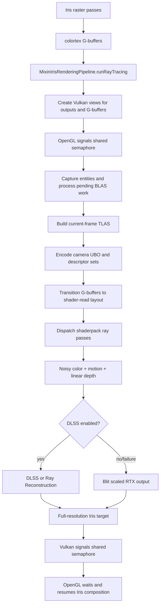
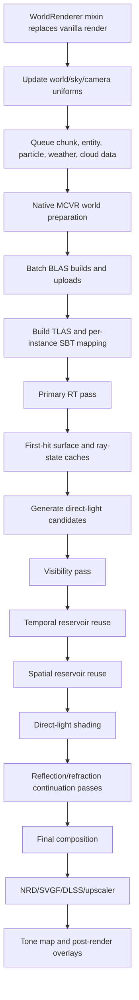

# Radiance RTX Flow and Vulkanite Comparison

> Extended by `plans/DIRECTIONAL_LIGHTING_RESOURCE_PLAN.md`, which turns the
> Radiance comparison into the current directional lighting and resource-saving
> roadmap.

## Scope

This document compares Vulkanite's current hybrid RTX path with Radiance's
native Vulkan renderer and records the parts of Radiance that are practical to
adopt without replacing Iris or Vulkanite's OpenGL/Vulkan interop model.

Reference revisions inspected and updated through June 19, 2026:

- [Radiance](https://github.com/Minecraft-Radiance/Radiance):
  `414d8e330a2fc6cb1e8630cc95f2302b2b97a0e8`
- [MCVR](https://github.com/Minecraft-Radiance/MCVR):
  `9905c81b1999f5845bf66d13501d371c16adf561`
- [Voxy](https://github.com/MCRcortex/voxy):
  `581d48e22f913656c1b6532635dbf6a5f371952a`

Radiance and Vulkanite solve related but different problems:

- Radiance replaces Minecraft's renderer with a native Vulkan render framework.
- Vulkanite keeps Iris/Sodium rasterization and adds Vulkan ray tracing through
  shared OpenGL/Vulkan images.

The useful comparison is therefore about data flow, pass ownership, temporal
state, and ray workload organization rather than copying Radiance wholesale.

## Vulkanite Flow

### Shader discovery

`MixinProgramSet` searches the active Iris shaderpack for:

- `ray0.rgen`, `ray1.rgen`, and later ray-generation passes
- `rayN_M.rmiss`
- `rayN_M.rchit`, `rayN_M.rahit`, and `rayN_M.rint`

It injects DLSS/ReSTIR configuration defines and, when the pack declares
`VULKANITE_RESTIR`, injects Vulkanite's bundled `restir.glsl`.

`RaytracingShaderSet` compiles those stages and builds one Vulkan RT pipeline per
shaderpack pass. `RenderPassExecutor` reflects each pipeline, binds only the
resources it declares, pushes frame/light/debug values, and calls `traceRays`.

### Frame execution

1. Iris finishes rasterizing shared render targets.
2. `MixinIrisRenderingPipeline` collects colortex 1-5 as albedo, material,
   normal, camera-relative position, and auxiliary lighting.
3. `VulkanPipeline.renderRTXPath` signals a shared semaphore covering both
   output images and G-buffers.
4. Pending BLAS work is completed and a TLAS is built for visible terrain and
   captured entities.
5. A second command buffer waits for the TLAS build, transitions resources,
   binds descriptors, and dispatches the ray passes.
6. The RTX shader writes noisy radiance, pixel-space motion, and linear depth.
7. DLSS/RR consumes those outputs plus G-buffer guides when enabled.
8. The final image is copied to the Iris target and ownership returns to OpenGL.

### Shader ownership update

This warning has been resolved by the directional-lighting work. The active
development shaderpack is now tracked at:

`shaderpacks/VulkaniteRT`

`run/shaderpacks/VulkaniteRT` is runtime output produced by
`syncVulkaniteShaderpacks`, and `validateVulkaniteShaderpackDrift` verifies that
the runtime copy matches tracked shaderpack sources.

## Radiance Flow

### Java-side capture

Radiance intercepts `WorldRenderer.render` at its head and owns the full frame:

- updates camera, fog, sky, light-map, and texture mappings;
- queues visible entity and block-entity geometry;
- queues particles, weather, clouds, and chunk rebuilds;
- cancels vanilla world rendering.

This gives Radiance one coordinate system and one renderer owner. Vulkanite
cannot assume that because Iris remains the raster owner.

### Acceleration structures

MCVR's world preparation:

- batches important chunk BLAS and entity BLAS builds;
- inserts an acceleration-structure build barrier;
- builds TLAS instances with per-instance masks and SBT offsets;
- uploads geometry addresses and previous entity geometry/transforms;
- inserts an explicit TLAS-build-to-ray-tracing barrier.

The previous geometry and transform metadata is important: Radiance can produce
object motion for animated entities, not only camera reprojection.

### Declarative pass graph

Radiance shaderpacks declare pass type, shaders, inputs, outputs, conditions,
and execution order in `configs.json`. MCVR derives image layouts and memory
barriers from those declarations.

The advanced pack separates:

1. Primary visibility and first-hit state.
2. Direct-light candidate generation.
3. Visibility.
4. Temporal reuse with position/normal validation.
5. Spatial reuse with plane, tangent, and normal tests.
6. Direct-light evaluation.
7. Reflection and refraction continuation.
8. Final composition and denoising guides.

This is the most important architectural lesson from Radiance: expensive and
temporally sensitive work is split into explicit products rather than hidden in
one large ray-generation shader.

### Denoiser contract

Radiance produces separate guide and lighting images:

- noisy radiance;
- diffuse albedo and metallic;
- specular albedo;
- normal and roughness;
- motion vectors;
- linear and first-hit depth;
- specular hit depth;
- direct diffuse, indirect diffuse, specular, clear coat, emission, fog, and
  refraction layers.

This allows NRD, SVGF, DLSS, and composition passes to consume the signal that
matches their assumptions. Vulkanite currently provides a smaller contract:
combined noisy radiance, motion, depth, and shared Iris G-buffers.

## Comparison

| Area | Vulkanite | Radiance | Practical direction |
| --- | --- | --- | --- |
| Renderer ownership | Iris raster plus Vulkan RT interop | Full native Vulkan renderer | Keep hybrid ownership explicit |
| First hit | Imported G-buffer | RT-generated surface cache | Treat G-buffer texels as exact surface records |
| Pass scheduling | Java loop over reflected RT pipelines | Declarative render graph | Add pass metadata before adding more effects |
| Direct light | Mostly inside raygen | Candidate, visibility, temporal, spatial, shade passes | Split ReSTIR when adding another light class |
| Temporal validation | Motion plus limited checks | Motion plus world position, plane, tangent, normal checks | Reject invalid reprojection and disocclusion |
| Object motion | Mostly camera/world-position reprojection | Previous geometry and transforms | Add entity previous-transform support |
| Denoiser inputs | Combined color plus guides | Separated lighting lobes and richer guides | Add hit distance and separated diffuse/specular |
| Synchronization | Manual transitions and shared semaphores | Resource-declared barriers inside Vulkan | Centralize resource state tracking |
| Shader ownership | Tracked `shaderpacks/VulkaniteRT` synced into `run/` | Versioned built-in shaderpacks | Keep tracked source and runtime drift validation |

## Voxy Reference Notes

Voxy is a useful longer-term reference for voxel and LoD math, not for direct
RT renderer structure. The current revision has both a production LoD renderer
and an in-progress hierarchical node experiment, so the safe approach is to
borrow the invariants and data layouts rather than transplanting the unfinished
hierarchy.

Performance-first pieces to steal:

1. Voxel hierarchy for probe work, not surface shading. Vulkanite already scans
   each Sodium section into emitter records plus a compact opacity mask, then
   generates `8x8x8` six-face probe pages. Voxy's 16 -> 8 -> 4 -> 2 -> 1 voxel
   mip idea should be applied here first: skip empty/unchanged probe cells,
   cheaply reject light/probe pairs blocked by coarse occupancy, and avoid
   per-probe traversal through every 16-block opacity cell when a coarser mask is
   decisive.
2. Section importance from projected bounds. Voxy's meshlet culler projects all
   eight local AABB corners, computes a screen-space box, chooses a Hi-Z mip from
   that footprint, and tests against the depth pyramid. Vulkanite can use the
   same projected AABB score to prioritize BLAS result installation and decide
   which TLAS terrain sections are worth carrying this frame.
3. Hard budgets and adaptive degradation. Voxy avoids unbounded work with fixed
   request queues, deduplicated build tasks, and cached section meshes. Vulkanite
   should keep AS builds, BLAS result installation, and probe page regeneration
   under explicit per-frame budgets, then degrade by using older BLAS/probe pages
   instead of stalling the frame.
4. Compact per-section metadata. Voxy carries position, a packed local AABB,
   geometry pointer, and eight 16-bit geometry bucket counts in 32 bytes. For
   Vulkanite, adding local section bounds and per-pass range counts beside
   `JobPassThroughData` would make AS scheduling and shader indexing less blind.
5. "Render what exists, request better data" fallback. The hierarchical comments
   keep the invariant that a coarse mesh remains renderable while children or
   replacement meshes are requested. For RT this means old section BLAS and old
   probe pages should remain active until replacements are ready, avoiding holes
   and stalls while async work catches up.

Secondary pieces:

1. Face/material buckets. Voxy stores translucent, double-sided, then six
   directional opaque buckets. Vulkanite already separates geometry kinds for
   solid, water, and translucent terrain; the next step is to keep opaque terrain
   hot and any-hit-free while isolating alpha/translucent work into smaller
   geometry ranges.
2. Bounded worker queues with stale-result rejection. Voxy's render generation
   service deduplicates section tasks by LoD key, checks whether a result is
   still wanted before upload, and keeps a small mesh cache for requested
   sections. Vulkanite's BLAS queues should do the same with screen priority and
   hard per-frame AS budgets.
3. Hi-Z informed AS budgeting. Voxy builds a depth pyramid and culls meshlets
   with it. Vulkanite can reuse the raster depth/G-buffer depth to deprioritize
   BLAS/TLAS updates for occluded terrain, especially when AS build time exceeds
   the 2 ms target.
4. Meshlet-sized RT ranges. Voxy's optional meshlet mode stores 62-quad chunks
   with a local AABB. If full chunk BLAS becomes too coarse, Vulkanite could split
   large terrain sections into bounded geometry ranges or multiple BLAS instances
   using the same local-bounds idea.

Avoid copying:

- The current `lod/hierarchical/selector.comp`, `NodeManager`, and `NodeManager2`
  are prototype-level and contain pseudocode/incomplete paths. Mine their
  invariants, not their implementation.
- Voxy's GL multi-draw/mesh-shader renderer does not map directly onto
  Vulkanite's Vulkan RT path.
- The current mipper picks the first non-air child in a fixed order. That is
  acceptable for coarse LoD color continuity, but not for RT material identity,
  alpha, emissive weighting, or physically meaningful lighting.

For Vulkanite, the near-term application is AS work budgeting: prioritize BLAS
builds and TLAS instances by projected screen importance, keep probe updates
voxel-backed and budgeted, preserve old BLAS/probe data while replacements
build, and avoid spending RT scene update time on sections that are too small,
unchanged, or occluded to matter this frame.

## Improvements Applied

### Tracked bundled shader

`src/main/resources/assets/vulkanite/shaders/raytracing/ray0.rgen` now:

- validates normals and positions before normalization, preventing zero-vector
  NaNs from turning sky pixels into false geometry;
- reads G-buffer records with `texelFetch` so filtering cannot mix surfaces at
  silhouettes;
- rejects previous-frame projections behind the camera or far outside the
  viewport and emits neutral motion for invalid history;
- samples the physical sun disk with an eight-frame stochastic sequence;
- skips shadow rays for back-facing light directions;
- replaces the ad hoc specular term with an energy-conserving GGX/Fresnel
  direct-light evaluation.

### Active tracked VulkaniteRT shader

`shaderpacks/VulkaniteRT/shaders/ray0.rgen` now:

- uses unfiltered G-buffer reads for first-hit data;
- rejects NaN, infinite, behind-camera, and out-of-range previous projections;
- prevents invalid projections from entering motion vectors or ReSTIR temporal
  reservoir lookup;
- samples local diffuse block light from the section directional probe cache by
  default instead of per-pixel RT blocklight probes;
- looks up probe pages through a bounded hash directory and defaults to nearest
  probe-cell filtering, with trilinear filtering kept as an explicit quality
  option;
- uses binding `24` as the hardware-RT radiance cache for six-face probe records.
  A cache cell is filled only after an RT ray claims it, traces local section
  light visibility, and publishes a versioned ready state. Final lighting hides
  partial trilinear gathers until all eight required cache corners are ready;
- treats cached RT radiance as the single final-light authority while
  `SECTION_LIGHT_PROBE_RT_CACHE_ENABLE` is active. Legacy coverage
  normalization, sparse per-pixel correction, and unoccluded table fallback are
  fenced off from the final path;
- defaults `INDIRECT_BOUNCES` to `3`, keeping the old secondary diffuse GI ray
  and adding two lower-energy diffuse bounces before the specular reflection
  path.

## Recommended Next Steps

1. Introduce a small pass/resource declaration model for ray passes, compute
   reuse passes, and output images.
2. Move section probe updates, RT-cache refresh scheduling, and future ReSTIR
   temporal/spatial reuse out of `ray0.rgen` into explicit compute/pass-graph
   nodes.
3. Store a compact first-hit cache with position, geometric normal, material ID,
   roughness, and validity.
4. Add previous entity transforms/positions so DLSS and temporal reuse can
   distinguish object motion from camera motion.
5. Split noisy diffuse and specular radiance and expose ray hit distance to
   DLSS/RR or a future NRD path.
6. Add a stale-cell refresh budget so cached RT probe cells are reused when
   stable but periodically refreshed instead of becoming permanently frozen.

The order matters. Tracking the runtime shaderpack and making pass resources
declarative should happen before importing more Radiance algorithms; otherwise
the shader becomes more capable while the execution model becomes harder to
verify.
