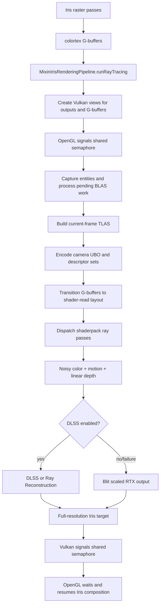
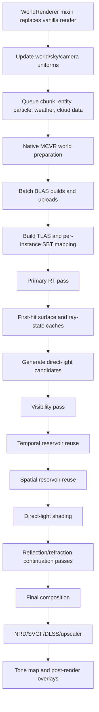

# Radiance RTX Flow and Vulkanite Comparison

## Scope

This document compares Vulkanite's current hybrid RTX path with Radiance's
native Vulkan renderer and records the parts of Radiance that are practical to
adopt without replacing Iris or Vulkanite's OpenGL/Vulkan interop model.

Reference revisions inspected on June 15, 2026:

- [Radiance](https://github.com/Minecraft-Radiance/Radiance):
  `414d8e330a2fc6cb1e8630cc95f2302b2b97a0e8`
- [MCVR](https://github.com/Minecraft-Radiance/MCVR):
  `9905c81b1999f5845bf66d13501d371c16adf561`

Radiance and Vulkanite solve related but different problems:

- Radiance replaces Minecraft's renderer with a native Vulkan render framework.
- Vulkanite keeps Iris/Sodium rasterization and adds Vulkan ray tracing through
  shared OpenGL/Vulkan images.

The useful comparison is therefore about data flow, pass ownership, temporal
state, and ray workload organization rather than copying Radiance wholesale.

## Vulkanite Flow

### Shader discovery

`MixinProgramSet` searches the active Iris shaderpack for:

- `ray0.rgen`, `ray1.rgen`, and later ray-generation passes
- `rayN_M.rmiss`
- `rayN_M.rchit`, `rayN_M.rahit`, and `rayN_M.rint`

It injects DLSS/ReSTIR configuration defines and, when the pack declares
`VULKANITE_RESTIR`, injects Vulkanite's bundled `restir.glsl`.

`RaytracingShaderSet` compiles those stages and builds one Vulkan RT pipeline per
shaderpack pass. `RenderPassExecutor` reflects each pipeline, binds only the
resources it declares, pushes frame/light/debug values, and calls `traceRays`.

### Frame execution

1. Iris finishes rasterizing shared render targets.
2. `MixinIrisRenderingPipeline` collects colortex 1-5 as albedo, material,
   normal, camera-relative position, and auxiliary lighting.
3. `VulkanPipeline.renderRTXPath` signals a shared semaphore covering both
   output images and G-buffers.
4. Pending BLAS work is completed and a TLAS is built for visible terrain and
   captured entities.
5. A second command buffer waits for the TLAS build, transitions resources,
   binds descriptors, and dispatches the ray passes.
6. The RTX shader writes noisy radiance, pixel-space motion, and linear depth.
7. DLSS/RR consumes those outputs plus G-buffer guides when enabled.
8. The final image is copied to the Iris target and ownership returns to OpenGL.

### Current ownership warning

The tracked shader
`src/main/resources/assets/vulkanite/shaders/raytracing/ray0.rgen` is not the
shader normally compiled for the selected `VulkaniteRT` pack.

The active development shader is:

`run/shaderpacks/VulkaniteRT/shaders/ray0.rgen`

The whole `run/` tree is ignored, and `syncVulkaniteShaderpacks` currently copies
only `VulkaniteDeferred` and `VulkaniteNormal`. As a result, the main RTX
shaderpack is local mutable state rather than a reproducible tracked artifact.

## Radiance Flow

### Java-side capture

Radiance intercepts `WorldRenderer.render` at its head and owns the full frame:

- updates camera, fog, sky, light-map, and texture mappings;
- queues visible entity and block-entity geometry;
- queues particles, weather, clouds, and chunk rebuilds;
- cancels vanilla world rendering.

This gives Radiance one coordinate system and one renderer owner. Vulkanite
cannot assume that because Iris remains the raster owner.

### Acceleration structures

MCVR's world preparation:

- batches important chunk BLAS and entity BLAS builds;
- inserts an acceleration-structure build barrier;
- builds TLAS instances with per-instance masks and SBT offsets;
- uploads geometry addresses and previous entity geometry/transforms;
- inserts an explicit TLAS-build-to-ray-tracing barrier.

The previous geometry and transform metadata is important: Radiance can produce
object motion for animated entities, not only camera reprojection.

### Declarative pass graph

Radiance shaderpacks declare pass type, shaders, inputs, outputs, conditions,
and execution order in `configs.json`. MCVR derives image layouts and memory
barriers from those declarations.

The advanced pack separates:

1. Primary visibility and first-hit state.
2. Direct-light candidate generation.
3. Visibility.
4. Temporal reuse with position/normal validation.
5. Spatial reuse with plane, tangent, and normal tests.
6. Direct-light evaluation.
7. Reflection and refraction continuation.
8. Final composition and denoising guides.

This is the most important architectural lesson from Radiance: expensive and
temporally sensitive work is split into explicit products rather than hidden in
one large ray-generation shader.

### Denoiser contract

Radiance produces separate guide and lighting images:

- noisy radiance;
- diffuse albedo and metallic;
- specular albedo;
- normal and roughness;
- motion vectors;
- linear and first-hit depth;
- specular hit depth;
- direct diffuse, indirect diffuse, specular, clear coat, emission, fog, and
  refraction layers.

This allows NRD, SVGF, DLSS, and composition passes to consume the signal that
matches their assumptions. Vulkanite currently provides a smaller contract:
combined noisy radiance, motion, depth, and shared Iris G-buffers.

## Comparison

| Area | Vulkanite | Radiance | Practical direction |
| --- | --- | --- | --- |
| Renderer ownership | Iris raster plus Vulkan RT interop | Full native Vulkan renderer | Keep hybrid ownership explicit |
| First hit | Imported G-buffer | RT-generated surface cache | Treat G-buffer texels as exact surface records |
| Pass scheduling | Java loop over reflected RT pipelines | Declarative render graph | Add pass metadata before adding more effects |
| Direct light | Mostly inside raygen | Candidate, visibility, temporal, spatial, shade passes | Split ReSTIR when adding another light class |
| Temporal validation | Motion plus limited checks | Motion plus world position, plane, tangent, normal checks | Reject invalid reprojection and disocclusion |
| Object motion | Mostly camera/world-position reprojection | Previous geometry and transforms | Add entity previous-transform support |
| Denoiser inputs | Combined color plus guides | Separated lighting lobes and richer guides | Add hit distance and separated diffuse/specular |
| Synchronization | Manual transitions and shared semaphores | Resource-declared barriers inside Vulkan | Centralize resource state tracking |
| Shader ownership | Active RTX pack under ignored `run/` | Versioned built-in shaderpacks | Track and sync `VulkaniteRT` |

## Improvements Applied

### Tracked bundled shader

`src/main/resources/assets/vulkanite/shaders/raytracing/ray0.rgen` now:

- validates normals and positions before normalization, preventing zero-vector
  NaNs from turning sky pixels into false geometry;
- reads G-buffer records with `texelFetch` so filtering cannot mix surfaces at
  silhouettes;
- rejects previous-frame projections behind the camera or far outside the
  viewport and emits neutral motion for invalid history;
- samples the physical sun disk with an eight-frame stochastic sequence;
- skips shadow rays for back-facing light directions;
- replaces the ad hoc specular term with an energy-conserving GGX/Fresnel
  direct-light evaluation.

### Active local VulkaniteRT shader

`run/shaderpacks/VulkaniteRT/shaders/ray0.rgen` now:

- uses unfiltered G-buffer reads for first-hit data;
- rejects NaN, infinite, behind-camera, and out-of-range previous projections;
- prevents invalid projections from entering motion vectors or ReSTIR temporal
  reservoir lookup.

Because `run/` is ignored, these live shader changes are local until the
VulkaniteRT shaderpack is moved into a tracked `shaderpacks/VulkaniteRT` source.

## Recommended Next Steps

1. Track `VulkaniteRT` and include it in `syncVulkaniteShaderpacks`.
2. Introduce a small pass/resource declaration model for ray passes, compute
   reuse passes, and output images.
3. Move ReSTIR temporal and spatial reuse out of `ray0.rgen` into compute passes.
4. Store a compact first-hit cache with position, geometric normal, material ID,
   roughness, and validity.
5. Add previous entity transforms/positions so DLSS and temporal reuse can
   distinguish object motion from camera motion.
6. Add alpha-aware shadow visibility instead of forcing all shadow rays opaque.
7. Split noisy diffuse and specular radiance and expose ray hit distance to
   DLSS/RR or a future NRD path.

The order matters. Tracking the runtime shaderpack and making pass resources
declarative should happen before importing more Radiance algorithms; otherwise
the shader becomes more capable while the execution model becomes harder to
verify.
