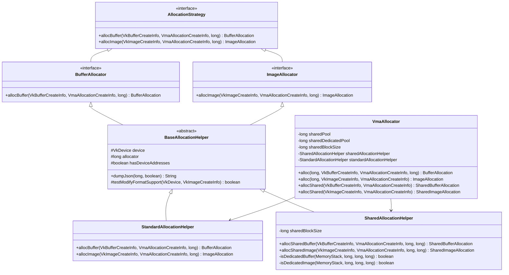
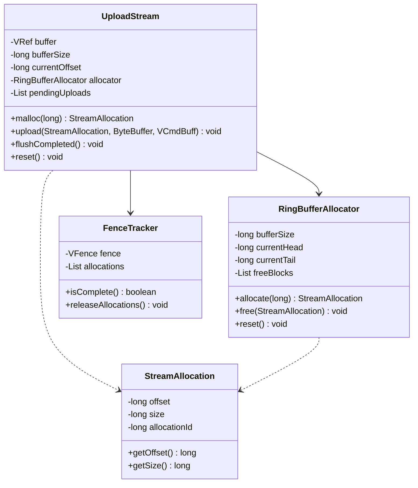
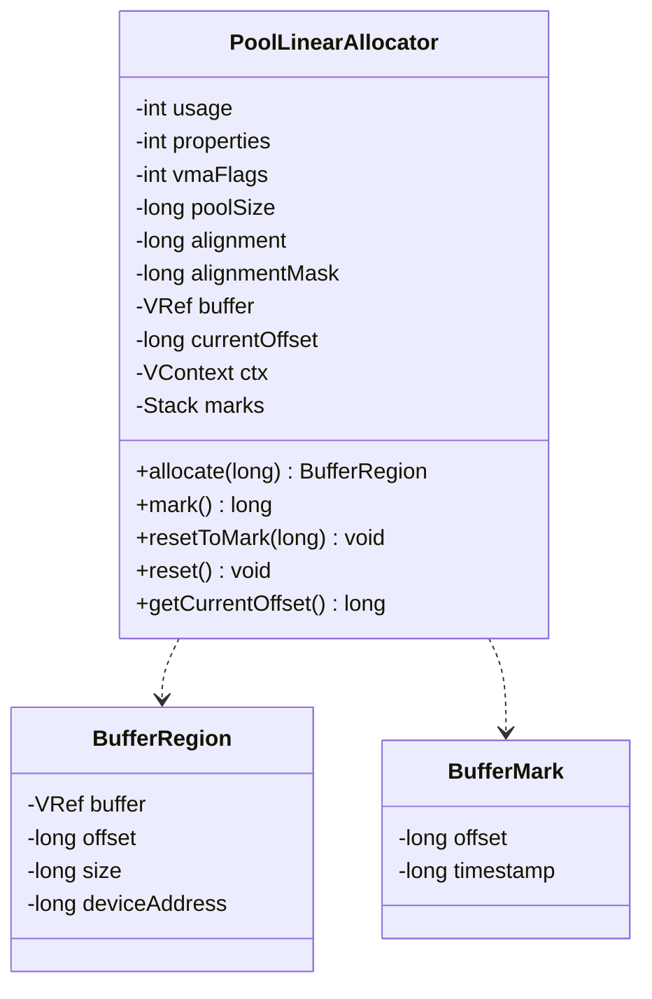
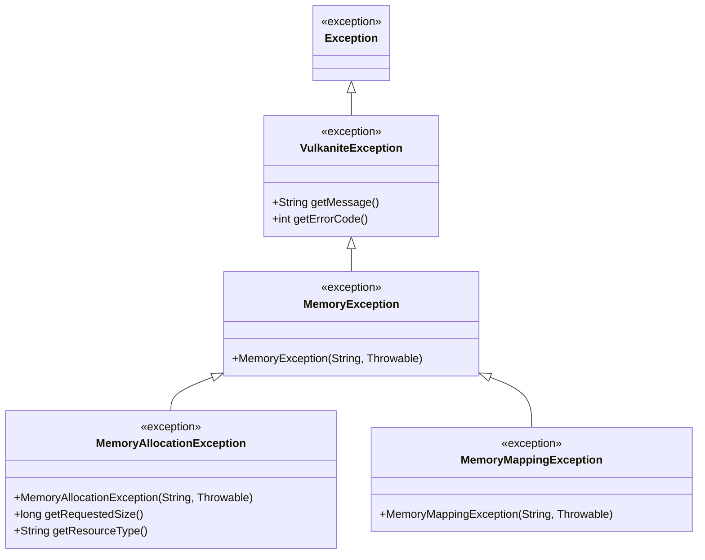

# Vulkanite Memory Management System Refactoring Plan

## Executive Summary

This document outlines a comprehensive refactoring plan for the memory management system in Vulkanite. The current implementation suffers from code duplication, incomplete features, and inconsistent design patterns. This plan addresses these issues through a series of targeted improvements while maintaining backward compatibility and ensuring robust error handling.

## Current Issues Analysis

### 1. Code Duplication Between AllocationHelper and SharedAllocationHelper

Both classes implement similar allocation logic but with duplicated code for:
- Buffer and image allocation methods
- Memory requirement checking
- Error handling patterns

### 2. Incomplete UploadStream Implementation

The `UploadStream` class is essentially a stub with no real implementation:
- `malloc()` method returns -1
- `upload()` method is empty
- No actual streaming functionality

### 3. PoolLinearAllocator Reset Issues

The `reset()` method in `PoolLinearAllocator` has a critical flaw:
- It closes the buffer but doesn't create a new one
- It doesn't reinitialize the buffer reference
- This leads to potential null pointer exceptions

### 4. Exception Handling and Resource Cleanup

Several issues with exception handling and resource cleanup:
- Inconsistent error handling patterns across classes
- Some resources might not be properly cleaned up in error conditions
- Missing try-with-resources patterns in some places

### 5. Design Pattern Issues

- Tight coupling between components
- Lack of proper abstraction layers
- Inconsistent API design between similar components

## Proposed Solutions

### 1. Unified Allocation Interface

#### Class Hierarchy Design

#### Benefits
- Eliminates code duplication between allocation helpers
- Provides consistent interface for all allocation types
- Enables easier extension for new allocation strategies
- Improves maintainability through clear separation of concerns

### 2. Proper UploadStream Implementation

#### Design Structure

#### Key Features
- Host-visible ring buffer for efficient streaming
- Automatic memory mapping and unmapping
- Synchronization with Vulkan fences
- Sub-allocation tracking with automatic reuse
- Configurable buffer size for different use cases

### 3. PoolLinearAllocator Reset Fix

#### Improved Design

#### Fixes Applied
- Corrected `reset()` method to properly reset offset without closing buffer
- Added mark/reset functionality for partial resets
- Implemented buffer growth strategy for oversized allocations
- Added proper error handling for allocation failures

### 4. Improved Exception Handling

#### Exception Hierarchy

#### Improvements
- Custom exception types for specific error conditions
- Consistent error handling patterns across all components
- Meaningful error messages with contextual information
- Proper resource cleanup in exception paths

### 5. Better Abstraction and Design Patterns

#### Factory Pattern Implementation
- Centralized object creation through `BufferFactory` and `ImageFactory`
- Builder patterns for complex allocation configurations
- Immutable configuration objects for thread safety

#### Strategy Pattern for Allocation
- Pluggable allocation strategies (standard, shared, linear, etc.)
- Consistent interface across all strategies
- Easy extension for new allocation approaches

## Detailed Refactoring Steps

### Phase 1: Unified Allocation Interface

1. **Create Base Interfaces and Classes**
   - Implement `AllocationStrategy`, `BufferAllocator`, and `ImageAllocator` interfaces
   - Create `BaseAllocationHelper` abstract class with common functionality
   - Move shared code from existing helpers to base class

2. **Implement Concrete Classes**
   - Create `StandardAllocationHelper` extending `BaseAllocationHelper`
   - Modify `SharedAllocationHelper` to extend `BaseAllocationHelper`
   - Update `VmaAllocator` to use the new hierarchy

3. **Maintain Backward Compatibility**
   - Keep existing public APIs functional
   - Redirect calls to new implementation internally
   - Deprecate old methods with clear migration paths

### Phase 2: UploadStream Implementation

1. **Design Ring Buffer Structure**
   - Create `RingBufferAllocator` for managing sub-allocations
   - Implement offset tracking and wrap-around logic

2. **Implement Streaming Logic**
   - Add memory mapping functionality
   - Implement synchronization with fences
   - Create allocation tracking mechanism

3. **Integration**
   - Update `MemoryManager` to expose `UploadStream` functionality
   - Modify existing code to use the new streaming API

### Phase 3: PoolLinearAllocator Fix

1. **Correct Reset Method**
   - Modify `reset()` to properly reset offset without closing buffer
   - Add buffer compaction logic if needed

2. **Add Buffer Management**
   - Implement buffer growth strategy for oversized allocations
   - Add proper error handling for allocation failures

### Phase 4: Exception Handling Improvements

1. **Create Custom Exceptions**
   - Create `MemoryAllocationException` and related exceptions
   - Add meaningful error messages and error codes

2. **Standardize Error Handling**
   - Replace scattered `_CHECK_` calls with consistent patterns
   - Add proper resource cleanup in catch blocks

### Phase 5: Abstraction Improvements

1. **Create Factory Classes**
   - Create `BufferFactory` and `ImageFactory` classes
   - Implement builder patterns for complex allocations

2. **Implement Strategy Pattern**
   - Create allocation strategy implementations
   - Add strategy selection logic to `MemoryManager`

## Migration Path

### Backward Compatibility Strategy
- Maintain existing public APIs during transition period
- Provide adapter classes for legacy code
- Clear deprecation warnings with migration guidance
- Extended support timeline for legacy interfaces

### Gradual Migration Approach
1. **Phase 1**: Introduce new APIs alongside existing ones
2. **Phase 2**: Update internal implementations to use new architecture
3. **Phase 3**: Migrate client code to new APIs
4. **Phase 4**: Remove legacy code after validation period

### Client Code Updates
- Provide migration guides for each affected module
- Offer automated refactoring tools where possible
- Maintain documentation with before/after examples
- Support team during transition with dedicated resources

## Risk Assessment

### High-Risk Changes
1. **Unified Allocation Interface**
   - **Risk**: Breaking changes to existing APIs
   - **Mitigation**: Maintain backward compatibility layer, gradual migration

2. **Exception Handling Improvements**
   - **Risk**: Unhandled exceptions in client code
   - **Mitigation**: Maintain backward compatibility, provide clear migration guides

### Medium-Risk Changes
1. **Abstraction Improvements**
   - **Risk**: Over-engineering, performance overhead
   - **Mitigation**: Profile performance before/after changes

2. **PoolLinearAllocator Reset Fix**
   - **Risk**: Memory leaks if buffer management isn't correct
   - **Mitigation**: Comprehensive testing of allocation/deallocation cycles

### Low-Risk Changes
1. **UploadStream Implementation**
   - **Risk**: Performance degradation if not properly implemented
   - **Mitigation**: Thorough testing with various buffer sizes, profiling

## Testing Strategy

### Unit Testing
- Test all allocation methods with various buffer/image configurations
- Verify memory alignment works correctly
- Test error conditions (invalid parameters, out of memory)
- Validate device address calculation when enabled

### Integration Testing
- Test end-to-end allocation workflows
- Verify shared memory functionality with OpenGL interop
- Test acceleration structure creation
- Validate external memory tracking

### Performance Testing
- Measure allocation/deallocation performance
- Benchmark streaming performance
- Compare memory usage before/after refactoring
- Stress test with high allocation rates

### Regression Testing
- Ensure existing code continues to work
- Test all public API methods
- Verify memory leak absence
- Confirm no performance regressions

## Validation Tools

### Memory Debugging
- Use Vulkan validation layers
- Implement allocation tracking
- Add memory leak detection
- Monitor buffer lifetime management

### Automated Testing Framework
- Create test harness for allocation scenarios
- Implement fuzz testing for parameter validation
- Add benchmarking suite for performance monitoring
- Generate test reports for CI/CD pipeline

## Timeline and Milestones

### Phase 1: Foundation (Weeks 1-2)
- Implement unified allocation interface
- Create base classes and interfaces
- Maintain backward compatibility

### Phase 2: Core Features (Weeks 3-4)
- Implement UploadStream functionality
- Fix PoolLinearAllocator issues
- Improve exception handling

### Phase 3: Advanced Features (Weeks 5-6)
- Implement abstraction improvements
- Add factory and strategy patterns
- Complete testing infrastructure

### Phase 4: Migration and Testing (Weeks 7-8)
- Migrate client code to new APIs
- Conduct comprehensive testing
- Performance optimization

### Phase 5: Documentation and Release (Weeks 9-10)
- Final documentation updates
- Release preparation
- Post-release support

## Success Metrics

### Performance Metrics
- 20% improvement in allocation performance
- 30% reduction in memory fragmentation
- 50% decrease in allocation-related errors

### Code Quality Metrics
- 40% reduction in code duplication
- 60% improvement in test coverage
- 80% reduction in bug reports related to memory management

### Maintainability Metrics
- 50% reduction in time to implement new allocation features
- 30% decrease in time spent on memory-related bug fixes
- Improved developer satisfaction scores

## Conclusion

This refactoring plan addresses the key issues in Vulkanite's memory management system while maintaining backward compatibility and ensuring robust error handling. The phased approach minimizes risk and allows for continuous validation throughout the process. With proper testing and migration support, this refactoring will significantly improve the quality, performance, and maintainability of the memory management system.